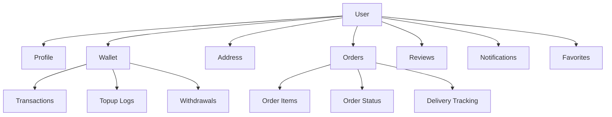
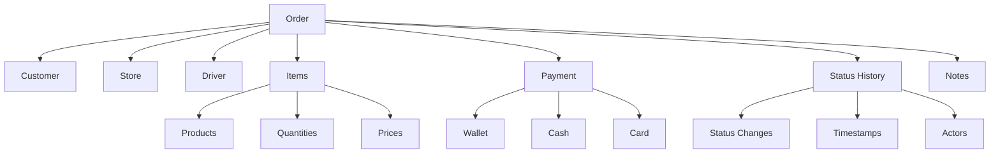
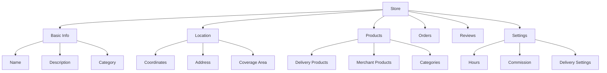
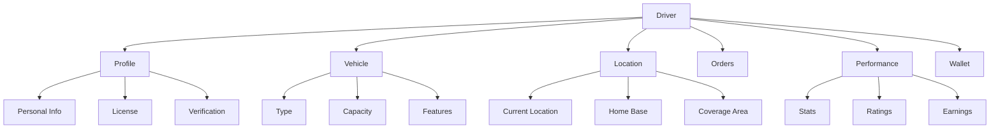
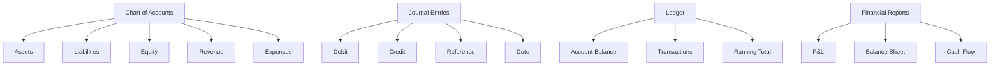
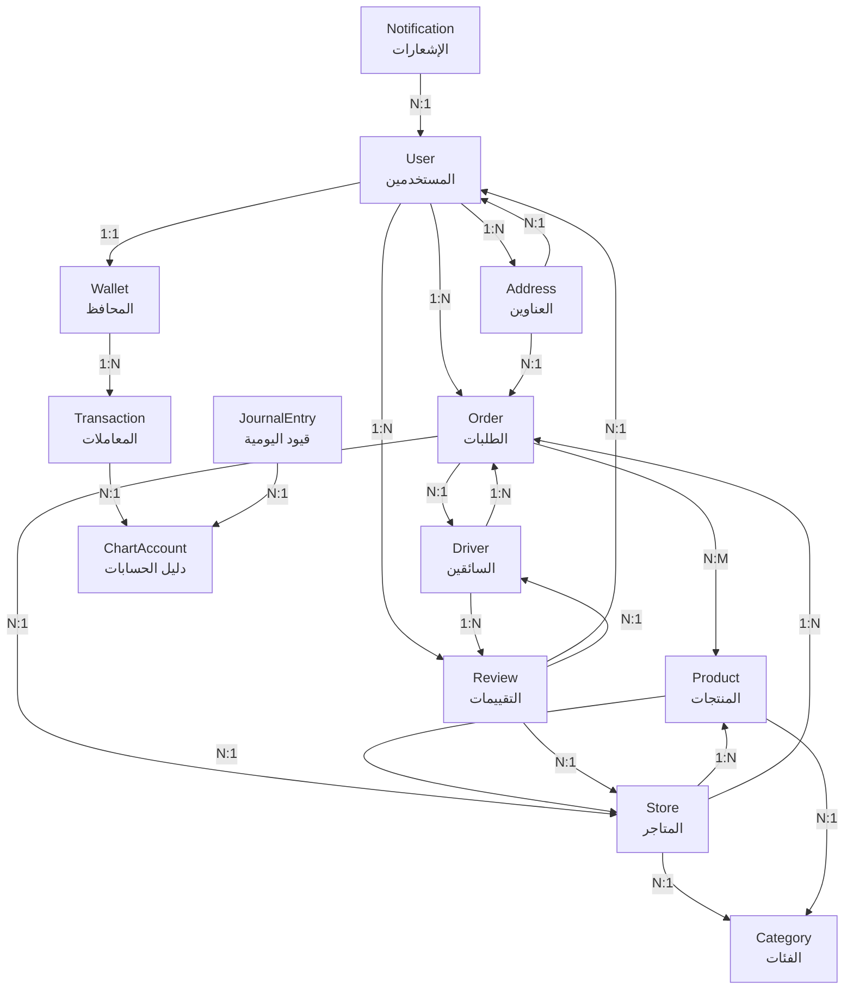
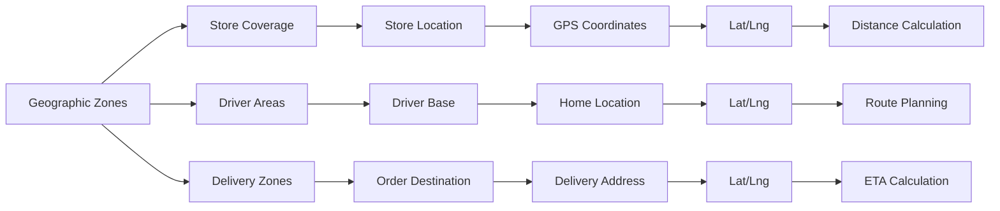
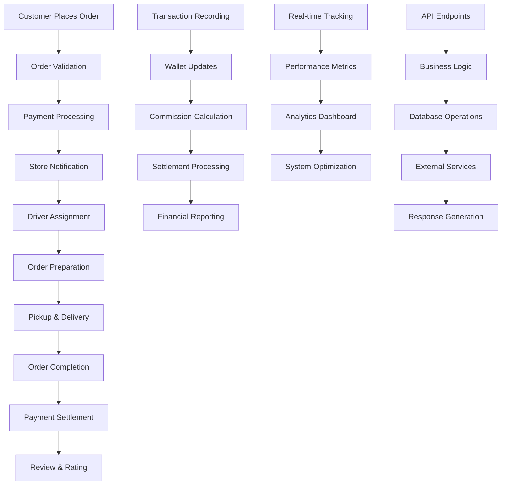

# 🗺️ مخطط علاقات البيانات (Data Relationship Map)

## نظرة عامة على العلاقات الرئيسية

```mermaid
erDiagram

    %% المستخدمين والمصادقة
    User ||--o{ Order : "يطلب"
    User ||--o{ Wallet : "يمتلك"
    User ||--o{ Address : "يحفظ"
    User ||--o{ Favorite : "يحفظ"
    User ||--o{ Notification : "يتلقى"
    User ||--o{ Transaction : "يقوم بـ"
    User ||--o{ Review : "يكتب"

    %% الطلبات والتوصيل
    Order }o--|| User : "للمستخدم"
    Order }o--o{ OrderItem : "يتكون من"
    Order }o--|| Driver : "يسنده"
    Order }o--|| DeliveryStore : "من متجر"
    Order ||--o{ OrderStatus : "يمر بـ"
    Order ||--o{ Note : "يحتوي على"

    %% المتاجر والمنتجات
    DeliveryStore ||--o{ OrderItem : "يوفر"
    DeliveryStore ||--o{ DeliveryProduct : "يبيع"
    DeliveryStore ||--o{ MerchantProduct : "يبيع"
    DeliveryStore }o--|| Category : "ينتمي لـ"
    DeliveryStore ||--o{ StoreSection : "يحتوي على"
    DeliveryStore ||--o{ Review : "يتلقى"

    %% السائقين
    Driver ||--o{ Order : "يوصل"
    Driver ||--o{ DriverLocation : "يحدث موقعه"
    Driver ||--o{ DriverShift : "يعمل في"
    Driver ||--o{ DriverReview : "يتلقى تقييم"
    Driver ||--o{ DriverAsset : "يستخدم"
    Driver ||--o{ VacationRequest : "يطلب"

    %% المحفظة والمعاملات المالية
    Wallet ||--o{ Transaction : "تسجل معاملاتها"
    Wallet ||--o{ TopupLog : "تسجل عمليات الشحن"
    Wallet ||--o{ WithdrawalRequest : "تطلب سحب"

    %% المحاسبة والقيود
    ChartAccount ||--o{ JournalEntry : "يشارك في"
    ChartAccount ||--o{ LedgerEntry : "يحتوي على"
    JournalEntry ||--o{ JournalEntryLine : "يتكون من"
    JournalEntry ||--|| Voucher : "مرتبط بـ"

    %% الإدارة والمراقبة
    AdminUser ||--o{ AdminLog : "يقوم بـ"
    AdminUser ||--o{ Notification : "يرسل"
    AdminUser ||--o{ Setting : "يحدد"
    AdminUser ||--o{ CommissionPlan : "يحدد"

    %% التجار والموردين
    Vendor ||--o{ VendorProduct : "يبيع"
    Vendor ||--o{ VendorOrder : "يتلقى"
    Vendor ||--o{ VendorSettlement : "يحصل على"
    Vendor ||--o{ VendorReview : "يتلقى تقييم"

    %% التسويق والمندوبين
    Marketer ||--o{ MarketingCampaign : "يدير"
    Marketer ||--o{ CommissionRule : "يستفيد من"
    Marketer ||--o{ ReferralEvent : "يحصل على"
    Marketer ||--o{ CommissionPlan : "مرتبط بـ"

    %% العلاقات التفصيلية
    OrderItem }o--|| DeliveryProduct : "مرتبط بـ"
    OrderItem }o--|| MerchantProduct : "مرتبط بـ"

    DeliveryProduct }o--|| Category : "ينتمي لـ"
    DeliveryProduct }o--|| Promotion : "يخضع لـ"

    MerchantProduct }o--|| Category : "ينتمي لـ"
    MerchantProduct }o--|| Promotion : "يخضع لـ"

    %% علاقات الموقع الجغرافي
    User }o--|| Address : "يحدد"
    DeliveryStore }o--|| Location : "يقع في"
    Driver }o--|| DriverLocation : "يحدد موقعه"

    %% علاقات المراجعة والتقييم
    Review }o--|| User : "يكتبها"
    Review }o--|| DeliveryStore : "عن متجر"
    Review }o--|| Driver : "عن سائق"
    Review }o--|| Vendor : "عن تاجر"

    %% علاقات المخزون والمبيعات
    Inventory }o--|| DeliveryProduct : "يتبع"
    Inventory }o--|| MerchantProduct : "يتبع"
    Inventory }o--|| DeliveryStore : "في متجر"

    %% علاقات التقارير والتحليلات
    Analytics }o--|| Order : "يحلل"
    Analytics }o--|| User : "يحلل سلوك"
    Analytics }o--|| DeliveryStore : "يحلل أداء"
    Analytics }o--|| Driver : "يحلل أداء"
```



## تفاصيل العلاقات الرئيسية

### 1. نظام المستخدمين (Users)


### 2. نظام الطلبات (Orders)


### 3. نظام المتاجر (Stores)


### 4. نظام السائقين (Drivers)


### 5. نظام المحاسبة (Accounting)


## جداول البيانات الرئيسية

### جدول المستخدمين والمصادقة
| الجدول | الغرض | العلاقات الرئيسية |
|---------|--------|---------------------|
| `User` | بيانات المستخدمين الأساسية | Orders, Wallet, Addresses, Reviews |
| `Address` | عناوين المستخدمين | مرتبطة بالمستخدمين والطلبات |
| `Wallet` | محافظ المستخدمين المالية | Transactions, Topups, Withdrawals |
| `Favorite` | المنتجات المفضلة | مرتبطة بالمستخدمين والمنتجات |

### جدول الطلبات والتوصيل
| الجدول | الغرض | العلاقات الرئيسية |
|---------|--------|---------------------|
| `Order` | الطلبات الرئيسية | Users, Stores, Drivers, Items |
| `OrderItem` | عناصر الطلبات | مرتبطة بالطلبات والمنتجات |
| `OrderStatus` | سجل حالات الطلبات | مرتبطة بالطلبات |
| `DeliveryTracking` | تتبع التوصيل | مرتبطة بالطلبات والسائقين |

### جدول المتاجر والمنتجات
| الجدول | الغرض | العلاقات الرئيسية |
|---------|--------|---------------------|
| `DeliveryStore` | المتاجر والمطاعم | Products, Orders, Categories |
| `DeliveryProduct` | منتجات التوصيل | مرتبطة بالمتاجر والطلبات |
| `MerchantProduct` | منتجات التجار | مرتبطة بالمتاجر والطلبات |
| `Category` | فئات المنتجات | مرتبطة بالمتاجر والمنتجات |

### جدول السائقين والمركبات
| الجدول | الغرض | العلاقات الرئيسية |
|---------|--------|---------------------|
| `Driver` | بيانات السائقين | Orders, Vehicles, Locations |
| `DriverLocation` | مواقع السائقين | مرتبطة بالسائقين |
| `DriverShift` | ورديات السائقين | مرتبطة بالسائقين |
| `Vehicle` | مركبات السائقين | مرتبطة بالسائقين |

### جدول المحاسبة والمالية
| الجدول | الغرض | العلاقات الرئيسية |
|---------|--------|---------------------|
| `ChartAccount` | دليل الحسابات | Journal Entries, Ledgers |
| `JournalEntry` | قيود اليومية | مرتبطة بالحسابات |
| `LedgerEntry` | سجلات الأستاذ | مرتبطة بالحسابات |
| `Transaction` | المعاملات المالية | مرتبطة بالمحافظ |

## مخطط قاعدة البيانات المفصل



## العلاقات الجغرافية والمكانية



## تدفق البيانات في النظام



## ملاحظات مهمة حول العلاقات

### 🔗 علاقات رئيسية حرجة
1. **User ↔ Order**: علاقة واحد لمتعدد - مستخدم واحد يمكنه إنشاء عدة طلبات
2. **Order ↔ Store**: علاقة متعدد لواحد - طلب واحد مرتبط بمتجر واحد فقط
3. **Store ↔ Product**: علاقة واحد لمتعدد - متجر واحد يحتوي على عدة منتجات
4. **Driver ↔ Order**: علاقة متعدد لواحد - سائق واحد يتعامل مع عدة طلبات

### 💰 علاقات مالية مهمة
1. **Wallet ↔ Transaction**: سجل كامل لجميع المعاملات المالية
2. **ChartAccount ↔ JournalEntry**: ربط القيود بالحسابات المحاسبية
3. **Order ↔ Payment**: تتبع طرق الدفع والمبالغ

### 📍 علاقات جغرافية
1. **Location-based Queries**: استخدام فهارس 2dsphere للبحث بالقرب
2. **Driver Tracking**: تتبع موقع السائق في الوقت الفعلي
3. **Store Coverage**: تحديد مناطق تغطية المتاجر

### 🔄 علاقات الوقت والتتبع
1. **Status History**: سجل زمني لتغييرات حالة الطلبات
2. **Timestamps**: تتبع أوقات الإنشاء والتحديث
3. **Audit Trail**: سجل للعمليات الإدارية

## نصائح للمطورين

### فهارس مهمة للأداء
```javascript
// فهارس الأداء الرئيسية
UserSchema.index({ createdAt: -1 });
OrderSchema.index({ status: 1, createdAt: -1 });
StoreSchema.index({ location: "2dsphere" });
DriverSchema.index({ location: "2dsphere" });
ProductSchema.index({ category: 1, store: 1 });
```

### استعلامات معقدة مدعومة
- **البحث بالقرب الجغرافي** (Near queries)
- **البحث النصي الكامل** (Text search)
- **التصفح مع الفلترة** (Pagination with filters)
- **التجميع والتقارير** (Aggregation pipelines)

### اعتبارات الأمان
- تشفير البيانات الحساسة (كلمات المرور، معلومات البطاقات)
- تقييد الوصول حسب الأدوار (RBAC)
- تسجيل العمليات الحساسة (Audit logging)
- حماية من هجمات الحقن (Input sanitization)

---

*هذا المخطط يوضح العلاقات المعقدة والمترابطة في نظام Bthwani ويساعد المطورين على فهم تدفق البيانات والعلاقات بين الكيانات المختلفة.*
