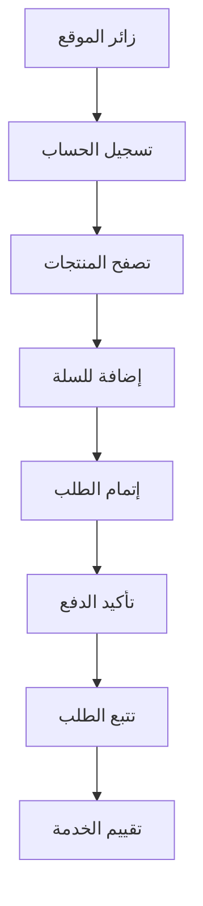

# خطة القياس والتحليلات لمنصة بثواني

## نظرة عامة على خطة التحليلات

توثق هذه الخطة استراتيجية جمع وتحليل البيانات في منصة بثواني، مع التركيز على تتبع سلوك المستخدمين وقياس أداء المنصة واتخاذ قرارات مبنية على البيانات.

## أدوات التحليلات المستخدمة

### 1. PostHog (الأداة الرئيسية)

```typescript
// إعدادات PostHog في التطبيقات
const posthogConfig = {
  apiKey: process.env.POSTHOG_KEY,
  host: process.env.POSTHOG_HOST,
  options: {
    capture_pageview: true,
    capture_pageleave: true,
    persistence: 'localStorage',
    captureNativeAppLifecycleEvents: true,
    captureDeepLinks: true
  }
}
```

**المميزات المستخدمة:**
- تتبع الأحداث المخصصة
- تحليل مسارات المستخدمين
- اختبارات A/B
- تحليل الاحتفاظ بالمستخدمين (Retention Analysis)
- خرائط الحرارة (Heatmaps)

### 2. Google Analytics 4 (احتياطي)

```javascript
// إعدادات GA4
window.dataLayer = window.dataLayer || [];
function gtag(){dataLayer.push(arguments);}
gtag('js', new Date());
gtag('config', 'GA_MEASUREMENT_ID');
```

### 3. Firebase Analytics (للتطبيقات المحمولة)

```javascript
// تكامل مع Firebase
import analytics from '@react-native-firebase/analytics';

await analytics().logEvent('custom_event', {
  item_id: 'item_123',
  item_name: 'Product Name'
});
```

## خريطة الأحداث (Event Taxonomy)

### فئات الأحداث الرئيسية

#### 1. أحداث المستخدمين (User Events)

| الحدث | الوصف | المعاملات | التطبيق |
|--------|--------|-----------|---------|
| **UserRegistered** | تسجيل مستخدم جديد | `user_type`, `registration_method` | جميع التطبيقات |
| **UserLoggedIn** | دخول المستخدم | `login_method`, `user_type` | جميع التطبيقات |
| **UserLoggedOut** | خروج المستخدم | - | جميع التطبيقات |
| **ProfileUpdated** | تحديث الملف الشخصي | `updated_fields` | جميع التطبيقات |
| **PasswordChanged** | تغيير كلمة المرور | `change_method` | جميع التطبيقات |

#### 2. أحداث التجارة (Commerce Events)

| الحدث | الوصف | المعاملات | التطبيق |
|--------|--------|-----------|---------|
| **ProductViewed** | عرض منتج | `product_id`, `product_name`, `category`, `price` | عميل، تاجر |
| **ProductAddedToCart** | إضافة منتج للسلة | `product_id`, `quantity`, `cart_value` | عميل |
| **CartViewed** | عرض سلة التسوق | `cart_items_count`, `cart_total` | عميل |
| **CheckoutStarted** | بدء إتمام الطلب | `checkout_step`, `cart_total` | عميل |
| **PaymentInitiated** | بدء الدفع | `payment_method`, `amount` | عميل |
| **PaymentCompleted** | إتمام الدفع | `payment_method`, `amount`, `transaction_id` | عميل |
| **OrderPlaced** | إتمام الطلب | `order_id`, `vendor_id`, `total_amount` | عميل، تاجر |

#### 3. أحداث السائقين (Driver Events)

| الحدث | الوصف | المعاملات | التطبيق |
|--------|--------|-----------|---------|
| **DriverAvailable** | السائق متاح للعمل | `location`, `vehicle_type` | سائق |
| **OrderAccepted** | قبول طلب توصيل | `order_id`, `estimated_time` | سائق |
| **OrderPickedUp** | استلام الطلب | `order_id`, `pickup_location` | سائق |
| **OrderDelivered** | توصيل الطلب | `order_id`, `delivery_location`, `actual_time` | سائق |
| **DriverOffline** | خروج السائق من العمل | `reason` | سائق |

#### 4. أحداث التجار (Vendor Events)

| الحدث | الوصف | المعاملات | التطبيق |
|--------|--------|-----------|---------|
| **StoreCreated** | إنشاء متجر جديد | `store_name`, `category`, `location` | تاجر |
| **ProductAdded** | إضافة منتج جديد | `product_id`, `category`, `price` | تاجر |
| **ProductUpdated** | تحديث منتج | `product_id`, `updated_fields` | تاجر |
| **OrderReceived** | استلام طلب جديد | `order_id`, `customer_id` | تاجر |
| **OrderPrepared** | تجهيز الطلب | `order_id`, `preparation_time` | تاجر |
| **SettlementRequested** | طلب تسوية مالية | `amount`, `settlement_method` | تاجر |

#### 5. أحداث الإدارة (Admin Events)

| الحدث | الوصف | المعاملات | التطبيق |
|--------|--------|-----------|---------|
| **AdminLoggedIn** | دخول المشرف | `admin_role` | لوحة الإدارة |
| **UserModerated** | إدارة مستخدم | `user_id`, `action`, `reason` | لوحة الإدارة |
| **SystemConfigured** | تغيير إعدادات النظام | `config_section`, `old_value`, `new_value` | لوحة الإدارة |
| **ReportGenerated** | إنشاء تقرير | `report_type`, `date_range` | لوحة الإدارة |

## هيكل البيانات المُرسلة مع كل حدث

### البيانات الأساسية (لكل حدث)

```typescript
interface BaseEventData {
  // معلومات المستخدم
  user_id?: string;
  user_type?: 'customer' | 'vendor' | 'driver' | 'admin';
  session_id: string;

  // معلومات الجهاز والتطبيق
  platform: 'web' | 'ios' | 'android';
  app_version: string;
  device_info: {
    os: string;
    os_version: string;
    device_model: string;
    screen_resolution: string;
  };

  // معلومات الموقع والوقت
  timestamp: string;
  timezone: string;
  location?: {
    latitude: number;
    longitude: number;
    city?: string;
    country?: string;
  };

  // معلومات السياق
  page_url?: string;
  referrer?: string;
  user_agent: string;
}
```

### البيانات المخصصة حسب نوع الحدث

```typescript
// مثال لحدث إضافة منتج للسلة
interface CartEventData extends BaseEventData {
  event_category: 'commerce';
  event_action: 'add_to_cart';
  product_info: {
    product_id: string;
    product_name: string;
    category: string;
    price: number;
    quantity: number;
  };
  cart_info: {
    cart_id: string;
    cart_total: number;
    items_count: number;
  };
}
```

## استراتيجية التتبع حسب التطبيق

### 1. تطبيق العميل (bThwaniApp)

```typescript
// تتبع تلقائي في App.tsx
useEffect(() => {
  // تتبع كل تغيير في الشاشة
  const unsubscribe = navigation.addListener('state', (state) => {
    const currentScreen = getActiveRouteName(state);
    Analytics.trackScreen(currentScreen);
  });

  return unsubscribe;
}, [navigation]);

// تتبع الأحداث في المكونات
const handleAddToCart = (product: Product) => {
  Analytics.capture(AnalyticsEvents.ItemAddedToCart, {
    product_id: product.id,
    product_name: product.name,
    category: product.category,
    price: product.price,
    quantity: 1
  });

  // إضافة المنتج للسلة فعلياً
  addToCart(product);
};
```

### 2. الموقع الإلكتروني (bthwani-web)

```typescript
// تتبع في React Router
import { useLocation } from 'react-router-dom';
import { useEffect } from 'react';

const AnalyticsTracker = () => {
  const location = useLocation();

  useEffect(() => {
    Analytics.trackPageView(location.pathname);
  }, [location]);

  return null;
};
```

### 3. تطبيق السائق (rider-app)

```typescript
// تتبع حالة السائق
const trackDriverStatus = (status: 'online' | 'offline' | 'busy') => {
  Analytics.capture('DriverStatusChanged', {
    status,
    location: currentLocation,
    vehicle_type: driver.vehicleType
  });
};
```

## لوحات القياس والتقارير

### 1. لوحة قياس الأعمال (Business Dashboard)

#### مؤشرات الأداء الرئيسية (KPIs)

```typescript
interface BusinessKPIs {
  // مؤشرات المبيعات
  daily_orders: number;
  total_revenue: number;
  average_order_value: number;

  // مؤشرات المستخدمين
  active_users: number;
  new_registrations: number;
  retention_rate: number;

  // مؤشرات العمليات
  delivery_success_rate: number;
  average_delivery_time: number;
  vendor_satisfaction: number;
}
```

#### استعلامات التحليل

```sql
-- تحليل المبيعات اليومية
SELECT
  DATE(created_at) as date,
  COUNT(*) as order_count,
  SUM(total_amount) as total_revenue,
  AVG(total_amount) as avg_order_value
FROM orders
WHERE created_at >= CURRENT_DATE - INTERVAL '30 days'
GROUP BY DATE(created_at)
ORDER BY date DESC;

-- تحليل الاحتفاظ بالمستخدمين
WITH user_activity AS (
  SELECT
    user_id,
    DATE(created_at) as activity_date,
    ROW_NUMBER() OVER (PARTITION BY user_id ORDER BY created_at) as activity_rank
  FROM user_events
  WHERE event_name = 'UserLoggedIn'
)
SELECT
  activity_date,
  COUNT(DISTINCT user_id) as active_users,
  COUNT(DISTINCT CASE WHEN activity_rank = 1 THEN user_id END) as new_users,
  COUNT(DISTINCT CASE WHEN activity_rank > 1 THEN user_id END) as returning_users
FROM user_activity
WHERE activity_date >= CURRENT_DATE - INTERVAL '30 days'
GROUP BY activity_date;
```

### 2. لوحة مراقبة الأداء (Performance Dashboard)

#### مؤشرات الأداء التقنية

```typescript
interface PerformanceKPIs {
  // أداء التطبيق
  page_load_time: number;
  api_response_time: number;
  error_rate: number;

  // أداء قاعدة البيانات
  database_query_time: number;
  connection_pool_usage: number;

  // أداء الخدمات الخارجية
  payment_gateway_success_rate: number;
  notification_delivery_rate: number;
}
```

### 3. لوحة تحليل المستخدمين (User Analytics Dashboard)

#### مسارات تحويل المستخدمين (User Journey)



## اختبارات A/B وتحسين التحويل

### هيكل اختبارات A/B

```typescript
interface ABTest {
  test_id: string;
  test_name: string;
  hypothesis: string;
  variants: {
    control: {
      name: string;
      traffic_percentage: number;
      configuration: Record<string, any>;
    };
    variant_a: {
      name: string;
      traffic_percentage: number;
      configuration: Record<string, any>;
    };
  };
  metrics: {
    primary: string;
    secondary: string[];
  };
  start_date: string;
  end_date: string;
  status: 'draft' | 'running' | 'completed' | 'cancelled';
}
```

### أمثلة على اختبارات A/B

#### اختبار 1: تحسين صفحة التسجيل

```typescript
const registrationABTest = {
  test_id: 'reg_form_optimization',
  test_name: 'تحسين نموذج التسجيل',
  hypothesis: 'تبسيط نموذج التسجيل يزيد من معدل التحويل',
  variants: {
    control: {
      name: 'النموذج الحالي',
      traffic_percentage: 50,
      configuration: {
        fields: ['name', 'phone', 'password', 'confirm_password']
      }
    },
    variant_a: {
      name: 'نموذج مبسط',
      traffic_percentage: 50,
      configuration: {
        fields: ['phone', 'password'],
        optional_fields: ['name']
      }
    }
  },
  metrics: {
    primary: 'registration_completion_rate',
    secondary: ['time_to_complete', 'form_abandonment_rate']
  }
};
```

#### اختبار 2: تحسين توصيات المنتجات

```typescript
const recommendationTest = {
  test_id: 'product_recommendations',
  test_name: 'تحسين خوارزمية التوصيات',
  hypothesis: 'التوصيات المبنية على السلوك تزيد من معدل التحويل',
  variants: {
    control: {
      name: 'توصيات بناءً على الفئة',
      traffic_percentage: 33,
      configuration: {
        algorithm: 'category_based'
      }
    },
    variant_a: {
      name: 'توصيات بناءً على السلوك',
      traffic_percentage: 33,
      configuration: {
        algorithm: 'behavior_based'
      }
    },
    variant_b: {
      name: 'توصيات مختلطة',
      traffic_percentage: 34,
      configuration: {
        algorithm: 'hybrid'
      }
    }
  },
  metrics: {
    primary: 'click_through_rate',
    secondary: ['conversion_rate', 'average_order_value']
  }
};
```

## خصوصية البيانات وامتثال GDPR

### مبادئ الخصوصية في التحليلات

#### 1. جمع البيانات بالحد الأدنى
```typescript
// تتبع بدون تخزين بيانات شخصية حساسة
const sanitizeEventData = (eventData: any) => {
  const sensitiveFields = ['password', 'credit_card', 'ssn'];
  const sanitized = { ...eventData };

  sensitiveFields.forEach(field => {
    if (sanitized[field]) {
      delete sanitized[field];
    }
  });

  return sanitized;
};
```

#### 2. التحكم في البيانات المخزنة
```typescript
// إعدادات الاحتفاظ بالبيانات
const dataRetentionSettings = {
  // البيانات الشخصية: 90 يوم
  personal_data: { retention_days: 90, anonymize_after: 30 },

  // أحداث المستخدمين: 2 سنوات
  user_events: { retention_days: 730, anonymize_after: 365 },

  // بيانات الأداء: 1 سنة
  performance_data: { retention_days: 365, anonymize_after: null }
};
```

#### 3. حقوق المستخدمين في البيانات
```typescript
// آليات حذف بيانات المستخدمين
const userDataDeletion = async (userId: string) => {
  // حذف جميع البيانات المرتبطة بالمستخدم
  await Promise.all([
    deleteUserFromAnalytics(userId),
    deleteUserFromDatabase(userId),
    anonymizeUserEvents(userId),
    notifyUserOfDeletion(userId)
  ]);
};
```

## مراقبة وتنبيهات التحليلات

### مؤشرات التنبيه (Analytics Alerts)

```typescript
interface AnalyticsAlert {
  id: string;
  name: string;
  condition: string;
  threshold: number;
  severity: 'low' | 'medium' | 'high' | 'critical';
  notification_channels: string[];
  is_enabled: boolean;
}

// أمثلة على التنبيهات
const alertExamples = [
  {
    id: 'high_error_rate',
    name: 'معدل أخطاء عالي',
    condition: 'error_rate > 0.05',
    threshold: 5, // نسبة مئوية
    severity: 'high',
    notification_channels: ['slack', 'email', 'sms']
  },
  {
    id: 'low_conversion_rate',
    name: 'انخفاض معدل التحويل',
    condition: 'conversion_rate < 0.02',
    threshold: 2, // نسبة مئوية
    severity: 'medium',
    notification_channels: ['email']
  },
  {
    id: 'unusual_traffic',
    name: 'حركة مرور غير عادية',
    condition: 'requests_per_minute > baseline * 3',
    threshold: 3, // مضاعف من المعدل العادي
    severity: 'critical',
    notification_channels: ['slack', 'email', 'phone']
  }
];
```

## خطة التحسين المستمر

### مراجعة شهرية للتحليلات

```bash
#!/bin/bash
# سكريبت المراجعة الشهرية للتحليلات

echo "=== مراجعة التحليلات الشهرية $(date) ==="

# تحليل اتجاهات السلوك
analyze_user_behavior() {
  # تحليل مسارات التحويل
  # تحديد نقاط الخروج الرئيسية
  # اقتراح تحسينات
}

# مراجعة فعالية الاختبارات A/B
review_ab_tests() {
  # تحليل نتائج الاختبارات الجارية
  # تحديد الفائزين والخاسرين
  # اقتراح اختبارات جديدة
}

# تحسين خريطة الأحداث
optimize_event_taxonomy() {
  # حذف الأحداث غير المستخدمة
  # إضافة أحداث جديدة مطلوبة
  # تحسين هيكل البيانات
}
```

### أهداف التحسين للعام القادم

| الهدف | الوضع الحالي | الهدف المستقبلي | طريقة القياس |
|--------|-------------|----------------|-------------|
| **معدل التحويل** | 2.5% | 4.0% | الطلبات ÷ الزيارات |
| **وقت الاحتفاظ** | 45 يوم | 60 يوم | متوسط الوقت بين الزيارات |
| **رضا المستخدمين** | 4.2/5 | 4.5/5 | تقييمات المستخدمين |
| **دقة التوصيات** | 68% | 85% | نسبة النقر على التوصيات |

## الخلاصة والتوصيات

### النتائج الحالية
- ✅ **نظام تحليلات متكامل**: PostHog في جميع التطبيقات
- ✅ **خريطة أحداث شاملة**: تغطية جميع نقاط التفاعل المهمة
- ✅ **تتبع متقدم**: مراقبة مسارات المستخدمين والتحويل
- ✅ **اختبارات A/B**: إمكانية اختبار التحسينات
- ✅ **خصوصية مضمونة**: امتثال لمعايير GDPR

### التوصيات الرئيسية

1. **توسيع نطاق التحليلات**: إضافة تحليلات متقدمة للسلوك والتنبؤ
2. **تحسين جودة البيانات**: ضمان دقة وشمولية البيانات المجمعة
3. **التركيز على الخصوصية**: الحفاظ على التوازن بين التحليلات والخصوصية
4. **التكامل مع الأنظمة الأخرى**: ربط التحليلات بنظام CRM وأدوات التسويق
5. **التدريب والتوعية**: تدريب الفريق على استخدام البيانات لاتخاذ القرارات

---

هذه الخطة تُحدث ربع سنوياً مع مراجعة شاملة للأدوات والأحداث والتقارير بناءً على احتياجات العمل والتطورات التقنية.
