# مخطط C4 - السياق (Context Diagram) لمنصة بثواني

## نظرة عامة على مخطط السياق

يُظهر مخطط C4 Context كيف تتفاعل منظومة بثواني مع العالم الخارجي والجهات المعنية المختلفة. هذا المستوى يركز على الحدود الخارجية للنظام والأنظمة الخارجية التي تتفاعل معها.

## الجهات الرئيسية (Actors)

### 1. المستخدمون النهائيون 👥
**وصف**: الأشخاص الذين يستخدمون خدمات المنصة
- **العملاء**: يطلبون منتجات وخدمات
- **الزوار**: يتصفحون المنصة دون تسجيل
- **المستخدمون المسجلون**: لديهم حسابات نشطة

**تفاعلاتهم**:
- البحث عن المنتجات والخدمات
- إجراء الطلبات والدفع
- تتبع حالة الطلبات
- تقييم الخدمات والتواصل مع الدعم

### 2. التجار والموردون 🏪
**وصف**: أصحاب الأعمال الذين يقدمون منتجاتهم عبر المنصة
- **التجار المسجلون**: لديهم متاجر نشطة على المنصة
- **الموردون**: يزودون التجار بالمنتجات
- **الشركاء التجاريون**: متاجر كبيرة أو سلاسل تجارية

**تفاعلاتهم**:
- إدارة المنتجات والمخزون
- معالجة الطلبات الواردة
- إدارة التسعير والعروض
- متابعة التقارير المالية والمبيعات

### 3. مقدمو خدمات التوصيل 🚛
**وصف**: السائقون والشركات المسؤولة عن توصيل الطلبات
- **السائقون الأفراد**: أشخاص يعملون لحسابهم الخاص
- **شركات التوصيل**: شركات متخصصة في الخدمات اللوجستية
- **أساطيل التوصيل**: مجموعات منظمة من السائقين

**تفاعلاتهم**:
- استقبال طلبات التوصيل
- تحديث حالة الطلبات
- التواصل مع العملاء والتجار
- إدارة المدفوعات والعمولات

### 4. فريق التسويق الميداني 📢
**وصف**: المسوقون المسؤولون عن جذب العملاء والتجار الجدد
- **مسوقو الميدان**: يعملون في الميدان لجذب العملاء
- **فرق التسويق**: يديرون الحملات الإعلانية
- **شركاء التسويق**: يتعاونون مع المنصة

**تفاعلاتهم**:
- جذب التجار الجدد للانضمام للمنصة
- تنفيذ الحملات التسويقية
- تحليل البيانات وتحسين الاستراتيجيات
- إدارة برامج الولاء والمكافآت

### 5. الجهات الإدارية والتشغيلية ⚙️
**وصف**: الفرق الداخلية المسؤولة عن إدارة وتشغيل المنصة
- **مدراء المنصة**: الإدارة العليا والاستراتيجية
- **فريق تطوير المنتج**: المطورون والمصممون
- **فريق دعم العملاء**: خدمة العملاء والدعم الفني
- **فريق المالية والمحاسبة**: إدارة الحسابات والمدفوعات

**تفاعلاتهم**:
- مراقبة أداء المنصة والتقارير
- إدارة المستخدمين والصلاحيات
- معالجة الشكاوى والمشاكل
- إدارة السياسات والإجراءات

## الأنظمة الخارجية (External Systems)

### 1. بوابات الدفع 💳
**الأنواع**:
- **بوابات دولية**: Stripe، PayPal، Square
- **بوابات محلية**: فواتير، مدى، STC Pay
- **محافظ إلكترونية**: Apple Pay، Google Pay، Samsung Pay

**التفاعل**:

### 2. خدمات الخرائط والموقع 🗺️
**الخدمات**:
- **Google Maps Platform**: خدمات الخرائط والتوجيه
- **Mapbox**: بديل مفتوح المصدر
- **OpenStreetMap**: خرائط مجانية مفتوحة المصدر

**الاستخدامات**:
- تحديد مواقع العملاء والتجار
- حساب المسافات ووقت التوصيل المتوقع
- تحسين مسارات السائقين
- عرض الخرائط التفاعلية للمستخدمين

### 3. خدمات التواصل والاتصالات 📡
**الخدمات**:
- **خدمات الرسائل النصية**: Twilio، AWS SNS، خدمات محلية
- **خدمات البريد الإلكتروني**: SendGrid، Mailgun، Amazon SES
- **خدمات الإشعارات**: Firebase Cloud Messaging، Apple Push Notifications

**الاستخدامات**:
- إرسال رموز التحقق والتأكيد
- إشعارات الطلبات والتوصيل
- حملات التسويق والترويج
- تواصل خدمة العملاء

### 4. خدمات التخزين السحابي ☁️
**الخدمات**:
- **AWS S3**: تخزين الملفات والصور
- **Cloudinary**: معالجة وتخزين الصور
- **Firebase Storage**: تخزين مرتبط بـ Firebase

**الاستخدامات**:
- تخزين صور المنتجات والملفات الشخصية
- نسخ احتياطية لقواعد البيانات
- تخزين الملفات المؤقتة والتقارير

### 5. خدمات الهوية والمصادقة 🔐
**الخدمات**:
- **Firebase Authentication**: مصادقة المستخدمين
- **OAuth 2.0**: تسجيل دخول عبر وسائل التواصل الاجتماعي
- **خدمات محلية**: أنظمة الهوية الوطنية

**الاستخدامات**:
- تسجيل المستخدمين الجدد
- التحقق من الهوية والأرقام
- ربط الحسابات الخارجية

### 6. خدمات التحليلات والمراقبة 📊
**الخدمات**:
- **Google Analytics**: تحليل سلوك المستخدمين
- **Firebase Analytics**: تحليلات التطبيقات
- **Sentry**: مراقبة الأخطاء والأداء
- **PostHog**: تحليلات المنتج

**الاستخدامات**:
- تتبع سلوك المستخدمين
- مراقبة أداء التطبيقات
- اكتشاف الأخطاء والمشاكل
- تحسين تجربة المستخدم

## مخطط السياق التفاعلي

```mermaid
graph TB
    %% الجهات الخارجية
    ExternalUsers[المستخدمون النهائيون<br/>عملاء ومتصفحون]
    Merchants[التجار والموردون<br/>أصحاب المتاجر]
    Drivers[مقدمو خدمات التوصيل<br/>سائقون وشركات]
    Marketers[فريق التسويق الميداني<br/>مسوقون وشركاء]
    Management[الإدارة والتشغيل<br/>مدراء وفرق داخلية]

    %% النظام الرئيسي
    BthwaniSystem[نظام بثواني الرئيسي]

    %% الأنظمة الخارجية
    PaymentSystems[بوابات الدفع<br/>Stripe، PayPal، محلية]
    MapServices[خدمات الخرائط<br/>Google Maps، Mapbox]
    CommunicationServices[خدمات التواصل<br/>SMS، Email، Push Notifications]
    CloudStorage[خدمات التخزين<br/>AWS S3، Cloudinary]
    AnalyticsServices[خدمات التحليلات<br/>Google Analytics، Sentry]

    %% التفاعلات
    ExternalUsers --> BthwaniSystem
    Merchants --> BthwaniSystem
    Drivers --> BthwaniSystem
    Marketers --> BthwaniSystem
    Management --> BthwaniSystem

    BthwaniSystem --> PaymentSystems
    BthwaniSystem --> MapServices
    BthwaniSystem --> CommunicationServices
    BthwaniSystem --> CloudStorage
    BthwaniSystem --> AnalyticsServices

    %% تدفقات البيانات الرئيسية
    ExternalUsers -.->|طلبات المنتجات والخدمات| BthwaniSystem
    BthwaniSystem -.->|إشعارات وتحديثات| ExternalUsers

    Merchants -.->|إدارة المنتجات والمخزون| BthwaniSystem
    BthwaniSystem -.->|تقارير المبيعات والمدفوعات| Merchants

    Drivers -.->|طلبات التوصيل والتتبع| BthwaniSystem
    BthwaniSystem -.->|توجيه وتحديثات الطلبات| Drivers

    Marketers -.->|حملات التسويق والعروض| BthwaniSystem
    BthwaniSystem -.->|تقارير الأداء والتحليلات| Marketers

    Management -.->|مراقبة وإدارة النظام| BthwaniSystem
    BthwaniSystem -.->|تقارير شاملة وتحليلات| Management

    %% التكامل مع الأنظمة الخارجية
    BthwaniSystem -.->|معالجة المدفوعات| PaymentSystems
    PaymentSystems -.->|تأكيد المدفوعات| BthwaniSystem

    BthwaniSystem -.->|خدمات الموقع والخرائط| MapServices
    MapServices -.->|بيانات الموقع والتوجيه| BthwaniSystem

    BthwaniSystem -.->|إرسال الرسائل والإشعارات| CommunicationServices
    CommunicationServices -.->|تأكيدات الإرسال| BthwaniSystem

    BthwaniSystem -.->|تخزين ومعالجة الملفات| CloudStorage
    CloudStorage -.->|وصول آمن للملفات| BthwaniSystem

    BthwaniSystem -.->|تتبع السلوك والأداء| AnalyticsServices
    AnalyticsServices -.->|تقارير وتحليلات| BthwaniSystem
```

## مصفوفة التواصل والتفاعل

| الجهة | نوع التفاعل | تردد التفاعل | طبيعة التفاعل |
|--------|-------------|---------------|----------------|
| العملاء | متزامن/غير متزامن | عالي (يومي) | طلبات، استفسارات، تقييمات |
| التجار | متزامن/غير متزامن | متوسط (أسبوعي) | إدارة منتجات، تقارير مالية |
| السائقون | شبه متزامن | عالي (ساعاتي) | طلبات توصيل، تحديثات فورية |
| المسوقون | غير متزامن | متوسط (يومي) | حملات، تقارير أداء |
| الإدارة | متزامن | منخفض (أسبوعي) | تقارير، قرارات استراتيجية |

## اعتبارات التصميم للسياق

### 1. قابلية التوسع (Scalability)
- تصميم يدعم نمو قاعدة المستخدمين
- إمكانية إضافة خدمات خارجية جديدة
- مرونة في التعامل مع زيادة حجم البيانات

### 2. الأمان والخصوصية (Security & Privacy)
- حماية بيانات المستخدمين والمعاملات
- الامتثال لمعايير حماية البيانات (GDPR، PCI DSS)
- تشفير البيانات أثناء النقل والتخزين

### 3. الموثوقية (Reliability)
- توفر عالي (99.9% uptime)
- آليات احتياطية واسترداد من الأعطال
- مراقبة مستمرة للأداء والأمان

### 4. سهولة الصيانة (Maintainability)
- واجهات برمجية موحدة وموثقة
- فصل واضح للمسؤوليات
- إمكانية تحديث المكونات بشكل مستقل

## التأثير على التصميم

يؤثر مخطط السياق على قرارات التصميم في المستويات الأخرى من C4 من خلال:
- تحديد متطلبات الأداء والقابلية للتوسع
- تحديد آليات الحماية والأمان المطلوبة
- تحديد نقاط التكامل مع الأنظمة الخارجية
- تحديد استراتيجيات المراقبة والصيانة

---

هذا المخطط يوفر فهم شامل لكيفية تفاعل منصة بثواني مع العالم الخارجي ويحدد الأولويات لتطوير المستويات الأعمق من المعمارية.
