# مخطط C4 - الحاويات (Container Diagram) لمنصة بثواني

## نظرة عامة على مخطط الحاويات

يُظهر مخطط C4 Container التطبيقات والخدمات الرئيسية التي تشكل منظومة بثواني. هذا المستوى يركز على الحاويات التقنية الرئيسية وكيفية تفاعلها مع بعضها البعض.

## الحاويات الرئيسية (Primary Containers)

### 1. تطبيقات العملاء 👤

#### تطبيق الويب (Web Application)
**التقنيات**: React + Vite + TypeScript + Material-UI + Tailwind CSS
**الغرض**: واجهة المستخدم الرئيسية للعملاء عبر المتصفح
**المسؤوليات**:
- عرض المنتجات والخدمات
- إدارة سلة التسوق
- معالجة عمليات الدفع
- تتبع حالة الطلبات
- إدارة الملف الشخصي للمستخدم

**البيانات المحلية**:
- حالة التطبيق (Redux/Zustand)
- بيانات المستخدم المؤقتة
- إعدادات التطبيق واللغة

#### تطبيق الهاتف المحمول (Mobile App)
**التقنيات**: React Native + Expo
**الغرض**: تطبيق الهاتف للعملاء
**المسؤوليات**:
- نفس وظائف تطبيق الويب
- إشعارات الدفع
- خدمات الموقع والخرائط
- الوصول للكاميرا والميكروفون

**البيانات المحلية**:
- AsyncStorage للبيانات الدائمة
- SQLite للبيانات المؤقتة (اختياري)

### 2. تطبيقات الشركاء 🤝

#### تطبيق التاجر (Vendor App)
**التقنيات**: React Native + Expo
**الغرض**: إدارة متاجر التجار ومنتجاتهم
**المسؤوليات**:
- إدارة قائمة المنتجات
- متابعة الطلبات الواردة
- إدارة المخزون والأسعار
- التقارير المالية والمبيعات
- إدارة عروض وتخفيضات

#### تطبيق السائق (Driver App)
**التقنيات**: React Native + Expo
**الغرض**: إدارة عمليات التوصيل للسائقين
**المسؤوليات**:
- عرض طلبات التوصيل المتاحة
- قبول ورفض الطلبات
- تتبع الموقع والمسار
- تحديث حالة الطلبات
- إدارة المدفوعات والأرباح

#### تطبيق المسوق الميداني (Marketer App)
**التقنيات**: React Native + Expo
**الغرض**: أدوات التسويق الميداني والحملات
**المسؤوليات**:
- جذب العملاء والتجار الجدد
- تنفيذ الحملات التسويقية
- جمع البيانات الميدانية
- متابعة العروض والحملات
- التقارير والتحليلات

### 3. أنظمة الإدارة ⚙️

#### لوحة إدارة المشرفين (Admin Dashboard)
**التقنيات**: React + Vite + TypeScript + Material-UI + Ant Design
**الغرض**: إدارة شاملة للمنصة والمستخدمين
**المسؤوليات**:
- إدارة المستخدمين والصلاحيات
- مراقبة أداء النظام والتقارير
- إدارة التجار والسائقين
- إدارة الحملات والعروض
- إعدادات النظام والتكوين

#### نظام ERP للمحاسبة (ERP System)
**التقنيات**: Web-based Application
**الغرض**: إدارة العمليات المالية والمحاسبية
**المسؤوليات**:
- إدارة الحسابات والقيود المحاسبية
- متابعة المدفوعات والتحصيلات
- إدارة المخزون والمشتريات
- التقارير المالية والضريبية
- إدارة الرواتب والعمولات

### 4. الخدمات الخلفية 🖥️

#### خدمة API الرئيسية (Main API Service)
**التقنيات**: Node.js + Express + TypeScript + MongoDB + Redis
**الغرض**: خدمة الويب API المركزية
**المسؤوليات**:
- معالجة طلبات العملاء والشركاء
- إدارة قواعد البيانات
- تنسيق العمليات التجارية
- إدارة المصادقة والأمان
- تكامل مع الخدمات الخارجية

**المكونات الداخلية**:
```javascript
// المسارات الرئيسية
- /api/v1/auth/*          // المصادقة والتسجيل
- /api/v1/users/*         // إدارة المستخدمين
- /api/v1/vendors/*       // إدارة التجار
- /api/v1/drivers/*       // إدارة السائقين
- /api/v1/orders/*        // إدارة الطلبات
- /api/v1/payments/*      // معالجة المدفوعات
- /api/v1/admin/*         // لوحة الإدارة
```

#### خدمة Socket.io للوقت الفعلي (Real-time Service)
**التقنيات**: Socket.io + Redis
**الغرض**: الاتصال ثنائي الاتجاه في الوقت الفعلي
**المسؤوليات**:
- تتبع حالة الطلبات فورياً
- إشعارات فورية للعملاء والسائقين
- تحديثات الموقع والمسار
- دردشة مباشرة بين الأطراف

**غرف الاتصال**:
- `user_{userId}` - للمستخدمين الأفراد
- `driver_{driverId}` - للسائقين
- `vendor_{vendorId}` - للتجار
- `orders_admin` - للمشرفين

#### خدمة المهام والمعالجة الخلفية (Background Jobs Service)
**التقنيات**: BullMQ + Redis
**الغرض**: معالجة المهام الخلفية والمجدولة
**المسؤوليات**:
- إرسال الإشعارات والرسائل
- معالجة الصور والملفات
- تحديث التقارير والإحصائيات
- تنظيف البيانات القديمة
- مزامنة البيانات

**قوائم المهام الرئيسية**:
- `email-notifications` - إرسال البريد الإلكتروني
- `push-notifications` - إرسال الإشعارات
- `image-processing` - معالجة الصور
- `data-cleanup` - تنظيف البيانات
- `report-generation` - إنشاء التقارير

### 5. قواعد البيانات والتخزين 💾

#### قاعدة البيانات الرئيسية (Primary Database)
**التقنية**: MongoDB
**الغرض**: تخزين البيانات الرئيسية للمنصة
**المجموعات الرئيسية**:
- `users` - بيانات المستخدمين
- `orders` - الطلبات والمعاملات
- `products` - منتجات التجار
- `drivers` - بيانات السائقين
- `vendors` - بيانات التجار
- `payments` - سجلات المدفوعات
- `notifications` - الإشعارات
- `audit_logs` - سجلات المراجعة

#### ذاكرة التخزين المؤقت (Cache Layer)
**التقنية**: Redis
**الغرض**: تخزين مؤقت للبيانات سريعة الوصول
**الاستخدامات**:
- جلسات المستخدمين
- نتائج الاستعلامات الشائعة
- حالة الطلبات والتوصيل
- إعدادات التطبيق
- قوائم المهام المؤقتة

#### تخزين الملفات (File Storage)
**التقنيات**: AWS S3 + Cloudinary
**الغرض**: تخزين ومعالجة الملفات
**الأنواع**:
- صور المنتجات والملفات الشخصية
- وثائق السائقين والتجار
- ملفات التقارير والنسخ الاحتياطية
- الملفات المؤقتة للمعالجة

## مخطط الحاويات التفاعلي

```mermaid
graph TB
    %% تطبيقات العملاء
    subgraph "تطبيقات العملاء"
        CustomerWeb[تطبيق الويب<br/>React + Vite]
        CustomerMobile[تطبيق الهاتف<br/>React Native + Expo]

        CustomerWebDB[(Local Storage<br/>حالة التطبيق)]
        CustomerMobileDB[(AsyncStorage<br/>البيانات المحلية)]
    end

    %% تطبيقات الشركاء
    subgraph "تطبيقات الشركاء"
        VendorApp[تطبيق التاجر<br/>React Native + Expo]
        DriverApp[تطبيق السائق<br/>React Native + Expo]
        MarketerApp[تطبيق المسوق<br/>React Native + Expo]

        VendorDB[(AsyncStorage<br/>البيانات المحلية)]
        DriverDB[(AsyncStorage<br/>البيانات المحلية)]
        MarketerDB[(AsyncStorage<br/>البيانات المحلية)]
    end

    %% أنظمة الإدارة
    subgraph "أنظمة الإدارة"
        AdminDashboard[لوحة الإدارة<br/>React + Material-UI]
        ERPSystem[نظام ERP<br/>Web Application]

        AdminDB[(Browser Storage<br/>الحالة المحلية)]
    end

    %% خدمات الخلفية
    subgraph "خدمات الخلفية"
        subgraph "خدمة API الرئيسية"
            AuthService[خدمة المصادقة<br/>JWT + Firebase]
            UserService[إدارة المستخدمين]
            OrderService[إدارة الطلبات]
            PaymentService[خدمات الدفع]
            VendorService[إدارة التجار]
            DriverService[إدارة السائقين]
        end

        subgraph "خدمات الوقت الفعلي"
            SocketService[خدمة Socket.io<br/>للتتبع في الوقت الفعلي]
            LocationService[خدمة تتبع الموقع]
        end

        subgraph "خدمات الخلفية"
            QueueService[خدمة المهام<br/>BullMQ + Redis]
            CronService[المهام المجدولة<br/>Node-cron]
            EmailService[خدمة البريد الإلكتروني]
            SMSService[خدمة الرسائل النصية]
        end
    end

    %% قواعد البيانات والتخزين
    subgraph "قواعد البيانات والتخزين"
        PrimaryDB[(قاعدة البيانات الرئيسية<br/>MongoDB)]
        CacheDB[(Redis Cache<br/>التخزين المؤقت)]
        FileStorage[تخزين الملفات<br/>AWS S3 + Cloudinary]
        BackupDB[(نسخ احتياطية<br/>MongoDB Backup)]
    end

    %% الاتصالات بين الحاويات
    CustomerWeb --> CustomerWebDB
    CustomerMobile --> CustomerMobileDB

    VendorApp --> VendorDB
    DriverApp --> DriverDB
    MarketerApp --> MarketerDB

    AdminDashboard --> AdminDB

    %% اتصال التطبيقات بالخدمات الخلفية
    CustomerWeb --> AuthService
    CustomerMobile --> AuthService
    VendorApp --> AuthService
    DriverApp --> AuthService
    MarketerApp --> AuthService
    AdminDashboard --> AuthService

    %% الخدمات الخلفية وقواعد البيانات
    AuthService --> PrimaryDB
    UserService --> PrimaryDB
    OrderService --> PrimaryDB
    PaymentService --> PrimaryDB
    VendorService --> PrimaryDB
    DriverService --> PrimaryDB

    QueueService --> CacheDB
    LocationService --> CacheDB

    EmailService --> PrimaryDB
    SMSService --> PrimaryDB

    CronService --> PrimaryDB

    FileStorage --> AuthService
    FileStorage --> UserService
    FileStorage --> VendorService

    %% خدمات الوقت الفعلي
    SocketService --> CustomerWeb
    SocketService --> CustomerMobile
    SocketService --> VendorApp
    SocketService --> DriverApp
    SocketService --> AdminDashboard

    LocationService --> DriverApp
    LocationService --> CacheDB

    %% خدمات النسخ الاحتياطي
    BackupDB --> PrimaryDB
    BackupDB --> FileStorage

    %% خدمات خارجية
    PaymentService -.->|تكامل مع| ExternalPayment[بوابات الدفع الخارجية]
    EmailService -.->|استخدام| ExternalEmail[خدمات البريد الإلكتروني]
    SMSService -.->|استخدام| ExternalSMS[خدمات الرسائل النصية]
    LocationService -.->|استخدام| ExternalMaps[خدمات الخرائط]

    ExternalPayment -.-> PaymentService
    ExternalEmail -.-> EmailService
    ExternalSMS -.-> SMSService
    ExternalMaps -.-> LocationService
```



## مصفوفة المسؤوليات والتبعيات

| الحاوية | المسؤوليات الرئيسية | التبعيات الرئيسية | وقت الاستجابة المطلوب |
|---------|---------------------|-------------------|---------------------|
| تطبيق الويب | عرض المنتجات، إدارة الطلبات | خدمة API، خدمات التخزين | < 2 ثانية |
| تطبيق الهاتف | نفس تطبيق الويب + الموقع والإشعارات | خدمة API، خدمات الإشعارات | < 1 ثانية |
| تطبيق التاجر | إدارة المنتجات والطلبات | خدمة API، خدمات الملفات | < 3 ثوان |
| تطبيق السائق | إدارة الطلبات والتتبع | خدمة API، خدمات الموقع | < 1 ثانية |
| لوحة الإدارة | إدارة شاملة للنظام | خدمة API، قواعد البيانات | < 2 ثوان |
| خدمة API | معالجة الطلبات والأعمال | قواعد البيانات، خدمات خارجية | < 500 مللي ثانية |
| خدمة Socket | اتصال فوري ثنائي الاتجاه | خدمة API، قاعدة البيانات | < 100 مللي ثانية |
| خدمة المهام | معالجة خلفية ومجدولة | قاعدة البيانات، خدمات خارجية | متغير حسب المهمة |

## اعتبارات التصميم للحاويات

### 1. قابلية التوسع (Scalability)
- **الحاويات المستقلة**: كل خدمة يمكن توسعتها بشكل مستقل
- **التوازن بين الحمل**: توزيع الحمل بين عدة نسخ من كل خدمة
- **قواعد البيانات المقسمة**: إمكانية تقسيم قواعد البيانات حسب الحاجة

### 2. الموثوقية (Reliability)
- **النسخ الاحتياطية**: نسخ احتياطية تلقائية منتظمة
- **مراقبة الصحة**: فحص دوري لحالة جميع الحاويات
- **آليات التعافي**: إعادة تشغيل تلقائي عند الأعطال

### 3. الأمان (Security)
- **جدران الحماية**: عزل بين الحاويات المختلفة
- **التحقق من الهوية**: مصادقة آمنة بين الحاويات
- **تشفير البيانات**: تشفير البيانات أثناء النقل بين الحاويات

### 4. سهولة الصيانة (Maintainability)
- **النشر المستقل**: تحديث كل حاوية بشكل مستقل
- **الاختبار المستقل**: اختبار كل حاوية بشكل منفصل
- **التسجيل والمراقبة**: سجلات مفصلة لكل حاوية

## استراتيجية النشر والتوسع

### نموذج النشر الحالي
```
البيئة الحالية:
├── تطبيقات العملاء (2 نسخ احتياطية)
├── تطبيقات الشركاء (مركزة)
├── لوحة الإدارة (مركزة)
├── خدمة API (3 نسخ متوزعة)
├── خدمة Socket (2 نسخ احتياطية)
├── خدمة المهام (2 نسخ احتياطية)
├── قاعدة البيانات (نسخة رئيسية + احتياطية)
└── خدمات التخزين (موزعة جغرافياً)
```

### خطة التوسع المستقبلية
- [ ] فصل قاعدة البيانات حسب الخدمة (Microservices)
- [ ] إضافة خدمة توصيات بالذكاء الاصطناعي
- [ ] تطوير خدمة معالجة الصور المتقدمة
- [ ] إضافة خدمة مراقبة متقدمة (APM)
- [ ] تطوير خدمة التحليلات والبيانات الضخمة

---

هذا المخطط يوفر فهم شامل للحاويات الرئيسية في المنصة وكيفية تفاعلها، مما يساعد في اتخاذ قرارات التصميم والنشر والتوسع.
