# مخطط C4 - المكونات (Component Diagram) لمنصة بثواني

## نظرة عامة على مخطط المكونات

يُظهر مخطط C4 Component المكونات الداخلية والتفاصيل التقنية للحاويات الرئيسية في منظومة بثواني. هذا المستوى يركز على المكونات البرمجية والتفاعلات الداخلية.

## تحليل مكونات خدمة API الرئيسية

### 1. طبقة العرض (Presentation Layer)

#### مسارات المصادقة والتسجيل (Authentication Routes)
**المسؤوليات**:
- إدارة تسجيل المستخدمين الجدد
- التحقق من الهوية والمصادقة
- إدارة جلسات المستخدمين
- إعادة تعيين كلمات المرور

**المكونات الرئيسية**:
```typescript
// مسارات المصادقة
POST   /api/v1/auth/register         // تسجيل مستخدم جديد
POST   /api/v1/auth/login           // تسجيل دخول
POST   /api/v1/auth/logout          // تسجيل خروج
POST   /api/v1/auth/refresh         // تحديث token
POST   /api/v1/auth/verify-otp      // التحقق من رمز OTP
POST   /api/v1/auth/forgot-password // نسيان كلمة المرور
POST   /api/v1/auth/reset-password  // إعادة تعيين كلمة المرور
```

#### مسارات إدارة المستخدمين (User Management Routes)
**المسؤوليات**:
- إدارة ملفات المستخدمين الشخصية
- تحديث بيانات المستخدمين
- إدارة التفضيلات والإعدادات

**المكونات الرئيسية**:
```typescript
// مسارات المستخدمين
GET    /api/v1/users/profile        // الحصول على الملف الشخصي
PUT    /api/v1/users/profile        // تحديث الملف الشخصي
POST   /api/v1/users/avatar         // رفع صورة الملف الشخصي
GET    /api/v1/users/favorites      // قائمة المفضلة
POST   /api/v1/users/favorites      // إضافة للمفضلة
DELETE /api/v1/users/favorites/:id  // حذف من المفضلة
```

#### مسارات الطلبات والتجارة (Order Management Routes)
**المسؤوليات**:
- إنشاء وإدارة الطلبات
- متابعة حالة الطلبات
- إدارة سلة التسوق
- معالجة عمليات الدفع

**المكونات الرئيسية**:
```typescript
// مسارات الطلبات
POST   /api/v1/orders              // إنشاء طلب جديد
GET    /api/v1/orders              // قائمة الطلبات
GET    /api/v1/orders/:id          // تفاصيل طلب محدد
PUT    /api/v1/orders/:id/status   // تحديث حالة الطلب
POST   /api/v1/orders/:id/cancel   // إلغاء طلب
GET    /api/v1/orders/:id/track    // تتبع الطلب

// سلة التسوق
POST   /api/v1/cart                // إضافة للسلة
GET    /api/v1/cart                // عرض السلة
PUT    /api/v1/cart/:id            // تحديث كمية المنتج
DELETE /api/v1/cart/:id            // حذف من السلة
```

#### مسارات إدارة التجار (Vendor Management Routes)
**المسؤوليات**:
- إدارة حسابات التجار
- إدارة المنتجات والمخزون
- متابعة الطلبات والمبيعات
- إدارة التسويات المالية

**المكونات الرئيسية**:
```typescript
// إدارة التجار
GET    /api/v1/vendors/profile     // ملف التاجر الشخصي
PUT    /api/v1/vendors/profile     // تحديث ملف التاجر
POST   /api/v1/vendors/products    // إضافة منتج جديد
GET    /api/v1/vendors/products    // قائمة منتجات التاجر
PUT    /api/v1/vendors/products/:id // تحديث منتج
DELETE /api/v1/vendors/products/:id // حذف منتج

// إدارة الطلبات للتاجر
GET    /api/v1/vendors/orders      // طلبات التاجر
PUT    /api/v1/vendors/orders/:id  // تحديث حالة طلب
GET    /api/v1/vendors/earnings    // الأرباح والتسويات
```

#### مسارات إدارة السائقين (Driver Management Routes)
**المسؤوليات**:
- إدارة حسابات السائقين
- تعيين الطلبات للسائقين
- متابعة حالة التوصيل
- إدارة الأرباح والمدفوعات

**المكونات الرئيسية**:
```typescript
// إدارة السائقين
GET    /api/v1/drivers/profile     // ملف السائق الشخصي
PUT    /api/v1/drivers/profile     // تحديث ملف السائق
PUT    /api/v1/drivers/location    // تحديث الموقع
GET    /api/v1/drivers/available-orders // الطلبات المتاحة
POST   /api/v1/drivers/orders/:id/accept  // قبول طلب
PUT    /api/v1/drivers/orders/:id/status  // تحديث حالة الطلب
GET    /api/v1/drivers/earnings    // الأرباح والسحوبات
```

#### مسارات لوحة الإدارة (Admin Routes)
**المسؤوليات**:
- إدارة شاملة للمنصة
- مراقبة المستخدمين والعمليات
- إدارة الإعدادات والتكوينات

**المكونات الرئيسية**:
```typescript
// إدارة المستخدمين
GET    /api/v1/admin/users         // قائمة جميع المستخدمين
PUT    /api/v1/admin/users/:id     // تحديث مستخدم
DELETE /api/v1/admin/users/:id     // حذف مستخدم
GET    /api/v1/admin/users/:id/logs // سجلات المستخدم

// إدارة النظام
GET    /api/v1/admin/dashboard     // لوحة التحكم الرئيسية
GET    /api/v1/admin/reports       // التقارير والإحصائيات
PUT    /api/v1/admin/settings      // إعدادات النظام
GET    /api/v1/admin/audit-logs    // سجلات المراجعة
```

### 2. طبقة الأعمال (Business Logic Layer)

#### خدمة المصادقة والأمان (Authentication Service)
**المسؤوليات**:
- إدارة عمليات المصادقة
- إصدار وتحقق الـ tokens
- إدارة الجلسات والانتهاء التلقائي

**المكونات الرئيسية**:
```typescript
class AuthService {
  // إنشاء حساب جديد
  async register(userData: RegisterData): Promise<User>

  // تسجيل دخول المستخدم
  async login(credentials: LoginCredentials): Promise<AuthTokens>

  // التحقق من صحة token
  async verifyToken(token: string): Promise<User | null>

  // تحديث token منتهي الصلاحية
  async refreshToken(refreshToken: string): Promise<AuthTokens>

  // إرسال رمز OTP
  async sendOTP(phone: string, type: OTPType): Promise<void>
}
```

#### خدمة إدارة المستخدمين (User Service)
**المسؤوليات**:
- إدارة بيانات المستخدمين
- التحقق من صحة البيانات
- إدارة الملفات الشخصية والصور

**المكونات الرئيسية**:
```typescript
class UserService {
  // إنشاء مستخدم جديد
  async createUser(userData: CreateUserData): Promise<User>

  // تحديث بيانات المستخدم
  async updateUser(userId: string, updates: UpdateUserData): Promise<User>

  // الحصول على ملف المستخدم الشخصي
  async getUserProfile(userId: string): Promise<UserProfile>

  // رفع ومعالجة صورة الملف الشخصي
  async uploadAvatar(userId: string, file: File): Promise<string>
}
```

#### خدمة إدارة الطلبات (Order Service)
**المسؤوليات**:
- إنشاء وإدارة دورة حياة الطلبات
- تنسيق بين العملاء والتجار والسائقين
- حساب التكاليف والرسوم

**المكونات الرئيسية**:
```typescript
class OrderService {
  // إنشاء طلب جديد
  async createOrder(orderData: CreateOrderData): Promise<Order>

  // تحديث حالة الطلب
  async updateOrderStatus(orderId: string, status: OrderStatus): Promise<Order>

  // البحث عن سائق مناسب للطلب
  async assignDriver(orderId: string): Promise<Order>

  // حساب تكلفة الطلب النهائية
  async calculateOrderTotal(orderId: string): Promise<number>

  // إلغاء طلب
  async cancelOrder(orderId: string, reason: string): Promise<Order>
}
```

#### خدمة معالجة المدفوعات (Payment Service)
**المسؤوليات**:
- تكامل مع بوابات الدفع المختلفة
- معالجة المعاملات المالية
- إدارة المحافظ الإلكترونية

**المكونات الرئيسية**:
```typescript
class PaymentService {
  // معالجة دفع جديد
  async processPayment(paymentData: PaymentData): Promise<PaymentResult>

  // استرداد مبلغ مدفوع
  async refundPayment(paymentId: string, amount: number): Promise<RefundResult>

  // التحقق من حالة معاملة
  async checkPaymentStatus(paymentId: string): Promise<PaymentStatus>

  // ربط محفظة إلكترونية
  async linkWallet(userId: string, walletData: WalletData): Promise<Wallet>
}
```

#### خدمة إدارة التجار (Vendor Service)
**المسؤوليات**:
- إدارة حسابات التجار والمتاجر
- إدارة المنتجات والمخزون
- حساب العمولات والتسويات

**المكونات الرئيسية**:
```typescript
class VendorService {
  // إنشاء متجر جديد
  async createVendor(vendorData: CreateVendorData): Promise<Vendor>

  // إضافة منتج جديد للمتجر
  async addProduct(vendorId: string, productData: ProductData): Promise<Product>

  // تحديث مخزون المنتج
  async updateProductStock(productId: string, quantity: number): Promise<Product>

  // حساب عمولة التاجر
  async calculateVendorCommission(vendorId: string, period: DateRange): Promise<number>
}
```

#### خدمة إدارة السائقين (Driver Service)
**المسؤوليات**:
- إدارة حسابات السائقين والمركبات
- تعيين الطلبات وتتبع الأداء
- حساب الأرباح والمدفوعات

**المكونات الرئيسية**:
```typescript
class DriverService {
  // التسجيل كسائق جديد
  async registerDriver(driverData: DriverData): Promise<Driver>

  // البحث عن سائقين متاحين قريبين
  async findAvailableDrivers(location: Coordinates, radius: number): Promise<Driver[]>

  // تعيين طلب لسائق
  async assignOrderToDriver(orderId: string, driverId: string): Promise<Order>

  // حساب أرباح السائق
  async calculateDriverEarnings(driverId: string, period: DateRange): Promise<number>
}
```

### 3. طبقة البيانات (Data Layer)

#### نماذج البيانات (Data Models)
**النماذج الرئيسية**:

```typescript
// نموذج المستخدم
interface User {
  _id: ObjectId
  phone: string
  email?: string
  name: string
  avatar?: string
  role: 'customer' | 'driver' | 'vendor' | 'marketer' | 'admin'
  location?: {
    type: 'Point'
    coordinates: [number, number]
  }
  isActive: boolean
  createdAt: Date
  updatedAt: Date
}

// نموذج الطلب
interface Order {
  _id: ObjectId
  customerId: ObjectId
  vendorId: ObjectId
  driverId?: ObjectId
  items: OrderItem[]
  totalAmount: number
  deliveryFee: number
  tax: number
  status: OrderStatus
  deliveryAddress: Address
  createdAt: Date
  updatedAt: Date
}

// نموذج المنتج
interface Product {
  _id: ObjectId
  vendorId: ObjectId
  name: string
  description: string
  price: number
  images: string[]
  category: string
  stock: number
  isActive: boolean
  createdAt: Date
  updatedAt: Date
}

// نموذج السائق
interface Driver {
  _id: ObjectId
  userId: ObjectId
  vehicleInfo: VehicleInfo
  licenseInfo: LicenseInfo
  rating: number
  totalEarnings: number
  isAvailable: boolean
  currentLocation?: {
    type: 'Point'
    coordinates: [number, number]
  }
  createdAt: Date
  updatedAt: Date
}

// نموذج التاجر
interface Vendor {
  _id: ObjectId
  userId: ObjectId
  storeName: string
  storeDescription: string
  storeLogo?: string
  storeImages: string[]
  address: Address
  category: string
  commissionRate: number
  totalEarnings: number
  isVerified: boolean
  createdAt: Date
  updatedAt: Date
}
```

#### مستودعات البيانات (Repositories)
**المسؤوليات**:
- التعامل المباشر مع قاعدة البيانات
- تنفيذ استعلامات البحث والفلترة
- إدارة العلاقات بين النماذج

**المكونات الرئيسية**:
```typescript
class UserRepository {
  async findById(id: string): Promise<User | null>
  async findByPhone(phone: string): Promise<User | null>
  async findNearbyUsers(location: Coordinates, radius: number): Promise<User[]>
  async updateUser(id: string, updates: Partial<User>): Promise<User>
  async deleteUser(id: string): Promise<void>
}

class OrderRepository {
  async create(orderData: CreateOrderData): Promise<Order>
  async findById(id: string): Promise<Order | null>
  async findByCustomer(customerId: string): Promise<Order[]>
  async findByVendor(vendorId: string): Promise<Order[]>
  async findByDriver(driverId: string): Promise<Order[]>
  async updateStatus(orderId: string, status: OrderStatus): Promise<Order>
}
```

### 4. وسطاء الطلبات (Middleware)

#### مصادقة المستخدمين (Authentication Middleware)
**الوظيفة**: التحقق من هوية المستخدم وصلاحياته

```typescript
// التحقق من وجود token صالح
const authenticate = async (req: Request, res: Response, next: NextFunction) => {
  try {
    const token = extractTokenFromHeader(req)
    const user = await authService.verifyToken(token)
    req.user = user
    next()
  } catch (error) {
    res.status(401).json({ error: 'Unauthorized' })
  }
}

// التحقق من صلاحيات المستخدم
const authorize = (roles: string[]) => {
  return (req: Request, res: Response, next: NextFunction) => {
    if (!req.user || !roles.includes(req.user.role)) {
      return res.status(403).json({ error: 'Forbidden' })
    }
    next()
  }
}
```

#### التحقق من صحة البيانات (Validation Middleware)
**الوظيفة**: التحقق من صحة البيانات المدخلة

```typescript
// التحقق من بيانات الطلب
const validateOrderData = (req: Request, res: Response, next: NextFunction) => {
  const { error } = orderSchema.validate(req.body)
  if (error) {
    return res.status(400).json({ error: error.details[0].message })
  }
  next()
}

// التحقق من الملفات المرفوعة
const validateFileUpload = (req: Request, res: Response, next: NextFunction) => {
  if (!req.file) {
    return res.status(400).json({ error: 'No file uploaded' })
  }

  const allowedTypes = ['image/jpeg', 'image/png', 'image/webp']
  if (!allowedTypes.includes(req.file.mimetype)) {
    return res.status(400).json({ error: 'Invalid file type' })
  }

  next()
}
```

#### الحماية الأمنية (Security Middleware)
**الوظيفة**: حماية من الهجمات والثغرات الأمنية

```typescript
// حماية من CSRF
const csrfProtection = csrf({ cookie: true })

// تحديد معدل الطلبات
const rateLimit = rateLimit({
  windowMs: 15 * 60 * 1000, // 15 دقيقة
  max: 100, // حد أقصى 100 طلب لكل نافذة
  message: 'Too many requests from this IP'
})

// تسجيل الطلبات للمراجعة
const auditLogger = (req: Request, res: Response, next: NextFunction) => {
  const logData = {
    userId: req.user?.id,
    method: req.method,
    url: req.url,
    ip: req.ip,
    timestamp: new Date()
  }
  auditService.log(logData)
  next()
}
```

## مخطط المكونات التفاعلي

```mermaid
graph TB
    %% طبقة العرض (Routes)
    subgraph "مسارات التطبيق"
        AuthRoutes[مسارات المصادقة<br/>JWT + Firebase]
        UserRoutes[مسارات المستخدمين<br/>CRUD Operations]
        OrderRoutes[مسارات الطلبات<br/>إنشاء وتتبع]
        VendorRoutes[مسارات التجار<br/>إدارة المتاجر]
        DriverRoutes[مسارات السائقين<br/>إدارة التوصيل]
        AdminRoutes[مسارات الإدارة<br/>مراقبة النظام]
    end

    %% وسطاء الطلبات
    subgraph "وسطاء الطلبات"
        AuthMiddleware[مصادقة المستخدمين<br/>JWT Verification]
        ValidationMiddleware[التحقق من البيانات<br/>Input Validation]
        SecurityMiddleware[الحماية الأمنية<br/>Rate Limiting + CSRF]
        AuditMiddleware[تسجيل العمليات<br/>Audit Logging]
    end

    %% طبقة الأعمال (Services)
    subgraph "خدمات الأعمال"
        AuthService[خدمة المصادقة<br/>Token Management]
        UserService[خدمة المستخدمين<br/>Profile Management]
        OrderService[خدمة الطلبات<br/>Order Lifecycle]
        PaymentService[خدمة المدفوعات<br/>Payment Processing]
        VendorService[خدمة التجار<br/>Store Management]
        DriverService[خدمة السائقين<br/>Delivery Management]
    end

    %% طبقة البيانات (Repositories)
    subgraph "مستودعات البيانات"
        UserRepo[مستودع المستخدمين<br/>User Repository]
        OrderRepo[مستودع الطلبات<br/>Order Repository]
        ProductRepo[مستودع المنتجات<br/>Product Repository]
        VendorRepo[مستودع التجار<br/>Vendor Repository]
        DriverRepo[مستودع السائقين<br/>Driver Repository]
    end

    %% قواعد البيانات والخدمات الخارجية
    subgraph "البيانات والخدمات الخارجية"
        MongoDB[(قاعدة البيانات<br/>MongoDB)]
        Redis[(التخزين المؤقت<br/>Redis)]
        FileStorage[تخزين الملفات<br/>AWS S3 + Cloudinary]
        PaymentGateway[بوابات الدفع<br/>Stripe + PayPal]
        SMSService[خدمات الرسائل<br/>Twilio + محلية]
        EmailService[خدمات البريد<br/>SendGrid + محلية]
    end

    %% تدفق الطلبات
    Client[العميل] --> AuthRoutes
    Client --> UserRoutes
    Client --> OrderRoutes

    AuthRoutes --> AuthMiddleware
    UserRoutes --> AuthMiddleware
    OrderRoutes --> AuthMiddleware
    VendorRoutes --> AuthMiddleware
    DriverRoutes --> AuthMiddleware
    AdminRoutes --> AuthMiddleware

    AuthMiddleware --> ValidationMiddleware
    ValidationMiddleware --> SecurityMiddleware
    SecurityMiddleware --> AuditMiddleware

    AuthRoutes --> AuthService
    UserRoutes --> UserService
    OrderRoutes --> OrderService
    VendorRoutes --> VendorService
    DriverRoutes --> DriverService
    AdminRoutes --> AdminService

    AuthService --> UserRepo
    UserService --> UserRepo
    OrderService --> OrderRepo
    VendorService --> VendorRepo
    DriverService --> DriverRepo

    UserRepo --> MongoDB
    OrderRepo --> MongoDB
    ProductRepo --> MongoDB
    VendorRepo --> MongoDB
    DriverRepo --> MongoDB

    OrderService --> PaymentService
    PaymentService --> PaymentGateway

    AuthService --> SMSService
    UserService --> EmailService
    UserService --> FileStorage

    OrderService --> Redis
    DriverService --> Redis

    %% خدمات إضافية
    QueueService[خدمة المهام<br/>BullMQ] --> Redis
    SocketService[خدمة Socket.io<br/>Real-time Updates] --> Redis

    CronService[المهام المجدولة<br/>Node-cron] --> MongoDB
```



## مصفوفة المسؤوليات والأداء

| المكون | المسؤولية الرئيسية | وقت الاستجابة المستهدف | مستوى التعقيد |
|---------|---------------------|-------------------------|---------------|
| مسارات المصادقة | إدارة الهوية والجلسات | < 100ms | متوسط |
| مسارات الطلبات | إدارة دورة حياة الطلبات | < 200ms | عالي |
| خدمة الطلبات | تنسيق العمليات التجارية | < 150ms | عالي جداً |
| خدمة المدفوعات | معالجة المعاملات المالية | < 500ms | عالي |
| قاعدة البيانات | تخزين واسترجاع البيانات | < 50ms | متوسط |
| خدمات خارجية | تكامل مع أنظمة خارجية | متغير | عالي |

## اعتبارات التصميم للمكونات

### 1. الفصل بين المسؤوليات (Separation of Concerns)
- كل طبقة لها مسؤولية محددة وواضحة
- عدم خلط منطق العرض مع منطق الأعمال
- فصل منطق البيانات عن منطق التطبيق

### 2. قابلية إعادة الاستخدام (Reusability)
- تصميم الخدمات لتكون قابلة للاستخدام في سياقات متعددة
- استخدام واجهات برمجية موحدة
- توثيق شامل للواجهات العامة

### 3. قابلية الاختبار (Testability)
- كل مكون يمكن اختباره بشكل مستقل
- استخدام حقن التبعيات (Dependency Injection)
- محاكاة التبعيات الخارجية في الاختبارات

### 4. مراقبة الأداء (Observability)
- تسجيل مفصل للعمليات والأخطاء
- قياس أداء المكونات المختلفة
- تتبع المعاملات عبر المكونات

---

هذا المخطط يوفر فهم مفصل للمكونات الداخلية لخدمة API الرئيسية وكيفية تفاعلها، مما يساعد في صيانة وتطوير النظام بشكل فعال.
