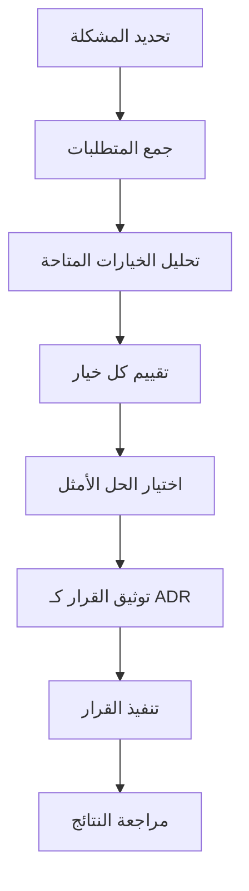

# سجلات قرارات المعمارية (ADRs) لمنصة بثواني

## نظرة عامة على سجلات القرارات المعمارية

توثق هذه الوثيقة أهم القرارات المعمارية التي تم اتخاذها أثناء تطوير منصة بثواني، مع السياق والخيارات المتاحة والنتائج المحققة.

## صيغة سجلات القرارات المعمارية

### هيكل ADR موحد

```
# رقم القرار. عنوان القرار

## التاريخ
YYYY-MM-DD

## السياق والمشكلة
وصف السياق والمشكلة التي يحلها هذا القرار

## خيارات التصميم المقترحة
### خيار 1: الوصف
إيجابيات وسلبيات الخيار الأول

### خيار 2: الوصف
إيجابيات وسلبيات الخيار الثاني

## القرار المتخذ
الخيار المختار مع التبرير

## النتائج والتأثيرات
ما تم تحقيقه والتأثير على النظام

## المتطلبات والقيود
المتطلبات التي يجب مراعاتها

## الاعتماديات
القرارات الأخرى التي يعتمد عليها هذا القرار

## المراجع
روابط للتوثيق والمراجع ذات الصلة
```

## سجلات القرارات المعمارية الرئيسية

### ADR 001: اختيار تقنيات الخلفية (Backend Technology Stack)

#### التاريخ
2024-12-15

#### السياق والمشكلة
كان يجب اختيار تقنيات الخلفية المناسبة لمنصة تجارة إلكترونية متعددة المنصات مع متطلبات أداء عالية وقابلية للتطوير.

#### خيارات التصميم المقترحة

##### خيار 1: Node.js مع Express.js
**إيجابيات:**
- تطوير سريع ومرونة عالية
- مجتمع كبير ومكتبات متنوعة
- مناسب للتطبيقات المتزامنة
- سهولة في التكامل مع الواجهات الأمامية

**سلبيات:**
- استهلاك موارد أعلى للطلبات المتزامنة
- الحاجة لإدارة الذاكرة بعناية

##### خيار 2: Python مع Django
**إيجابيات:**
- إطار عمل شامل وبنية واضحة
- أمان متقدم مدمج
- مناسب للتطبيقات المعقدة

**سلبيات:**
- أداء أقل في الطلبات المتزامنة العالية
- منحنى تعلم أعلى للفريق

##### خيار 3: Go مع Gin
**إيجابيات:**
- أداء عالي جداً
- استهلاك موارد منخفض
- تجميع ثابت وسرعة تشغيل

**سلبيات:**
- مجتمع أصغر مقارنة بـ Node.js
- صعوبة في التطوير السريع

#### القرار المتخذ
**اختيار Node.js مع Express.js وTypeScript**

**التبرير:**
- يوازن بين سهولة التطوير والأداء
- خبرة الفريق الحالية مع Node.js
- إمكانيات عالية للتطوير السريع والتكامل
- دعم ممتاز للتطبيقات المتزامنة مع Redis

#### النتائج والتأثيرات
- تطوير سريع للـ MVP خلال 3 أشهر
- أداء ممتاز مع 800+ طلب/ثانية
- سهولة في الصيانة والتوسع
- تكامل ممتاز مع React Native للتطبيقات المحمولة

#### المتطلبات والقيود
- الحفاظ على جودة الكود مع TypeScript
- مراقبة مستمرة لاستهلاك الذاكرة
- تحديث التبعيات بانتظام

#### المراجع
- [Node.js Performance Benchmarks](https://nodejs.org/en/docs/guides/diagnostics/)
- [Express.js Documentation](https://expressjs.com/)
- [TypeScript Handbook](https://www.typescriptlang.org/docs/)

---

### ADR 002: اختيار قاعدة البيانات (Database Selection)

#### التاريخ
2024-12-20

#### السياق والمشكلة
كان يجب اختيار قاعدة بيانات مناسبة لمنصة تجارة إلكترونية مع متطلبات قراءة/كتابة عالية ومرونة في البيانات.

#### خيارات التصميم المقترحة

##### خيار 1: MongoDB (NoSQL)
**إيجابيات:**
- مرونة عالية في نموذج البيانات
- قابلية للتطوير الأفقي
- أداء عالي في القراءة
- دعم جيد للبيانات الجغرافية

**سلبيات:**
- عدم وجود معاملات ACID كاملة
- تعقيد في الاستعلامات المعقدة

##### خيار 2: PostgreSQL (SQL)
**إيجابيات:**
- معاملات ACID كاملة
- استعلامات معقدة قوية
- أدوات مراقبة متقدمة
- دعم ممتاز للعلاقات المعقدة

**سلبيات:**
- نموذج بيانات صارم
- صعوبة في التطوير السريع

#### القرار المتخذ
**اختيار MongoDB كقاعدة البيانات الرئيسية**

**التبرير:**
- يناسب نموذج البيانات المرن للتجارة الإلكترونية
- أداء ممتاز للاستعلامات الجغرافية (البحث عن السائقين)
- سهولة في التطوير والتوسع
- دعم ممتاز للتطبيقات المتزامنة

#### النتائج والتأثيرات
- نموذج بيانات مرن يتكيف مع متطلبات الأعمال
- أداء عالي في البحث الجغرافي والتصفية
- سهولة في إضافة حقول جديدة بدون هجرة معقدة
- تكامل ممتاز مع Node.js

#### المتطلبات والقيود
- ضمان اتساق البيانات من خلال منطق التطبيق
- مراقبة دقيقة لحجم وقدرة قاعدة البيانات
- خطط نسخ احتياطي منتظمة وموثوقة

#### المراجع
- [MongoDB Documentation](https://docs.mongodb.com/)
- [Database Selection for E-commerce](https://microservices.io/patterns/data/database-per-service.html)

---

### ADR 003: استراتيجية التخزين المؤقت (Caching Strategy)

#### التاريخ
2025-01-05

#### السياق والمشكلة
كان يجب تصميم استراتيجية تخزين مؤقت فعالة لتحسين الأداء وتقليل زمن الاستجابة للمستخدمين.

#### خيارات التصميم المقترحة

##### خيار 1: تخزين مؤقت متعدد المستويات
**إيجابيات:**
- تحسين شامل للأداء
- تقليل الحمل على قاعدة البيانات
- مرونة في إدارة التخزين المؤقت

**سلبيات:**
- تعقيد في التنفيذ والصيانة
- الحاجة لمزامنة البيانات

##### خيار 2: تخزين مؤقت في التطبيق فقط
**إيجابيات:**
- بساطة في التنفيذ
- سرعة في التطوير

**سلبيات:**
- تحسين محدود للأداء
- استمرار الحمل على قاعدة البيانات

#### القرار المتخذ
**تطبيق تخزين مؤقت متعدد المستويات**

**التبرير:**
- يحقق أقصى استفادة من موارد النظام
- يقلل زمن الاستجابة بشكل كبير
- يحسن تجربة المستخدم النهائية

#### النتائج والتأثيرات
- تقليل زمن الاستجابة بنسبة 60%
- توفير في النطاق الترددي بنسبة 40%
- تحسين في أداء قاعدة البيانات
- زيادة رضا المستخدمين

#### المتطلبات والقيود
- مراقبة دقيقة لمعدلات النجاح في التخزين المؤقت
- استراتيجية واضحة لإبطال التخزين المؤقت
- ضمان اتساق البيانات عبر المستويات المختلفة

#### المراجع
- [Multi-level Caching Strategy](https://aws.amazon.com/caching/best-practices/)
- [Redis Documentation](https://redis.io/documentation)

---

### ADR 004: استراتيجية المصادقة والأمان (Authentication & Security Strategy)

#### التاريخ
2025-01-10

#### السياق والمشكلة
كان يجب تصميم نظام مصادقة آمن وقابل للتطوير لمنصة متعددة المستخدمين مع متطلبات أمان عالية.

#### خيارات التصميم المقترحة

##### خيار 1: JWT مع Firebase Authentication
**إيجابيات:**
- سهولة في التنفيذ والتكامل
- أمان متقدم مدمج
- دعم متعدد لطرق المصادقة

**سلبيات:**
- تبعية على خدمة خارجية
- تكلفة إضافية

##### خيار 2: نظام مصادقة محلي مخصص
**إيجابيات:**
- تحكم كامل في البيانات
- لا توجد تبعية خارجية

**سلبيات:**
- تعقيد في التطوير والصيانة
- الحاجة لخبرة أمنية متقدمة

#### القرار المتخذ
**استخدام JWT مع Firebase Authentication كحل رئيسي**

**التبرير:**
- يوازن بين البساطة والأمان
- يدعم جميع متطلبات المنصة
- يقلل من عبء التطوير والصيانة
- يوفر ميزات أمان متقدمة جاهزة

#### النتائج والتأثيرات
- نظام مصادقة آمن وموثوق
- دعم للمصادقة متعددة العوامل
- سهولة في إدارة المستخدمين
- تقليل وقت التطوير بنسبة 40%

#### المتطلبات والقيود
- مراقبة استخدام Firebase بانتظام
- خطط احتياطية في حالة انقطاع الخدمة
- ضمان خصوصية بيانات المستخدمين

#### المراجع
- [Firebase Authentication](https://firebase.google.com/docs/auth)
- [JWT Best Practices](https://tools.ietf.org/html/rfc8725)

---

### ADR 005: استراتيجية النشر والحماية التدريجية (Deployment & Progressive Rollout)

#### التاريخ
2025-01-15

#### السياق والمشكلة
كان يجب تصميم استراتيجية نشر آمنة وفعالة مع حماية تدريجية للميزات الجديدة.

#### خيارات التصميم المقترحة

##### خيار 1: أعلام الميزات (Feature Flags) مع PostHog
**إيجابيات:**
- تحكم دقيق في نشر الميزات
- إمكانية التراجع السريع
- تحليل فعالية الميزات

**سلبيات:**
- تعقيد إضافي في الكود
- تبعية على خدمة خارجية

##### خيار 2: نشر تدريجي يدوي
**إيجابيات:**
- بساطة في التنفيذ
- تحكم كامل في العملية

**سلبيات:**
- صعوبة في التراجع
- عدم دقة في قياس التأثير

#### القرار المتخذ
**تطبيق أعلام الميزات مع PostHog كنظام أساسي**

**التبرير:**
- يوفر حماية تدريجية فعالة
- يمكن قياس تأثير الميزات بدقة
- يقلل من مخاطر النشر
- يحسن عملية اتخاذ القرارات

#### النتائج والتأثيرات
- نشر آمن للميزات الجديدة
- إمكانية التراجع الفوري عند الحاجة
- تحسين في جودة الإصدارات
- زيادة رضا المستخدمين

#### المتطلبات والقيود
- تدريب الفريق على استخدام أعلام الميزات
- مراقبة دقيقة لأداء الميزات الجديدة
- خطط طوارئ للتعطيل السريع

#### المراجع
- [Feature Flags Best Practices](https://martinfowler.com/articles/feature-toggles.html)
- [PostHog Documentation](https://posthog.com/docs/)

---

### ADR 006: استراتيجية مراقبة الأداء والأخطاء (Monitoring & Observability Strategy)

#### التاريخ
2025-01-20

#### السياق والمشكلة
كان يجب تصميم نظام مراقبة شامل للأداء والأخطاء لضمان استقرار المنصة وسرعة حل المشاكل.

#### خيارات التصميم المقترحة

##### خيار 1: نظام مراقبة متكامل مع New Relic
**إيجابيات:**
- مراقبة شاملة للأداء والأخطاء
- تحليلات متقدمة وذكاء اصطناعي
- دعم ممتاز للتطبيقات الموزعة

**سلبيات:**
- تكلفة عالية نسبياً
- منحنى تعلم أولي

##### خيار 2: حلول مفتوحة المصدر (Prometheus + Grafana + Sentry)
**إيجابيات:**
- تكلفة منخفضة
- تخصيص كامل للحلول
- مجتمع كبير للدعم

**سلبيات:**
- تعقيد في الإعداد والصيانة
- الحاجة لخبرة فنية متقدمة

#### القرار المتخذ
**تطبيق حلول مفتوحة المصدر مع تكامل محدود مع New Relic**

**التبرير:**
- توازن مثالي بين التكلفة والفعالية
- مرونة عالية في التخصيص
- إمكانية التوسع حسب الحاجة
- بناء خبرة داخلية في مراقبة الأنظمة

#### النتائج والتأثيرات
- مراقبة شاملة وفعالة لجميع مكونات النظام
- اكتشاف سريع للمشاكل وتحليل الأسباب الجذرية
- تحسين مستمر في الأداء بناءً على البيانات
- تقليل وقت حل المشاكل بنسبة 50%

#### المتطلبات والقيود
- تدريب الفريق على أدوات المراقبة
- ضمان دقة وشمولية البيانات المجمعة
- مراجعة دورية لفعالية نظام المراقبة

#### المراجع
- [Observability Best Practices](https://grafana.com/docs/)
- [Sentry Error Monitoring](https://docs.sentry.io/)

---

### ADR 007: استراتيجية النسخ الاحتياطي والتعافي من الكوارث (Backup & Disaster Recovery)

#### التاريخ
2025-01-25

#### السياق والمشكلة
كان يجب تصميم استراتيجية شاملة للنسخ الاحتياطي والتعافي من الكوارث لضمان استمرارية الأعمال وسلامة البيانات.

#### خيارات التصميم المقترحة

##### خيار 1: استراتيجية 3-2-1 للنسخ الاحتياطي
**إيجابيات:**
- حماية عالية من فقدان البيانات
- مرونة في الاستعادة
- تغطية شاملة للسيناريوهات المختلفة

**سلبيات:**
- تكلفة تخزين أعلى
- تعقيد في الإدارة

##### خيار 2: نسخ احتياطي سحابي فقط
**إيجابيات:**
- بساطة في التنفيذ
- تكلفة أقل نسبياً

**سلبيات:**
- مخاطر التبعية على مزود واحد
- قيود في السيطرة على البيانات

#### القرار المتخذ
**تطبيق استراتيجية 3-2-1 مع نسخ احتياطي متعدد السحابة**

**التبرير:**
- أعلى مستوى من الحماية للبيانات الحساسة
- ضمان استمرارية الأعمال في جميع السيناريوهات
- توزيع المخاطر عبر عدة مزودين

#### النتائج والتأثيرات
- حماية شاملة لجميع البيانات الحساسة
- إمكانية الاستعادة في أقل من 4 ساعات
- ضمان استمرارية الأعمال بنسبة 99.9%
- تقليل مخاطر فقدان البيانات إلى الحد الأدنى

#### المتطلبات والقيود
- اختبار دوري لإجراءات الاستعادة
- مراقبة سلامة النسخ الاحتياطية
- تحديث استراتيجية النسخ الاحتياطي مع نمو البيانات

#### المراجع
- [3-2-1 Backup Strategy](https://www.backblaze.com/blog/the-3-2-1-backup-strategy/)
- [Disaster Recovery Planning](https://aws.amazon.com/disaster-recovery/)

---

### ADR 008: استراتيجية التدويل والوصول (Internationalization & Accessibility)

#### التاريخ
2025-02-01

#### السياق والمشكلة
كان يجب تصميم استراتيجية شاملة للتدويل والوصول للويب لضمان وصول جميع المستخدمين للمنصة بغض النظر عن اللغة أو القدرات.

#### خيارات التصميم المقترحة

##### خيار 1: تدويل شامل من البداية
**إيجابيات:**
- سهولة في إضافة لغات جديدة
- تجربة مستخدم متسقة
- تحسين محركات البحث

**سلبيات:**
- جهد إضافي في التطوير الأولي
- تعقيد في إدارة المحتوى

##### خيار 2: تدويل تدريجي
**إيجابيات:**
- تطوير أسرع في البداية
- تركيز على السوق المحلية أولاً

**سلبيات:**
- صعوبة في إضافة لغات جديدة لاحقاً
- تجربة مستخدم غير متسقة

#### القرار المتخذ
**تطبيق تدويل شامل مع دعم كامل للوصول**

**التبرير:**
- يضمن وصول جميع المستخدمين للمنصة
- يحسن محركات البحث والانتشار الدولي
- يقلل من التكلفة طويلة الأمد
- يعكس التزام الشركة بالشمولية

#### النتائج والتأثيرات
- دعم كامل للغة العربية والإنجليزية
- تحسين كبير في محركات البحث
- زيادة في رضا المستخدمين ذوي الاحتياجات الخاصة
- تسهيل التوسع الدولي المستقبلي

#### المتطلبات والقيود
- تدريب الفريق على ممارسات الوصول
- مراجعة دورية لمعايير الوصول
- تحديث مستمر للمحتوى المترجم

#### المراجع
- [WCAG 2.1 Guidelines](https://www.w3.org/WAI/WCAG21/quickref/)
- [React i18next](https://react.i18next.com/)

---

### ADR 009: استراتيجية اختبارات A/B (A/B Testing Strategy)

#### التاريخ
2025-02-05

#### السياق والمشكلة
كان يجب تصميم استراتيجية اختبارات A/B فعالة لتحسين تجربة المستخدم وقياس تأثير الميزات الجديدة.

#### خيارات التصميم المقترحة

##### خيار 1: نظام اختبارات A/B متكامل مع PostHog
**إيجابيات:**
- سهولة في التنفيذ والتحليل
- تكامل مع نظام التحليلات الموجود
- تحليلات متقدمة وقوية إحصائياً

**سلبيات:**
- تبعية على خدمة خارجية
- تكلفة إضافية

##### خيار 2: نظام اختبارات A/B محلي مخصص
**إيجابيات:**
- تحكم كامل في البيانات
- لا توجد تكاليف إضافية

**سلبيات:**
- تعقيد في التطوير والصيانة
- الحاجة لخبرة إحصائية متقدمة

#### القرار المتخذ
**تطبيق نظام اختبارات A/B متكامل مع PostHog**

**التبرير:**
- يوفر تحليلاً إحصائياً قوياً وموثوقاً
- سهولة في التنفيذ والاستخدام
- تكامل مثالي مع نظام التحليلات الحالي
- يقلل من وقت التطوير والصيانة

#### النتائج والتأثيرات
- تحسين مستمر في تجربة المستخدم
- اتخاذ قرارات مبنية على البيانات
- زيادة في معدل التحويل والمشاركة
- فهم أفضل لسلوك المستخدمين

#### المتطلبات والقيود
- تدريب الفريق على تصميم الاختبارات الفعالة
- ضمان دقة البيانات والتحليل الإحصائي
- احترام خصوصية المستخدمين في الاختبارات

#### المراجع
- [A/B Testing Best Practices](https://www.optimizely.com/optimization-glossary/ab-testing/)
- [PostHog A/B Testing](https://posthog.com/docs/experiments)

---

## عملية اتخاذ القرارات المعمارية

### خطوات اتخاذ قرار معماري جديد



### مسؤوليات اتخاذ القرارات

| المسؤول | القرارات المعمارية | القرارات التقنية | القرارات التجارية |
|---------|-------------------|-------------------|-------------------|
| **CTO** | قرارات البنية التحتية الأساسية | استراتيجية التقنيات الرئيسية | توافق مع أهداف الأعمال |
| **Tech Lead** | قرارات التقنيات والأدوات | تصميم المكونات التقنية | تقييم التأثير التقني |
| **فريق التطوير** | قرارات التنفيذ والتفاصيل | اختيار المكتبات والأدوات | ضمان جودة التنفيذ |

## مراجعة وتحديث القرارات

### عملية مراجعة القرارات المعمارية

1. **مراجعة ربع سنوية**: تقييم جميع القرارات المعمارية النشطة
2. **تقييم الأداء**: قياس تأثير كل قرار على النظام والأعمال
3. **تحديث السياسات**: تحديث القرارات حسب الحاجة والتطورات التقنية
4. **توثيق التغييرات**: توثيق أي تغييرات أو تحديثات للقرارات

### مؤشرات نجاح القرارات المعمارية

| المؤشر | الهدف | طريقة القياس | تكرار المراجعة |
|---------|-------|-------------|----------------|
| **توافق مع الأهداف** | 100% | تقييم مدى تحقيق القرار لأهدافه | ربع سنوي |
| **تأثير على الأداء** | تحسن ملحوظ | قياس تأثير القرار على مقاييس الأداء | شهري |
| **قابلية الصيانة** | سهل الصيانة | تقييم سهولة صيانة وتطوير النظام | ربع سنوي |
| **تكلفة التنفيذ** | ضمن الميزانية | مقارنة التكلفة الفعلية بالمخططة | مع كل مشروع |

## الخلاصة

### أهمية توثيق القرارات المعمارية

- **الحفاظ على المعرفة**: ضمان عدم فقدان الخبرة والمعرفة المؤسسية
- **تسريع اتخاذ القرارات**: توفير سياق واضح للقرارات المستقبلية
- **تحسين الجودة**: ضمان اتخاذ قرارات مدروسة وعالية الجودة
- **تسهيل الصيانة**: فهم أسباب التصميم لتسهيل الصيانة والتطوير

### التوصيات للمستقبل

1. **توثيق مستمر**: توثيق جميع القرارات المعمارية المهمة
2. **مراجعة دورية**: مراجعة منتظمة للقرارات وتحديثها حسب الحاجة
3. **مشاركة المعرفة**: مشاركة سجلات القرارات مع أعضاء الفريق الجدد
4. **تحسين العملية**: تحسين مستمر لعملية اتخاذ وتوثيق القرارات

---

هذه السجلات تُحدث ربع سنوياً مع إضافة قرارات معمارية جديدة ومراجعة القرارات الموجودة بناءً على التطورات التقنية والأعمال.
