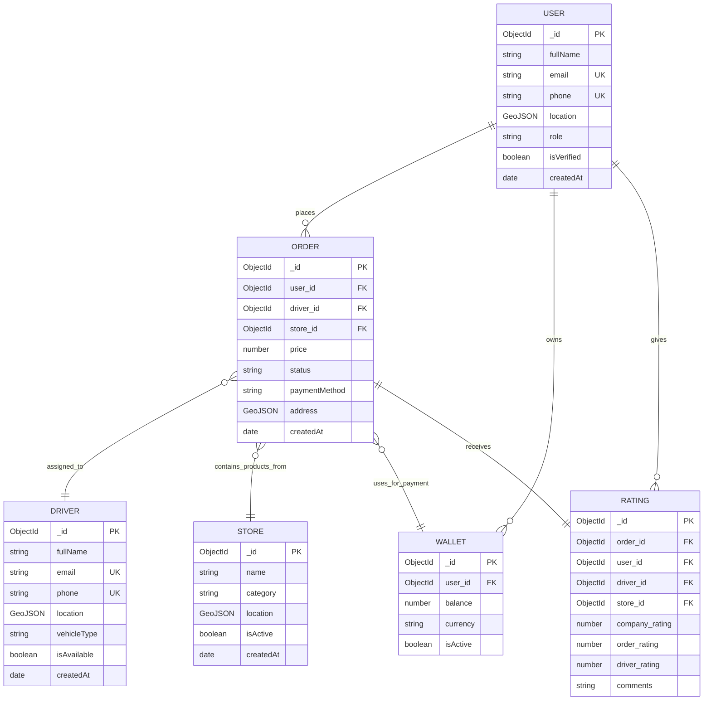
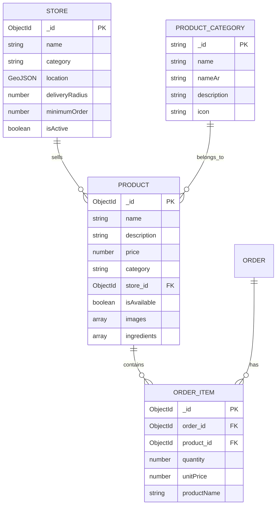
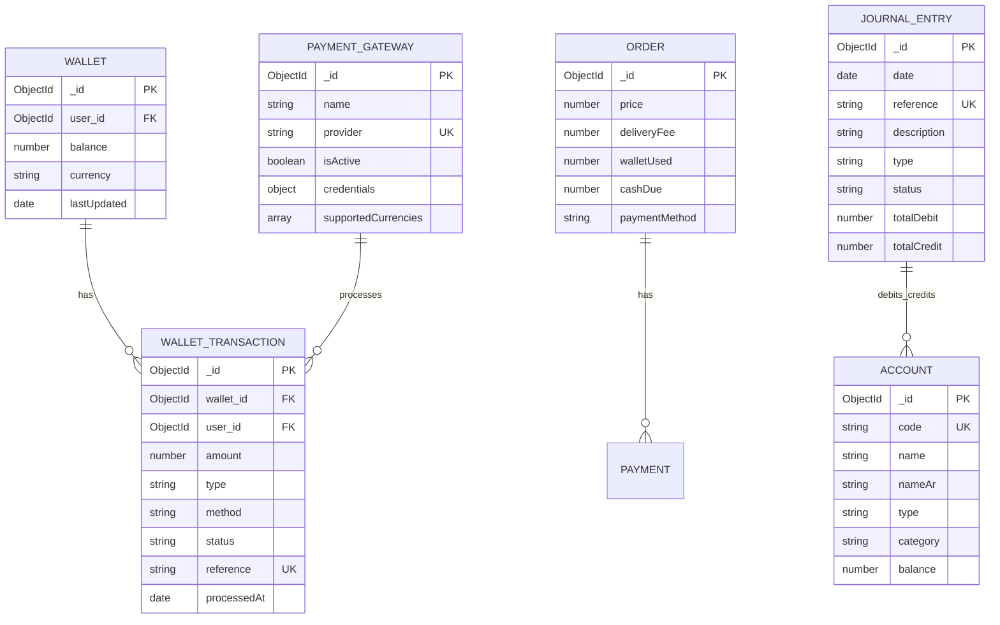
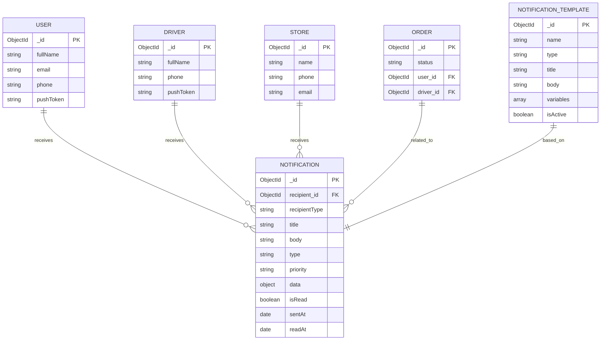
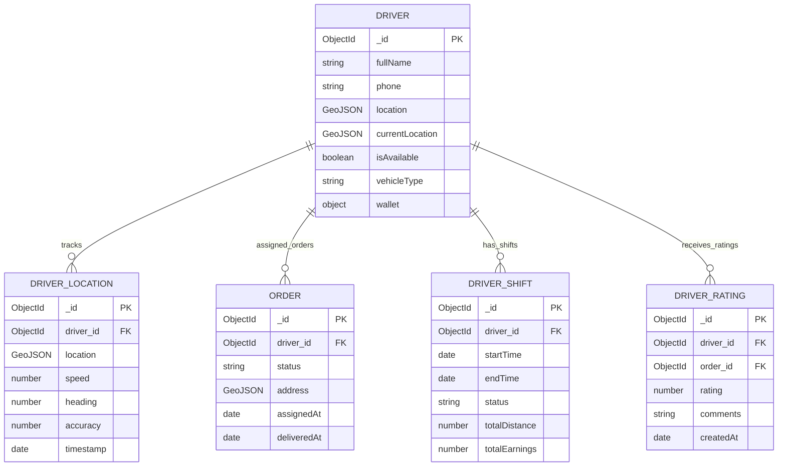
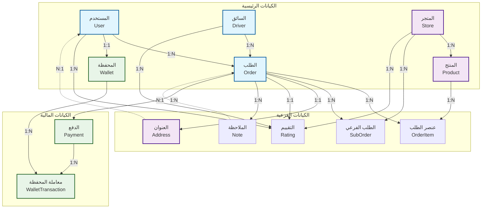
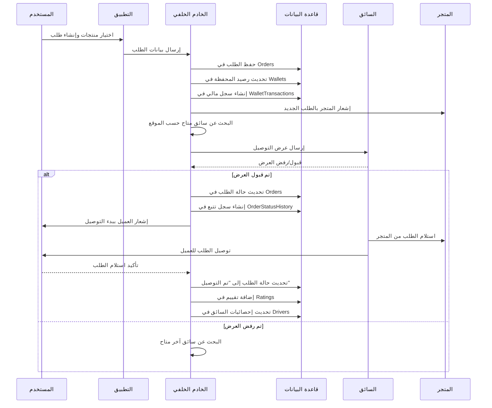
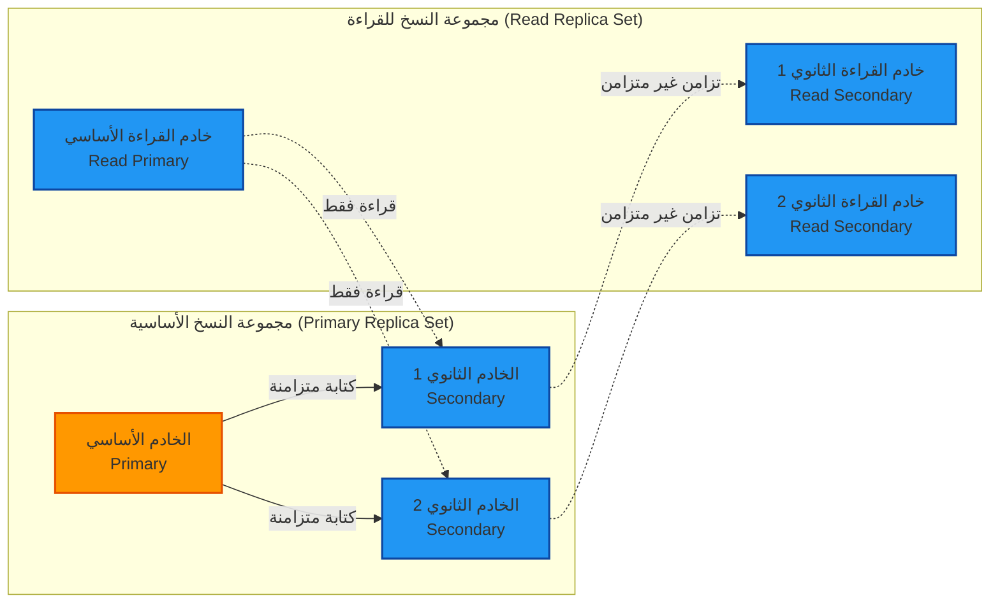

# خرائط العلاقات (ERD) لمنصة بثواني

## نظرة عامة
توثق هذه الصفحة خرائط العلاقات بين الكيانات (Entity Relationship Diagrams) لقاعدة البيانات في منصة بثواني. تم تصميم هذه المخططات لتوضيح العلاقات بين الكيانات المختلفة والمساعدة في فهم بنية البيانات.

## أسطورة المخطط (Legend)

```
المستطيل: كيان رئيسي (Entity)
البيضاوي: خاصية (Attribute)
الماس: علاقة (Relationship)
السهم: اتجاه العلاقة
الرقم: عددية العلاقة (Cardinality)
```

## مخطط العلاقات الرئيسية

### 1. علاقات المستخدمين والطلبات



### 2. علاقات المنتجات والمتاجر



### 3. علاقات المعاملات المالية



### 4. علاقات الإشعارات والتتبع



### 5. علاقات السائقين والتتبع



## مخطط العلاقات المفصل - نموذج الطلبات



## مخطط تدفق البيانات - عملية طلب جديد



## مصفوفة العلاقات (Relationship Matrix)

| الكيان الرئيسي | Users | Drivers | Orders | Stores | Products | Wallets |
|----------------|-------|---------|--------|--------|----------|---------|
| **Users** | - | N:M | 1:N | N:M | N:M | 1:1 |
| **Drivers** | N:M | - | 1:N | 1:N | N:M | 1:1 |
| **Orders** | 1:N | 1:N | - | N:M | N:M | N:M |
| **Stores** | N:M | 1:N | N:M | - | 1:N | 1:1 |
| **Products** | N:M | N:M | N:M | 1:N | - | N:M |
| **Wallets** | 1:1 | 1:1 | N:M | 1:1 | N:M | - |

### تفسير المصفوفة:
- **1:1**: علاقة واحد لواحد
- **1:N**: علاقة واحد لمتعدد
- **N:M**: علاقة متعدد لمتعدد
- **N:M**: علاقة متعدد لمتعدد (تحتاج جدول وسطي)

## قيود التكامل المرجعي (Referential Integrity)

### قيود الحذف (Cascade Delete Rules)

1. **عند حذف مستخدم**:
   - حذف جميع طلباته (CASCADE)
   - حذف محفظته (CASCADE)
   - حذف تقييماته (CASCADE)
   - إبقاء سجلات التدقيق (RESTRICT)

2. **عند حذف سائق**:
   - إلغاء تكليفه من الطلبات (SET NULL)
   - حذف تقييماته (CASCADE)
   - إبقاء سجل التتبع (RESTRICT)

3. **عند حذف متجر**:
   - إلغاء توفر منتجاته (SET NULL)
   - إلغاء الطلبات الفرعية (SET NULL)
   - حذف منتجاته (CASCADE)

4. **عند حذف منتج**:
   - إزالته من الطلبات (CASCADE)
   - حذف تقييماته (CASCADE)

### قيود التحقق من الصحة (Validation Constraints)

1. **قيود على الطلبات**:
   - السعر يجب أن يكون أكبر من 0
   - حالة الطلب يجب أن تكون من القيم المحددة
   - عنوان التوصيل مطلوب

2. **قيود على المستخدمين**:
   - البريد الإلكتروني صيغته صحيحة
   - رقم الهاتف بالصيغة الصحيحة للبلد
   - كلمة المرور لا تقل عن 8 أحرف

3. **قيود على السائقين**:
   - الموقع مطلوب وصالح جغرافياً
   - نوع المركبة مطلوب
   - حالة التوفر منطقية

## استراتيجية النسخ المتماثل (Replication Strategy)



### إعدادات النسخ المتماثل:
- **نوع النسخ**: Replica Set مع Read Preference
- **عدد النسخ**: 5 خوادم (2 للكتابة، 3 للقراءة)
- **التأخير المسموح**: أقل من 1 ثانية
- **استراتيجية الفشل**: Automatic Failover

---

*آخر تحديث: أكتوبر 2025*
*الإصدار: 1.0.0*
