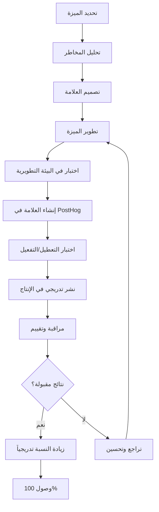

# سياسة الأعلام الميزات (Feature Flags) والحماية التدريجية لمنصة بثواني

## نظرة عامة على سياسة الأعلام الميزات

توثق هذه السياسة إطار عمل إدارة الأعلام الميزات (Feature Flags) في منصة بثواني، مع التركيز على الحماية التدريجية والنشر الآمن والمراقبة المستمرة للميزات الجديدة.

## فلسفة الأعلام الميزات في بثواني

### مبادئ أساسية

1. **الحماية التدريجية**: كل ميزة جديدة تبدأ بنسبة صغيرة من المستخدمين
2. **المراقبة المستمرة**: مراقبة الأداء والأخطاء في الوقت الفعلي
3. **التراجع السريع**: إمكانية تعطيل الميزة فوراً عند اكتشاف مشاكل
4. **البيانات المبنية على القرارات**: اتخاذ قرارات النشر بناءً على المقاييس

### أنواع الأعلام الميزات

```typescript
enum FeatureFlagType {
  RELEASE = 'release',        // ميزات جديدة في مرحلة الإصدار
  EXPERIMENT = 'experiment',  // اختبارات A/B وتجارب
  OPERATIONAL = 'operational', // تغييرات تشغيلية
  KILL_SWITCH = 'kill_switch'  // تعطيل مؤقت للمشاكل الحرجة
}
```

## هيكل إدارة الأعلام الميزات

### 1. نظام إدارة الأعلام (Feature Flags Management)

#### أدوات مستخدمة
- **PostHog**: إدارة الأعلام وتحليل النتائج
- **LaunchDarkly** (احتياطي): إدارة متقدمة للمؤسسات الكبيرة
- **نظام داخلي**: لوحة إدارة مخصصة للفريق التقني

#### هيكل العلامة الميزة
```typescript
interface FeatureFlag {
  id: string;
  name: string;
  description: string;
  type: FeatureFlagType;
  status: 'draft' | 'active' | 'paused' | 'archived';

  // إعدادات التوزيع
  targeting: {
    percentage: number;        // نسبة المستخدمين المشمولين
    userGroups: string[];     // مجموعات مستخدمين محددة
    environments: string[];   // البيئات المفعلة فيها
    platforms: string[];      // المنصات المشمولة
  };

  // إعدادات السلامة
  safety: {
    maxErrorRate: number;     // معدل أخطاء مقبول (5% افتراضياً)
    maxResponseTime: number;  // وقت استجابة مقبول (500ms افتراضياً)
    autoDisable: boolean;     // تعطيل تلقائي عند تجاوز الحدود
  };

  // معلومات التتبع
  metadata: {
    createdBy: string;
    createdAt: string;
    lastModifiedBy: string;
    lastModifiedAt: string;
    version: string;
    rollbackVersion?: string;
  };
}
```

### 2. لوحة إدارة الأعلام الميزات

#### واجهة المستخدم للمشرفين

```typescript
// مثال لواجهة إدارة الأعلام
const FeatureFlagsDashboard = () => {
  const [flags, setFlags] = useState<FeatureFlag[]>([]);

  const updateFlag = async (flagId: string, updates: Partial<FeatureFlag>) => {
    // تحديث العلامة مع تسجيل العملية
    await api.updateFeatureFlag(flagId, updates);

    // إعادة تحميل الأعلام في جميع الخوادم
    await reloadAllServers();

    // إرسال إشعار للفريق التقني
    await notifyTeam('Feature flag updated', { flagId, updates });
  };

  return (
    <div>
      <h2>إدارة الأعلام الميزات</h2>

      {flags.map(flag => (
        <FeatureFlagCard
          key={flag.id}
          flag={flag}
          onUpdate={(updates) => updateFlag(flag.id, updates)}
        />
      ))}
    </div>
  );
};
```

## استراتيجية الحماية التدريجية (Progressive Rollout)

### مراحل النشر التدريجي

#### المرحلة 1: البيئة التطويرية (Development)
```yaml
rollout_strategy:
  development:
    percentage: 100          # جميع المطورين
    targeting:
      userGroups: ['developers', 'qa-team']
      environments: ['dev', 'staging']
    safety:
      maxErrorRate: 10       # أعلى تسامح في التطوير
      autoDisable: false     # عدم تعطيل تلقائي في التطوير
```

#### المرحلة 2: الاختبار الداخلي (Internal Testing)
```yaml
internal_testing:
  percentage: 5            # 5% من المستخدمين الداخليين
  targeting:
    userGroups: ['internal-testers', 'product-team']
    environments: ['staging']
  safety:
    maxErrorRate: 1        # متطلبات صارمة للجودة
    autoDisable: true       # تعطيل تلقائي لحماية المستخدمين
```

#### المرحلة 3: النشر التدريجي (Progressive Rollout)
```yaml
progressive_rollout:
  stages:
    - percentage: 1       # 1% من المستخدمين الحقيقيين
      duration: '1h'      # ساعة واحدة مراقبة
    - percentage: 10      # 10% من المستخدمين
      duration: '6h'      # 6 ساعات مراقبة
    - percentage: 50      # 50% من المستخدمين
      duration: '24h'     # يوم كامل مراقبة
    - percentage: 100     # جميع المستخدمين
      duration: '7d'      # أسبوع مراقبة نهائي

  safety:
    maxErrorRate: 0.5     # معدل أخطاء منخفض جداً
    maxResponseTime: 200  # وقت استجابة سريع
    autoDisable: true      # تعطيل تلقائي فوري
```

### آلية التراجع التلقائي (Automatic Rollback)

```typescript
class AutoRollbackManager {
  constructor(private flagId: string) {}

  async monitorMetrics() {
    const metrics = await this.getCurrentMetrics();

    if (this.shouldRollback(metrics)) {
      await this.rollback();
      await this.notifyTeam();
    }
  }

  private shouldRollback(metrics: PerformanceMetrics): boolean {
    return (
      metrics.errorRate > 0.5 ||           // معدل أخطاء عالي
      metrics.responseTime > 200 ||        // وقت استجابة بطيء
      metrics.crashRate > 1 ||             // معدل تعطل عالي
      metrics.userComplaints > 10          // شكاوى مستخدمين
    );
  }

  private async rollback() {
    // تعطيل العلامة مؤقتاً
    await FeatureFlags.update(this.flagId, {
      status: 'paused',
      targeting: { percentage: 0 }
    });

    // إشعار جميع الخوادم
    await reloadAllServers();

    // حفظ نسخة احتياطية من الإعدادات
    await backupCurrentConfiguration();
  }
}
```

## كتالوج الأعلام الميزات الحالية

### أعلام الميزات النشطة

| العلامة | النوع | الوصف | نسبة التغطية | الحالة | تاريخ الإنشاء |
|---------|-------|--------|---------------|--------|----------------|
| **newCheckout** | `release` | نظام دفع محسن | 100% | نشطة | 2025-01-15 |
| **promoBanner** | `experiment` | لافتات ترويجية مخصصة | 25% | نشطة | 2025-02-01 |
| **darkMode** | `release` | وضع مظلم للتطبيق | 50% | نشطة | 2025-01-20 |
| **advancedSearch** | `experiment` | بحث متقدم بالذكاء الاصطناعي | 10% | نشطة | 2025-02-15 |
| **notifications** | `release` | نظام إشعارات محسن | 75% | نشطة | 2025-01-10 |

### أعلام الميزات المخططة

| العلامة | النوع | الوصف | المرحلة | تاريخ التخطيط |
|---------|-------|--------|---------|----------------|
| **aiRecommendations** | `experiment` | توصيات بالذكاء الاصطناعي | قيد التطوير | 2025-03-01 |
| **voiceSearch** | `experiment` | بحث صوتي | قيد التصميم | 2025-04-01 |
| **subscriptionModel** | `release` | نموذج الاشتراكات | قيد التخطيط | 2025-05-01 |
| **multiVendorDelivery** | `release` | توصيل متعدد التجار | قيد التحليل | 2025-06-01 |

## عملية إنشاء وإدارة علامة ميزة جديدة

### خطوات إنشاء علامة ميزة جديدة



### نموذج طلب علامة ميزة جديدة

```typescript
interface FeatureFlagRequest {
  // معلومات أساسية
  name: string;
  description: string;
  type: FeatureFlagType;

  // المتطلبات التقنية
  technicalRequirements: {
    affectedServices: string[];
    databaseChanges: boolean;
    apiChanges: boolean;
    clientChanges: boolean;
  };

  // خطة النشر
  rolloutPlan: {
    initialPercentage: number;
    targetPercentage: number;
    rolloutStages: RolloutStage[];
    rollbackPlan: string;
  };

  // مقاييس النجاح
  successMetrics: {
    primary: string;
    secondary: string[];
    targetValues: Record<string, number>;
  };

  // معلومات المسؤولية
  owner: string;
  reviewers: string[];
  approvers: string[];
}
```

## مراقبة وتنبيهات الأعلام الميزات

### نظام المراقبة الشامل

#### مقاييس مراقبة الأعلام الميزات

```typescript
interface FeatureFlagMetrics {
  // مقاييس الأداء
  performance: {
    responseTime: number;
    errorRate: number;
    throughput: number;
  };

  // مقاييس الأعمال
  business: {
    conversionRate: number;
    userEngagement: number;
    retentionRate: number;
  };

  // مقاييس الاستخدام
  usage: {
    activeUsers: number;
    featureAdoption: number;
    userSatisfaction: number;
  };

  // مقاييس السلامة
  safety: {
    crashRate: number;
    userComplaints: number;
    supportTickets: number;
  };
}
```

#### لوحة مراقبة الأعلام الميزات

```typescript
// مكون React لمراقبة الأعلام
const FeatureFlagMonitor = ({ flagId }: { flagId: string }) => {
  const [metrics, setMetrics] = useState<FeatureFlagMetrics | null>(null);
  const [alerts, setAlerts] = useState<Alert[]>([]);

  useEffect(() => {
    const fetchMetrics = async () => {
      const data = await api.getFeatureFlagMetrics(flagId);
      setMetrics(data);

      // فحص التنبيهات
      const newAlerts = checkAlerts(data);
      setAlerts(newAlerts);
    };

    fetchMetrics();
    const interval = setInterval(fetchMetrics, 30000); // كل 30 ثانية

    return () => clearInterval(interval);
  }, [flagId]);

  return (
    <div className="feature-flag-monitor">
      <h3>مراقبة العلامة: {flagId}</h3>

      {metrics && <MetricsDisplay metrics={metrics} />}
      {alerts.length > 0 && <AlertsPanel alerts={alerts} />}
    </div>
  );
};
```

### نظام التنبيهات الذكي

```typescript
interface AlertRule {
  id: string;
  name: string;
  flagId: string;
  condition: string;
  threshold: number;
  severity: 'info' | 'warning' | 'error' | 'critical';
  notificationChannels: string[];
  isEnabled: boolean;
}

// قواعد تنبيه افتراضية
const defaultAlertRules = [
  {
    id: 'high_error_rate',
    name: 'معدل أخطاء عالي',
    condition: 'errorRate > 0.05',
    threshold: 5,
    severity: 'error',
    notificationChannels: ['slack', 'email', 'sms']
  },
  {
    id: 'performance_degradation',
    name: 'تدهور في الأداء',
    condition: 'responseTime > 500',
    threshold: 500,
    severity: 'warning',
    notificationChannels: ['slack', 'email']
  },
  {
    id: 'low_user_engagement',
    name: 'انخفاض تفاعل المستخدمين',
    condition: 'userEngagement < 0.3',
    threshold: 0.3,
    severity: 'info',
    notificationChannels: ['email']
  }
];
```

## اختبارات A/B مع الأعلام الميزات

### هيكل اختبار A/B

```typescript
interface ABTest {
  id: string;
  name: string;
  description: string;

  // الأعلام المستخدمة
  featureFlags: string[];

  // مجموعات الاختبار
  variants: {
    control: {
      name: string;
      description: string;
      trafficPercentage: number;
      featureFlagValues: Record<string, boolean>;
    };
    variantA: {
      name: string;
      description: string;
      trafficPercentage: number;
      featureFlagValues: Record<string, boolean>;
    };
    variantB?: {
      name: string;
      description: string;
      trafficPercentage: number;
      featureFlagValues: Record<string, boolean>;
    };
  };

  // مقاييس النجاح
  successMetrics: {
    primary: string;
    secondary: string[];
    minimumImprovement: number; // نسبة التحسن المطلوبة
  };

  // معلومات التنفيذ
  startDate: string;
  endDate: string;
  status: 'planned' | 'running' | 'completed' | 'cancelled';

  // نتائج الاختبار
  results?: {
    winner: string;
    confidence: number;
    improvement: number;
    statisticalSignificance: boolean;
  };
}
```

### مثال على اختبار A/B حقيقي

```typescript
const checkoutOptimizationTest: ABTest = {
  id: 'checkout_flow_optimization',
  name: 'تحسين تدفق إتمام الطلب',
  description: 'اختبار تخطيط جديد لصفحة إتمام الطلب',

  featureFlags: ['newCheckout', 'simplifiedForm'],

  variants: {
    control: {
      name: 'التدفق الحالي',
      description: 'صفحة إتمام الطلب الحالية',
      trafficPercentage: 50,
      featureFlagValues: {
        newCheckout: false,
        simplifiedForm: false
      }
    },
    variantA: {
      name: 'تدفق محسن',
      description: 'صفحة إتمام طلب مبسطة مع خطوات أقل',
      trafficPercentage: 50,
      featureFlagValues: {
        newCheckout: true,
        simplifiedForm: true
      }
    }
  },

  successMetrics: {
    primary: 'checkout_completion_rate',
    secondary: ['time_to_complete', 'form_abandonment_rate'],
    minimumImprovement: 15 // 15% تحسن مطلوب
  },

  startDate: '2025-03-01',
  endDate: '2025-03-31',
  status: 'planned'
};
```

## إدارة المخاطر والسلامة

### مصفوفة المخاطر للأعلام الميزات

| نوع الميزة | مستوى المخاطر | متطلبات السلامة | إجراءات وقائية |
|-------------|----------------|-------------------|-----------------|
| **تغييرات واجهة المستخدم** | منخفض | مراقبة معدل الأخطاء | تراجع سريع |
| **تغييرات منطق الأعمال** | متوسط | مراقبة شاملة للمقاييس | مراجعة كود إضافية |
| **تغييرات قاعدة البيانات** | عالي | نسخ احتياطي قبل النشر | خطة تراجع مفصلة |
| **تغييرات البنية التحتية** | حرج | مراقبة 24/7 | فريق طوارئ جاهز |

### خطط الطوارئ لكل نوع مخاطر

```typescript
const emergencyPlans = {
  lowRisk: {
    trigger: 'errorRate > 1%',
    actions: [
      'notify_developer',
      'increase_logging',
      'prepare_rollback'
    ]
  },

  mediumRisk: {
    trigger: 'errorRate > 0.5% || performance_degradation',
    actions: [
      'notify_team',
      'reduce_traffic_percentage',
      'enable_detailed_monitoring'
    ]
  },

  highRisk: {
    trigger: 'errorRate > 0.1% || critical_errors',
    actions: [
      'immediate_rollback',
      'notify_all_stakeholders',
      'enable_circuit_breaker',
      'activate_backup_system'
    ]
  },

  criticalRisk: {
    trigger: 'system_unavailable || data_corruption',
    actions: [
      'emergency_rollback',
      'activate_disaster_recovery',
      'notify_executive_team',
      'external_communication'
    ]
  }
};
```

## التكامل مع دورة التطوير

### تكامل مع Git وCI/CD

```yaml
# مثال على pipeline CI/CD مع Feature Flags
stages:
  - name: build
    script:
      - npm run build

  - name: test
    script:
      - npm run test
      - npm run e2e-test

  - name: feature_flag_check
    script:
      # فحص أن جميع الأعلام الميزات محددة بشكل صحيح
      - validate_feature_flags

  - name: deploy_staging
    script:
      - deploy_to_staging
      - enable_feature_flags_staging

  - name: integration_test
    script:
      - run_integration_tests
      - validate_feature_flags_integration

  - name: deploy_production
    script:
      - deploy_to_production
      - enable_feature_flags_production_gradually
```

### تكامل مع نظام إدارة المشاريع

```typescript
interface FeatureFlagProject {
  projectId: string;
  featureId: string;
  flagId: string;

  // حالة التطوير
  developmentStatus: 'planning' | 'in_development' | 'testing' | 'ready_for_rollout';

  // حالة النشر
  rolloutStatus: 'not_started' | 'in_progress' | 'completed' | 'rolled_back';

  // معلومات التتبع
  createdBy: string;
  assignedTo: string;
  estimatedEffort: number;
  actualEffort?: number;

  // تواريخ مهمة
  plannedStartDate: string;
  actualStartDate?: string;
  plannedCompletionDate: string;
  actualCompletionDate?: string;
}
```

## التدريب والتوثيق

### دليل المطور لاستخدام الأعلام الميزات

```typescript
// مثال على استخدام Feature Flag في الكود
import { useFeatureFlag } from '@/lib/featureFlags';

const ProductCard = ({ product }: { product: Product }) => {
  // استخدام العلامة الميزة
  const showNewDesign = useFeatureFlag('newProductCard');
  const enableQuickAdd = useFeatureFlag('quickAddToCart');

  if (showNewDesign) {
    return <NewProductCardDesign product={product} />;
  }

  return <ProductCardClassic product={product} />;
};

// مثال على استخدام Kill Switch
const PaymentButton = ({ amount }: { amount: number }) => {
  const paymentsEnabled = useFeatureFlag('killPayments');

  if (!paymentsEnabled) {
    return (
      <div className="payment-disabled">
        نظام الدفع معطل مؤقتاً للصيانة
      </div>
    );
  }

  return <PaymentForm amount={amount} />;
};
```

### دليل مراقبة الأعلام الميزات

```bash
#!/bin/bash
# سكريبت مراقبة الأعلام الميزات

echo "=== مراقبة الأعلام الميزات $(date) ==="

# فحص حالة جميع الأعلام النشطة
check_active_flags() {
  curl -s "https://api.bthwani.com/api/admin/feature-flags" \
    | jq '.flags[] | select(.status == "active") | .name'
}

# فحص مقاييس الأداء لكل علامة
check_flag_metrics() {
  for flag in $(check_active_flags); do
    echo "=== فحص العلامة: $flag ==="
    curl -s "https://api.bthwani.com/api/admin/feature-flags/$flag/metrics" \
      | jq '.'
  done
}

# فحص التنبيهات النشطة
check_active_alerts() {
  curl -s "https://api.bthwani.com/api/admin/feature-flags/alerts" \
    | jq '.alerts[] | select(.status == "active")'
}
```

## الخلاصة والتوصيات

### النتائج الحالية
- ✅ **نظام أعلام ميزات فعال**: PostHog متكامل مع جميع التطبيقات
- ✅ **حماية تدريجية منظمة**: استراتيجية نشر آمنة ومراقبة
- ✅ **مراقبة شاملة**: تتبع الأداء والأخطاء في الوقت الفعلي
- ✅ **تراجع سريع**: إمكانية تعطيل الميزات فوراً عند الحاجة
- ✅ **اختبارات A/B مدعومة**: إطار عمل للتجارب والتحسين المستمر

### التوصيات الرئيسية

1. **توسيع نطاق الاستخدام**: تطبيق الأعلام الميزات على جميع الميزات الجديدة
2. **تحسين آليات السلامة**: تطوير نظام تنبيهات أكثر ذكاءً
3. **تدريب الفريق**: تعزيز ثقافة استخدام الأعلام الميزات في التطوير
4. **توثيق شامل**: توثيق كل علامة ميزة وخطة نشرها
5. **مراجعة دورية**: مراجعة فعالية الأعلام الميزات ربع سنوياً

### المخاطر والتخفيف

| المخاطر | التأثير | احتمالية الحدوث | خطة التخفيف |
|---------|---------|----------------|-------------|
| **تعطيل ميزة حرجة** | عالي | منخفضة | اختبار شامل قبل النشر |
| **مشاكل في الأداء** | متوسط | متوسطة | مراقبة مستمرة وتراجع تلقائي |
| **تعقيد إدارة الأعلام** | متوسط | عالية | توثيق واضح وتدريب الفريق |
| **تأثير على تجربة المستخدم** | عالي | منخفضة | نشر تدريجي ومراقبة التفاعل |

---

هذه السياسة تُحدث سنوياً أو عند الحاجة لتحسين عمليات النشر والحماية التدريجية بناءً على الدروس المستفادة والتطورات التقنية.
