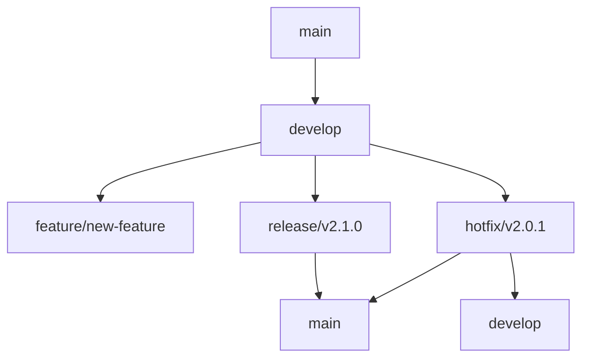
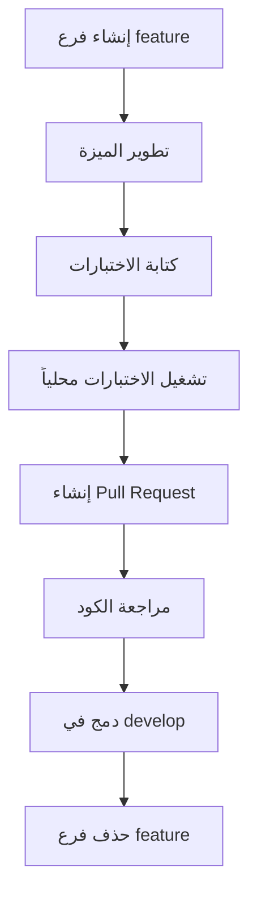
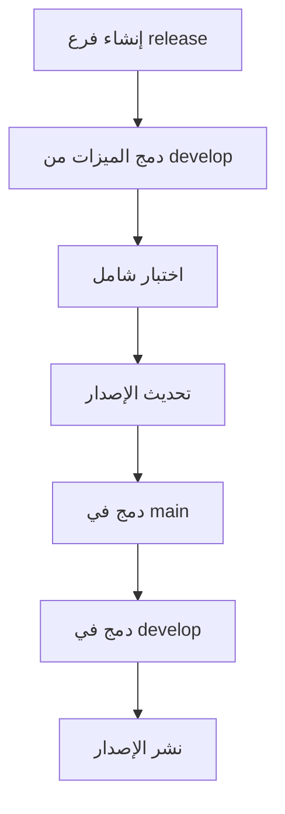
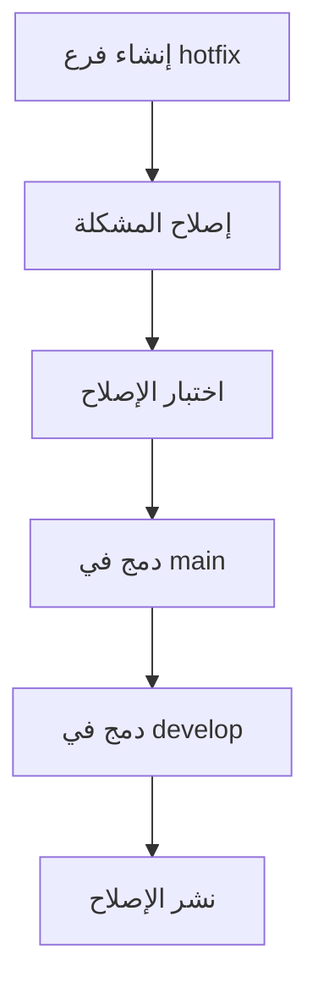

# سياسة الفروع والإصدارات لمنصة بثواني

## نظرة عامة على سياسة إدارة الإصدارات

توثق هذه السياسة نموذج Git Flow وإدارة الإصدارات في منصة بثواني، مع استراتيجية Conventional Commits للحفاظ على سجل واضح وقابل للتتبع للتغييرات.

## نموذج Git Flow في بثواني

### هيكل الفروع الرئيسية



### أنواع الفروع وأغراضها

| نوع الفرع | الغرض | قاعدة البدء | قاعدة الدمج | مثال على الاسم |
|-----------|--------|-------------|-------------|----------------|
| **main** | الفرع الرئيسي للإنتاج | - | - | main |
| **develop** | فرع التطوير الرئيسي | main | main | develop |
| **feature/** | تطوير ميزات جديدة | develop | develop | feature/user-authentication |
| **release/** | تحضير إصدار جديد | develop | main + develop | release/v2.1.0 |
| **hotfix/** | إصلاحات طارئة للإنتاج | main | main + develop | hotfix/payment-bug-fix |
| **bugfix/** | إصلاحات للأخطاء | develop | develop | bugfix/login-validation |

## استراتيجية Conventional Commits

### هيكل رسائل الـ Commit

```
<type>[optional scope]: <description>

[optional body]

[optional footer(s)]
```

### أنواع الـ Commit (Types)

| النوع | الوصف | مثال | استخدام في |
|-------|--------|-------|-------------|
| **feat** | ميزة جديدة | `feat: إضافة نظام التقييمات` | feature branches |
| **fix** | إصلاح خطأ | `fix: إصلاح خطأ في معالجة المدفوعات` | جميع الفروع |
| **docs** | تغييرات في التوثيق | `docs: تحديث دليل API` | جميع الفروع |
| **style** | تحسينات في التنسيق | `style: إصلاح تنسيق الكود` | جميع الفروع |
| **refactor** | إعادة هيكلة الكود | `refactor: تحسين هيكل قاعدة البيانات` | develop/feature |
| **test** | إضافة اختبارات | `test: إضافة اختبارات لخدمة الطلبات` | جميع الفروع |
| **chore** | مهام صيانة | `chore: تحديث dependencies` | جميع الفروع |

### أمثلة على رسائل الـ Commit

```bash
# ميزة جديدة
git commit -m "feat: إضافة نظام التقييمات للمنتجات

- إضافة نموذج التقييمات
- تكامل مع قاعدة البيانات
- واجهة مستخدم للتقييم
- إشعارات للتجار

Resolves: #123"

# إصلاح خطأ
git commit -m "fix: إصلاح خطأ في حساب إجمالي الطلب

تم إصلاح حساب الضريبة في حالة وجود خصم

Fixes: #456"

# تحديث توثيق
git commit -m "docs: تحديث دليل التطوير

- إضافة قسم حول Conventional Commits
- تحديث أمثلة الكود
- إصلاح الروابط المكسورة"
```

## إدارة الإصدارات (Versioning Strategy)

### نظام الترقيم الدلالي (Semantic Versioning)

```
MAJOR.MINOR.PATCH
```

| الجزء | متى يتم التحديث | مثال | تأثير على المستخدمين |
|-------|------------------|-------|----------------------|
| **MAJOR** | تغييرات جذرية غير متوافقة | 1.0.0 → 2.0.0 | قد يحتاج تحديث التطبيقات |
| **MINOR** | ميزات جديدة متوافقة | 1.0.0 → 1.1.0 | آمن للترقية |
| **PATCH** | إصلاحات أخطاء | 1.0.0 → 1.0.1 | آمن جداً للترقية |

### قواعد الترقيم في بثواني

```typescript
// نظام ترقيم الإصدارات في بثواني
interface VersioningRules {
  major: {
    triggers: [
      'تغيير جذري في API',
      'تغيير في هيكل قاعدة البيانات',
      'إزالة ميزات موجودة',
      'تغيير في نموذج البيانات الأساسي'
    ],
    examples: ['v1.0.0 → v2.0.0']
  };

  minor: {
    triggers: [
      'إضافة ميزات جديدة',
      'تحسينات في الأداء',
      'إضافة endpoints جديدة',
      'تغييرات في واجهة المستخدم'
    ],
    examples: ['v1.0.0 → v1.1.0']
  };

  patch: {
    triggers: [
      'إصلاح أخطاء برمجية',
      'تحديثات أمنية',
      'إصلاح مشاكل في الأداء',
      'تحسينات طفيفة في الكود'
    ],
    examples: ['v1.0.0 → v1.0.1']
  };
}
```

## سير عمل التطوير (Development Workflow)

### 1. تطوير ميزة جديدة (Feature Development)



**خطوات مفصلة:**

1. **إنشاء فرع الميزة:**
   ```bash
   git checkout develop
   git pull origin develop
   git checkout -b feature/user-authentication
   ```

2. **تطوير الميزة:**
   - اتباع معايير الترميز
   - كتابة اختبارات شاملة
   - تحديث التوثيق

3. **إنشاء Pull Request:**
   ```bash
   git add .
   git commit -m "feat: إضافة نظام المصادقة بالهاتف

   - إضافة endpoint لإرسال OTP
   - إضافة endpoint للتحقق من OTP
   - إضافة rate limiting للطلبات
   - إضافة اختبارات شاملة

   Resolves: #123"
   git push origin feature/user-authentication
   ```

### 2. إصدار جديد (Release Process)



**خطوات الإصدار:**

1. **إنشاء فرع الإصدار:**
   ```bash
   git checkout develop
   git checkout -b release/v2.1.0
   ```

2. **تحديث ملف الإصدار:**
   ```bash
   # تحديث package.json
   npm version 2.1.0 --no-git-tag-version

   # تحديث CHANGELOG.md
   echo "## v2.1.0 - $(date +%Y-%m-%d)" >> CHANGELOG.md
   ```

3. **اختبار شامل:**
   - تشغيل جميع الاختبارات
   - اختبار التكامل
   - اختبار الأداء
   - مراجعة الأمان

4. **دمج ونشر:**
   ```bash
   git checkout main
   git merge release/v2.1.0
   git push origin main

   git checkout develop
   git merge release/v2.1.0
   git push origin develop

   # حذف فرع الإصدار
   git branch -d release/v2.1.0
   ```

### 3. إصلاحات طارئة (Hotfix Process)



**خطوات الإصلاح الطارئ:**

1. **إنشاء فرع الإصلاح:**
   ```bash
   git checkout main
   git checkout -b hotfix/payment-gateway-fix
   ```

2. **إصلاح المشكلة:**
   - تحديد سبب المشكلة
   - تطوير الإصلاح
   - كتابة اختبار للإصلاح
   - اختبار شامل

3. **نشر الإصلاح:**
   ```bash
   git checkout main
   git merge hotfix/payment-gateway-fix
   git push origin main

   git checkout develop
   git merge hotfix/payment-gateway-fix
   git push origin develop

   # حذف فرع الإصلاح
   git branch -d hotfix/payment-gateway-fix
   ```

## قوالب Pull Requests وIssues

### قالب Pull Request

```markdown
## وصف التغيير
<!-- وصف مختصر وواضح للتغيير -->

## نوع التغيير
- [ ] ميزة جديدة (feat)
- [ ] إصلاح خطأ (fix)
- [ ] تحسين أداء (perf)
- [ ] تحديث توثيق (docs)
- [ ] إعادة هيكلة (refactor)
- [ ] اختبارات (test)
- [ ] مهام صيانة (chore)

## المشاكل المحلولة
<!-- روابط للـ Issues المحلولة -->

## التغييرات الرئيسية
- **الملفات المتأثرة:** `src/components/UserProfile.tsx`
- **الاعتماديات الجديدة:** `react-hook-form@7.45.0`
- **إعدادات البيئة:** لا توجد تغييرات

## الاختبارات
- [x] اختبارات الوحدة مكتوبة وتعمل
- [x] اختبارات التكامل تعمل
- [x] اختبار يدوي تم بنجاح
- [x] اختبارات الأداء لا تظهر تراجعاً

## قائمة فحص قبل الدمج
- [ ] الكود يتبع معايير الترميز
- [ ] لا توجد اختبارات فاشلة
- [ ] تم تحديث التوثيق إن لزم الأمر
- [ ] تم اختبار التغيير على جميع المتصفحات المدعومة
- [ ] تم اختبار التغيير على جميع الأجهزة المدعومة

## مراجع إضافية
<!-- روابط للتوثيق أو المقالات ذات الصلة -->
```

### قالب Issue

```markdown
## وصف المشكلة
<!-- وصف واضح ومفصل للمشكلة -->

## خطوات إعادة إنتاج المشكلة
1. اذهب إلى ...
2. اضغط على ...
3. لاحظ ...

## السلوك المتوقع
<!-- ما يجب أن يحدث -->

## السلوك الحالي
<!-- ما يحدث فعلياً -->

## معلومات البيئة
- **إصدار التطبيق:** v2.1.0
- **المتصفح:** Chrome 115.0
- **نظام التشغيل:** Windows 11
- **الجهاز:** Desktop

## سجلات الأخطاء
```
<!-- لصق سجلات الأخطاء إن وجدت -->
```

## محاولات الحل
<!-- ما تم تجربته للحل -->

## أولوية المشكلة
- [ ] حرج (P0) - يمنع استخدام التطبيق
- [ ] عالي (P1) - يؤثر على وظائف رئيسية
- [ ] متوسط (P2) - يؤثر على وظائف فرعية
- [ ] منخفض (P3) - تحسينات طفيفة
```

## أتمتة عمليات Git

### سكريبت إنشاء فرع ميزة

```bash
#!/bin/bash
# scripts/create-feature-branch.sh

FEATURE_NAME="$1"
TICKET_NUMBER="$2"

if [ -z "$FEATURE_NAME" ]; then
    echo "Usage: $0 <feature-name> [ticket-number]"
    exit 1
fi

# إنشاء اسم الفرع بالتنسيق الصحيح
BRANCH_NAME="feature/$(echo $FEATURE_NAME | tr ' ' '-' | tr '[:upper:]' '[:lower:]')"

# إضافة رقم التذكرة إن وجد
if [ ! -z "$TICKET_NUMBER" ]; then
    BRANCH_NAME="$BRANCH_NAME-$TICKET_NUMBER"
fi

# إنشاء الفرع والتبديل إليه
git checkout develop
git pull origin develop
git checkout -b "$BRANCH_NAME"

echo "✅ تم إنشاء فرع الميزة: $BRANCH_NAME"
echo "📝 يمكنك الآن البدء في تطوير الميزة"
```

### سكريبت إنشاء إصدار جديد

```bash
#!/bin/bash
# scripts/create-release.sh

VERSION="$1"
RELEASE_TYPE="$2" # major, minor, patch

if [ -z "$VERSION" ]; then
    echo "Usage: $0 <version> [release-type]"
    exit 1
fi

# إنشاء فرع الإصدار
git checkout develop
git checkout -b "release/v$VERSION"

# تحديث ملف الإصدار
npm version "$VERSION" --no-git-tag-version

# إنشاء tag للإصدار
git add package.json package-lock.json
git commit -m "chore: bump version to $VERSION"
git tag "v$VERSION"

echo "✅ تم إنشاء إصدار v$VERSION"
echo "📝 فرع الإصدار جاهز للاختبار والنشر"
```

## تكامل مع أدوات CI/CD

### إعدادات GitHub Actions

```yaml
# .github/workflows/ci.yml
name: CI/CD Pipeline

on:
  push:
    branches: [main, develop]
  pull_request:
    branches: [main, develop]

jobs:
  test:
    runs-on: ubuntu-latest
    steps:
      - uses: actions/checkout@v3
        with:
          fetch-depth: 0

      - name: Setup Node.js
        uses: actions/setup-node@v3
        with:
          node-version: '18'
          cache: 'npm'

      - name: Install dependencies
        run: npm ci

      - name: Run linting
        run: npm run lint

      - name: Run tests
        run: npm run test:ci

      - name: Build application
        run: npm run build

  conventional-commits:
    runs-on: ubuntu-latest
    steps:
      - uses: wagoid/commitlint-github-action@v5
        with:
          configFile: .commitlintrc.json

  semantic-release:
    runs-on: ubuntu-latest
    needs: [test, conventional-commits]
    if: github.ref == 'refs/heads/main'
    steps:
      - uses: google-github-actions/release-please-action@v3
        with:
          release-type: node
          package-name: bthwani-platform
```

### إعدادات Commitlint

```json
// .commitlintrc.json
{
  "extends": ["@commitlint/config-conventional"],
  "rules": {
    "type-enum": [
      2,
      "always",
      [
        "feat",
        "fix",
        "docs",
        "style",
        "refactor",
        "test",
        "chore",
        "ci",
        "build",
        "revert"
      ]
    ],
    "type-case": [2, "always", "lower-case"],
    "type-empty": [2, "never"],
    "scope-case": [2, "always", "lower-case"],
    "subject-case": [2, "always", "sentence-case"],
    "subject-empty": [2, "never"],
    "subject-full-stop": [2, "never", "."],
    "header-max-length": [2, "always", 100]
  }
}
```

## مراقبة وتحليل سير العمل

### 1. لوحة مراقبة Git Flow

```typescript
// مكون مراقبة حالة الفروع والإصدارات
const GitFlowDashboard = () => {
  const [branches, setBranches] = useState([]);
  const [releases, setReleases] = useState([]);
  const [metrics, setMetrics] = useState({});

  useEffect(() => {
    const fetchGitData = async () => {
      const [branchesData, releasesData, metricsData] = await Promise.all([
        getAllBranches(),
        getAllReleases(),
        getGitMetrics()
      ]);

      setBranches(branchesData);
      setReleases(releasesData);
      setMetrics(metricsData);
    };

    fetchGitData();
    const interval = setInterval(fetchGitData, 300000); // كل 5 دقائق

    return () => clearInterval(interval);
  }, []);

  return (
    <div className="git-flow-dashboard">
      <div className="branches-overview">
        <h3>حالة الفروع</h3>
        <BranchesTable branches={branches} />
      </div>

      <div className="releases-overview">
        <h3>الإصدارات الأخيرة</h3>
        <ReleasesTable releases={releases} />
      </div>

      <div className="git-metrics">
        <h3>مقاييس Git Flow</h3>
        <MetricsGrid metrics={metrics} />
      </div>
    </div>
  );
};
```

### 2. مقاييس أداء Git Flow

| المقياس | الهدف | طريقة القياس | تكرار المراجعة |
|---------|-------|-------------|----------------|
| **متوسط وقت دمج PR** | < 24 ساعة | وقت من إنشاء PR للموافقة | أسبوعي |
| **نسبة نجاح البناء** | > 95% | نسبة عمليات البناء الناجحة | يومي |
| **تغطية الاختبارات** | > 90% | نسبة الكود المغطى بالاختبارات | مع كل PR |
| **عدد الفروع النشطة** | < 20 فرع | عدد الفروع النشطة حالياً | أسبوعي |
| **امتثال Conventional Commits** | 100% | نسبة الـ commits المتوافقة | يومي |

## الخلاصة والتوصيات

### النتائج الحالية
- ✅ **نموذج Git Flow منظم**: فصل واضح بين التطوير والإنتاج والإصلاحات
- ✅ **رسائل Commit موحدة**: استخدام Conventional Commits للتتبع الواضح
- ✅ **إصدارات دلالية**: ترقيم منطقي ومفهوم للإصدارات
- ✅ **أتمتة فعالة**: سير عمل آلي للاختبار والنشر
- ✅ **مراقبة شاملة**: تتبع مفصل لأداء عمليات التطوير

### التوصيات الرئيسية

1. **تدريب الفريق**: تدريب شامل على نموذج Git Flow وConventional Commits
2. **أتمتة المزيد**: زيادة الأتمتة في عمليات المراجعة والدمج
3. **تحسين القوالب**: تخصيص قوالب PR/Issues حسب احتياجات الفريق
4. **مراقبة مستمرة**: مراقبة مقاييس الأداء وتحسينها بانتظام
5. **توثيق الممارسات**: توثيق أفضل الممارسات ومشاركتها مع الفريق الجديد

### خطة التطوير المستقبلية

| الفترة | الهدف | الإنجازات المستهدفة |
|---------|-------|---------------------|
| **الربع الأول** | تحسين عمليات المراجعة | تقليل وقت المراجعة بنسبة 30% |
| **الربع الثاني** | أتمتة كاملة للنشر | نشر تلقائي بنسبة 90% |
| **الربع الثالث** | تحسين جودة الكود | زيادة تغطية الاختبارات إلى 95% |
| **الربع الرابع** | تحسين الأمان | تطبيق أمان متقدم في سير العمل |

---

هذه السياسة تُحدث سنوياً مع مراجعة شاملة لعمليات التطوير والأدوات المستخدمة بناءً على نمو الفريق والمشاريع.
