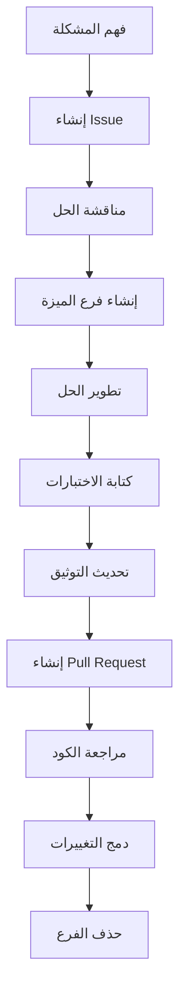

# دليل الإسهام وقوالب PR/Issues لمنصة بثواني

## نظرة عامة على دليل الإسهام

يوثق هذا الدليل كيفية المساهمة في تطوير منصة بثواني، مع قوالب مفصلة لـ Pull Requests وIssues لضمان عملية تطوير منظمة وفعالة.

## كيفية المساهمة في المشروع

### 1. إعداد بيئة التطوير

#### متطلبات النظام
```bash
# متطلبات أساسية
Node.js >= 18.0.0
npm >= 9.0.0
Git >= 2.40.0
Docker >= 20.10.0 (اختياري)
```

#### خطوات الإعداد
```bash
# 1. استنساخ المستودع
git clone https://github.com/bthwani/platform.git
cd platform

# 2. تثبيت التبعيات
npm install

# 3. إعداد متغيرات البيئة
cp .env.example .env.local
# تحرير .env.local بالإعدادات المحلية

# 4. تشغيل قاعدة البيانات المحلية
docker-compose up -d mongodb redis

# 5. تشغيل الخادم في وضع التطوير
npm run dev

# 6. تشغيل الاختبارات
npm test

# 7. فحص الكود
npm run lint
```

### 2. سير عمل المساهمة



## قوالب Issues مفصلة

### 1. قالب مشكلة خطأ (Bug Report)

```markdown
## وصف المشكلة
<!-- وصف واضح ومفصل للمشكلة مع خطوات إعادة الإنتاج -->

## خطوات إعادة إنتاج المشكلة
1. اذهب إلى صفحة `/products`
2. ابحث عن منتج معين
3. اضغط على زر "إضافة للسلة"
4. لاحظ ظهور رسالة خطأ

## السلوك المتوقع
يجب أن يتم إضافة المنتج للسلة بدون أخطاء

## السلوك الحالي
يظهر خطأ: "فشل في إضافة المنتج للسلة"

## معلومات البيئة
- **إصدار التطبيق:** v2.1.0
- **المتصفح:** Chrome 115.0.5790.170
- **نظام التشغيل:** Windows 11 Pro
- **الجهاز:** Desktop
- **الشاشة:** 1920x1080

## سجلات الأخطاء
```
Error: Failed to add product to cart
    at CartService.addItem (src/services/cart.ts:45:12)
    at ProductCard.handleAddToCart (src/components/ProductCard.tsx:78:5)
```

## محاولات الحل
- تم مسح التخزين المؤقت للمتصفح
- تم إعادة تشغيل التطبيق
- تم تجربة متصفح مختلف (Firefox) - نفس المشكلة

## أولوية المشكلة
- [x] حرج (P0) - يمنع استخدام التطبيق
- [ ] عالي (P1) - يؤثر على وظائف رئيسية
- [ ] متوسط (P2) - يؤثر على وظائف فرعية
- [ ] منخفض (P3) - تحسينات طفيفة

## تسميات مقترحة
- [ ] bug
- [ ] frontend
- [ ] cart
- [ ] high-priority
```

### 2. قالب طلب ميزة (Feature Request)

```markdown
## وصف الميزة المطلوبة
<!-- وصف مفصل للميزة المطلوبة مع الفائدة المتوقعة -->

## سبب الطلب
توفير تجربة أفضل للمستخدمين وتحسين معدل التحويل

## حالات الاستخدام
### حالة استخدام 1: البحث المتقدم
- **كـ:** مستخدم يبحث عن منتجات محددة
- **أريد:** فلترة النتائج حسب السعر والفئة والتقييم
- **لكي:** أجد المنتج المناسب بسرعة أكبر

### حالة استخدام 2: مقارنة المنتجات
- **كـ:** مستخدم مهتم بشراء هاتف ذكي
- **أريد:** مقارنة مواصفات عدة هواتف جنباً إلى جنب
- **لكي:** أتخذ قرار شراء مدروس

## متطلبات الميزة
### متطلبات وظيفية
- [ ] فلترة المنتجات حسب السعر (من - إلى)
- [ ] فلترة حسب الفئة والعلامة التجارية
- [ ] فلترة حسب التقييم (4 نجوم فما فوق)
- [ ] ترتيب حسب السعر أو التقييم أو الجديد

### متطلبات غير وظيفية
- [ ] زمن استجابة أقل من 2 ثانية
- [ ] دعم كامل للوصول (Keyboard navigation)
- [ ] تصميم متجاوب للهواتف المحمولة
- [ ] تدويل كامل للعربية والإنجليزية

## اقتراحات التصميم
<!-- صور أو رسوم توضيحية للميزة إن وجدت -->

## أولوية الميزة
- [ ] حرج (P0) - ضروري لتشغيل التطبيق
- [x] عالي (P1) - يحسن الوظائف الرئيسية
- [ ] متوسط (P2) - يحسن الوظائف الفرعية
- [ ] منخفض (P3) - تحسينات طفيفة

## تقدير الجهد المطلوب
- **وقت التطوير:** 2-3 أسابيع
- **تعقيد التنفيذ:** متوسط
- **عدد الملفات المتأثرة:** 5-7 ملفات
- **الاعتماديات المطلوبة:** بحث محسن في قاعدة البيانات

## تسميات مقترحة
- [ ] enhancement
- [ ] feature-request
- [ ] frontend
- [ ] search
- [ ] high-priority
```

### 3. قالب مهمة تطوير (Development Task)

```markdown
## وصف المهمة
تطوير نظام البحث المتقدم للمنتجات مع فلترة ذكية وترتيب متعدد

## قصص المستخدمين (User Stories)
- **كـ** مستخدم، **أريد** البحث عن منتجات بكلمات مفتاحية محددة، **لكي** أجد ما أبحث عنه بسرعة
- **كـ** مستخدم، **أريد** فلترة النتائج حسب السعر والفئة، **لكي** أحدد نطاق بحثي
- **كـ** مستخدم، **أريد** ترتيب النتائج حسب السعر أو التقييم، **لكي** أجد أفضل الخيارات

## متطلبات المهمة
### متطلبات وظيفية
- [ ] تطوير endpoint `/api/v1/products/search`
- [ ] إضافة فلاتر السعر والفئة والتقييم
- [ ] تطوير خوارزمية البحث بالنص الكامل
- [ ] إضافة خيارات الترتيب (السعر، التقييم، الجديد)
- [ ] تخزين مؤقت لنتائج البحث الشائعة

### متطلبات تقنية
- [ ] استخدام MongoDB text search أو Elasticsearch
- [ ] إضافة فهارس محسنة للبحث
- [ ] تطبيق rate limiting للـ API
- [ ] إضافة مراقبة لأداء البحث
- [ ] كتابة اختبارات شاملة

## نقاط القصص (Story Points)
- **التخطيط:** 3 نقاط
- **التطوير:** 8 نقاط
- **الاختبار:** 5 نقاط
- **التوثيق:** 2 نقاط
- **المراجعة:** 2 نقاط
- **المجموع:** 20 نقطة

## التبعيات
- [ ] تحديث نموذج المنتج في قاعدة البيانات
- [ ] إضافة حقول البحث في API الخلفية
- [ ] تحديث واجهة البحث في الواجهة الأمامية

## معايير القبول (Acceptance Criteria)
- [ ] يعمل البحث بالكلمات المفتاحية بشكل صحيح
- [ ] تعمل الفلاتر حسب السعر والفئة والتقييم
- [ ] يعمل الترتيب حسب المعايير المختلفة
- [ ] زمن الاستجابة أقل من 2 ثانية
- [ ] جميع الاختبارات تمر بنجاح
- [ ] التوثيق محدث وكامل

## تسميات مقترحة
- [ ] feature
- [ ] backend
- [ ] frontend
- [ ] search
- [ ] database
- [ ] medium-priority
```

## قوالب Pull Requests مفصلة

### 1. قالب Pull Request لميزة جديدة

```markdown
## وصف التغيير
إضافة نظام البحث المتقدم للمنتجات مع فلترة ذكية وترتيب متعدد

## نوع التغيير
- [x] ميزة جديدة (feat)
- [ ] إصلاح خطأ (fix)
- [ ] تحسين أداء (perf)
- [ ] تحديث توثيق (docs)
- [ ] إعادة هيكلة (refactor)
- [ ] اختبارات (test)
- [ ] مهام صيانة (chore)

## المشاكل المحلولة
- Closes #123 (طلب ميزة البحث المتقدم)
- Closes #124 (تحسين فلترة المنتجات)

## التغييرات الرئيسية

### الملفات المتأثرة
- **Backend:**
  - `src/controllers/products.controller.ts` - إضافة endpoint البحث
  - `src/services/search.service.ts` - خدمة البحث والفلترة
  - `src/models/product.model.ts` - تحديث نموذج المنتج

- **Frontend:**
  - `src/components/SearchFilters.tsx` - مكون الفلاتر الجديد
  - `src/hooks/useSearch.ts` - hook لإدارة البحث
  - `src/pages/SearchPage.tsx` - صفحة البحث المحدثة

- **قاعدة البيانات:**
  - إضافة فهرس نصي للمنتجات
  - تحديث collection المنتجات

### الاعتماديات الجديدة
- `elasticsearch@8.10.0` - محرك البحث المتقدم
- `react-instantsearch@7.0.0` - مكتبة البحث للواجهة الأمامية

### إعدادات البيئة
- إضافة متغيرات Elasticsearch في `.env`
- تحديث إعدادات Docker لتشمل Elasticsearch

## الاختبارات
- [x] اختبارات الوحدة مكتوبة وتعمل (15 اختبار جديد)
- [x] اختبارات التكامل تعمل (3 اختبارات جديدة)
- [x] اختبار يدوي تم بنجاح على البيئة المحلية
- [x] اختبارات الأداء لا تظهر تراجعاً (زمن البحث < 500ms)
- [x] اختبارات الوصول تعمل بشكل صحيح

## قائمة فحص قبل الدمج

### معايير الكود
- [x] الكود يتبع معايير الترميز المحددة
- [x] لا توجد اختبارات فاشلة في CI/CD
- [x] تم تحديث التوثيق إن لزم الأمر
- [x] تم اختبار التغيير على جميع المتصفحات المدعومة
- [x] تم اختبار التغيير على جميع الأجهزة المدعومة

### معايير الأمان
- [x] لا توجد ثغرات أمنية معروفة في الاعتماديات الجديدة
- [x] تم تطبيق مبدأ Least Privilege في الوصول
- [x] تم تشفير البيانات الحساسة إن وجدت

### معايير الأداء
- [x] زمن الاستجابة ضمن الحدود المقبولة
- [x] استهلاك الذاكرة معقول
- [x] لا يوجد تسرب في الذاكرة

## اختبار التغيير

### خطوات الاختبار
1. تشغيل `npm run test:search` لتشغيل اختبارات البحث الجديدة
2. فتح صفحة البحث في المتصفح
3. تجربة البحث بالكلمات المفتاحية المختلفة
4. اختبار الفلاتر المختلفة (السعر، الفئة، التقييم)
5. اختبار خيارات الترتيب

### نتائج الاختبار المتوقعة
- البحث يعمل بسرعة ودقة
- الفلاتر تعمل بشكل صحيح
- الترتيب يعمل حسب المعايير المختلفة
- لا توجد أخطاء في وحدة التحكم

## مراجع إضافية
- [دليل البحث والفلترة في التوثيق](https://docs.bthwani.com/search-implementation)
- [مواصفات API البحث](https://api-docs.bthwani.com/search-endpoints)
- [تصميم واجهة البحث](https://figma.bthwani.com/search-ui)

## تعليقات المراجعين
<!-- تعليقات وملاحظات المراجعين تظهر هنا أثناء عملية المراجعة -->
```

### 2. قالب Pull Request لإصلاح خطأ

```markdown
## وصف التغيير
إصلاح خطأ في حساب إجمالي الطلب عند وجود خصومات متعددة

## نوع التغيير
- [ ] ميزة جديدة (feat)
- [x] إصلاح خطأ (fix)
- [ ] تحسين أداء (perf)
- [ ] تحديث توثيق (docs)
- [ ] إعادة هيكلة (refactor)
- [ ] اختبارات (test)
- [ ] مهام صيانة (chore)

## المشاكل المحلولة
- Fixes #456 (خطأ في حساب الخصومات)
- Related to #457 (تحسين حساب الإجمالي)

## التغييرات الرئيسية

### الملفات المتأثرة
- **Backend:** `src/services/order.service.ts` - إصلاح منطق حساب الإجمالي
- **Tests:** `src/services/__tests__/order.service.test.ts` - إضافة اختبارات للحساب الجديد

### التغيير في منطق الحساب
```typescript
// قبل الإصلاح
const total = items.reduce((sum, item) => {
  const discount = item.discount || 0;
  return sum + (item.price * item.quantity * (1 - discount));
}, 0);

// بعد الإصلاح
const total = items.reduce((sum, item) => {
  const itemTotal = item.price * item.quantity;
  const discount = (item.discount || 0) * itemTotal;
  return sum + (itemTotal - discount);
}, 0);
```

## الاختبارات
- [x] اختبارات الوحدة مكتوبة وتعمل (8 اختبارات جديدة)
- [x] اختبارات التكامل تعمل (2 اختبار جديد)
- [x] اختبار يدوي تم بنجاح على البيئة المحلية
- [x] اختبارات الانحدار لا تظهر مشاكل جديدة

## قائمة فحص قبل الدمج
- [x] الكود يتبع معايير الترميز
- [x] لا توجد اختبارات فاشلة
- [x] تم تحديث التوثيق إن لزم الأمر
- [x] تم اختبار التغيير على جميع المتصفحات المدعومة
- [x] تم اختبار التغيير على جميع الأجهزة المدعومة

## اختبار التغيير

### سيناريوهات الاختبار
1. **طلب عادي بدون خصومات** - يجب أن يعمل كالمعتاد
2. **طلب بخصم واحد** - يجب حساب الخصم بشكل صحيح
3. **طلب بخصومات متعددة** - يجب حساب جميع الخصومات بشكل صحيح
4. **طلب بكميات مختلفة** - يجب حساب الإجمالي بدقة

### خطوات الاختبار
```bash
# تشغيل اختبارات الطلبات
npm run test:orders

# اختبار يدوي
curl -X POST http://localhost:3000/api/v1/orders \
  -H "Content-Type: application/json" \
  -d '{
    "items": [
      {"productId": "1", "quantity": 2, "price": 100, "discount": 0.1},
      {"productId": "2", "quantity": 1, "price": 50, "discount": 0}
    ]
  }'
```

## مراجع إضافية
- [دليل حساب الطلبات](https://docs.bthwani.com/order-calculation)
- [مواصفات API الطلبات](https://api-docs.bthwani.com/order-endpoints)
```

## دليل المساهم للمستودعات

### 1. إعداد المستودع

```markdown
# دليل المساهم في منصة بثواني

## مرحباً بك في مشروع بثواني! 👋

نحن سعداء برؤيتك مهتماً بالمساهمة في تطوير منصة التجارة الإلكترونية الأولى في الشرق الأوسط.

### قبل البدء

1. **اقرأ التوثيق**: تأكد من فهم بنية المشروع ومعايير التطوير
2. **انضم للمجتمع**: انضم لقناة Slack #contributors للتواصل مع الفريق
3. **ابدأ بسيطاً**: ابدأ بالمساهمات الصغيرة قبل المشاريع الكبيرة

### كيفية المساهمة

#### 1. الإبلاغ عن مشاكل
- استخدم قالب "Bug Report" للإبلاغ عن الأخطاء
- كن واضحاً ومفصلاً في الوصف
- أضف سجلات الأخطاء إن أمكن

#### 2. طلب ميزات جديدة
- استخدم قالب "Feature Request"
- شرح الفائدة بوضوح
- اقترح حلول بديلة إن أمكن

#### 3. المساهمة في الكود
- اتبع سير عمل Git Flow
- استخدم Conventional Commits
- اكتب اختبارات شاملة
- حدث التوثيق

### معايير الجودة

#### الكود المقبول يجب أن:
- ✅ يتبع معايير الترميز المحددة
- ✅ يحتوي على اختبارات شاملة
- ✅ يحدث التوثيق إن لزم الأمر
- ✅ يمر من جميع فحوصات CI/CD
- ✅ يحسن الأداء أو يحافظ عليه

#### المساهمات المرفوضة:
- ❌ تحتوي على أخطاء في الاختبارات
- ❌ لا تتبع معايير الترميز
- ❌ تقلل من الأداء بشكل ملحوظ
- ❌ لا تحتوي على اختبارات كافية
- ❌ تكسر التوافق الخلفي بدون مبرر

### عملية المراجعة

1. **المراجعة التلقائية**: فحص CI/CD يجب أن ينجح
2. **المراجعة اليدوية**: مطور من الفريق يراجع الكود
3. **التعليقات**: مناقشة أي تعديلات مطلوبة
4. **الموافقة**: دمج التغييرات في الفرع المناسب

### التواصل والدعم

- **قناة Slack**: #contributors للأسئلة العامة
- **البريد الإلكتروني**: contributors@bthwani.com للأمور الرسمية
- **الاجتماعات**: اجتماع أسبوعي للمساهمين كل خميس 3 مساءً

### التقدير والمكافآت

نقدر مساهماتكم ونقدم:
- **التقدير العام**: ذكر المساهمين في الإصدارات
- **المكافآت**: مكافآت مالية للمساهمات المتميزة
- **الفرص المهنية**: فرص عمل للمساهمين النشيطين
```

### 2. ملف CONTRIBUTING.md في المستودع

```markdown
# دليل المساهمة في منصة بثواني

## مرحباً بك! 👋

شكراً لاهتمامك بالمساهمة في تطوير منصة بثواني، منصة التجارة الإلكترونية الرائدة في الشرق الأوسط.

## كيفية البدء

### 1. إعداد البيئة المحلية

\`\`\`bash
# استنساخ المستودع
git clone https://github.com/bthwani/platform.git
cd platform

# تثبيت التبعيات
npm install

# إعداد البيئة
cp .env.example .env.local
# حرر .env.local بالإعدادات المحلية

# تشغيل الخادم
npm run dev
\`\`\`

### 2. فهم بنية المشروع

اقرأ التوثيق لفهم:
- [المعمارية العامة](docs/architecture/01-architecture-overview.md)
- [معايير الترميز](docs/development/01-coding-standards-performance.md)
- [سير عمل التطوير](docs/development/02-git-flow-versioning-policy.md)

### 3. اختيار مهمة للعمل عليها

- ابحث عن Issues مفتوحة مع تسمية `good first issue`
- أو اقترح ميزة جديدة باستخدام قالب "Feature Request"
- ابدأ بمهام صغيرة للتعود على سير العمل

## عملية المساهمة خطوة بخطوة

### 1. إنشاء Issue للتغيير المقترح
- استخدم القوالب المحددة لنوع التغيير
- كن واضحاً ومفصلاً في الوصف
- أضف تسميات مناسبة للمشكلة

### 2. مناقشة الحل
- شارك أفكارك في قناة #contributors
- احصل على موافقة من الفريق قبل البدء
- حدد نطاق العمل بوضوح

### 3. إنشاء فرع للعمل
\`\`\`bash
git checkout develop
git pull origin develop
git checkout -b feature/your-feature-name
\`\`\`

### 4. تطوير الحل
- اتبع معايير الترميز
- اكتب اختبارات شاملة
- حدث التوثيق إن لزم الأمر

### 5. إنشاء Pull Request
- استخدم القوالب المحددة
- أضف وصفاً شاملاً للتغييرات
- ربط الـ PR بالـ Issue المعني

### 6. عملية المراجعة
- انتظر مراجعة مطور من الفريق
- أجرِ التعديلات المطلوبة
- احصل على الموافقة النهائية

## معايير الجودة

### الكود المقبول يجب أن:
- ✅ يتبع معايير الترميز (ESLint + Prettier)
- ✅ يحتوي على اختبارات شاملة (> 90% تغطية)
- ✅ يحدث التوثيق إن لزم الأمر
- ✅ يمر من جميع فحوصات CI/CD
- ✅ لا يقلل من الأداء بشكل ملحوظ

### الاختبارات المطلوبة:
- اختبارات الوحدة للوظائف الجديدة
- اختبارات التكامل للتفاعلات المعقدة
- اختبارات الـ E2E للمسارات الرئيسية
- اختبارات الوصول للواجهات الجديدة

## التواصل والدعم

### قنوات التواصل:
- **Slack**: #contributors للأسئلة والنقاشات
- **البريد الإلكتروني**: contributors@bthwani.com للأمور الرسمية
- **الاجتماعات**: اجتماع أسبوعي كل خميس 3 مساءً بتوقيت السعودية

### الحصول على المساعدة:
1. ابحث في التوثيق أولاً
2. اسأل في قناة #contributors
3. أنشئ Issue إذا لم تجد إجابة
4. احجز اجتماع 1:1 مع أحد أعضاء الفريق إن لزم الأمر

## التقدير والمكافآت

نقدر مساهماتكم ونقدم:

### التقدير:
- ذكر المساهمين في صفحة الإصدارات
- شارة "مساهم" في ملفك الشخصي
- فرصة للانضمام للفريق الرسمي

### المكافآت:
- مكافآت مالية للمساهمات المتميزة
- فرص تدريب وتطوير مهني
- دعوات لحضور المؤتمرات التقنية

## سلوك مجتمعي متوقع

- كن لطيفاً ومحترماً مع الجميع
- ركز على الحلول لا المشاكل
- شارك المعرفة مع الآخرين
- احترم آراء ومقترحات الجميع
- ابحث عن حلول بناءة للخلافات

---

نشكرك على مساهمتك في جعل منصة بثواني أفضل! 🚀
```

## الخلاصة والتوصيات

### النتائج الحالية
- ✅ **عملية مساهمة منظمة**: سير عمل واضح وفعال للمساهمين
- ✅ **قوالب مفصلة**: قوالب شاملة لـ Issues وPRs تضمن الجودة
- ✅ **توثيق شامل**: دليل مفصل للمساهمين الجدد
- ✅ **نظام تقدير**: نظام مكافآت وتقدير للمساهمين
- ✅ **مجتمع نشط**: تواصل فعال وقنوات دعم متعددة

### التوصيات الرئيسية

1. **تحسين القوالب**: مراجعة دورية للقوالب وتحديثها حسب الحاجة
2. **توسيع التوثيق**: إضافة المزيد من الأمثلة والإرشادات
3. **أتمتة المراجعة**: تطبيق مراجعة تلقائية جزئية للـ PRs
4. **تعزيز المجتمع**: تنظيم فعاليات ومسابقات للمساهمين
5. **تتبع المقاييس**: مراقبة فعالية عملية المساهمة وتحسينها

### مؤشرات نجاح المساهمة

| المؤشر | الهدف | طريقة القياس | تكرار المراجعة |
|---------|-------|-------------|----------------|
| **عدد المساهمين النشطين** | > 50 مساهم شهرياً | تتبع GitHub Insights | شهري |
| **متوسط وقت المراجعة** | < 48 ساعة | قياس وقت المراجعة في GitHub | أسبوعي |
| **نسبة نجاح دمج PR** | > 90% | تتبع حالة الـ PRs | أسبوعي |
| **رضا المساهمين** | > 4.5/5 | استطلاعات الرأي | ربع سنوي |
| **تغطية الاختبارات** | > 90% للمساهمات الجديدة | قياس تغطية الاختبارات | مع كل PR |

---

هذا الدليل يُحدث ربع سنوياً مع مراجعة شاملة لعملية المساهمة وتحسين التجربة بناءً على تعليقات المساهمين والفريق.
