# مخططات التدفقات التفصيلية لمنصة بثواني

## نظرة عامة على التدفقات

توثق هذه الوثيقة التدفقات الأساسية والفرعية للمنصة، مع التركيز على تفاعل المستخدمين مع النظام والعمليات الداخلية.

## تدفق التسجيل والمصادقة

### تدفق تسجيل عميل جديد

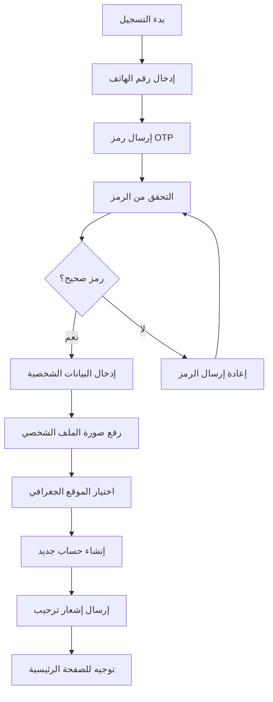

### تدفق مصادقة السائق

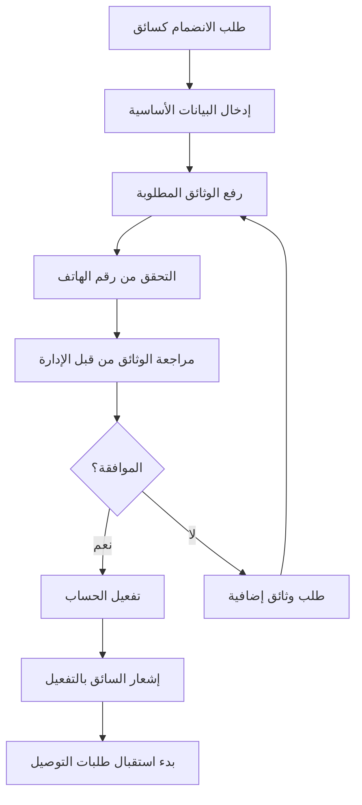

## تدفق معالجة الطلبات

### التدفق الكامل لطلب جديد

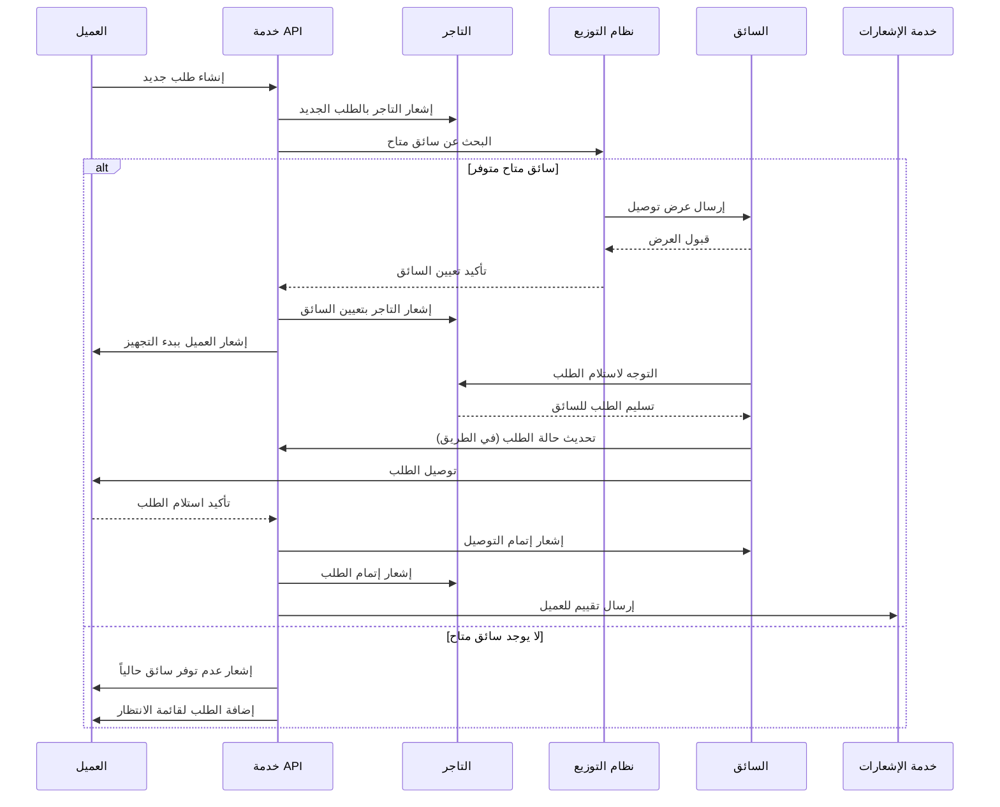

### تدفق معالجة الدفع

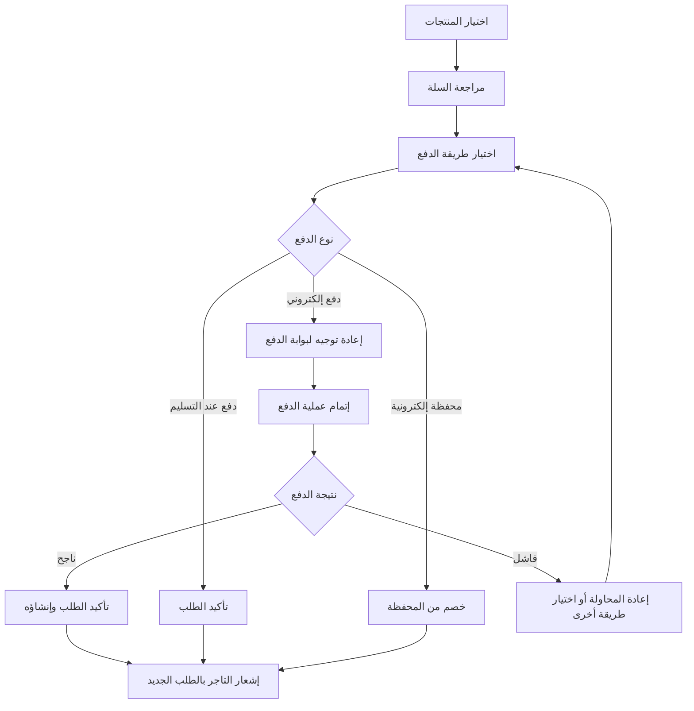

## تدفق إدارة التجار

### تدفق إضافة منتج جديد

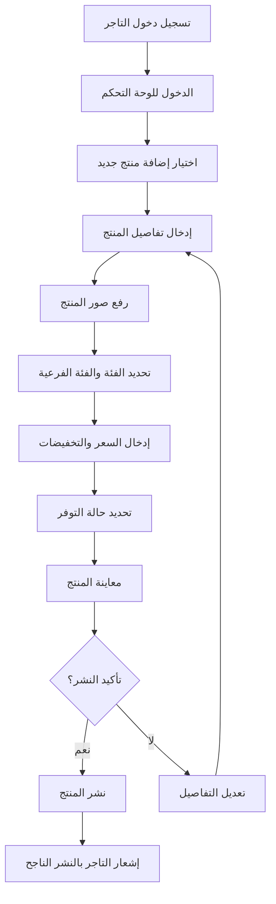

### تدفق مراجعة طلبات السحب للتاجر

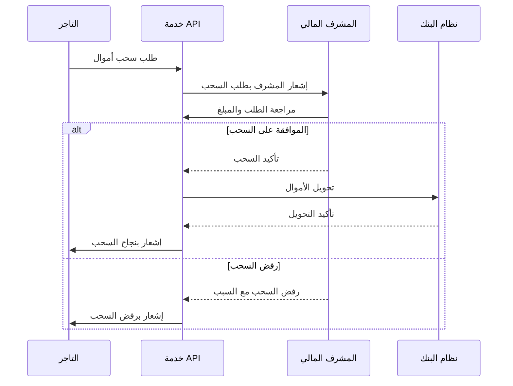

## تدفق إدارة السائقين

### تدفق تعيين طلب توصيل

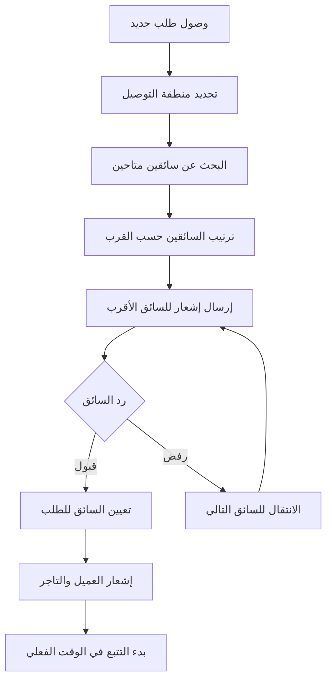

### تدفق تتبع حالة السائق

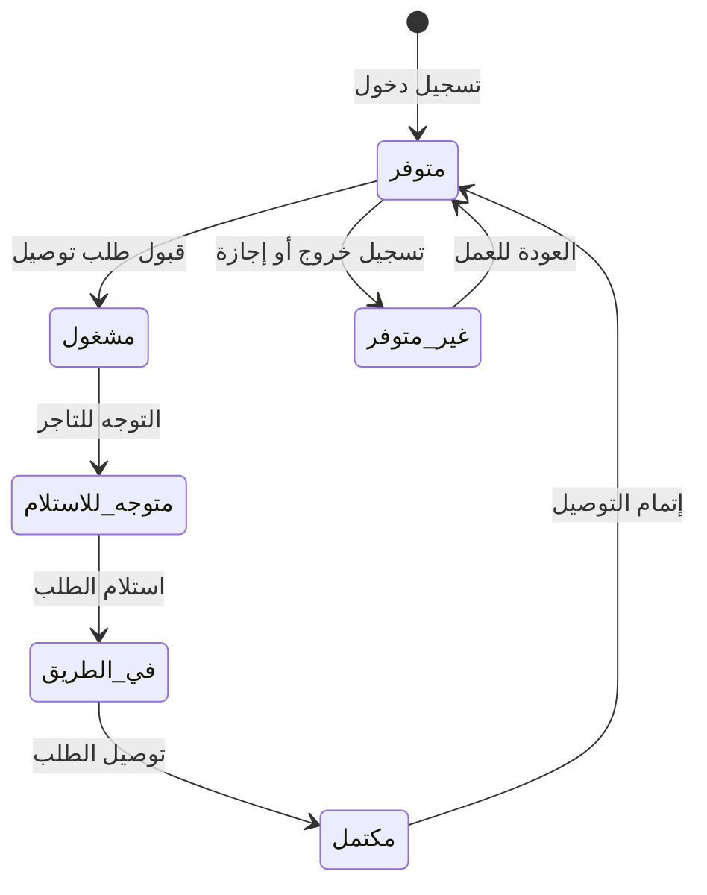

## تدفق خدمات التسويق

### تدفق حملة تسويقية جديدة

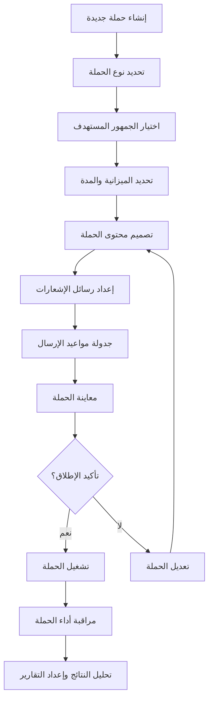

### تدفق تجزئة العملاء

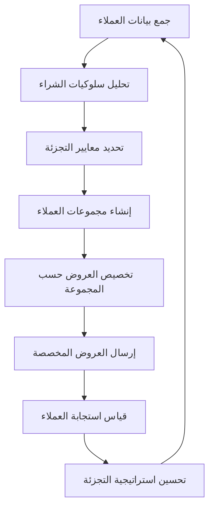

## تدفق خدمات الدعم الفني

### تدفق معالجة شكوى عميل

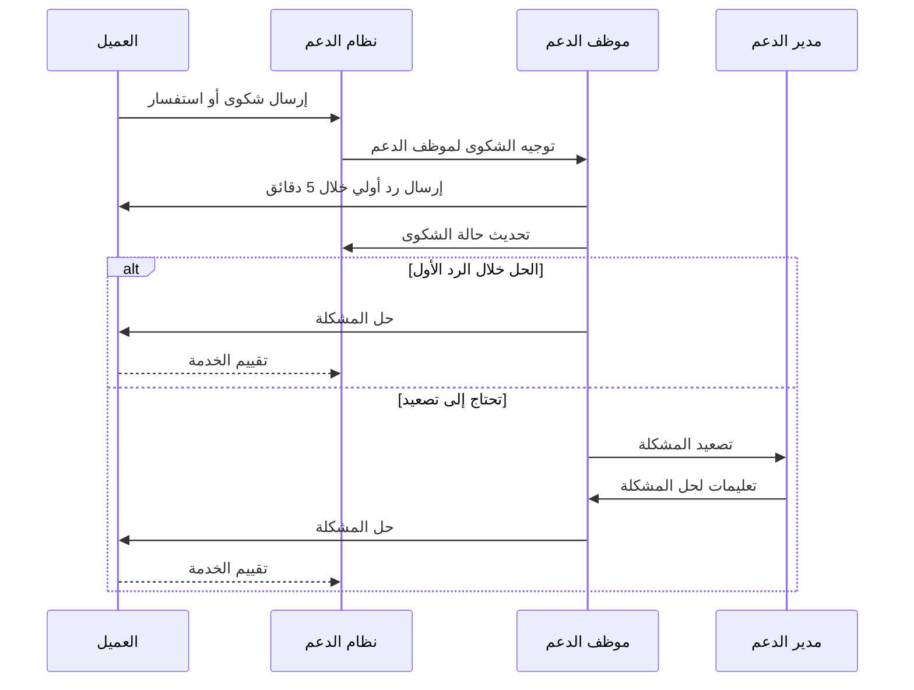

## تدفق النظام المالي (ERP)

### تدفق معالجة الفواتير والمدفوعات

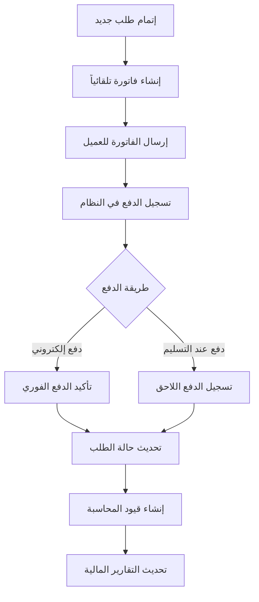

### تدفق إغلاق الشهر المالي

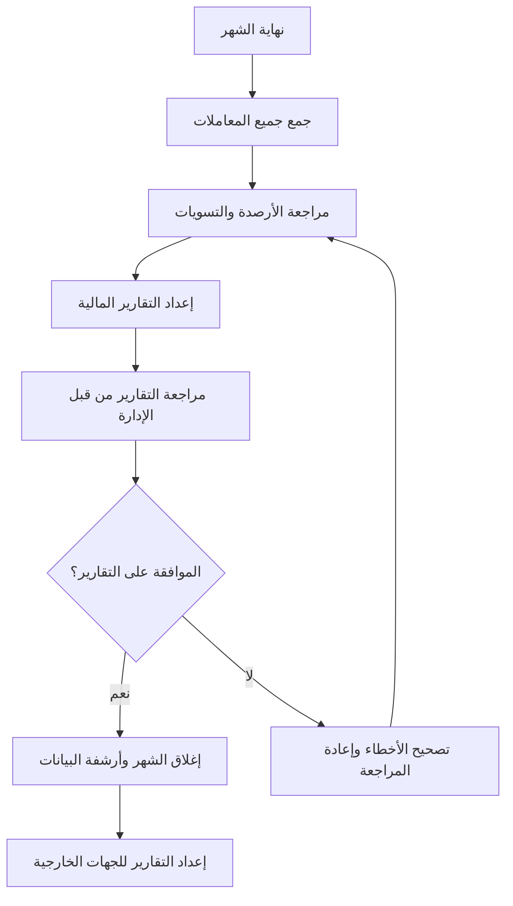

## تدفق النسخ الاحتياطي والاسترداد

### تدفق النسخ الاحتياطي اليومي

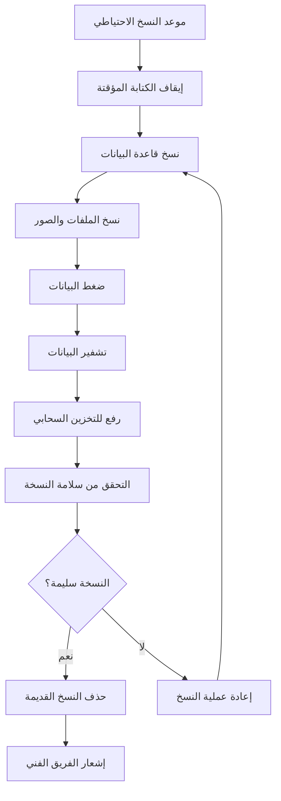

## تدفق مراقبة الأداء والأمان

### تدفق مراقبة الخوادم

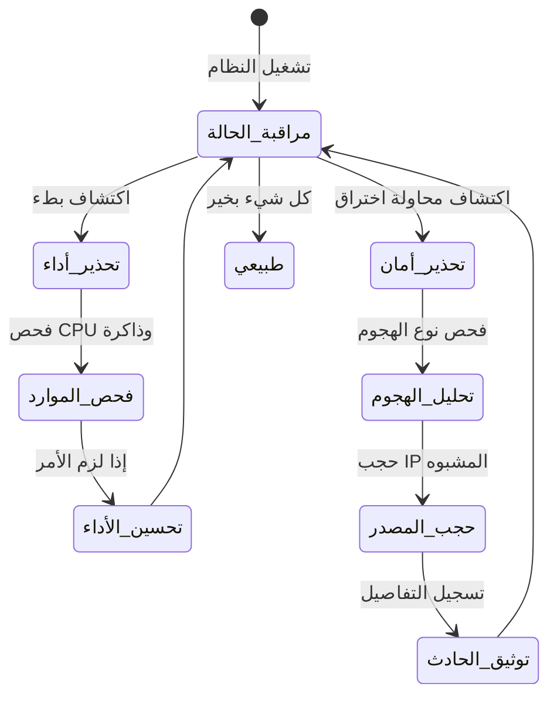

## تدفق تطوير ونشر المزايا الجديدة

### تدفق تطوير ميزة جديدة

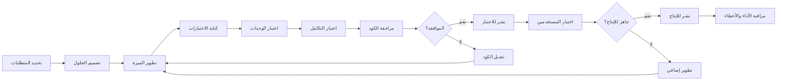

## ملخص التدفقات

| التدفق | الوصف | الوقت المتوقع | المسؤول |
|--------|--------|---------------|----------|
| تسجيل عميل جديد | من الاشتراك للتفعيل | 5-10 دقائق | نظام تلقائي |
| معالجة طلب جديد | من الطلب للتسليم | 30-90 دقيقة | النظام + السائق |
| إضافة منتج جديد | من الإدخال للنشر | 10-15 دقيقة | التاجر + المراجعة |
| حملة تسويقية | من الإنشاء للتنفيذ | 1-3 أيام | فريق التسويق |
| إغلاق شهري مالي | مراجعة وإغلاق الشهر | 3-5 أيام | فريق المالية |
| نسخ احتياطي يومي | نسخ وأرشفة البيانات | 2-4 ساعات | النظام التلقائي |

هذه التدفقات توضح كيفية تفاعل جميع مكونات المنصة مع بعضها البعض لضمان تجربة سلسة وفعالة لجميع المستخدمين.
