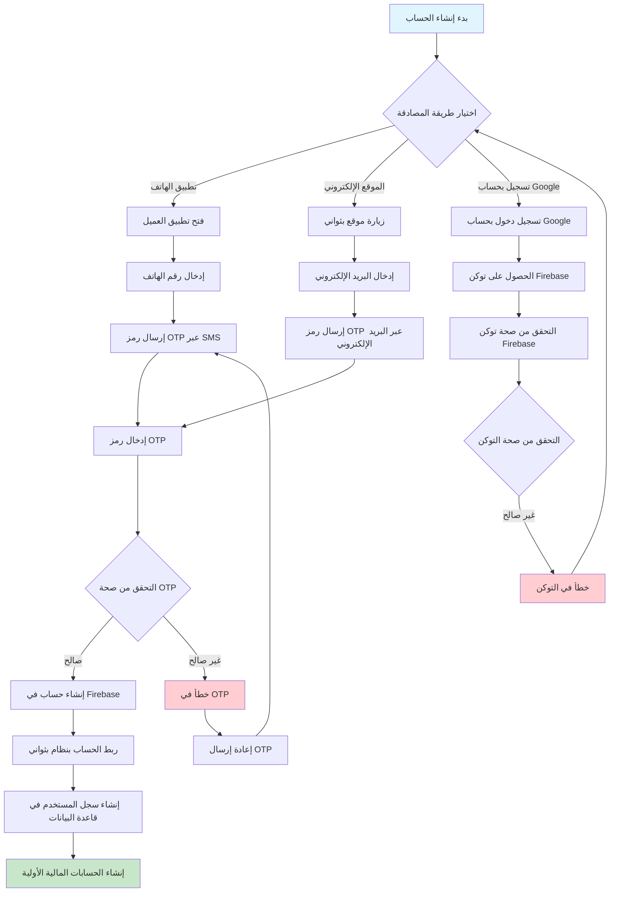
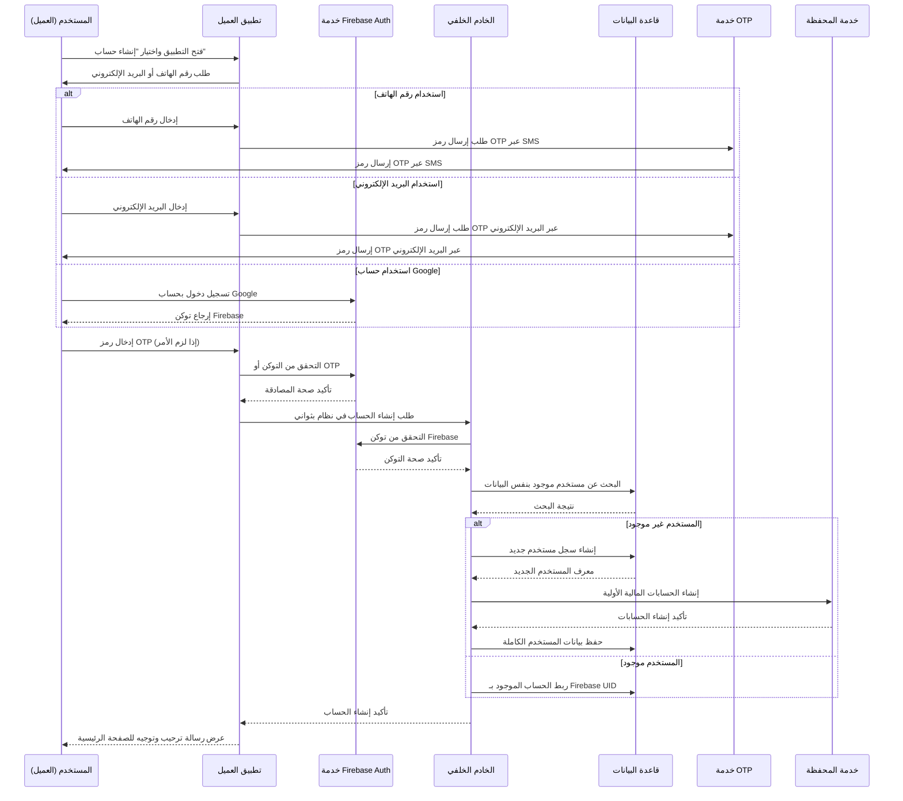
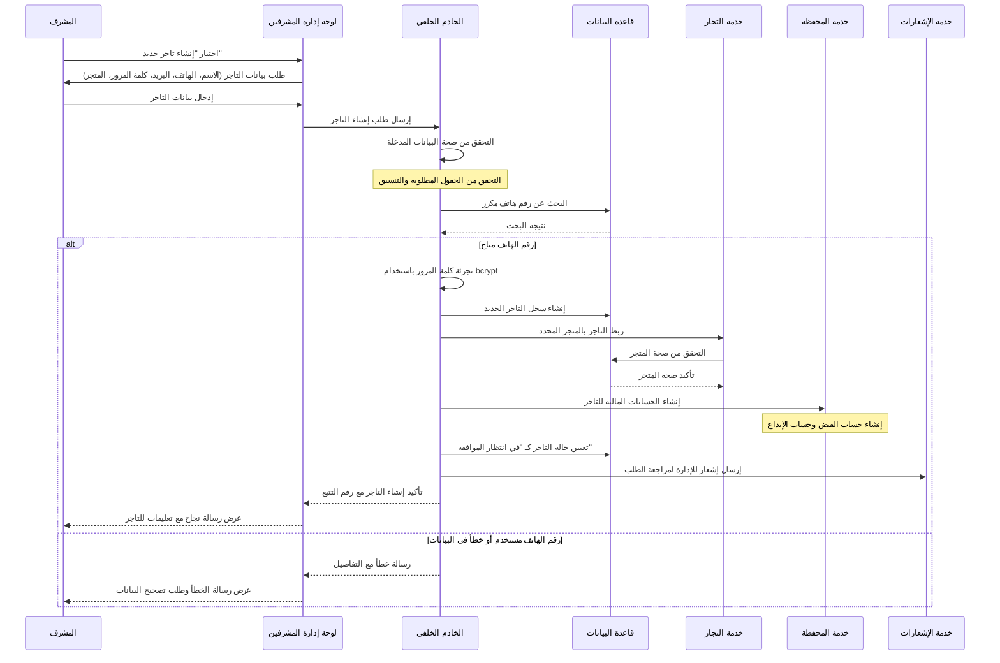
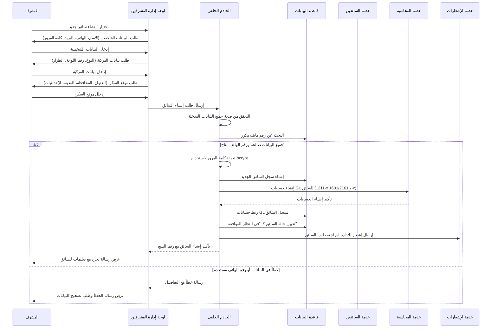
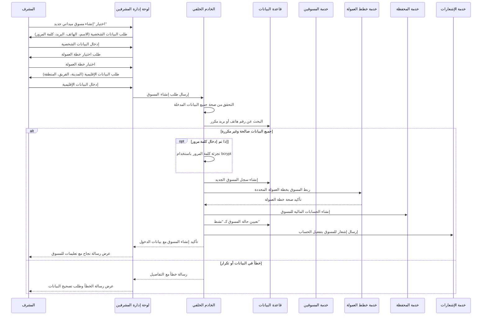
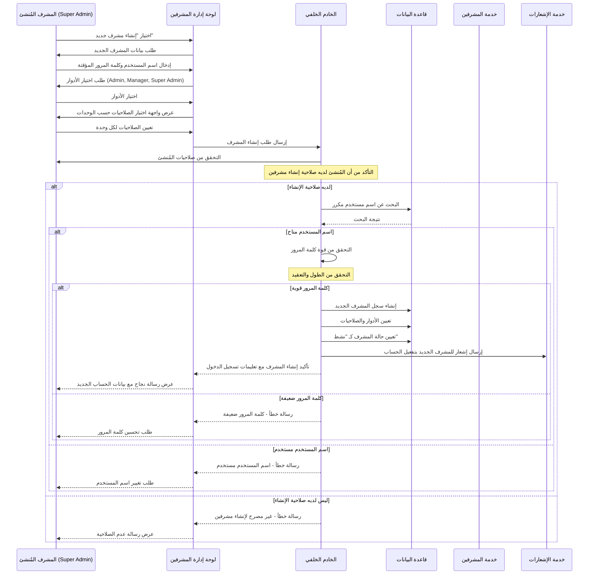

# مخططات تدفقات إنشاء الحسابات لجميع الشخصيات في نظام بثواني

## نظرة عامة على عمليات إنشاء الحسابات في النظام

نظام بثواني يدعم خمس شخصيات رئيسية مع آليات مختلفة لإنشاء الحسابات:

1. **العملاء** (Customers) - إنشاء تلقائي عبر Firebase Authentication
2. **التجار** (Vendors/Merchants) - إنشاء يدوي من قبل الأدمن مع موافقة إدارية
3. **السائقين** (Drivers) - إنشاء يدوي من قبل الأدمن مع بيانات السيارة
4. **مسوقي الميدان** (Field Marketers) - إنشاء يدوي من قبل الأدمن مع خطط العمولة
5. **المشرفين** (Admins) - إنشاء يدوي من قبل مشرفين آخرين مع نظام الصلاحيات

---

## 1. تدفق إنشاء حساب العميل (Customer Account Creation)

### Workflow Diagram - مخطط التدفق



### Sequence Diagram - مخطط التسلسل



---

## 2. تدفق إنشاء حساب التاجر (Vendor Account Creation)

### Workflow Diagram - مخطط التدفق

```mermaid
graph TD
    A[طلب إنشاء حساب تاجر] --> B[تسجيل البيانات الأساسية]
    B --> C[التحقق من صحة البيانات]

    C -->|صالحة| D[التحقق من عدم تكرار رقم الهاتف]
    C -->|غير صالحة| E[خطأ في البيانات المدخلة]

    D -->|متاح| F[تجزئة كلمة المرور]
    D -->|مستخدم| G[خطأ - رقم الهاتف مستخدم]

    F --> H[إنشاء سجل التاجر في قاعدة البيانات]
    H --> I[ربط التاجر بالمتجر المحدد]

    I --> J{التحقق من صحة المتجر}
    J -->|صالح| K[تعيين حالة التاجر كـ "في انتظار الموافقة"]
    J -->|غير صالح| L[خطأ في بيانات المتجر]

    K --> M[إنشاء الحسابات المالية للتاجر]
    M --> N[إرسال إشعار للإدارة للموافقة]

    L --> O[تصحيح بيانات المتجر]
    G --> P[تغيير رقم الهاتف]
    E --> Q[تصحيح البيانات]

    O --> I
    P --> D
    Q --> C

    style A fill:#e1f5fe
    style N fill:#c8e6c9
    style E fill:#ffcdd2
    style G fill:#ffcdd2
    style L fill:#ffcdd2
```

### Sequence Diagram - مخطط التسلسل



---

## 3. تدفق إنشاء حساب السائق (Driver Account Creation)

### Workflow Diagram - مخطط التدفق

```mermaid
graph TD
    A[طلب إنشاء حساب سائق] --> B[إدخال البيانات الشخصية]
    B --> C[إدخال بيانات المركبة]

    C --> D[إدخال موقع السكن]
    D --> E[التحقق من صحة جميع البيانات]

    E -->|صالحة| F[التحقق من عدم تكرار رقم الهاتف]
    E -->|غير صالحة| G[خطأ في البيانات]

    F -->|متاح| H[تجزئة كلمة المرور]
    F -->|مستخدم| I[خطأ - رقم الهاتف مستخدم]

    H --> J[إنشاء سجل السائق في قاعدة البيانات]
    J --> K[ربط السائق بحسابات GL المالية]

    K --> L{التحقق من نجاح الربط}
    L -->|ناجح| M[تعيين حالة السائق كـ "في انتظار الموافقة"]
    L -->|فاشل| N[خطأ في إنشاء الحسابات المالية]

    M --> O[إرسال إشعار للإدارة للموافقة]
    N --> P[إعادة محاولة إنشاء الحسابات]

    G --> Q[تصحيح البيانات]
    I --> R[تغيير رقم الهاتف]

    Q --> E
    R --> F
    P --> K

    style A fill:#e1f5fe
    style O fill:#c8e6c9
    style G fill:#ffcdd2
    style I fill:#ffcdd2
    style N fill:#ffcdd2
```

### Sequence Diagram - مخطط التسلسل



---

## 4. تدفق إنشاء حساب المسوق الميداني (Field Marketer Account Creation)

### Workflow Diagram - مخطط التدفق

```mermaid
graph TD
    A[طلب إنشاء حساب مسوق] --> B[إدخال البيانات الشخصية]
    B --> C[اختيار خطة العمولة]

    C --> D[إدخال البيانات الإقليمية]
    D --> E[التحقق من صحة جميع البيانات]

    E -->|صالحة| F[التحقق من عدم تكرار البيانات]
    E -->|غير صالحة| G[خطأ في البيانات]

    F -->|متاحة| H[تجزئة كلمة المرور (اختيارية)]
    F -->|مستخدمة| I[خطأ - البيانات مستخدمة]

    H --> J[إنشاء سجل المسوق في قاعدة البيانات]
    J --> K[ربط المسوق بخطة العمولة]

    K --> L{التحقق من صحة خطة العمولة}
    L -->|صالحة| M[تعيين حالة المسوق كـ "نشط"]
    L -->|غير صالحة| N[خطأ في خطة العمولة]

    M --> O[إنشاء الحسابات المالية للمسوق]
    O --> P[إرسال إشعار للمسوق بالتفعيل]

    N --> Q[اختيار خطة عمولة أخرى]
    I --> R[تغيير البيانات]
    G --> S[تصحيح البيانات]

    Q --> C
    R --> F
    S --> E

    style A fill:#e1f5fe
    style P fill:#c8e6c9
    style G fill:#ffcdd2
    style I fill:#ffcdd2
    style N fill:#ffcdd2
```

### Sequence Diagram - مخطط التسلسل



---

## 5. تدفق إنشاء حساب المشرف (Admin Account Creation)

### Workflow Diagram - مخطط التدفق

```mermaid
graph TD
    A[طلب إنشاء حساب مشرف] --> B[التحقق من صلاحيات المُنشئ]
    B -->|ليس لديه صلاحية| C[خطأ - غير مصرح]

    B -->|لديه صلاحية| D[إدخال بيانات المشرف الجديد]
    D --> E[اختيار الأدوار والصلاحيات]

    E --> F[التحقق من صحة اسم المستخدم]
    F -->|متاح| G[التحقق من قوة كلمة المرور]
    F -->|مستخدم| H[خطأ - اسم المستخدم مستخدم]

    G -->|قوية| I[إنشاء سجل المشرف في قاعدة البيانات]
    G -->|ضعيفة| J[خطأ - كلمة مرور ضعيفة]

    I --> K[تعيين الأدوار والصلاحيات]
    K --> L[تعيين حالة المشرف كـ "نشط"]

    L --> M[إرسال إشعار للمشرف الجديد]
    J --> N[تحسين كلمة المرور]
    H --> O[تغيير اسم المستخدم]

    N --> G
    O --> F

    style A fill:#e1f5fe
    style M fill:#c8e6c9
    style C fill:#ffcdd2
    style H fill:#ffcdd2
    style J fill:#ffcdd2
```

### Sequence Diagram - مخطط التسلسل



---

## مقارنة بين عمليات إنشاء الحسابات لكل شخصية

| الشخصية | طريقة الإنشاء | المسؤول عن الإنشاء | الحالة الافتراضية | متطلبات خاصة |
|---------|---------------|-------------------|-------------------|---------------|
| **العميل** | تلقائي عبر Firebase | المستخدم نفسه | نشط فوري | رقم هاتف أو بريد إلكتروني صالح |
| **التاجر** | يدوي من قبل الأدمن | المشرفين | في انتظار الموافقة | متجر محدد، موافقة إدارية |
| **السائق** | يدوي من قبل الأدمن | المشرفين | في انتظار الموافقة | بيانات المركبة، حسابات GL |
| **المسوق** | يدوي من قبل الأدمن | المشرفين | نشط فوري | خطة عمولة، بيانات إقليمية |
| **المشرف** | يدوي من قبل مشرفين آخرين | مشرفين آخرين | نشط فوري | صلاحيات محددة، كلمة مرور قوية |

---

## آليات الحماية المشتركة في جميع التدفقات

### 1. تشفير كلمات المرور
- استخدام bcrypt لتجزئة كلمات المرور
- عدم حفظ كلمات المرور كنص عادي

### 2. التحقق من البيانات المكررة
- منع تكرار أرقام الهواتف والبريد الإلكتروني
- فحص قواعد البيانات قبل الإنشاء

### 3. التحقق من صحة البيانات
- التحقق من تنسيق أرقام الهواتف والبريد الإلكتروني
- التحقق من قوة كلمات المرور

### 4. نظام الصلاحيات
- التحقق من صلاحيات المُنشئ قبل السماح بالإنشاء
- تسجيل عمليات الإنشاء في سجل التدقيق

### 5. إشعارات النظام
- إرسال إشعارات للمستخدمين الجدد
- إرسال طلبات موافقة للإدارة عند الحاجة

---

## قواعد البيانات المستخدمة

- **العملاء**: جدول `users` في MongoDB مع ربط بـ Firebase UIDs
- **التجار**: جدول `vendors` في MongoDB مع حالات الموافقة
- **السائقون**: جدول `drivers` في MongoDB مع بيانات المركبات وحسابات GL
- **المسوقون**: جدول `marketers` في MongoDB مع خطط العمولة
- **المشرفون**: جدول `admin_users` في MongoDB مع نظام الصلاحيات

هذه المخططات تغطي جميع جوانب عمليات إنشاء الحسابات في نظام بثواني بالتفصيل الكامل.
