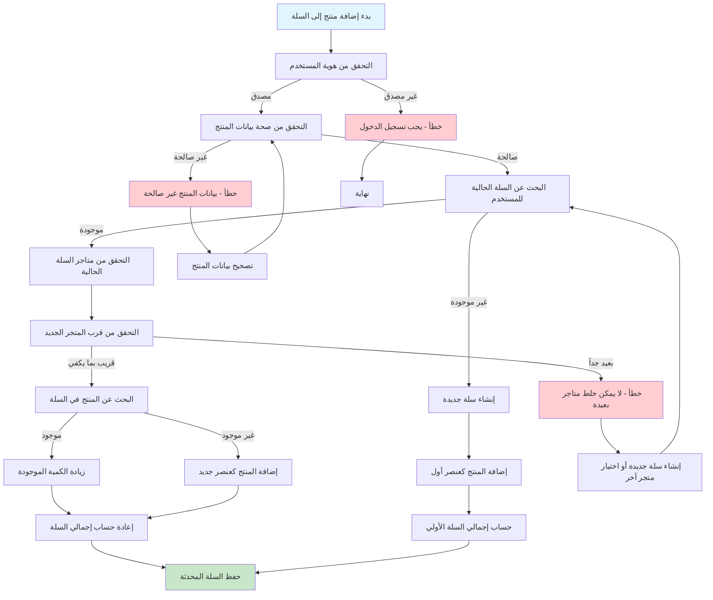
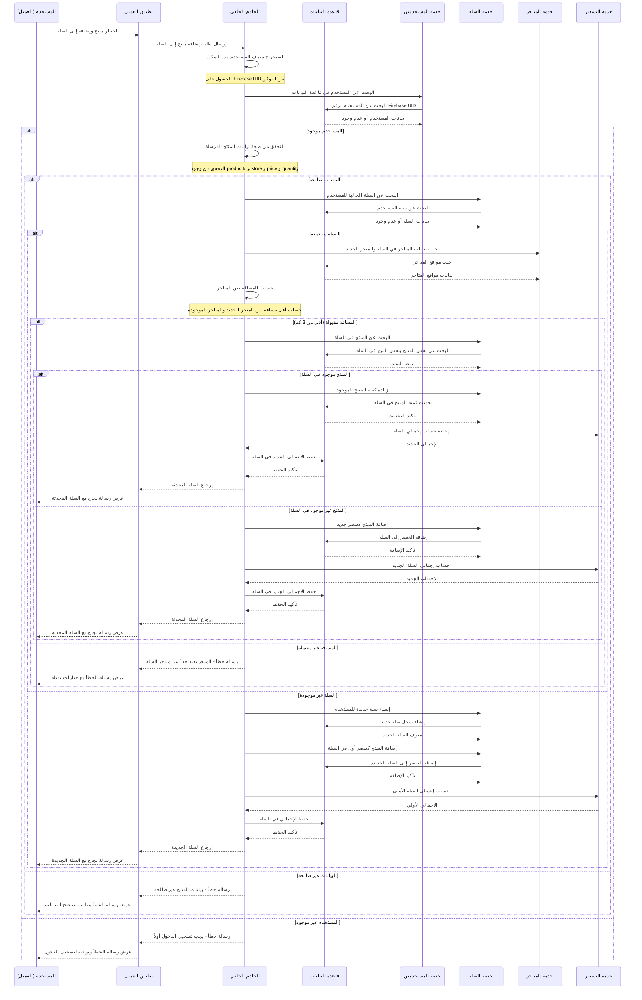
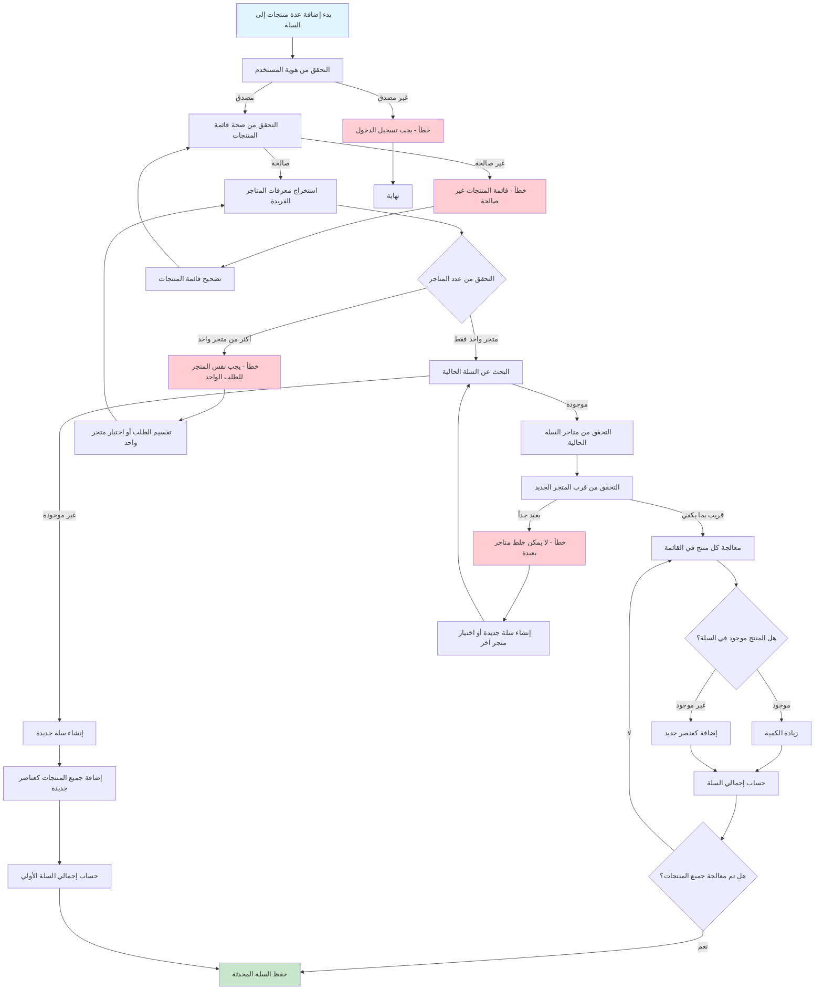
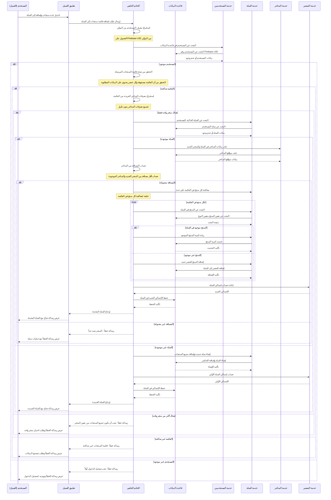
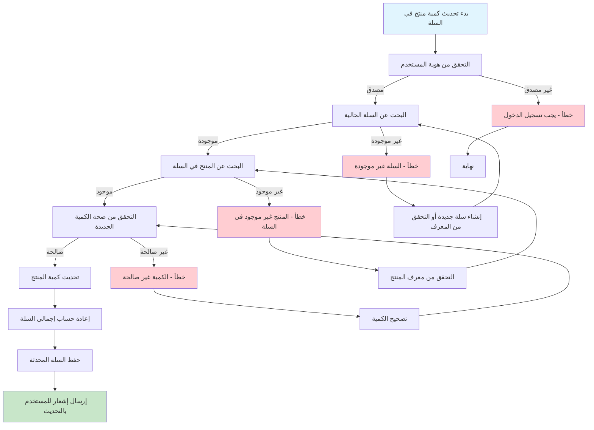
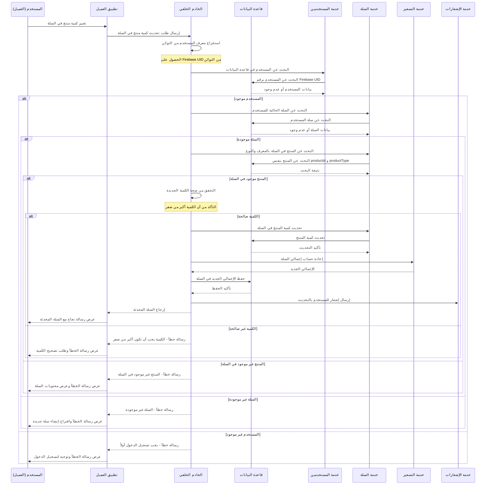
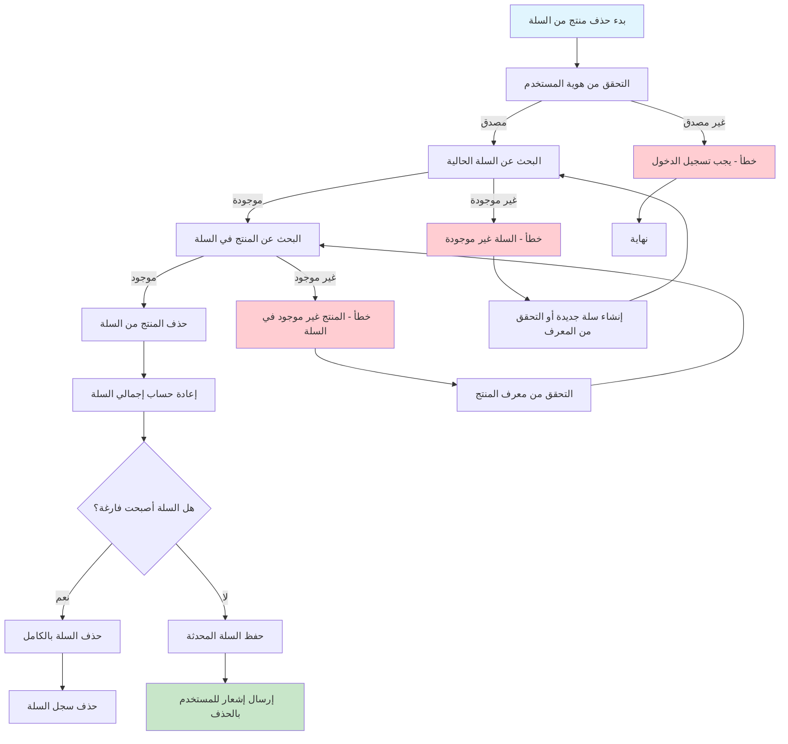
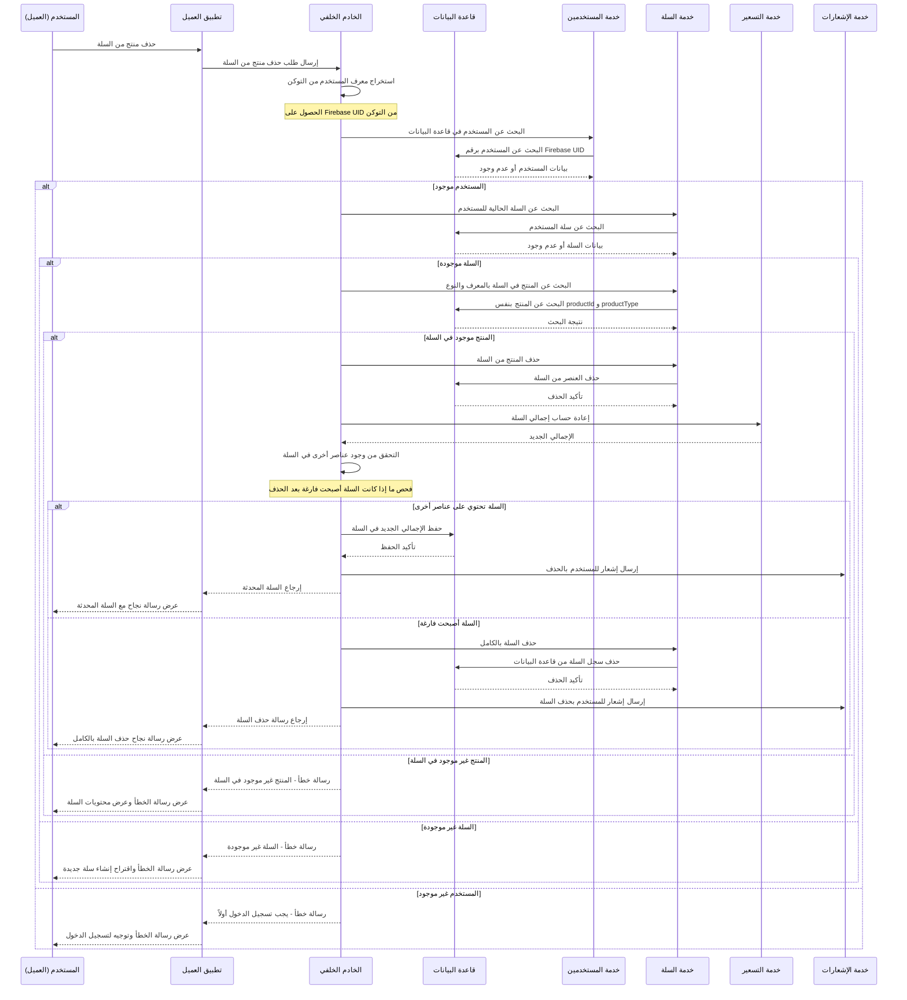

# مخططات تدفقات إضافة المنتجات إلى السلة في نظام بثواني

## نظرة عامة على عمليات إضافة المنتجات إلى السلة في النظام

نظام بثواني يدعم عملية معقدة لإضافة المنتجات إلى السلة مع آليات متقدمة للتحقق من:

1. **صلاحية المتاجر** - التأكد من أن المتاجر متاحة وقريبة من بعضها البعض
2. **دمج العناصر** - إضافة كميات جديدة للعناصر الموجودة مسبقاً
3. **حساب الإجمالي** - تحديث إجمالي السلة تلقائياً
4. **التحقق من الأسعار** - التأكد من صحة الأسعار والكميات

---

## 1. تدفق إضافة منتج واحد إلى السلة (Single Product Addition)

### Workflow Diagram - مخطط التدفق

### Sequence Diagram - مخطط التسلسل

---

## 2. تدفق إضافة عدة منتجات إلى السلة (Multiple Products Addition)

### Workflow Diagram - مخطط التدفق

### Sequence Diagram - مخطط التسلسل

---

## 3. تدفق تحديث كمية منتج في السلة (Cart Item Quantity Update)

### Workflow Diagram - مخطط التدفق

### Sequence Diagram - مخطط التسلسل

---

## 4. تدفق حذف منتج من السلة (Cart Item Removal)

### Workflow Diagram - مخطط التدفق

### Sequence Diagram - مخطط التسلسل

---

## مقارنة بين عمليات السلة في النظام

| العملية | المدخلات المطلوبة | التحقق الرئيسي | التأثير على السلة | الاستجابة |
|---------|-------------------|----------------|-------------------|-----------|
| **إضافة منتج واحد** | productId, store, price, quantity | مسافة المتاجر، تكرار المنتج | إضافة أو تحديث كمية | السلة المحدثة |
| **إضافة عدة منتجات** | قائمة منتجات من نفس المتجر | نفس المتجر فقط، مسافة المتاجر | إضافة عدة عناصر | السلة المحدثة |
| **تحديث كمية** | productId, productType, quantity | وجود المنتج، كمية صالحة | تحديث كمية واحدة | السلة المحدثة |
| **حذف منتج** | productId, productType | وجود المنتج | حذف عنصر واحد | السلة المحدثة أو محذوفة |

---

## البيانات المطلوبة لإضافة منتج إلى السلة

### البيانات الأساسية (مشتركة)
- **معرف المنتج** (productId - مطلوب)
- **نوع المنتج** (productType - افتراضي deliveryProduct)
- **معرف المتجر** (store - مطلوب)
- **السعر** (price - مطلوب)
- **الكمية** (quantity - مطلوب، أدنى 1)

### البيانات الإضافية
- **اسم المنتج** (name - اختياري، للعرض)
- **صورة المنتج** (image - اختياري، للعرض)
- **ملاحظات** (note - اختياري، للسلة كاملة)

---

## آليات الحماية والتحقق

### 1. التحقق من الهوية والصلاحيات
- **المصادقة**: يجب أن يكون المستخدم مسجل دخوله
- **الترخيص**: يجب أن يكون لدى المستخدم صلاحية تعديل سلته

### 2. التحقق من صحة البيانات
- **المعرفات**: التحقق من صحة ObjectId للمنتج والمتجر
- **الأرقام**: التحقق من صحة السعر والكمية (أكبر من صفر)
- **القائمة**: التحقق من أن قائمة المنتجات مصفوفة صالحة

### 3. التحقق من قيود المتاجر
- **القرب**: لا يمكن خلط متاجر بعيدة عن بعضها (أكثر من 3 كم)
- **التوافق**: يجب أن تكون جميع المنتجات من نفس المتجر للطلب الواحد
- **التوفر**: التحقق من توفر المتجر والمنتج

### 4. منع التلاعب بالبيانات
- **الأسعار**: لا يمكن تعديل الأسعار من جانب العميل
- **الكميات**: تحديد حدود عليا للكميات لمنع الطلبات الكبيرة جداً
- **التكرار**: منع إضافة نفس المنتج عدة مرات (يتم دمج الكميات)

### 5. إدارة حالات الخطأ
- **السلة المفقودة**: إنشاء سلة جديدة تلقائياً
- **المنتج المفقود**: رسالة خطأ واضحة للمستخدم
- **البيانات غير الصالحة**: رسالة خطأ مع تفاصيل التصحيح المطلوب

---

## قواعد البيانات المستخدمة

- **السلة**: جدول `deliverycarts` في MongoDB
- **المستخدمون**: جدول `users` في MongoDB
- **المتاجر**: جدول `deliverystores` في MongoDB
- **المنتجات**: جداول `merchantproducts` و `deliveryproducts` في MongoDB

---

## حالات السلة الممكنة

| الحالة | الوصف | يمكن إضافة منتجات | يمكن إتمام الطلب |
|---------|--------|-------------------|------------------|
| **نشطة** | سلة مفتوحة للتعديل | ✅ يمكن الإضافة | ❌ لا يمكن الإتمام |
| **مكتملة** | سلة تم إتمام طلبها | ❌ لا يمكن الإضافة | ✅ تم الإتمام |

---

## مميزات نظام السلة المتقدمة

### 1. إدارة متعددة المتاجر
- دعم متاجر متعددة في نفس السلة (مع قيود القرب)
- حساب رسوم التوصيل منفصلة لكل متجر
- تجميع الطلبات حسب المتجر للتوصيل

### 2. نظام دمج العناصر الذكي
- دمج الكميات تلقائياً لنفس المنتج
- منع التكرار غير المقصود
- حساب الإجمالي بدقة عالية

### 3. حارس القرب الجغرافي
- حساب المسافات بين المتاجر تلقائياً
- منع خلط متاجر بعيدة عن بعضها
- تحسين تجربة التوصيل والتكلفة

### 4. حساب التسعير الديناميكي
- تطبيق العروض والخصومات على مستوى السلة
- حساب رسوم التوصيل حسب المسافة والمتجر
- تحديث الأسعار في الوقت الفعلي

### 5. إدارة حالات السلة
- تتبع حالة السلة (نشطة/مكتملة/ملغية)
- حفظ تاريخ التعديلات والتغييرات
- إشعارات للمستخدم بالتغييرات المهمة

هذه المخططات تغطي جميع جوانب عمليات إضافة المنتجات إلى السلة في نظام بثواني بالتفصيل الكامل.
