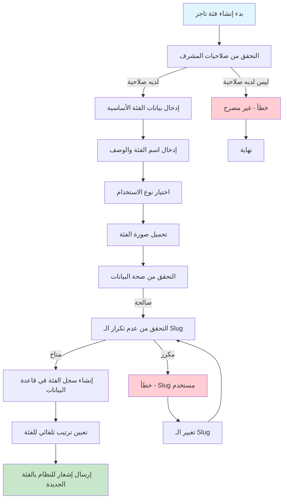
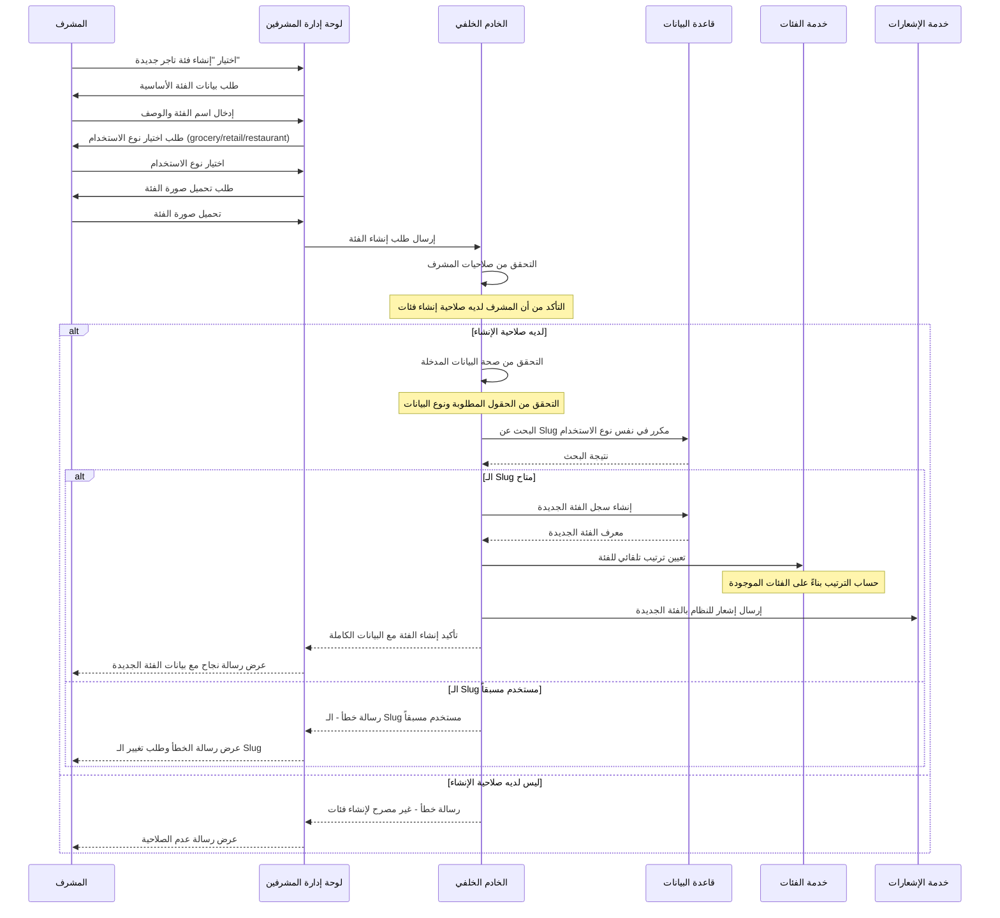
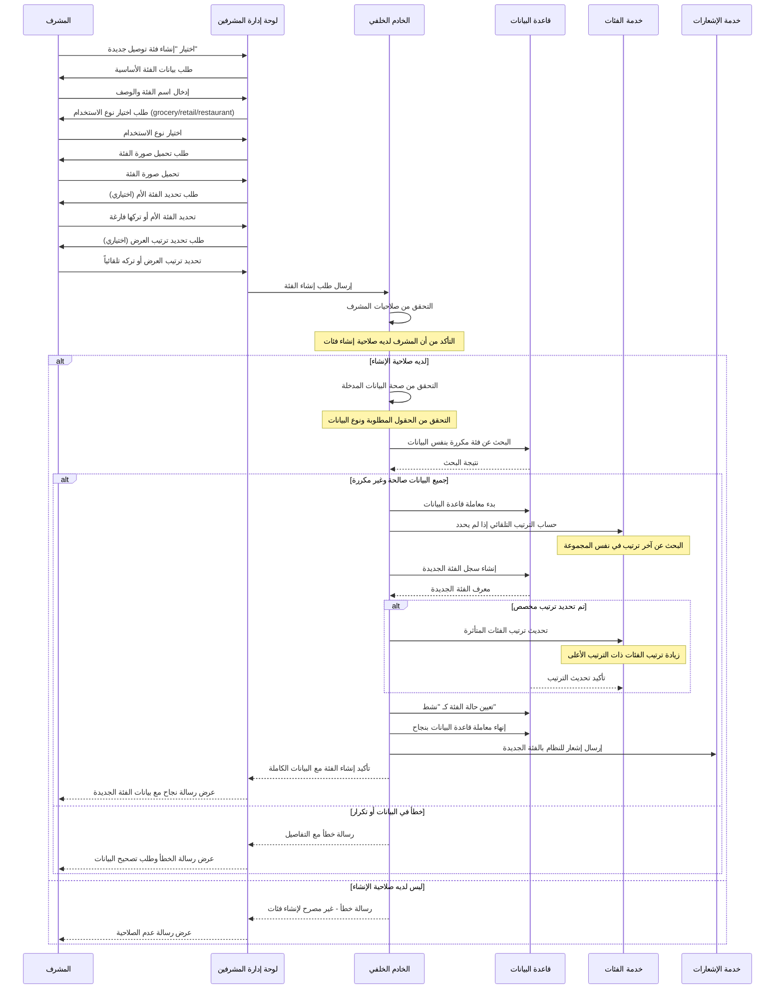
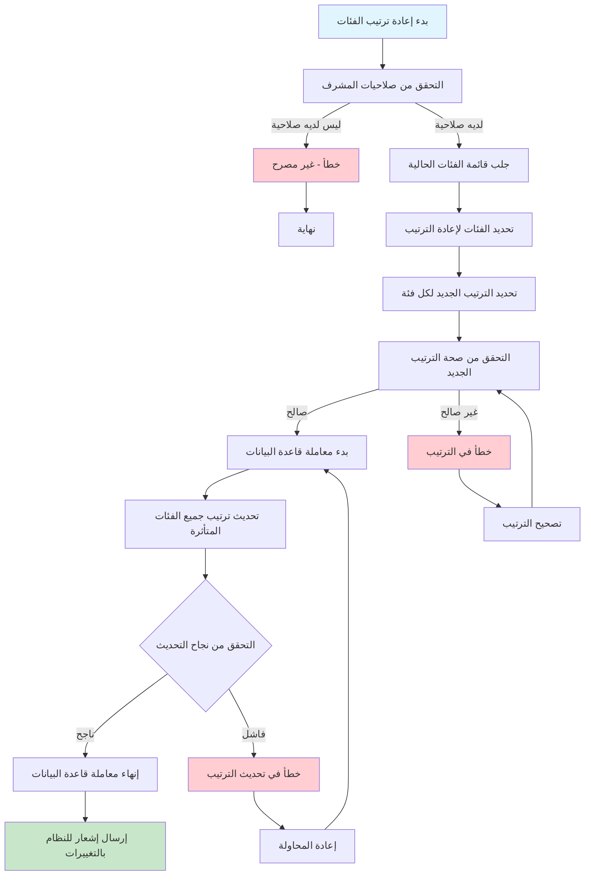
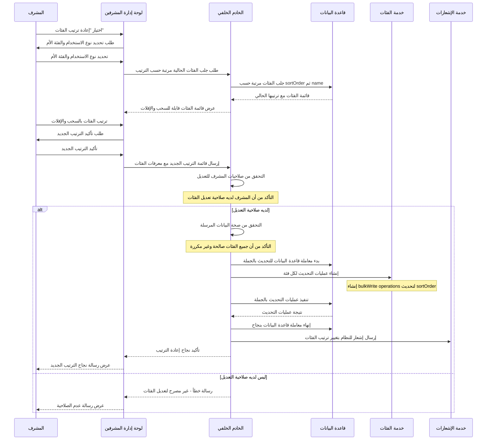

# مخططات تدفقات إنشاء الفئات في نظام بثواني

## نظرة عامة على عمليات إنشاء الفئات في النظام

نظام بثواني يدعم نوعين رئيسيين من الفئات:

1. **فئات التاجر (Merchant Categories)** - تستخدم في نظام إدارة المنتجات للتجار
2. **فئات التوصيل (Delivery Categories)** - تستخدم في نظام التوصيل والمتاجر

كل نظام له آليات مختلفة لإنشاء وإدارة الفئات مع التركيز على التنظيم والترتيب.

---

## 1. تدفق إنشاء فئة تاجر (Merchant Category Creation)

### Workflow Diagram - مخطط التدفق



### Sequence Diagram - مخطط التسلسل



---

## 2. تدفق إنشاء فئة توصيل (Delivery Category Creation)

### Workflow Diagram - مخطط التدفق

```mermaid
graph TD
    A[بدء إنشاء فئة توصيل] --> B[التحقق من صلاحيات المشرف]
    B -->|ليس لديه صلاحية| C[خطأ - غير مصرح]

    B -->|لديه صلاحية| D[إدخال بيانات الفئة الأساسية]
    D --> E[إدخال اسم الفئة والوصف]

    E --> F[اختيار نوع الاستخدام]
    F --> G[تحميل صورة الفئة]

    G --> H[تحديد الفئة الأم (اختياري)]
    H --> I[تحديد ترتيب العرض]

    I --> J[التحقق من صحة البيانات]
    J -->|صالحة| K[التحقق من عدم تكرار الفئة]

    K -->|متاحة| L[بدء معاملة قاعدة البيانات]
    K -->|مكررة| M[خطأ - الفئة موجودة]

    L --> N[إنشاء سجل الفئة]
    N --> O[تحديث ترتيب الفئات المتأثرة]

    O --> P{التحقق من نجاح العملية}
    P -->|ناجح| Q[تعيين حالة الفئة كـ "نشط"]
    P -->|فاشل| R[خطأ في إنشاء الفئة]

    Q --> S[إنهاء معاملة قاعدة البيانات]
    S --> T[إرسال إشعار للنظام بالفئة الجديدة]

    C --> U[نهاية]
    M --> V[تغيير بيانات الفئة]
    R --> W[إعادة المحاولة]

    V --> K
    W --> L

    style A fill:#e1f5fe
    style T fill:#c8e6c9
    style C fill:#ffcdd2
    style M fill:#ffcdd2
    style R fill:#ffcdd2
```

### Sequence Diagram - مخطط التسلسل



---

## 3. تدفق إعادة ترتيب الفئات (Category Reordering Workflow)

### Workflow Diagram - مخطط التدفق



### Sequence Diagram - مخطط التسلسل



---

## مقارنة بين أنواع الفئات في النظام

| نوع الفئة | الاستخدام | نظام الترتيب | الهيكل الهرمي | التحقق من التكرار |
|-----------|-----------|----------------|------------------|-------------------|
| **فئات التاجر** | تصنيف منتجات التجار | ترتيب يدوي | فئات رئيسية فقط | Slug فريد |
| **فئات التوصيل** | تصنيف متاجر التوصيل | ترتيب تلقائي + يدوي | فئات رئيسية وفرعية | اسم فريد ضمن نفس المستوى |

---

## البيانات المطلوبة لإنشاء فئة

### البيانات الأساسية (مشتركة)
- **اسم الفئة** (مطلوب، فريد)
- **نوع الاستخدام** (مطلوب: grocery/retail/restaurant)
- **صورة الفئة** (مطلوب للتوصيل، اختياري للتاجر)

### البيانات الإضافية لفئات التاجر
- **الوصف** (اختياري)
- **Slug** (فريد، يستخدم في الروابط)
- **الفئة الأم** (اختياري)

### البيانات الإضافية لفئات التوصيل
- **الوصف** (اختياري)
- **الفئة الأم** (اختياري - للفئات الفرعية)
- **ترتيب العرض** (اختياري - يتم حسابه تلقائياً)
- **حالة التفعيل** (افتراضي نشط)

---

## آليات الحماية والتحقق

### 1. التحقق من التكرار
- **فئات التاجر**: منع تكرار الـ Slug في نفس نوع الاستخدام
- **فئات التوصيل**: منع تكرار الاسم في نفس المستوى والنوع

### 2. التحقق من صحة البيانات
- التحقق من وجود الحقول المطلوبة
- التحقق من صحة نوع الاستخدام
- التحقق من صحة معرف الفئة الأم إذا وُجدت

### 3. نظام الترتيب الذكي
- **التعيين التلقائي**: حساب الترتيب التالي عند الإنشاء
- **التحديث التلقائي**: تحديث ترتيب الفئات المتأثرة عند الإدراج
- **السحب والإفلات**: إمكانية إعادة ترتيب يدوي بالسحب والإفلات

### 4. إدارة المعاملات
- استخدام معاملات قاعدة البيانات لضمان الاتساق
- إلغاء العملية إذا فشل أي جزء منها
- ضمان عدم ترك بيانات غير مكتملة

### 5. نظام الصلاحيات
- التحقق من صلاحيات المشرف قبل الإنشاء أو التعديل
- تسجيل عمليات الإنشاء والتعديل في سجل التدقيق
- ربط كل فئة بالمُنشئ أو المُعدل

---

## قواعد البيانات المستخدمة

- **فئات التاجر**: جدول `categorymacs` في MongoDB
- **فئات التوصيل**: جدول `deliverycategories` في MongoDB
- **الفئات الفرعية**: ربط ذاتي بـ `parent` في نفس الجدول

---

## حالات الفئة الممكنة

| الحالة | الوصف | متاح للاستخدام | يظهر في القوائم |
|---------|--------|------------------|-------------------|
| **نشط** | فئة مفعلة وتعمل بشكل طبيعي | ✅ متاح | ✅ يظهر |
| **غير نشط** | فئة معطلة مؤقتاً | ❌ غير متاح | ❌ لا يظهر |

---

## مميزات نظام الفئات

### 1. الهيكل الهرمي
- دعم الفئات الرئيسية والفرعية
- إمكانية تصنيف متعدد المستويات
- وراثة الخصائص من الفئة الأم

### 2. نظام الترتيب المتقدم
- ترتيب تلقائي عند الإنشاء
- إمكانية إعادة ترتيب يدوي
- حفظ الترتيب حسب نوع الاستخدام والمستوى

### 3. البحث والتصفية
- بحث بالاسم والوصف
- تصفية حسب نوع الاستخدام
- تصفية حسب الفئة الأم
- ترتيب حسب الترتيب أو الأبجدي

هذه المخططات تغطي جميع جوانب عمليات إنشاء الفئات في نظام بثواني بالتفصيل الكامل.
