```mermaid
graph TD
    A[بدء تسجيل دخول السائق] --> B[إدخال رقم الهاتف]
    B --> C[التحقق من وجود السائق في النظام]

    C -->|موجود| D[التحقق من حالة السائق]
    C -->|غير موجود| E[رسالة خطأ - السائق غير مسجل]

    D -->|نشط| F[إرسال رمز OTP عبر SMS]
    D -->|معطل| G[رسالة خطأ - الحساب معطل]
    D -->|في انتظار الموافقة| H[رسالة خطأ - الحساب في انتظار الموافقة]

    F --> I[إدخال رمز OTP]
    I --> J{التحقق من صحة OTP}

    J -->|صالح| K[إنشاء JWT Tokens خاصة بالسائق]
    J -->|غير صالح| L[خطأ في OTP]

    K --> M[حفظ Refresh Token]
    M --> N[تسجيل دخول ناجح]

    L --> O[إعادة إرسال OTP]
    O --> I

    style A fill:#e1f5fe
    style N fill:#c8e6c9
    style E fill:#ffcdd2
    style G fill:#ffcdd2
    style H fill:#ffcdd2
```

# مخططات تدفقات تسجيل الدخول لجميع الشخصيات في نظام بثواني

## نظرة عامة على الشخصيات في النظام

نظام بثواني يدعم خمس شخصيات رئيسية:
1. **العملاء** (Customers) - المستخدمون النهائيون الذين يطلبون المنتجات والخدمات
2. **التجار** (Vendors/Merchants) - أصحاب المتاجر الذين يبيعون منتجاتهم عبر المنصة
3. **السائقين** (Drivers) - مقدمو خدمات التوصيل
4. **مسوقي الميدان** (Field Marketers) - فريق التسويق الميداني
5. **المشرفين** (Admins) - مدراء النظام والمشرفين

---

## 1. تدفق تسجيل دخول العميل (Customer Login Workflow)

### Workflow Diagram - مخطط التدفق


### Sequence Diagram - مخطط التسلسل


---

## 2. تدفق تسجيل دخول التاجر (Vendor Login Workflow)

### Workflow Diagram - مخطط التدفق


### Sequence Diagram - مخطط التسلسل


---

## 3. تدفق تسجيل دخول السائق (Driver Login Workflow)

### Workflow Diagram - مخطط التدفق



### Sequence Diagram - مخطط التسلسل


---

## 4. تدفق تسجيل دخول المسوق الميداني (Field Marketer Login Workflow)

### Workflow Diagram - مخطط التدفق


### Sequence Diagram - مخطط التسلسل


---

## 5. تدفق تسجيل دخول المشرف (Admin Login Workflow)

### Workflow Diagram - مخطط التدفق


### Sequence Diagram - مخطط التسلسل


---

## مقارنة بين طرق تسجيل الدخول لكل شخصية

| الشخصية | طريقة المصادقة | آلية التحقق | الحماية الإضافية | حالات الحظر |
|---------|---------------|-------------|-------------------|-------------|
| **العميل** | رقم الهاتف/البريد الإلكتروني + OTP | Firebase Auth + JWT | حماية من الـ Rate Limiting | لا توجد حماية من المحاولات المتكررة |
| **التاجر** | رقم الهاتف + OTP | JWT خاص بالتاجر | التحقق من حالة الحساب | لا توجد حماية من المحاولات المتكررة |
| **السائق** | رقم الهاتف + OTP | JWT خاص بالسائق | التحقق من حالة الحساب والمركبة | لا توجد حماية من المحاولات المتكررة |
| **المسوق** | رقم الهاتف + OTP | JWT خاص بالمسوق | التحقق من حالة الحساب | لا توجد حماية من المحاولات المتكررة |
| **المشرف** | اسم المستخدم + كلمة مرور | JWT خاص بالمشرف | حماية من المحاولات المتكررة (Brute Force) | حظر مؤقت بعد عدة محاولات فاشلة |

---

## آليات الحماية المشتركة في جميع التدفقات

### 1. JWT Token Management
- **Access Token**: قصير الأمد (15 دقيقة) للوصول للموارد
- **Refresh Token**: طويل الأمد (7 أيام) للحصول على Access Token جديد
- **Token Blacklisting**: إمكانية إلغاء التوكنات عند تسجيل الخروج

### 2. Rate Limiting
- تحديد عدد الطلبات المسموحة لكل عنوان IP
- حماية من الهجمات الآلية والـ DDoS

### 3. Input Validation
- التحقق من صحة البيانات المدخلة
- حماية من هجمات الحقن (Injection Attacks)

### 4. Audit Logging
- تسجيل جميع عمليات تسجيل الدخول والمحاولات الفاشلة
- تتبع العمليات المشبوهة

### 5. Session Management
- انتهاء صلاحية الجلسات تلقائياً
- إمكانية تسجيل الخروج من جميع الأجهزة

---

## ملاحظات تقنية مهمة

### متغيرات البيئة المطلوبة
```bash
# JWT Configuration
JWT_ACCESS_SECRET=your-access-secret
JWT_REFRESH_SECRET=your-refresh-secret
JWT_ACCESS_EXPIRY=15m
JWT_REFRESH_EXPIRY=7d

# Firebase Configuration
FIREBASE_PROJECT_ID=your-project-id
FB_CHECK_REVOKED=true

# SMS/Email Services
SMS_API_KEY=your-sms-api-key
SMTP_HOST=smtp.gmail.com
```

### قواعد البيانات المستخدمة
- **المستخدمون**: جدول `users` في MongoDB
- **التجار**: جدول `vendors` في MongoDB
- **السائقون**: جدول `drivers` في MongoDB
- **المسوقون**: جدول `marketers` في MongoDB
- **المشرفون**: جدول `admin_users` في MongoDB
- **رموز OTP**: جدول `otps` في MongoDB
- **المحاولات الفاشلة**: جدول `login_attempts` في MongoDB

### الاختلافات الرئيسية بين الشخصيات
1. **العملاء**: أكثر مرونة في طرق المصادقة (رقم الهاتف/البريد الإلكتروني/Google)
2. **التجار والسائقين**: يتطلبون موافقة إدارية قبل التفعيل
3. **المسوقين**: مرتبطون بنظام التسويق والعمولات
4. **المشرفين**: نظام مصادقة تقليدي مع حماية متقدمة من المحاولات المتكررة

هذه المخططات تغطي جميع جوانب عمليات تسجيل الدخول في نظام بثواني بالتفصيل الكامل.
