# نظام الإشعارات الشامل في نظام بثواني

## نظرة عامة على نظام الإشعارات

نظام بثواني يحتوي على نظام إشعارات شامل ومتعدد القنوات يغطي:

1. **إشعارات الطلبات** (Order Notifications) - تتبع حالة الطلبات
2. **إشعارات التاجر** (Vendor Notifications) - إشعارات خاصة بالتجار
3. **إشعارات السائقين** (Driver Notifications) - إشعارات خاصة بالسائقين
4. **إشعارات النظام** (System Notifications) - إشعارات النظام والأمان
5. **إشعارات التسويق** (Marketing Notifications) - العروض والحملات

النظام يدعم عدة قنوات للإرسال: Push Notifications، Email، SMS، In-App Notifications.

---

## 1. تدفق إشعارات الطلبات (Order Notifications Flow)

### الأدوار المشاركة:
- **العميل**: يتلقى إشعارات عن حالة طلبه
- **السائق**: يتلقى إشعارات عن الطلبات المعينة له
- **التاجر**: يتلقى إشعارات عن الطلبات الجديدة
- **النظام**: يرسل الإشعارات تلقائياً حسب التغييرات في حالة الطلب

### Workflow Diagram - مخطط التدفق

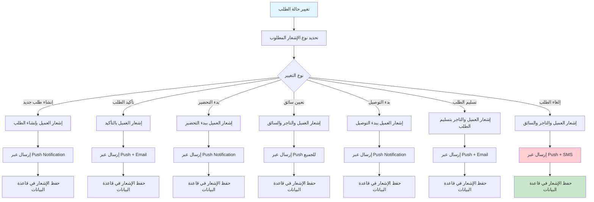

### Sequence Diagram - مخطط التسلسل

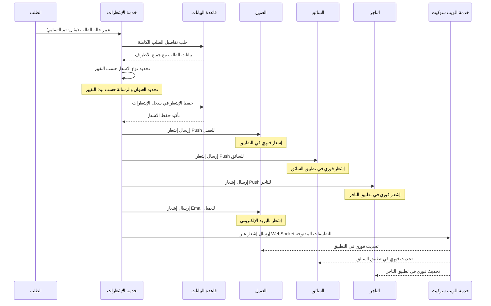

---

## 2. تدفق إشعارات السائقين (Driver Notifications Flow)

### الأدوار المشاركة:
- **السائق**: يتلقى عروض التوصيل وتحديثات الطلبات
- **النظام**: يرسل عروض التوصيل ويتابع حالة السائقين
- **الإدارة**: تتلقى إشعارات عن مشاكل السائقين

### Workflow Diagram - مخطط التدفق

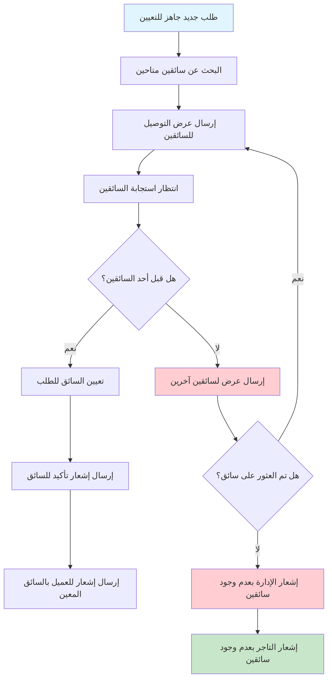

### Sequence Diagram - مخطط التسلسل

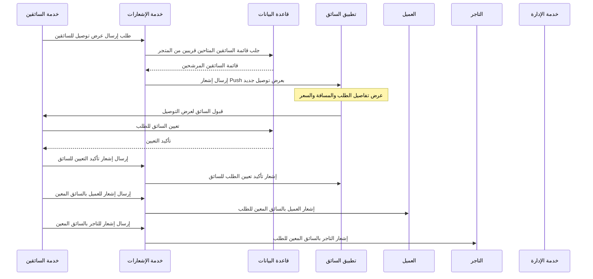

---

## 3. تدفق إشعارات التاجر (Vendor Notifications Flow)

### الأدوار المشاركة:
- **التاجر**: يتلقى إشعارات الطلبات الجديدة والتحديثات
- **النظام**: يرسل إشعارات تلقائية عن حالة الطلبات
- **الإدارة**: تتلقى إشعارات عن مشاكل التجار

### Workflow Diagram - مخطط التدفق

```mermaid
graph TD
    A[طلب جديد تم تأكيده] --> B[إرسال إشعار للتاجر بالطلب الجديد]
    B --> C[انتظار استجابة التاجر]

    C --> D{هل قبل التاجر الطلب؟}
    D -->|نعم| E[تحديث حالة الطلب إلى "قيد التحضير"]

    D -->|لا| F[إشعار التاجر برفض الطلب]
    E --> G[إرسال إشعار للعميل بقبول الطلب]

    G --> H[إرسال إشعار للسائق ببدء التحضير]
    H --> I[انتظار إكمال التحضير]

    I --> J{هل تم إكمال التحضير؟}
    J -->|نعم| K[إرسال إشعار للسائق بالطلب الجاهز]

    J -->|لا| L[إرسال تذكير للتاجر]

    K --> M[إرسال إشعار للعميل بجاهزية الطلب]

    style A fill:#e1f5fe
    style M fill:#c8e6c9
    style D fill:#ffcdd2
    style L fill:#ffcdd2
```

### Sequence Diagram - مخطط التسلسل

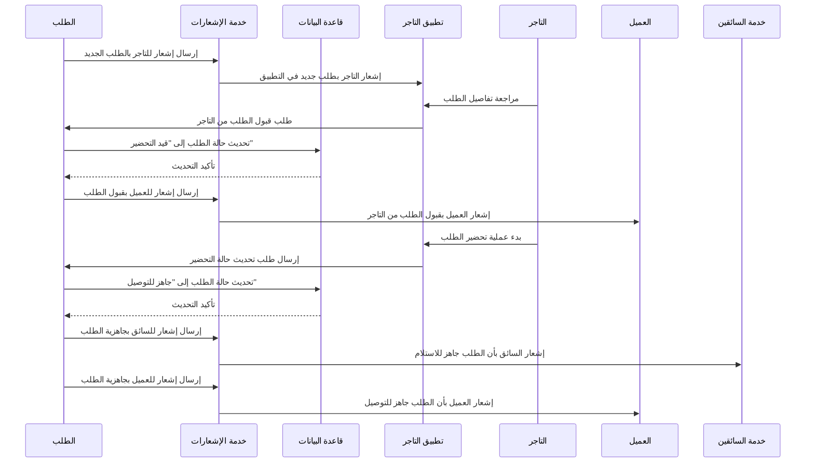

---

## 4. تدفق إشعارات النظام (System Notifications Flow)

### الأدوار المشاركة:
- **الإدارة**: تتلقى إشعارات الأمان والأخطاء
- **النظام**: يرسل إشعارات تلقائية عن الأحداث المهمة
- **المطورين**: تتلقى إشعارات الأخطاء التقنية

### Workflow Diagram - مخطط التدفق

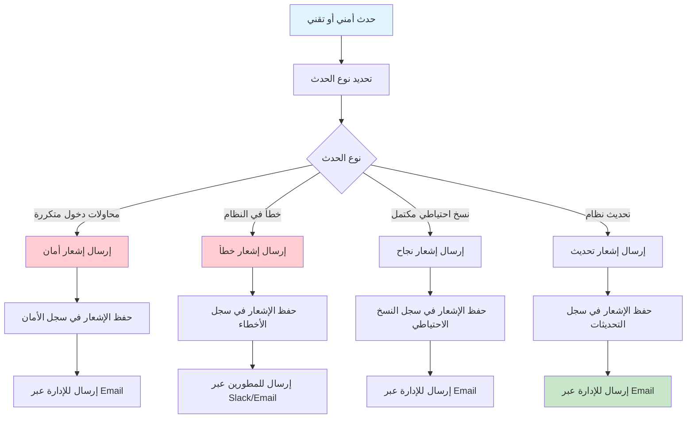

### Sequence Diagram - مخطط التسلسل

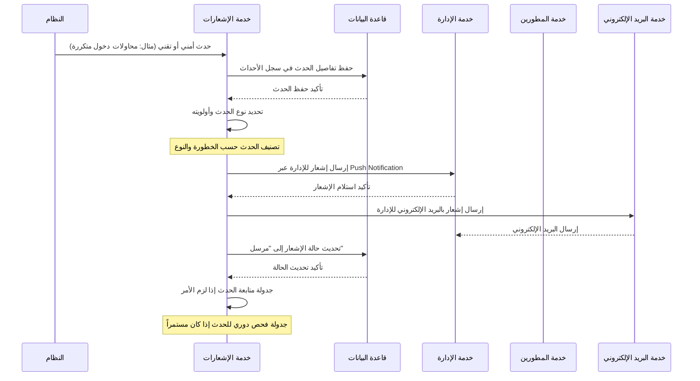

---

## 5. تدفق إشعارات التسويق (Marketing Notifications Flow)

### الأدوار المشاركة:
- **العملاء**: يتلقون عروض وخصومات مخصصة
- **التاجر**: يتلقى إشعارات عن حملاته التسويقية
- **النظام**: يرسل الإشعارات حسب التفضيلات والسلوك

### Workflow Diagram - مخطط التدفق

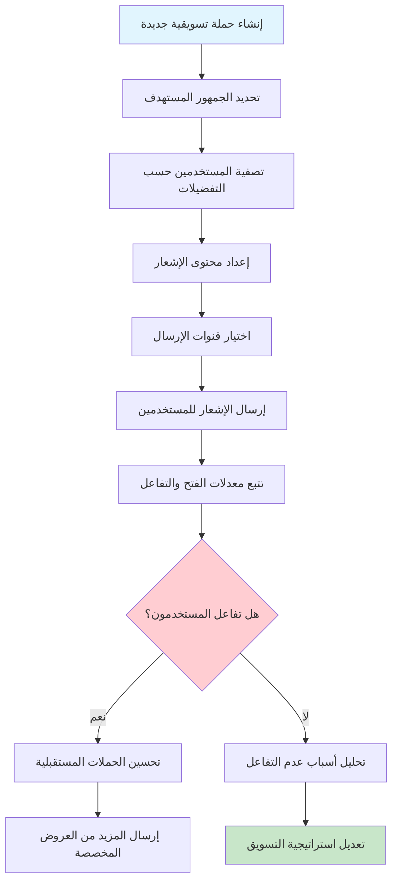

### Sequence Diagram - مخطط التسلسل

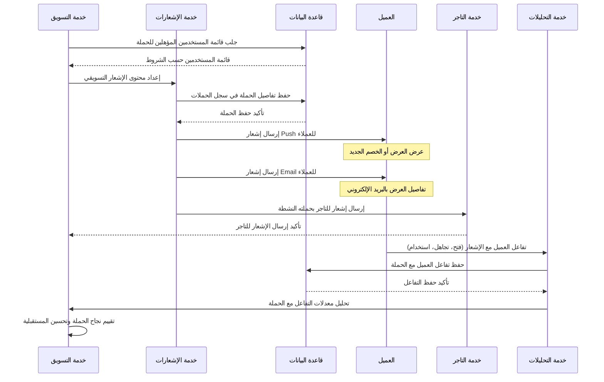

---

## 6. تدفق إدارة تفضيلات الإشعارات (Notification Preferences Flow)

### الأدوار المشاركة:
- **المستخدم**: يتحكم في تفضيلات الإشعارات الخاصة به
- **النظام**: يحفظ ويطبق تفضيلات المستخدم
- **التطبيق**: يعرض واجهة إدارة التفضيلات

### Workflow Diagram - مخطط التدفق

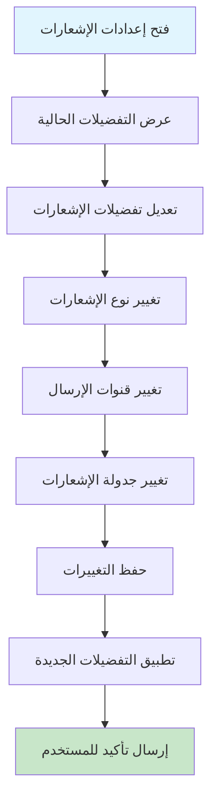

### Sequence Diagram - مخطط التسلسل

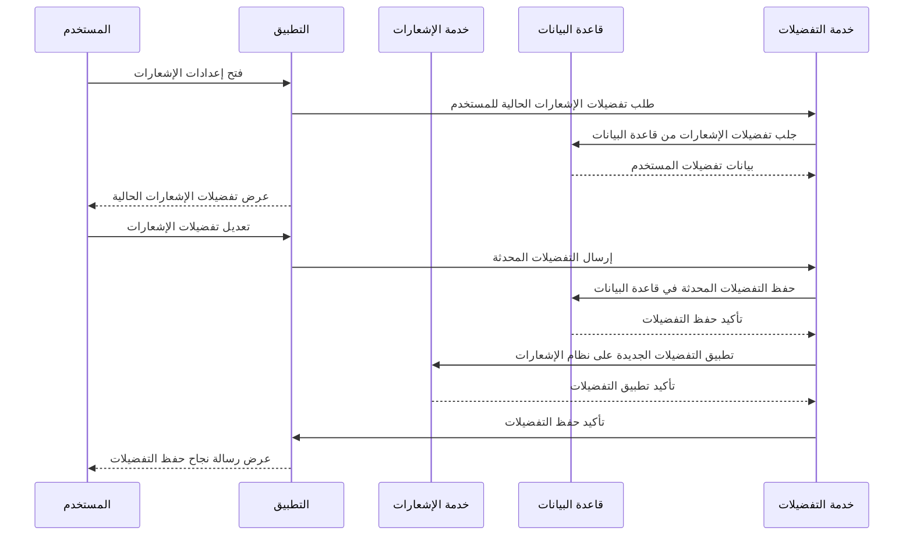

---

## مقارنة بين أنواع الإشعارات في النظام

| نوع الإشعار | المستلمون | القنوات | الأولوية | التكرار |
|-------------|-----------|----------|----------|---------|
| **إشعارات الطلبات** | العميل، السائق، التاجر | Push, Email, In-App | عالية | فوري عند التغيير |
| **إشعارات السائقين** | السائقين المتاحين | Push, In-App | عالية | فوري للعروض |
| **إشعارات التاجر** | التجار | Push, In-App | متوسطة | فوري للطلبات |
| **إشعارات النظام** | الإدارة، المطورين | Email, Slack, In-App | عالية/حرجة | حسب الحدث |
| **إشعارات التسويق** | العملاء المستهدفين | Push, Email, SMS | متوسطة | حسب الحملة |

---

## البيانات المطلوبة لكل نوع إشعار

### إشعار طلب جديد (Order Created)
- **معرف الطلب** (orderId)
- **معرف المستخدم** (userId)
- **اسم المستخدم** (userName)
- **مبلغ الطلب** (totalAmount)
- **عدد العناصر** (itemsCount)
- **عنوان التسليم** (deliveryAddress)

### إشعار تعيين سائق (Driver Assigned)
- **معرف الطلب** (orderId)
- **اسم السائق** (driverName)
- **هاتف السائق** (driverPhone)
- **وقت الوصول المتوقع** (estimatedArrival)

### إشعار حالة الطلب (Order Status Update)
- **معرف الطلب** (orderId)
- **الحالة الجديدة** (newStatus)
- **الحالة السابقة** (oldStatus)
- **رسالة إضافية** (message)

### إشعار أمني (Security Alert)
- **نوع الحدث** (eventType)
- **عنوان IP** (ipAddress)
- **اسم المستخدم** (username)
- **عدد المحاولات** (attempts)
- **حالة الحظر** (isBlocked)

---

## آليات الحماية والتحقق

### 1. التحقق من التفضيلات
- **تفضيلات المستخدم**: عدم إرسال إشعارات للمستخدمين الذين رفضوها
- **أنواع الإشعارات**: فلترة حسب نوع الإشعار المسموح به
- **قنوات الإرسال**: احترام قنوات الإرسال المفضلة للمستخدم

### 2. منع السبام
- **حدود التكرار**: منع إرسال إشعارات متكررة لنفس الحدث
- **فترات الانتظار**: تحديد فترات زمنية بين الإشعارات المتشابهة
- **الحد الأقصى**: تحديد عدد الإشعارات المسموح بها يومياً

### 3. جودة المحتوى
- **الطول المحدد**: تحديد طول العناوين والرسائل
- **التنسيق المناسب**: التأكد من صحة تنسيق الرسائل
- **اللغة المناسبة**: استخدام اللغة الصحيحة حسب المستخدم

### 4. إدارة الأخطاء
- **إعادة المحاولة**: إعادة إرسال الإشعارات الفاشلة
- **التسجيل**: حفظ سجل كامل لجميع الإشعارات المرسلة
- **المراقبة**: مراقبة حالة إرسال الإشعارات

### 5. حماية البيانات
- **التشفير**: تشفير بيانات الإشعارات الحساسة
- **الخصوصية**: عدم عرض بيانات شخصية في الإشعارات العامة
- **الامتثال**: الامتثال لقوانين حماية البيانات (GDPR, CCPA)

---

## قواعد البيانات المستخدمة

- **إشعارات المستخدمين**: جدول `notifications` في MongoDB
- **تفضيلات الإشعارات**: جدول `notification_preferences` في MongoDB
- **سجل الإشعارات**: جدول `notification_logs` في MongoDB
- **قوالب الإشعارات**: جدول `notification_templates` في MongoDB

---

## حالات الإشعار الممكنة

| الحالة | الوصف | يمكن إعادة الإرسال | يظهر للمستخدم |
|---------|--------|-------------------|----------------|
| **مرسل** | إشعار تم إرساله بنجاح | ❌ لا | ✅ يظهر |
| **فاشل** | إشعار فشل في الإرسال | ✅ يمكن إعادة الإرسال | ❌ لا يظهر |
| **مؤجل** | إشعار في قائمة الانتظار | ✅ يمكن إعادة الإرسال | ❌ لا يظهر |
| **ملغي** | إشعار تم إلغاؤه | ❌ لا | ❌ لا يظهر |

---

## مميزات نظام الإشعارات المتقدمة

### 1. تخصيص الإشعارات
- إعدادات مخصصة لكل مستخدم حسب تفضيلاته
- قنوات إرسال متعددة (Push, Email, SMS, In-App)
- جدولة الإشعارات حسب أوقات المستخدم المفضلة

### 2. ذكاء اصطناعي في الإشعارات
- تحليل سلوك المستخدم لتحسين توقيت الإشعارات
- تخصيص المحتوى حسب تفاعل المستخدم السابق
- تجنب الإشعارات المزعجة بناءً على التحليل

### 3. نظام التحليلات
- تتبع معدلات فتح الإشعارات
- تحليل التفاعل مع الإشعارات التسويقية
- قياس فعالية الحملات التسويقية

### 4. نظام الاستجابات التلقائية
- ردود تلقائية على أحداث معينة
- إشعارات ذكية حسب حالة الطلب
- تذكيرات تلقائية للمهام المهمة

### 5. نظام التنبيهات الذكي
- تنبيهات فورية للأحداث الحرجة
- تنبيهات دورية للأحداث المهمة
- تصعيد التنبيهات حسب الأولوية والأهمية

هذه المخططات تغطي جميع جوانب نظام الإشعارات في نظام بثواني بالتفصيل الكامل.
