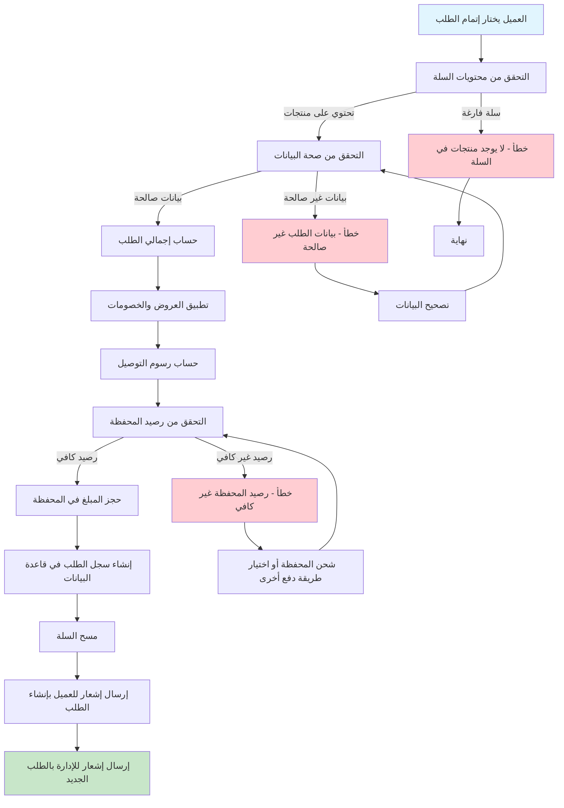
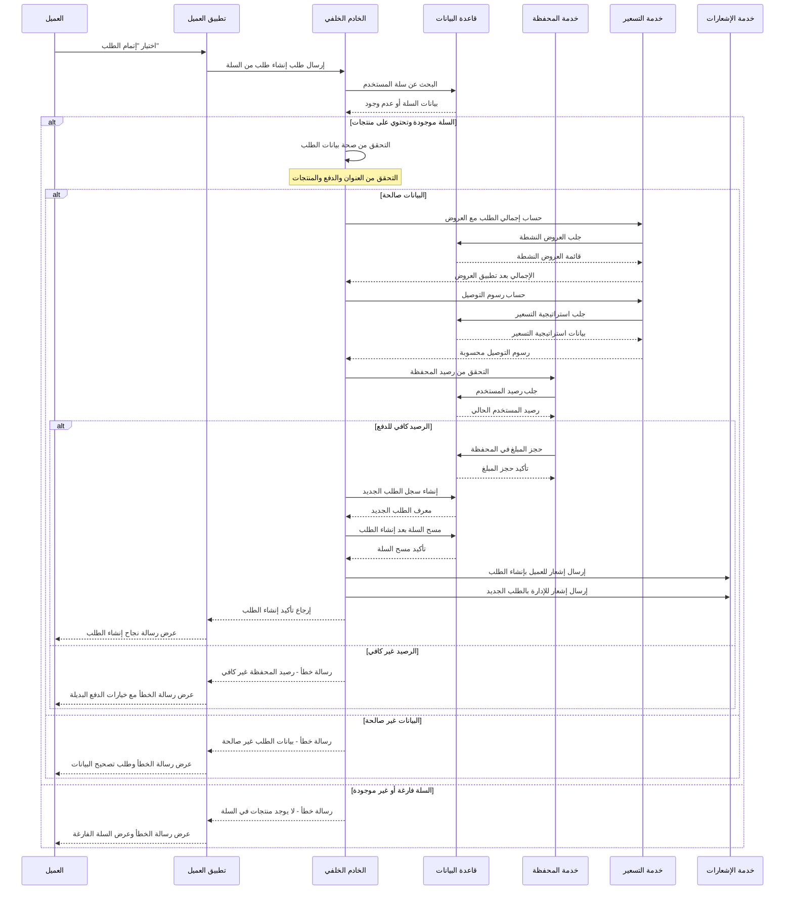
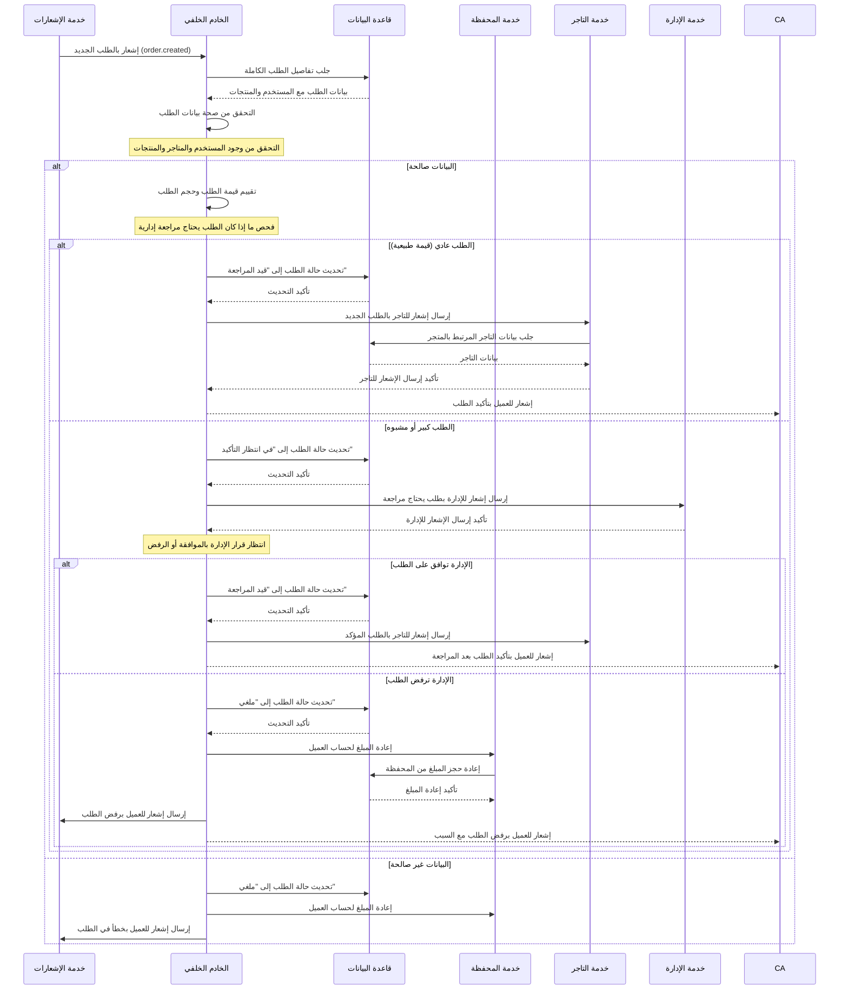
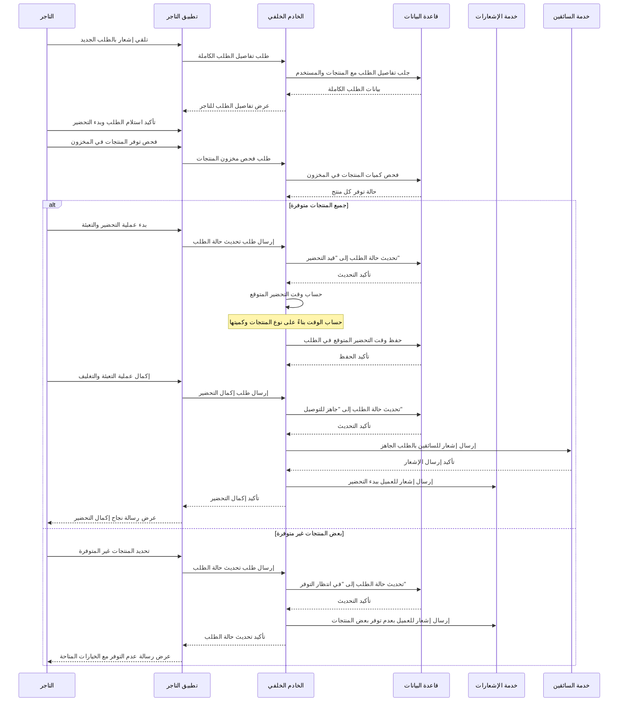
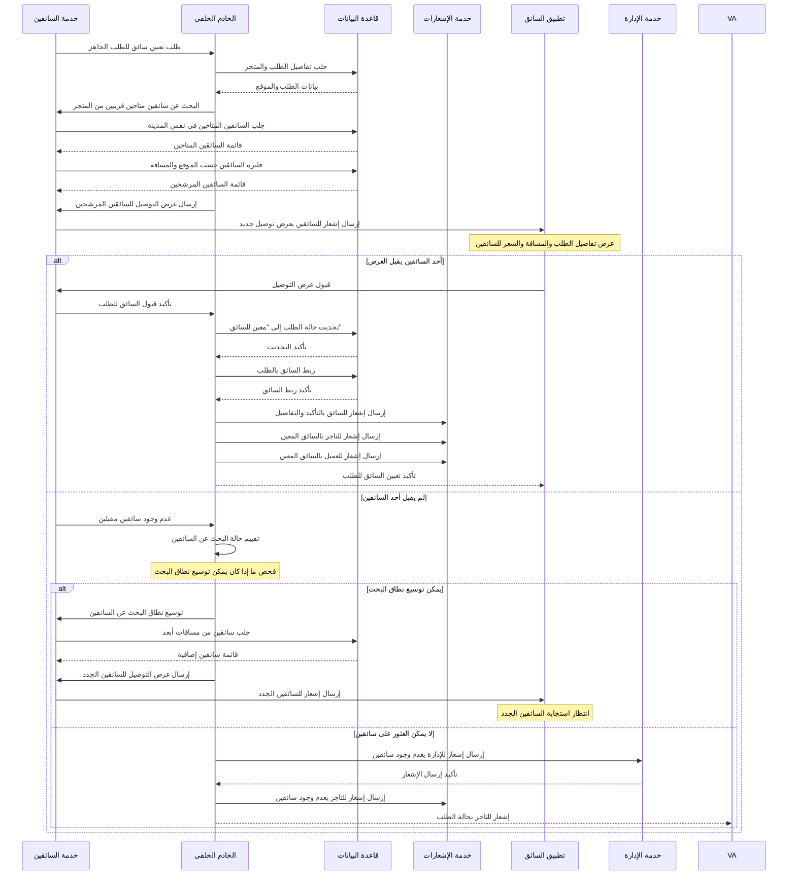
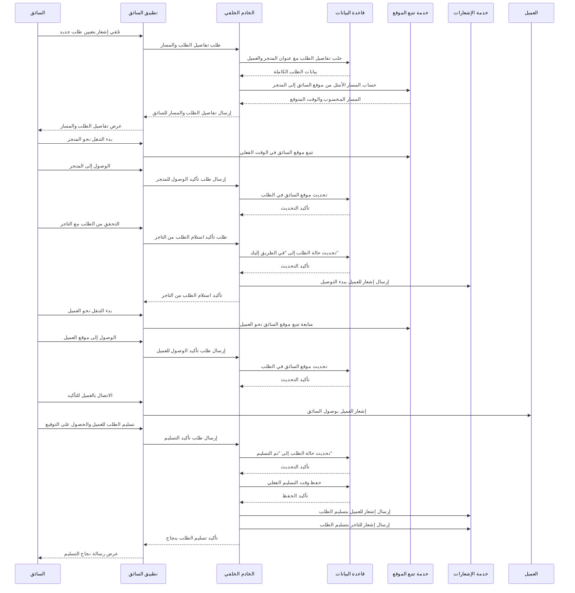
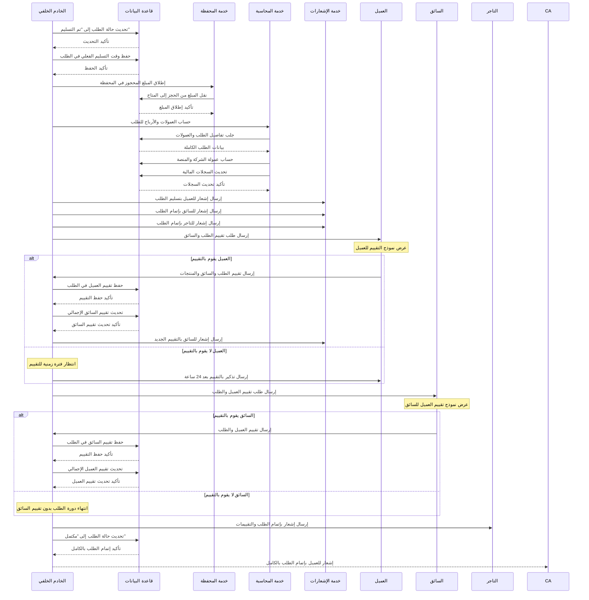

# دورة حياة الطلب الكاملة في نظام بثواني

## نظرة عامة على دورة حياة الطلب

دورة حياة الطلب في نظام بثواني تمر بعدة مراحل رئيسية مع مشاركة جميع الأطراف المعنية في النظام:

1. **إنشاء الطلب** (Order Creation) - العميل
2. **تأكيد الطلب** (Order Confirmation) - النظام/الإدارة
3. **مراجعة الطلب** (Order Review) - النظام/الإدارة
4. **التحضير** (Order Preparation) - التاجر/المتجر
5. **تعيين السائق** (Driver Assignment) - النظام/الإدارة
6. **التوصيل** (Order Delivery) - السائق
7. **التسليم** (Order Completion) - السائق والعميل
8. **التقييم** (Order Rating) - العميل والسائق

كل مرحلة لها مسؤوليات محددة وأدوار مشاركة مختلفة.

---

## 1. مرحلة إنشاء الطلب (Order Creation)

### الأدوار المشاركة:
- **العميل**: يقوم بإنشاء الطلب من السلة
- **النظام**: يتحقق من صحة البيانات ويحسب التكاليف
- **المحفظة**: يتحقق من رصيد العميل ويحجز المبلغ

### Workflow Diagram - مخطط التدفق



### Sequence Diagram - مخطط التسلسل



---

## 2. مرحلة تأكيد الطلب (Order Confirmation)

### الأدوار المشاركة:
- **النظام**: يتحقق من صحة الطلب ويؤكده تلقائياً
- **الإدارة**: مراجعة الطلبات المشبوهة أو الكبيرة
- **التاجر**: يتلقى إشعار بالطلب الجديد

### Workflow Diagram - مخطط التدفق

```mermaid
graph TD
    A[تلقي إشعار بالطلب الجديد] --> B[التحقق من صحة بيانات الطلب]
    B -->|صالح| C[التحقق من قيمة الطلب]

    C -->|طلب عادي| D[تأكيد الطلب تلقائياً]
    C -->|طلب كبير/مشبوه| E[وضع الطلب قيد المراجعة]

    D --> F[تحديث حالة الطلب إلى "قيد المراجعة"]
    E --> G[إرسال إشعار للإدارة بالمراجعة]

    F --> H[إرسال إشعار للتاجر بالطلب الجديد]
    G --> I[انتظار مراجعة الإدارة]

    I --> J{نتيجة المراجعة}
    J -->|موافق عليه| K[تأكيد الطلب وإرسال للتاجر]

    J -->|مرفوض| L[إلغاء الطلب وإعادة المبلغ]

    K --> H
    L --> M[إرسال إشعار للعميل برفض الطلب]

    style A fill:#e1f5fe
    style H fill:#c8e6c9
    style E fill:#ffcdd2
    style L fill:#ffcdd2
```

### Sequence Diagram - مخطط التسلسل



---

## 3. مرحلة تحضير الطلب (Order Preparation)

### الأدوار المشاركة:
- **التاجر**: يقوم بتحضير المنتجات وتعبئتها
- **النظام**: يتتبع حالة التحضير ويحدث الأوقات المتوقعة
- **السائق**: يتلقى إشعاراً بالطلب الجاهز للاستلام

### Workflow Diagram - مخطط التدفق

```mermaid
graph TD
    A[تلقي إشعار بالطلب الجديد] --> B[التحقق من توفر المنتجات]
    B -->|غير متوفر| C[إشعار العميل بعدم التوفر]

    B -->|متوفر| D[بدء تحضير المنتجات]
    D --> E[تعبئة وتغليف المنتجات]

    E --> F[تحديث حالة الطلب إلى "قيد التحضير"]
    F --> G[تقدير وقت التحضير]

    G --> H[إرسال إشعار للسائق بالطلب الجاهز]
    H --> I[انتظار وصول السائق]

    I --> J{هل وصل السائق؟}
    J -->|نعم| K[تسليم الطلب للسائق]

    J -->|لا| L[متابعة الانتظار]

    K --> M[تحديث حالة الطلب إلى "جاهز للتوصيل"]

    C --> N[نهاية]
    L --> I

    style A fill:#e1f5fe
    style M fill:#c8e6c9
    style C fill:#ffcdd2
```

### Sequence Diagram - مخطط التسلسل



---

## 4. مرحلة تعيين السائق (Driver Assignment)

### الأدوار المشاركة:
- **النظام**: يبحث عن سائق متاح وقريب من المتجر
- **الإدارة**: مراجعة طلبات التوصيل الكبيرة أو المعقدة
- **السائق**: يتلقى عرض التوصيل ويقبل أو يرفض

### Workflow Diagram - مخطط التدفق

```mermaid
graph TD
    A[تلقي إشعار بالطلب الجاهز] --> B[البحث عن سائقين متاحين]
    B --> C[فلترة السائقين حسب الموقع]

    C --> D[إرسال عرض التوصيل للسائقين]
    D --> E[انتظار استجابة السائقين]

    E --> F{هل قبل أحد السائقين؟}
    F -->|نعم| G[تعيين السائق للطلب]

    F -->|لا| H[زيادة نطاق البحث أو انتظار]

    G --> I[تحديث حالة الطلب إلى "معين للسائق"]
    I --> J[إرسال إشعار للسائق بالتأكيد]

    J --> K[إرسال إشعار للتاجر بالسائق المعين]
    K --> L[إرسال إشعار للعميل بالسائق المعين]

    H --> M{هل تم العثور على سائق؟}
    M -->|نعم| D
    M -->|لا| N[إشعار الإدارة بعدم وجود سائقين]

    style A fill:#e1f5fe
    style L fill:#c8e6c9
    style H fill:#ffcdd2
    style N fill:#ffcdd2
```

### Sequence Diagram - مخطط التسلسل



---

## 5. مرحلة التوصيل (Order Delivery)

### الأدوار المشاركة:
- **السائق**: يقوم بالتوصيل وتتبع الموقع
- **النظام**: يتتبع موقع السائق ويحدث حالة الطلب
- **العميل**: يتلقى تحديثات عن حالة التوصيل

### Workflow Diagram - مخطط التدفق

```mermaid
graph TD
    A[تلقي تأكيد تعيين الطلب] --> B[التوجه إلى المتجر للاستلام]
    B --> C[الوصول إلى المتجر]

    C --> D[التحقق من الطلب مع التاجر]
    D --> E[استلام الطلب من التاجر]

    E --> F[تحديث حالة الطلب إلى "في الطريق"]
    F --> G[بدء التنقل نحو العميل]

    G --> H[تتبع الموقع في الوقت الفعلي]
    H --> I[الوصول إلى موقع العميل]

    I --> J[الاتصال بالعميل للتأكيد]
    J --> K[تسليم الطلب للعميل]

    K --> L[تحديث حالة الطلب إلى "تم التسليم"]

    style A fill:#e1f5fe
    style L fill:#c8e6c9
```

### Sequence Diagram - مخطط التسلسل



---

## 6. مرحلة إتمام الطلب والتقييم (Order Completion & Rating)

### الأدوار المشاركة:
- **العميل**: يقيم الطلب والسائق والمنتجات
- **السائق**: يقيم العميل والطلب
- **النظام**: يحسب العمولات ويحدث السجلات المالية
- **المحاسبة**: تحديث السجلات المالية والمحاسبية

### Workflow Diagram - مخطط التدفق

```mermaid
graph TD
    A[تسليم الطلب بنجاح] --> B[تحديث حالة الطلب إلى "تم التسليم"]
    B --> C[إطلاق المبلغ المحجوز في المحفظة]

    C --> D[حساب العمولات والأرباح]
    D --> E[تحديث السجلات المالية]

    E --> F[إرسال طلب تقييم للعميل]
    F --> G[انتظار تقييم العميل]

    G --> H{هل قام العميل بالتقييم؟}
    H -->|نعم| I[حفظ تقييم العميل]

    H -->|لا| J[إرسال تذكير بالتقييم]

    I --> K[إرسال طلب تقييم للسائق]
    K --> L[انتظار تقييم السائق]

    L --> M{هل قام السائق بالتقييم؟}
    M -->|نعم| N[حفظ تقييم السائق]

    M -->|لا| O[إنهاء بدون تقييم السائق]

    N --> P[تحديث تقييمات النظام]
    P --> Q[إرسال إشعار للتاجر بإتمام الطلب]

    style A fill:#e1f5fe
    style Q fill:#c8e6c9
```

### Sequence Diagram - مخطط التسلسل



---

## ملخص دورة حياة الطلب الكاملة

### المراحل الرئيسية:
1. **إنشاء الطلب** - العميل ينشئ الطلب من السلة
2. **تأكيد الطلب** - النظام يؤكد الطلب تلقائياً أو يرسله للمراجعة
3. **تحضير الطلب** - التاجر يحضر المنتجات ويغلفها
4. **تعيين السائق** - النظام يبحث عن سائق متاح ويعينه للطلب
5. **التوصيل** - السائق يستلم الطلب ويوصله للعميل
6. **التسليم** - السائق يسلم الطلب ويحصل على التوقيع
7. **التقييم** - العميل والسائق يقيمان بعضهما البعض
8. **إتمام الطلب** - النظام يحسب العمولات ويحدث السجلات المالية

### الأدوار المشاركة في كل مرحلة:

| المرحلة | العميل | التاجر | السائق | الإدارة | النظام |
|---------|---------|---------|---------|----------|---------|
| **إنشاء الطلب** | ✅ ينشئ الطلب | ❌ | ❌ | ❌ | ✅ يتحقق ويحسب |
| **تأكيد الطلب** | ✅ يتلقى التأكيد | ✅ يتلقى الطلب | ❌ | ✅ يراجع إن لزم | ✅ يؤكد تلقائياً |
| **تحضير الطلب** | ✅ يتلقى التحديثات | ✅ يحضر الطلب | ❌ | ❌ | ✅ يتتبع التقدم |
| **تعيين السائق** | ✅ يتلقى إشعار السائق | ✅ يتلقى إشعار السائق | ✅ يقبل العرض | ✅ يراجع إن لزم | ✅ يبحث عن السائق |
| **التوصيل** | ✅ يتلقى التحديثات | ❌ | ✅ يقوم بالتوصيل | ❌ | ✅ يتتبع الموقع |
| **التسليم** | ✅ يستلم الطلب | ✅ يتلقى التأكيد | ✅ يسلم الطلب | ❌ | ✅ يؤكد التسليم |
| **التقييم** | ✅ يقيم الطلب | ✅ يتلقى التقييم | ✅ يقيم العميل | ❌ | ✅ يحسب التقييمات |
| **إتمام الطلب** | ✅ يتلقى التأكيد | ✅ يتلقى التأكيد | ✅ يتلقى التأكيد | ✅ يراجع المالية | ✅ يحسب العمولات |

### آليات الحماية والتحقق:

1. **التحقق من الهوية**: التأكد من هوية جميع الأطراف
2. **التحقق من الصلاحيات**: التأكد من صلاحية كل دور للعملية
3. **التحقق من البيانات**: صحة البيانات في كل مرحلة
4. **التحقق من التكرار**: منع تكرار العمليات غير المقصودة
5. **التحقق من الحالات**: التأكد من الانتقال الصحيح بين الحالات
6. **التحقق من الموقع**: تتبع مواقع السائقين والتأكد من القرب
7. **التحقق من الدفع**: التأكد من صحة عمليات الدفع والحجز

هذه الدورة تغطي جميع جوانب عمليات الطلب في نظام بثواني بالتفصيل الكامل مع جميع الأدوار والمسؤوليات.
