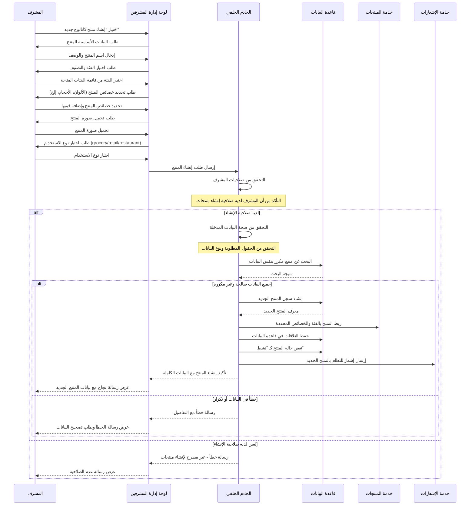
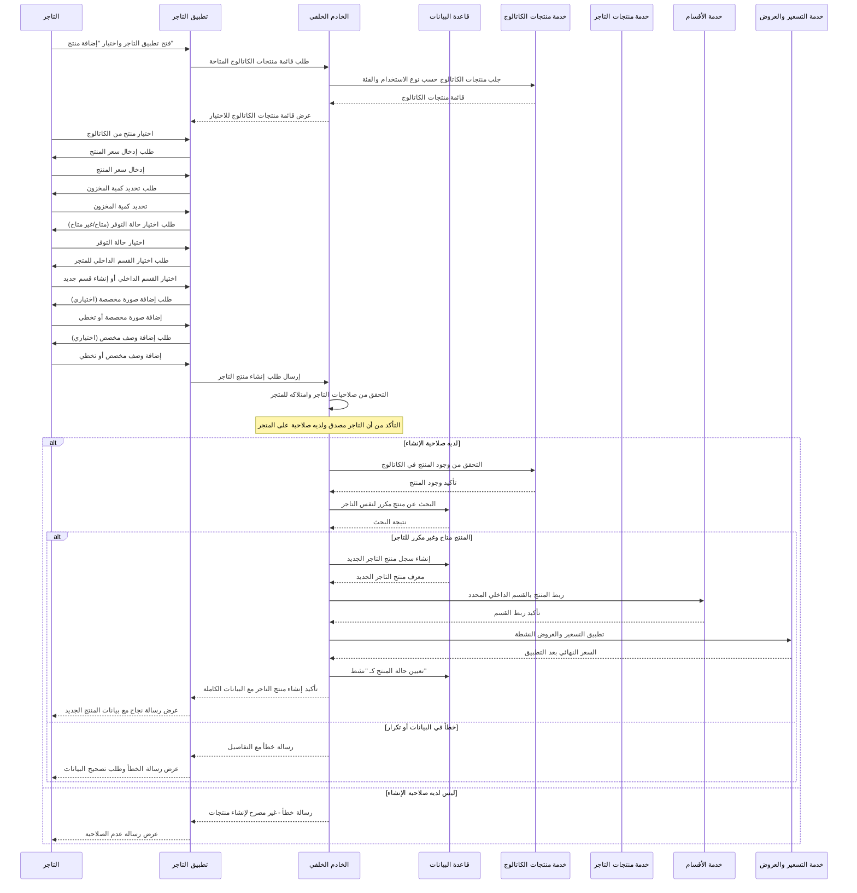
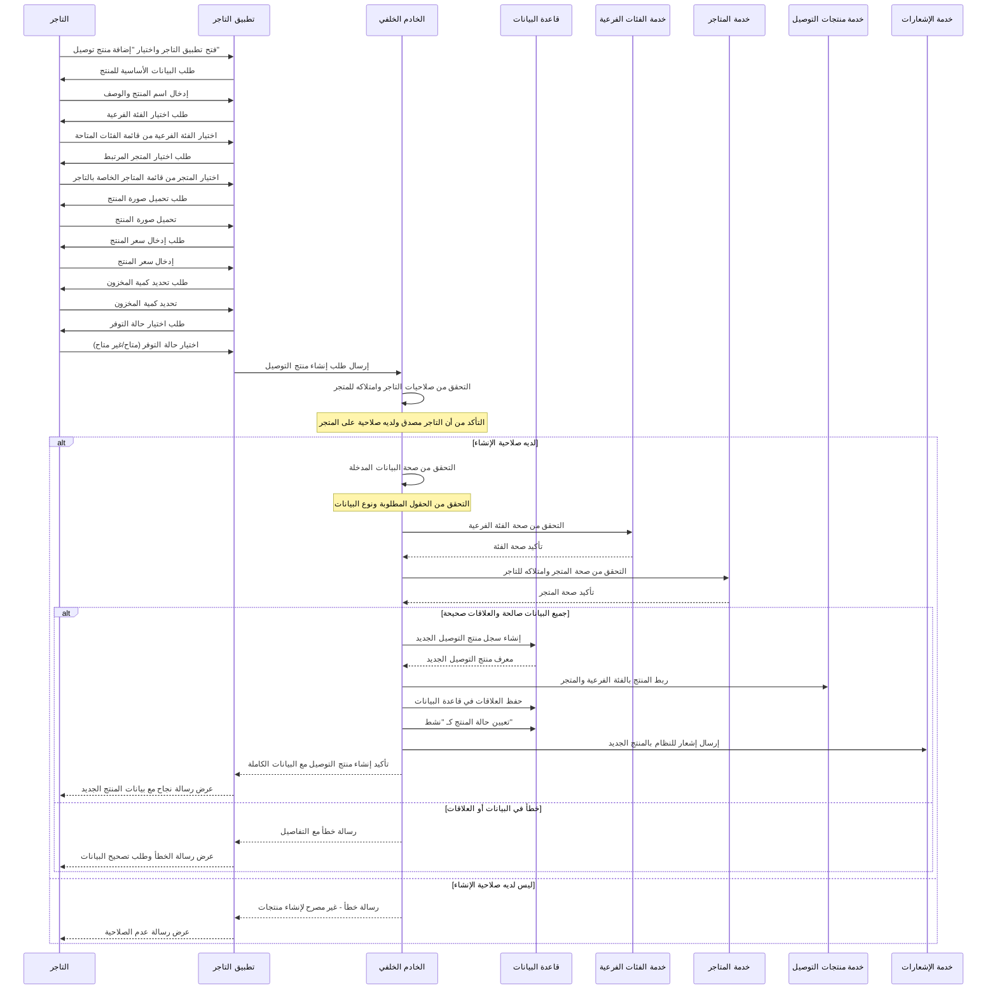
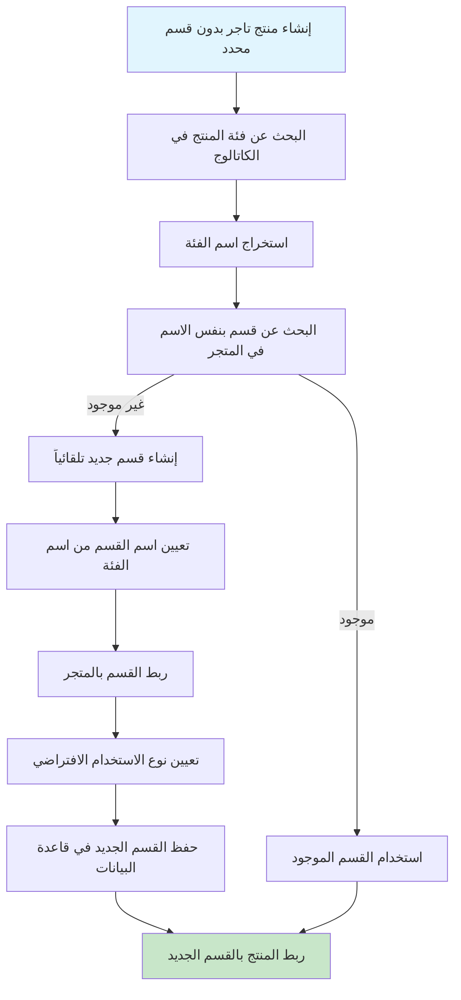
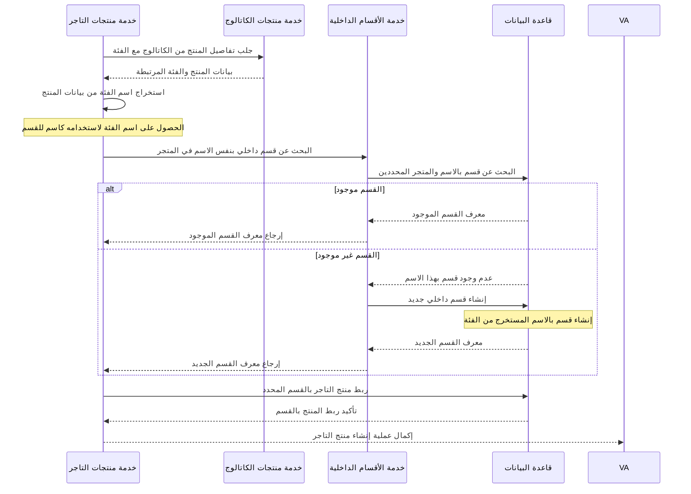

# مخططات تدفقات إنشاء المنتجات في نظام بثواني

## نظرة عامة على عمليات إنشاء المنتجات في النظام

نظام بثواني يدعم ثلاثة أنواع رئيسية من المنتجات:

1. **منتجات الكاتالوج (ProductCatalog)** - منتجات عامة في النظام تستخدم كقالب
2. **منتجات التاجر (MerchantProduct)** - منتجات محددة للتاجر في متجره مع أسعار مخصصة
3. **منتجات التوصيل (DeliveryProduct)** - منتجات للمتاجر في نظام التوصيل

كل نظام له آليات مختلفة لإنشاء وإدارة المنتجات مع التركيز على التنظيم والتسعير والتوفر.

---

## 1. تدفق إنشاء منتج كاتالوج (ProductCatalog Creation)

### Workflow Diagram - مخطط التدفق

```mermaid
graph TD
    A[بدء إنشاء منتج كاتالوج] --> B[التحقق من صلاحيات المشرف]
    B -->|ليس لديه صلاحية| C[خطأ - غير مصرح]

    B -->|لديه صلاحية| D[إدخال بيانات المنتج الأساسية]
    D --> E[إدخال اسم المنتج والوصف]

    E --> F[اختيار الفئة والتصنيف]
    F --> G[تحديد خصائص المنتج]

    G --> H[تحميل صورة المنتج]
    H --> I[اختيار نوع الاستخدام]

    I --> J[التحقق من صحة البيانات]
    J -->|صالحة| K[التحقق من عدم تكرار المنتج]

    K -->|متاح| L[إنشاء سجل المنتج في قاعدة البيانات]
    K -->|مكرر| M[خطأ - المنتج موجود]

    L --> N[ربط المنتج بالفئة والخصائص]
    N --> O[تعيين حالة المنتج كـ "نشط"]

    O --> P[إرسال إشعار للنظام بالمنتج الجديد]

    C --> Q[نهاية]
    M --> R[تغيير بيانات المنتج]
    R --> K

    style A fill:#e1f5fe
    style P fill:#c8e6c9
    style C fill:#ffcdd2
    style M fill:#ffcdd2
```

### Sequence Diagram - مخطط التسلسل



---

## 2. تدفق إنشاء منتج تاجر (MerchantProduct Creation)

### Workflow Diagram - مخطط التدفق

```mermaid
graph TD
    A[بدء إنشاء منتج تاجر] --> B[التحقق من صلاحيات التاجر]
    B -->|ليس تاجر| C[خطأ - يجب أن تكون تاجر]

    B -->|تاجر مصدق| D[اختيار منتج من الكاتالوج]
    D --> E[التحقق من وجود المنتج في الكاتالوج]

    E -->|موجود| F[إدخال سعر المنتج]
    E -->|غير موجود| G[خطأ - المنتج غير موجود]

    F --> H[تحديد كمية المخزون]
    H --> I[اختيار حالة التوفر]

    I --> J[تحديد القسم الداخلي]
    J --> K[إضافة صورة مخصصة (اختياري)]

    K --> L[إضافة وصف مخصص (اختياري)]
    L --> M[التحقق من صحة البيانات]

    M -->|صالحة| N[التحقق من عدم تكرار المنتج للتاجر]
    M -->|غير صالحة| O[خطأ في البيانات]

    N -->|متاح| P[إنشاء سجل منتج التاجر]
    N -->|مكرر| Q[خطأ - المنتج موجود للتاجر]

    P --> R[ربط المنتج بالقسم والمتجر]
    R --> S[تطبيق التسعير والعروض]

    S --> T[تعيين حالة المنتج كـ "نشط"]

    C --> U[نهاية]
    G --> V[اختيار منتج آخر]
    O --> W[تصحيح البيانات]
    Q --> X[اختيار منتج آخر أو تعديل موجود]

    V --> D
    W --> M
    X --> D

    style A fill:#e1f5fe
    style T fill:#c8e6c9
    style C fill:#ffcdd2
    style G fill:#ffcdd2
    style O fill:#ffcdd2
    style Q fill:#ffcdd2
```

### Sequence Diagram - مخطط التسلسل



---

## 3. تدفق إنشاء منتج توصيل (DeliveryProduct Creation)

### Workflow Diagram - مخطط التدفق

```mermaid
graph TD
    A[بدء إنشاء منتج توصيل] --> B[التحقق من صلاحيات التاجر]
    B -->|ليس تاجر| C[خطأ - يجب أن تكون تاجر]

    B -->|تاجر مصدق| D[إدخال بيانات المنتج الأساسية]
    D --> E[إدخال اسم المنتج والوصف]

    E --> F[تحديد الفئة الفرعية]
    F --> G[اختيار المتجر المرتبط]

    G --> H[تحميل صورة المنتج]
    H --> I[إدخال سعر المنتج]

    I --> J[تحديد كمية المخزون]
    J --> K[اختيار حالة التوفر]

    K --> L[التحقق من صحة البيانات]
    L -->|صالحة| M[التحقق من صحة الفئة والمتجر]

    M -->|صالح| N[إنشاء سجل منتج التوصيل]
    M -->|غير صالح| O[خطأ في الفئة أو المتجر]

    N --> P[ربط المنتج بالفئة والمتجر]
    P --> Q[تعيين حالة المنتج كـ "نشط"]

    Q --> R[إرسال إشعار للنظام بالمنتج الجديد]

    C --> S[نهاية]
    O --> T[تصحيح الفئة أو المتجر]
    T --> M

    style A fill:#e1f5fe
    style R fill:#c8e6c9
    style C fill:#ffcdd2
    style O fill:#ffcdd2
```

### Sequence Diagram - مخطط التسلسل



---

## 4. تدفق إنشاء قسم داخلي تلقائياً (Auto Section Creation)

### Workflow Diagram - مخطط التدفق



### Sequence Diagram - مخطط التسلسل



---

## مقارنة بين أنواع المنتجات في النظام

| نوع المنتج | الاستخدام | نظام التسعير | نظام المخزون | آلية الربط |
|-------------|-----------|----------------|----------------|-------------|
| **منتجات الكاتالوج** | قوالب عامة | سعر أساسي | لا يوجد مخزون | مرتبط بالفئات والخصائص |
| **منتجات التاجر** | منتجات محددة للتاجر | سعر مخصص + عروض | مخزون محدد | مرتبط بمنتج الكاتالوج والقسم |
| **منتجات التوصيل** | منتجات المتاجر | سعر محدد + عروض | مخزون محدد | مرتبط بالفئة الفرعية والمتجر |

---

## البيانات المطلوبة لإنشاء منتج

### البيانات الأساسية (مشتركة)
- **اسم المنتج** (مطلوب)
- **الوصف** (اختياري)
- **صورة المنتج** (مطلوب للتوصيل، اختياري للتاجر)
- **نوع الاستخدام** (مطلوب: grocery/retail/restaurant)

### البيانات الإضافية لمنتجات الكاتالوج
- **الفئة** (مطلوب)
- **الخصائص** (اختياري - الألوان، الأحجام، إلخ)
- **حالة التفعيل** (افتراضي نشط)

### البيانات الإضافية لمنتجات التاجر
- **المنتج من الكاتالوج** (مطلوب)
- **السعر** (مطلوب)
- **كمية المخزون** (اختياري)
- **حالة التوفر** (افتراضي متاح)
- **القسم الداخلي** (تلقائي أو محدد)
- **صورة مخصصة** (اختياري)
- **وصف مخصص** (اختياري)

### البيانات الإضافية لمنتجات التوصيل
- **الفئة الفرعية** (مطلوب)
- **المتجر** (مطلوب)
- **السعر** (مطلوب)
- **كمية المخزون** (اختياري)
- **حالة التوفر** (افتراضي متاح)
- **حالة التفعيل** (افتراضي نشط)

---

## آليات الحماية والتحقق

### 1. التحقق من الصلاحيات
- **التاجر**: يجب أن يكون مصدقاً ولديه صلاحية على المتجر
- **المشرف**: يجب أن يكون لديه صلاحية إنشاء منتجات في النظام

### 2. التحقق من صحة البيانات
- التحقق من وجود الحقول المطلوبة
- التحقق من صحة المعرفات (ObjectId)
- التحقق من صحة الأسعار والكميات
- التحقق من صحة الصور والروابط

### 3. التحقق من العلاقات
- **منتجات التاجر**: التحقق من وجود المنتج في الكاتالوج
- **منتجات التوصيل**: التحقق من صحة الفئة الفرعية والمتجر
- **الأقسام**: التحقق من تبعية القسم للمتجر الصحيح

### 4. منع التكرار
- **منتجات الكاتالوج**: منع تكرار المنتجات بنفس البيانات
- **منتجات التاجر**: منع تكرار نفس المنتج لنفس التاجر
- **منتجات التوصيل**: منع تكرار نفس المنتج في نفس المتجر

### 5. إدارة المعاملات
- استخدام معاملات قاعدة البيانات لضمان الاتساق
- إلغاء العملية إذا فشل أي جزء منها
- ضمان عدم ترك بيانات غير مكتملة

---

## قواعد البيانات المستخدمة

- **منتجات الكاتالوج**: جدول `productcatalogs` في MongoDB
- **منتجات التاجر**: جدول `merchantproducts` في MongoDB
- **منتجات التوصيل**: جدول `deliveryproducts` في MongoDB
- **الفئات**: جدول `categories` في MongoDB
- **الأقسام الداخلية**: جدول `storesections` في MongoDB

---

## حالات المنتج الممكنة

| الحالة | الوصف | متاح للطلب | يظهر في القوائم |
|---------|--------|-------------|------------------|
| **نشط** | منتج مفعل ومتاح للطلب | ✅ متاح | ✅ يظهر |
| **غير نشط** | منتج معطل مؤقتاً | ❌ غير متاح | ❌ لا يظهر |
| **غير متوفر** | منتج مفعل لكن نفد من المخزون | ❌ غير متاح | ✅ يظهر مع علامة "غير متوفر" |

---

## مميزات نظام المنتجات

### 1. الهيكل الهرمي
- منتجات الكاتالوج كقوالب عامة
- منتجات التاجر مرتبطة بمنتجات الكاتالوج
- منتجات التوصيل مرتبطة بالفئات الفرعية

### 2. نظام التسعير المتقدم
- تسعير أساسي في الكاتالوج
- تسعير مخصص للتاجر مع العروض والخصومات
- تطبيق العروض والحملات الترويجية

### 3. إدارة المخزون
- تتبع كميات المخزون لكل منتج
- تحديد الحد الأدنى والأقصى للطلب
- إشعارات نفاد المخزون

### 4. نظام الفئات والأقسام
- تصنيف هرمي متعدد المستويات
- إنشاء أقسام داخلية تلقائياً حسب الفئات
- ربط المنتجات بالأقسام المناسبة

### 5. البحث والتصفية
- بحث بالاسم والوصف
- تصفية حسب الفئة والقسم
- ترتيب حسب السعر أو التقييم أو الجديد

هذه المخططات تغطي جميع جوانب عمليات إنشاء المنتجات في نظام بثواني بالتفصيل الكامل.
