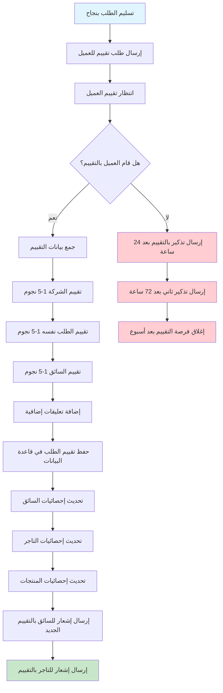
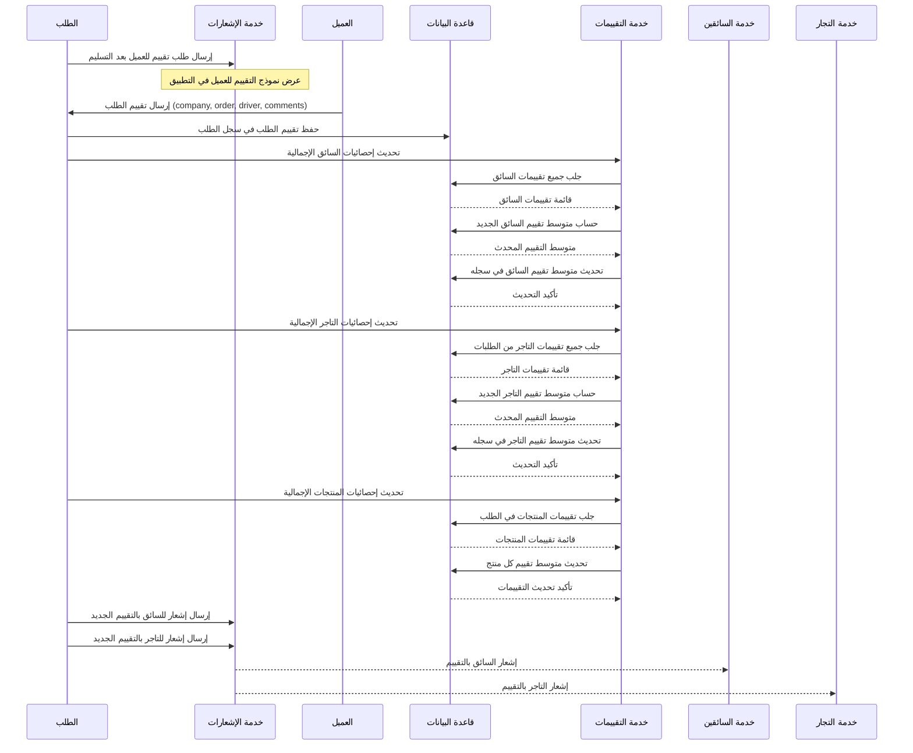
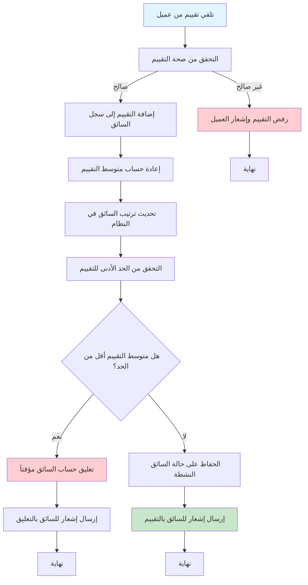
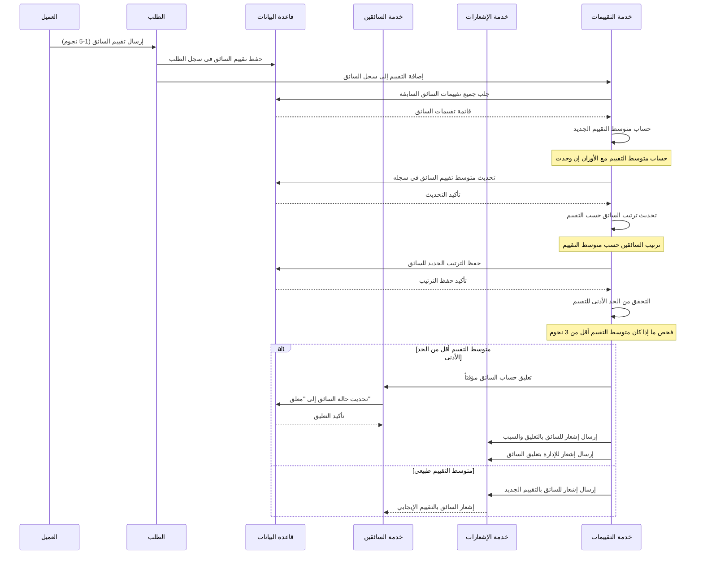
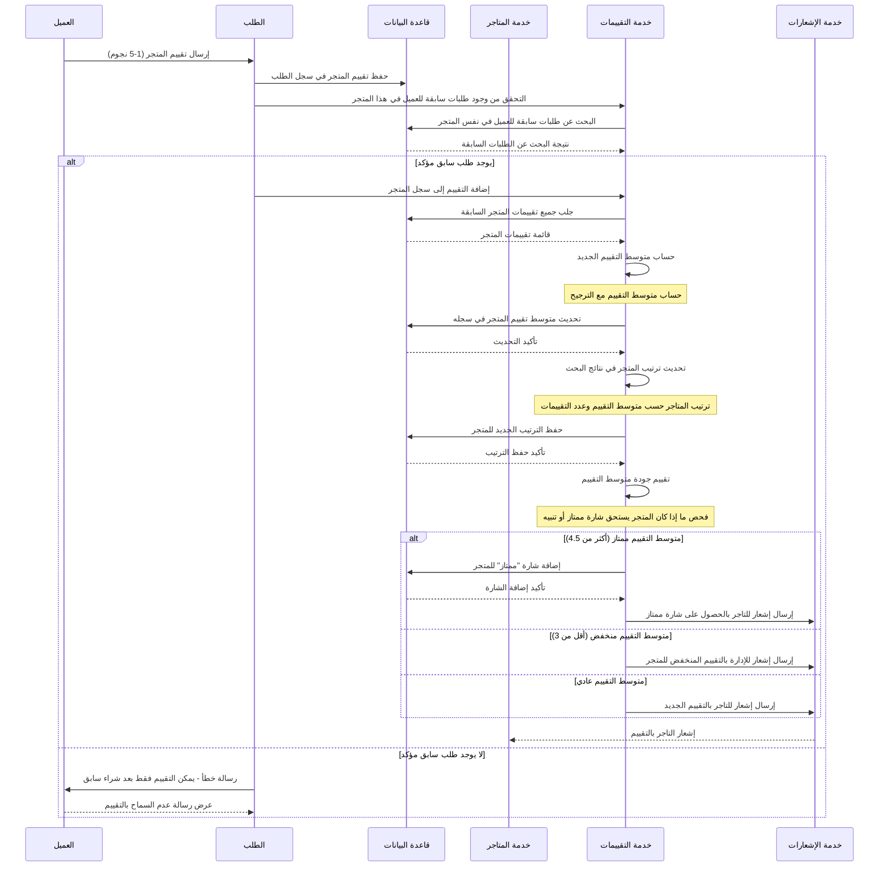
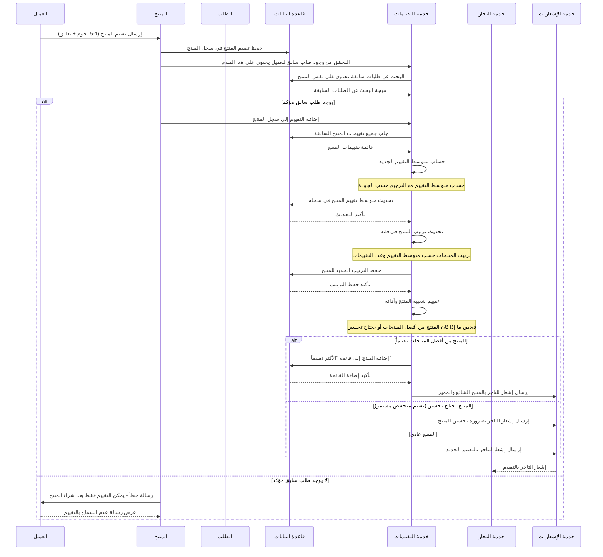
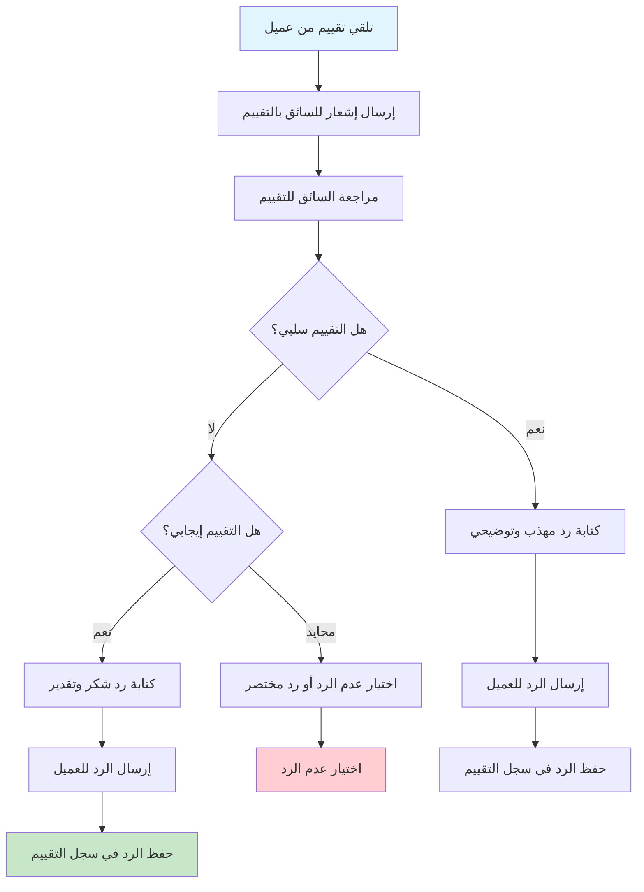
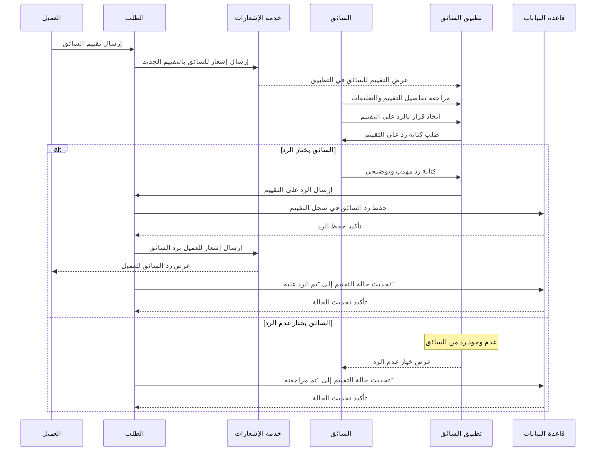

# نظام التقييمات والمراجعات في نظام بثواني

## نظرة عامة على نظام التقييمات

نظام بثواني يحتوي على نظام تقييمات شامل ومتعدد الأبعاد يغطي:

1. **تقييم الطلبات** (Order Ratings) - تقييم العميل للطلب والتاجر والسائق
2. **تقييم السائقين** (Driver Ratings) - تقييم العملاء للسائقين والعكس
3. **تقييم المتاجر** (Store Ratings) - تقييم العملاء للمتاجر والخدمة
4. **تقييم المنتجات** (Product Ratings) - تقييم العملاء للمنتجات والخدمات

كل نظام تقييم له آليات مختلفة للجمع والحساب والعرض.

---

## 1. تدفق تقييم الطلب (Order Rating Flow)

### الأدوار المشاركة:
- **العميل**: يقوم بالتقييم بعد تسليم الطلب
- **السائق**: يتلقى التقييم ويمكنه الرد عليه
- **التاجر**: يتلقى تقييم الطلب والمنتجات
- **النظام**: يحسب التقييمات ويحدث الإحصائيات

### Workflow Diagram - مخطط التدفق



### Sequence Diagram - مخطط التسلسل



---

## 2. تدفق تقييم السائق (Driver Rating Flow)

### الأدوار المشاركة:
- **العميل**: يقيم السائق بناءً على الخدمة المقدمة
- **السائق**: يتلقى التقييم ويمكنه الرد عليه
- **النظام**: يحسب متوسط التقييم ويحدث الترتيب

### Workflow Diagram - مخطط التدفق



### Sequence Diagram - مخطط التسلسل



---

## 3. تدفق تقييم المتجر (Store Rating Flow)

### الأدوار المشاركة:
- **العميل**: يقيم المتجر بناءً على الجودة والخدمة
- **التاجر**: يتلقى التقييم ويمكنه الرد عليه
- **النظام**: يحسب متوسط التقييم ويؤثر على ترتيب المتجر

### Workflow Diagram - مخطط التدفق

```mermaid
graph TD
    A[تلقي تقييم من عميل] --> B[التحقق من شراء سابق من المتجر]
    B -->|لا يوجد شراء سابق| C[رفض التقييم]

    B -->|يوجد شراء سابق| D[إضافة التقييم إلى سجل المتجر]
    D --> E[إعادة حساب متوسط التقييم]

    E --> F[تحديث ترتيب المتجر في البحث]
    F --> G[التحقق من جودة التقييم]

    G --> H{هل متوسط التقييم ممتاز؟}
    H -->|نعم| I[إضافة شارة "ممتاز" للمتجر]

    H -->|لا| J{هل متوسط التقييم منخفض؟}
    J -->|نعم| K[إضافة تنبيه للإدارة]

    J -->|لا| L[الحفاظ على الحالة العادية]

    I --> M[إرسال إشعار للتاجر بالتقييم الممتاز]
    K --> N[إرسال إشعار للإدارة بالتقييم المنخفض]
    L --> O[إرسال إشعار للتاجر بالتقييم العادي]

    C --> P[نهاية]

    style A fill:#e1f5fe
    style O fill:#c8e6c9
    style C fill:#ffcdd2
    style K fill:#ffcdd2
```

### Sequence Diagram - مخطط التسلسل



---

## 4. تدفق تقييم المنتجات (Product Rating Flow)

### الأدوار المشاركة:
- **العميل**: يقيم المنتجات التي اشتراها
- **التاجر**: يتلقى تقييم منتجاته
- **النظام**: يحسب متوسط تقييم المنتج ويؤثر على ترتيبه

### Workflow Diagram - مخطط التدفق

```mermaid
graph TD
    A[تلقي تقييم منتج من عميل] --> B[التحقق من شراء المنتج سابقاً]
    B -->|لا يوجد شراء سابق| C[رفض التقييم]

    B -->|يوجد شراء سابق| D[إضافة التقييم إلى سجل المنتج]
    D --> E[إعادة حساب متوسط التقييم]

    E --> F[تحديث ترتيب المنتج في الفئة]
    F --> G[التحقق من شعبية المنتج]

    G --> H{هل المنتج من أكثر المنتجات تقييماً؟}
    H -->|نعم| I[إضافة المنتج إلى قائمة "الأكثر تقييماً"]

    H -->|لا| J{هل المنتج يحتاج تحسين؟}
    J -->|نعم| K[إضافة تنبيه للتاجر]

    J -->|لا| L[الحفاظ على الحالة العادية]

    I --> M[إرسال إشعار للتاجر بالمنتج الشائع]
    K --> N[إرسال إشعار للتاجر بتحسين المنتج]
    L --> O[إرسال إشعار للتاجر بالتقييم]

    C --> P[نهاية]

    style A fill:#e1f5fe
    style O fill:#c8e6c9
    style C fill:#ffcdd2
    style K fill:#ffcdd2
```

### Sequence Diagram - مخطط التسلسل



---

## 5. تدفق استجابة السائق على التقييم (Driver Response Flow)

### الأدوار المشاركة:
- **السائق**: يرد على التقييمات السلبية أو يشكر على التقييمات الإيجابية
- **العميل**: يتلقى رد السائق على تقييمه
- **النظام**: يتوسط في التواصل ويحفظ السجل

### Workflow Diagram - مخطط التدفق



### Sequence Diagram - مخطط التسلسل



---

## مقارنة بين أنواع التقييمات في النظام

| نوع التقييم | المقيم | المقيم عليه | التأثير | آلية الحساب | فترة التقييم |
|-------------|--------|-------------|---------|-------------|---------------|
| **تقييم الطلب** | العميل | الطلب + السائق + التاجر | متعدد | متوسط مرجح | بعد التسليم مباشرة |
| **تقييم السائق** | العميل | السائق فقط | ترتيب السائقين | متوسط بسيط | بعد التسليم مباشرة |
| **تقييم المتجر** | العميل | المتجر فقط | ترتيب المتاجر | متوسط مرجح | بعد الشراء فقط |
| **تقييم المنتج** | العميل | المنتج فقط | ترتيب المنتجات | متوسط بسيط | بعد الشراء فقط |

---

## البيانات المطلوبة لكل نوع تقييم

### تقييم الطلب (Order Rating)
- **تقييم الشركة** (company: 1-5 نجوم)
- **تقييم الطلب** (order: 1-5 نجوم)
- **تقييم السائق** (driver: 1-5 نجوم)
- **تعليقات إضافية** (comments: نص اختياري)
- **معرف الطلب** (orderId: مطلوب للتحقق)

### تقييم المتجر (Store Rating)
- **تقييم المتجر** (rating: 1-5 نجوم)
- **تعليقات إضافية** (comments: نص اختياري)
- **معرف الطلب** (orderId: مطلوب للتحقق من الشراء السابق)

### تقييم المنتج (Product Rating)
- **تقييم المنتج** (rating: 1-5 نجوم)
- **تعليقات إضافية** (comments: نص اختياري)
- **معرف الطلب** (orderId: مطلوب للتحقق من الشراء السابق)

---

## آليات الحماية والتحقق

### 1. التحقق من الأهلية للتقييم
- **الطلبات**: يمكن التقييم فقط بعد تسليم الطلب بنجاح
- **المتاجر**: يمكن التقييم فقط بعد شراء سابق من المتجر
- **المنتجات**: يمكن التقييم فقط بعد شراء المنتج الفعلي

### 2. منع التقييمات المكررة
- **مرة واحدة فقط**: لا يمكن تقييم نفس الطلب أكثر من مرة
- **تحديد زمني**: فترة محدودة للتقييم (أسبوع بعد التسليم)
- **تتبع المستخدمين**: منع تقييم نفس الشخص لنفس العنصر عدة مرات

### 3. جودة التقييمات
- **الحد الأدنى**: رفض التقييمات بدون نجوم أو تعليقات فارغة
- **الحد الأقصى**: تحديد طول التعليقات لمنع السبام
- **الكشف عن السبام**: فلترة التعليقات المكررة أو المشبوهة

### 4. نظام الاستجابات
- **ردود السائقين**: إمكانية رد السائقين على التقييمات السلبية
- **ردود التجار**: إمكانية رد التجار على تقييمات منتجاتهم
- **حفظ السجل**: حفظ جميع الردود والتواصل في السجل

### 5. حساب متوسط التقييمات
- **الترجيح**: إعطاء وزن أكبر للتقييمات الأحدث
- **التصفية**: استبعاد التقييمات المشبوهة أو المزيفة
- **التحديث الفوري**: تحديث متوسط التقييم فوراً بعد كل تقييم جديد

---

## قواعد البيانات المستخدمة

- **تقييمات الطلبات**: مخزنة في جدول `orders` مع حقل `rating`
- **تقييمات السائقين**: محدثة في جدول `drivers` مع حقل `rating`
- **تقييمات المتاجر**: محدثة في جدول `deliverystores` مع حقل `rating`
- **تقييمات المنتجات**: محدثة في جداول `merchantproducts` و `deliveryproducts`
- **سجل التقييمات**: جدول منفصل للحفاظ على تاريخ جميع التقييمات

---

## حالات التقييم الممكنة

| الحالة | الوصف | يمكن التعديل | يظهر للآخرين |
|---------|--------|---------------|----------------|
| **جديد** | تقييم تم إرساله حديثاً | ✅ يمكن التعديل | ❌ لا يظهر بعد |
| **مؤكد** | تقييم تم التحقق منه | ❌ لا يمكن التعديل | ✅ يظهر للآخرين |
| **مرفوض** | تقييم تم رفضه بسبب مخالفات | ❌ لا يمكن التعديل | ❌ لا يظهر |
| **تم الرد عليه** | تقييم تم الرد عليه من قبل المقيم عليه | ❌ لا يمكن التعديل | ✅ يظهر مع الرد |

---

## مميزات نظام التقييمات المتقدمة

### 1. تقييم متعدد الأبعاد
- تقييم الطلب ككل مع تقييم منفصل للسائق والتاجر
- تقييم المنتجات بشكل فردي
- تقييم المتاجر بناءً على تجارب الشراء السابقة

### 2. نظام الترجيح الذكي
- إعطاء وزن أكبر للتقييمات الأحدث
- استبعاد التقييمات المشبوهة أو المزيفة
- حساب متوسط مرجح حسب جودة التقييم

### 3. نظام الاستجابات والتواصل
- إمكانية رد السائقين والتجار على التقييمات
- حفظ سجل كامل للتواصل بين الأطراف
- تحسين الخدمة بناءً على التعليقات

### 4. تأثير على الترتيب والعرض
- ترتيب السائقين حسب متوسط التقييم
- ترتيب المتاجر حسب متوسط التقييم وعدد التقييمات
- ترتيب المنتجات حسب متوسط التقييم

### 5. نظام التنبيهات والمراقبة
- تنبيهات للسائقين عند انخفاض متوسط التقييم
- تنبيهات للتجار عند تلقي تقييمات سلبية
- مراقبة جودة الخدمة وتحسينها المستمر

هذه المخططات تغطي جميع جوانب نظام التقييمات والمراجعات في نظام بثواني بالتفصيل الكامل.
