# نظام التقارير والإحصائيات في نظام بثواني

## نظرة عامة على نظام التقارير والإحصائيات

نظام بثواني يحتوي على نظام تقارير وإحصائيات شامل يغطي:

1. **تقارير المبيعات والإيرادات** - تتبع الأداء المالي
2. **تقارير السائقين** - أداء السائقين والتقييمات
3. **تقارير المتاجر** - أداء المتاجر والمبيعات
4. **تقارير العملاء** - سلوك العملاء والطلبات
5. **تقارير النظام** - أداء النظام والأخطاء
6. **تقارير الدعم الفني** - تتبع طلبات الدعم وحلها

النظام يدعم التقارير الزمنية والتصدير إلى Excel والتحليلات المتقدمة.

---

## 1. تدفق تقارير المبيعات والإيرادات (Sales & Revenue Reports)

### الأدوار المشاركة:
- **الإدارة**: مراجعة التقارير المالية والإيرادات
- **المالية**: تحليل الأرباح والخسائر
- **التاجر**: مراجعة مبيعاته الخاصة
- **النظام**: جمع البيانات وحساب المؤشرات

### Workflow Diagram - مخطط التدفق

```mermaid
graph TD
    A[طلب تقرير المبيعات] --> B[تحديد الفترة الزمنية]
    B --> C[تحديد المعايير (متجر/منطقة/فئة)]

    C --> D[جمع بيانات الطلبات من قاعدة البيانات]
    D --> E[حساب الإيرادات والعمولات]

    E --> F[تجميع البيانات حسب الفترة]
    F --> G[حساب المؤشرات الرئيسية]

    G --> H[تطبيق الفلاتر والتصنيف]
    H --> I[إعداد البيانات للعرض]

    I --> J[عرض التقرير في لوحة الإدارة]
    J --> K[إمكانية تصدير التقرير]

    K --> L{اختيار تنسيق التصدير}
    L -->|Excel| M[تصدير إلى ملف Excel]
    L -->|PDF| N[تصدير إلى ملف PDF]

    M --> O[تحميل الملف المُصدّر]
    N --> O

    style A fill:#e1f5fe
    style O fill:#c8e6c9
    style L fill:#ffcdd2
```

### Sequence Diagram - مخطط التسلسل

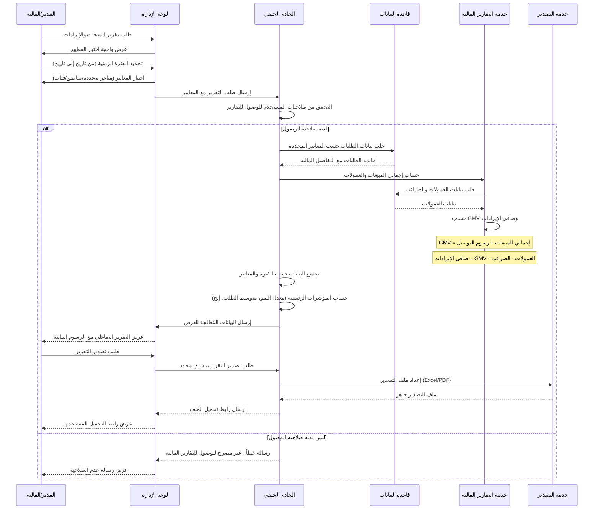

---

## 2. تدفق تقارير أداء السائقين (Driver Performance Reports)

### الأدوار المشاركة:
- **الإدارة**: مراجعة أداء السائقين واتخاذ القرارات
- **السائق**: مراجعة أدائه الخاص وتحسينه
- **النظام**: جمع البيانات وحساب المؤشرات

### Workflow Diagram - مخطط التدفق

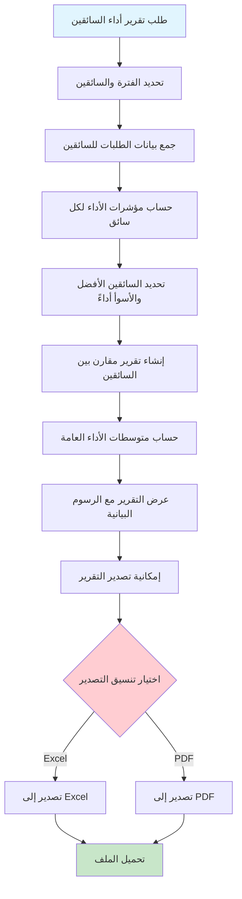

### Sequence Diagram - مخطط التسلسل

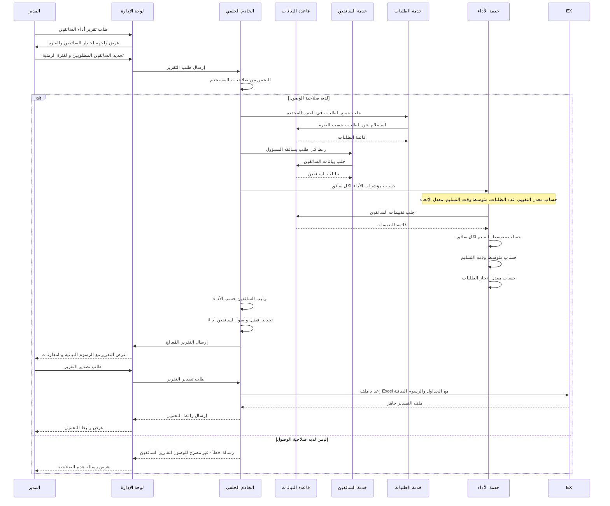

---

## 3. تدفق تقارير أداء المتاجر (Store Performance Reports)

### الأدوار المشاركة:
- **الإدارة**: مراجعة أداء المتاجر واتخاذ القرارات
- **التاجر**: مراجعة أدائه الخاص وتحسينه
- **النظام**: جمع البيانات وحساب المؤشرات

### Workflow Diagram - مخطط التدفق

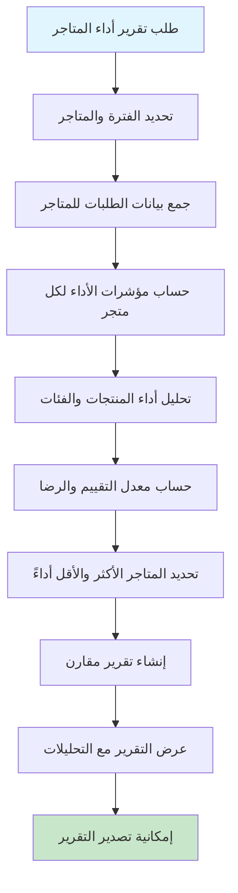

### Sequence Diagram - مخطط التسلسل

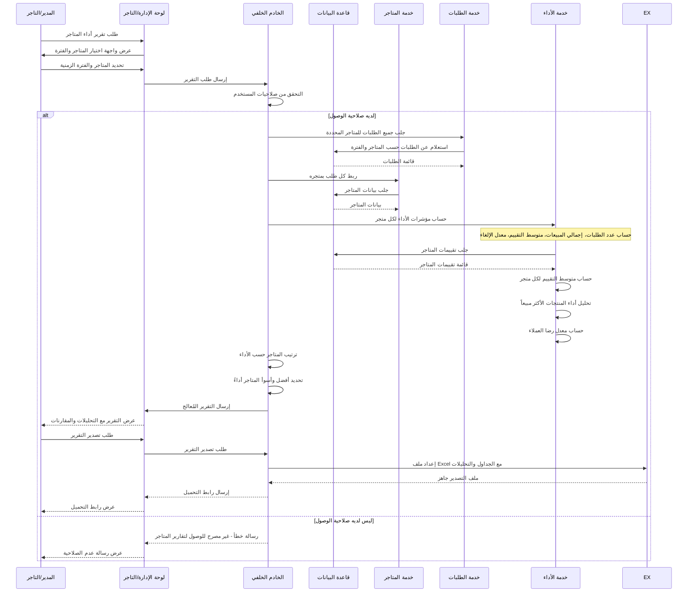

---

## 4. تدفق تقارير العملاء (Customer Analytics Reports)

### الأدوار المشاركة:
- **الإدارة**: تحليل سلوك العملاء والاتجاهات
- **التسويق**: فهم احتياجات العملاء وتحسين الحملات
- **النظام**: جمع البيانات وتحليل الأنماط

### Workflow Diagram - مخطط التدفق

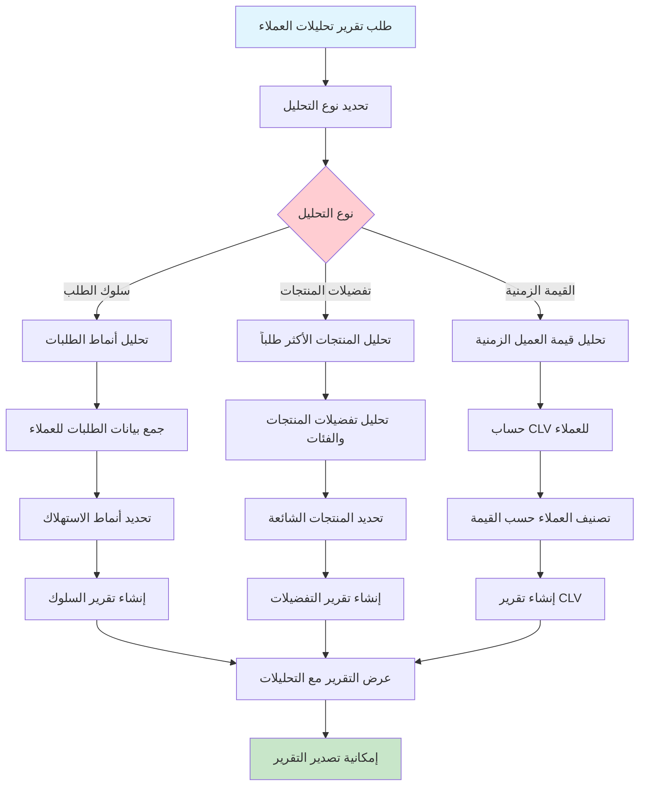

### Sequence Diagram - مخطط التسلسل

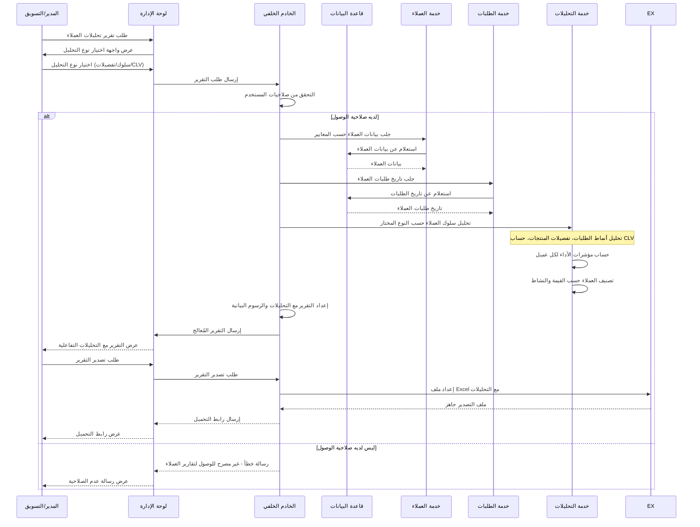

---

## 5. تدفق تقارير النظام والأداء (System Performance Reports)

### الأدوار المشاركة:
- **الإدارة**: مراقبة أداء النظام واتخاذ القرارات
- **المطورين**: تحليل الأخطاء وتحسين الأداء
- **النظام**: جمع البيانات ومراقبة الأداء

### Workflow Diagram - مخطط التدفق

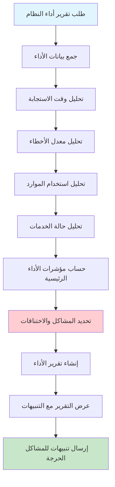

### Sequence Diagram - مخطط التسلسل

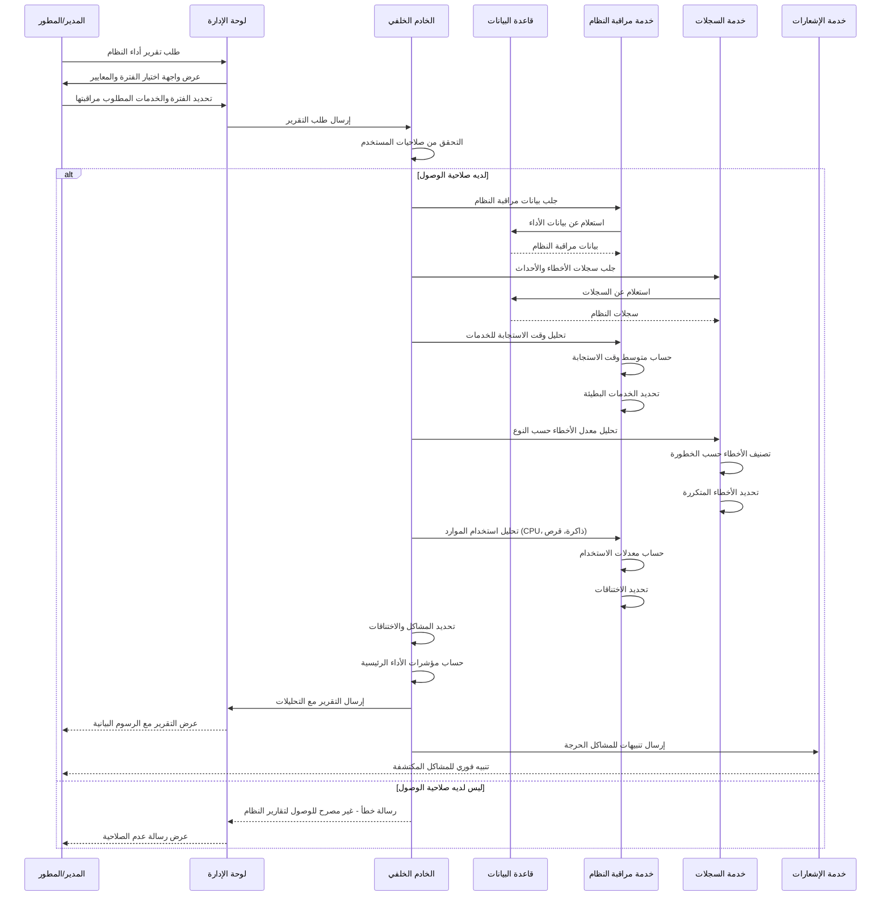

---

## 6. تدفق تقارير الدعم الفني (Support Reports Flow)

### الأدوار المشاركة:
- **الإدارة**: مراجعة أداء الدعم وحل المشاكل
- **فريق الدعم**: تحليل طلبات الدعم وتحسين الخدمة
- **النظام**: جمع البيانات وتحليل الأنماط

### Workflow Diagram - مخطط التدفق

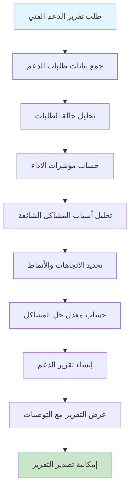

### Sequence Diagram - مخطط التسلسل

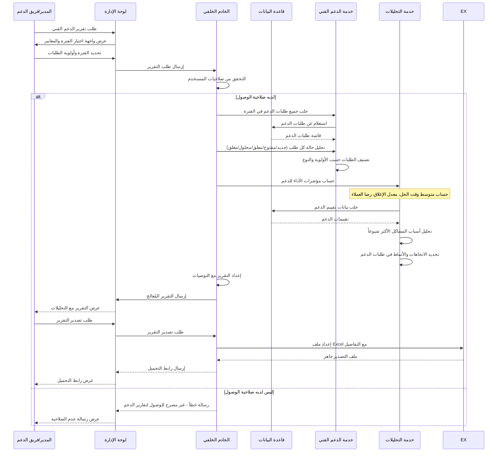

---

## مقارنة بين أنواع التقارير في النظام

| نوع التقرير | المستخدمون | البيانات الرئيسية | التحليلات | التكرار |
|-------------|------------|------------------|-----------|---------|
| **تقارير المبيعات** | الإدارة، المالية، التاجر | الإيرادات، العمولات، GMV | تحليل الاتجاهات، المقارنة | يومي/أسبوعي/شهري |
| **تقارير السائقين** | الإدارة، السائق | الأداء، التقييمات، الطلبات | ترتيب الأداء، تحسين الخدمة | أسبوعي/شهري |
| **تقارير المتاجر** | الإدارة، التاجر | المبيعات، التقييمات، الأداء | ترتيب المتاجر، تحسين الجودة | أسبوعي/شهري |
| **تقارير العملاء** | الإدارة، التسويق | السلوك، التفضيلات، CLV | فهم العملاء، تحسين الخدمة | شهري/ربع سنوي |
| **تقارير النظام** | الإدارة، المطورين | الأداء، الأخطاء، الموارد | مراقبة الصحة، تحسين الأداء | يومي/أسبوعي |
| **تقارير الدعم** | الإدارة، فريق الدعم | الطلبات، الأداء، الرضا | تحسين الخدمة، حل المشاكل | أسبوعي/شهري |

---

## البيانات المطلوبة لكل نوع تقرير

### تقرير المبيعات والإيرادات
- **الفترة الزمنية** (من تاريخ إلى تاريخ)
- **المتاجر** (معينة أو الكل)
- **المناطق** (مدن محددة)
- **فئات المنتجات** (grocery/restaurant/retail)
- **طرق الدفع** (نقدي/محفظة/بطاقة)

### تقرير أداء السائقين
- **الفترة الزمنية** (من تاريخ إلى تاريخ)
- **السائقين** (معينين أو الكل)
- **المناطق** (مدن محددة)
- **مؤشرات الأداء** (التقييم، وقت التسليم، معدل الإلغاء)

### تقرير أداء المتاجر
- **الفترة الزمنية** (من تاريخ إلى تاريخ)
- **المتاجر** (معينة أو الكل)
- **الفئات** (grocery/restaurant/retail)
- **مؤشرات الأداء** (المبيعات، التقييمات، معدل الإلغاء)

### تقرير تحليلات العملاء
- **الفترة الزمنية** (من تاريخ إلى تاريخ)
- **شرائح العملاء** (جدد/نشطين/مفقودين)
- **القيمة الزمنية** (CLV)
- **التفضيلات** (المنتجات، الفئات، المتاجر)

---

## آليات الحماية والتحقق

### 1. التحقق من الصلاحيات
- **الإدارة**: صلاحية الوصول لجميع التقارير
- **التاجر**: صلاحية الوصول لتقاريره الخاصة فقط
- **المالية**: صلاحية الوصول للتقارير المالية فقط

### 2. التحقق من صحة البيانات
- **الفترات الزمنية**: التأكد من صحة التواريخ
- **المعايير**: التأكد من صحة المعرفات والمراجع
- **الحسابات**: التأكد من دقة العمليات الحسابية

### 3. أمان البيانات
- **التشفير**: تشفير البيانات المالية الحساسة
- **الخصوصية**: عدم عرض بيانات العملاء الشخصية
- **الامتثال**: الامتثال لقوانين حماية البيانات

### 4. إدارة الأخطاء
- **النسخ الاحتياطي**: حفظ نسخة من التقارير المهمة
- **التسجيل**: تسجيل جميع عمليات الوصول والتصدير
- **المراقبة**: مراقبة استخدام النظام وكشف الشذوذ

---

## قواعد البيانات المستخدمة

- **الطلبات**: جدول `orders` في MongoDB
- **السائقين**: جدول `drivers` في MongoDB
- **المتاجر**: جدول `stores` في MongoDB
- **العملاء**: جدول `users` في MongoDB
- **التقييمات**: جداول `ratings` و `reviews` في MongoDB
- **الدعم الفني**: جدول `support_tickets` في MongoDB

---

## حالات التقرير الممكنة

| الحالة | الوصف | يمكن التصدير | يتطلب مراجعة |
|---------|--------|---------------|----------------|
| **مكتمل** | تقرير تم إعداده بنجاح | ✅ يمكن التصدير | ❌ لا يحتاج |
| **قيد المعالجة** | تقرير يتم إعداده | ❌ لا يمكن التصدير | ❌ لا يحتاج |
| **فاشل** | تقرير فشل في الإعداد | ❌ لا يمكن التصدير | ✅ يحتاج مراجعة |
| **مؤجل** | تقرير في قائمة الانتظار | ❌ لا يمكن التصدير | ❌ لا يحتاج |

---

## مميزات نظام التقارير والإحصائيات المتقدمة

### 1. التقارير التفاعلية
- رسوم بيانية تفاعلية قابلة للتخصيص
- فلاتر ديناميكية للبيانات
- إمكانية التنقل والتكبير في التقارير

### 2. التصدير المتعدد
- تصدير إلى Excel مع التنسيق المناسب
- تصدير إلى PDF للتقارير الرسمية
- تصدير البيانات الأولية للتحليل الخارجي

### 3. التحليلات الذكية
- تحليل الاتجاهات والأنماط
- تنبؤات مبنية على البيانات التاريخية
- اقتراحات لتحسين الأداء

### 4. التقارير التلقائية
- تقارير دورية تلقائية
- إشعارات للتقارير المهمة
- جدولة التقارير حسب الحاجة

### 5. نظام التنبيهات
- تنبيهات للانخفاض في الأداء
- تنبيهات للزيادة في الأخطاء
- تنبيهات للفرص التجارية

هذه المخططات تغطي جميع جوانب نظام التقارير والإحصائيات في نظام بثواني بالتفصيل الكامل.
