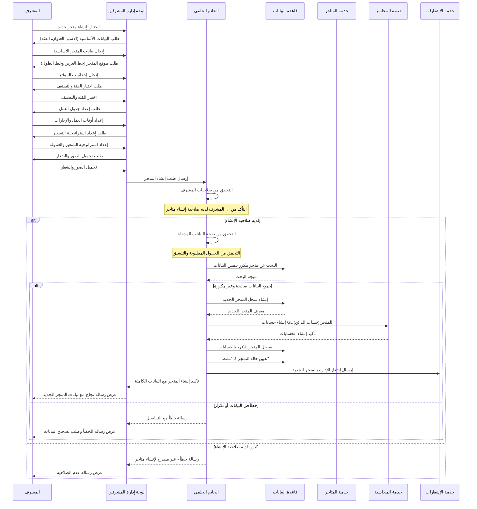
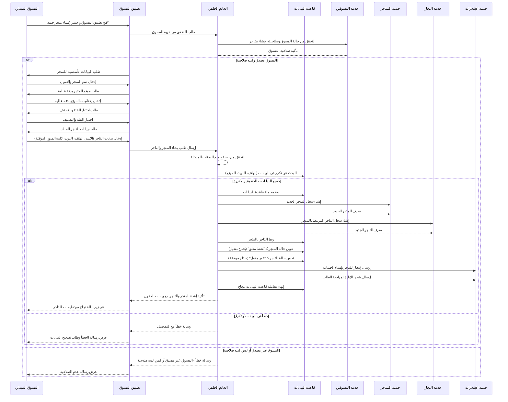
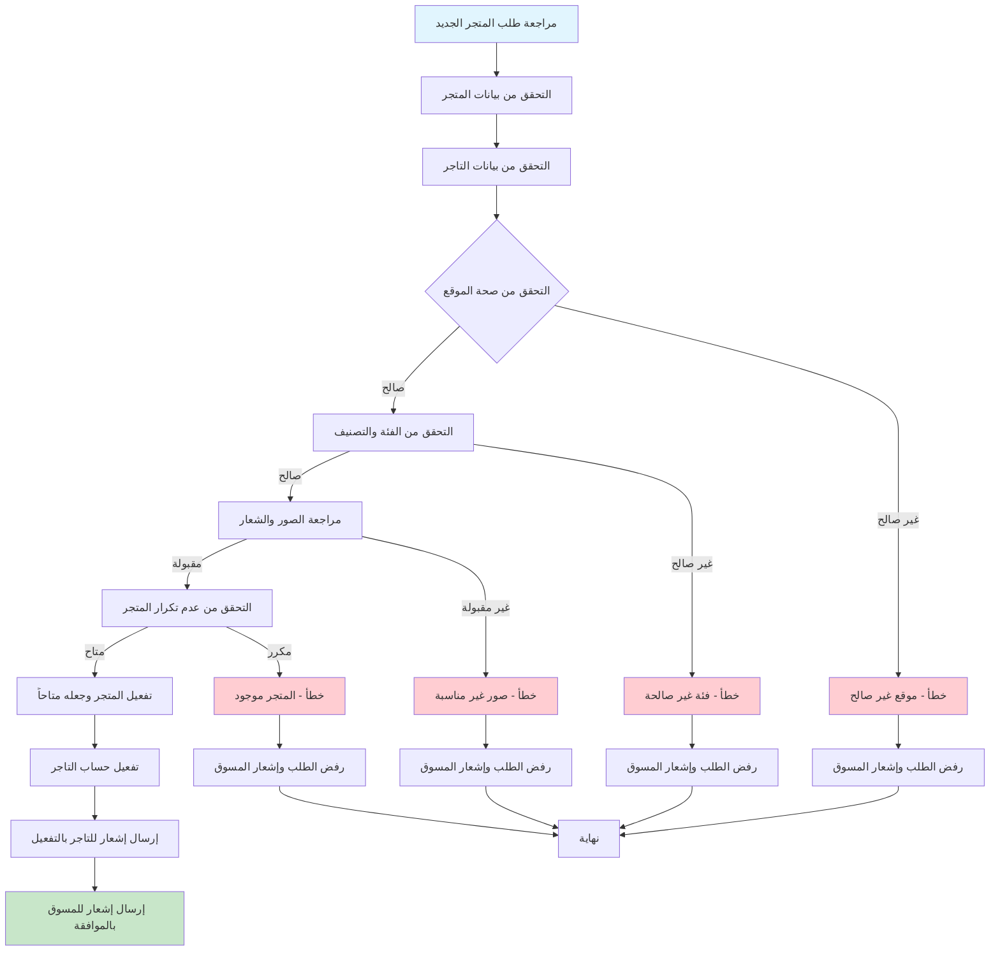
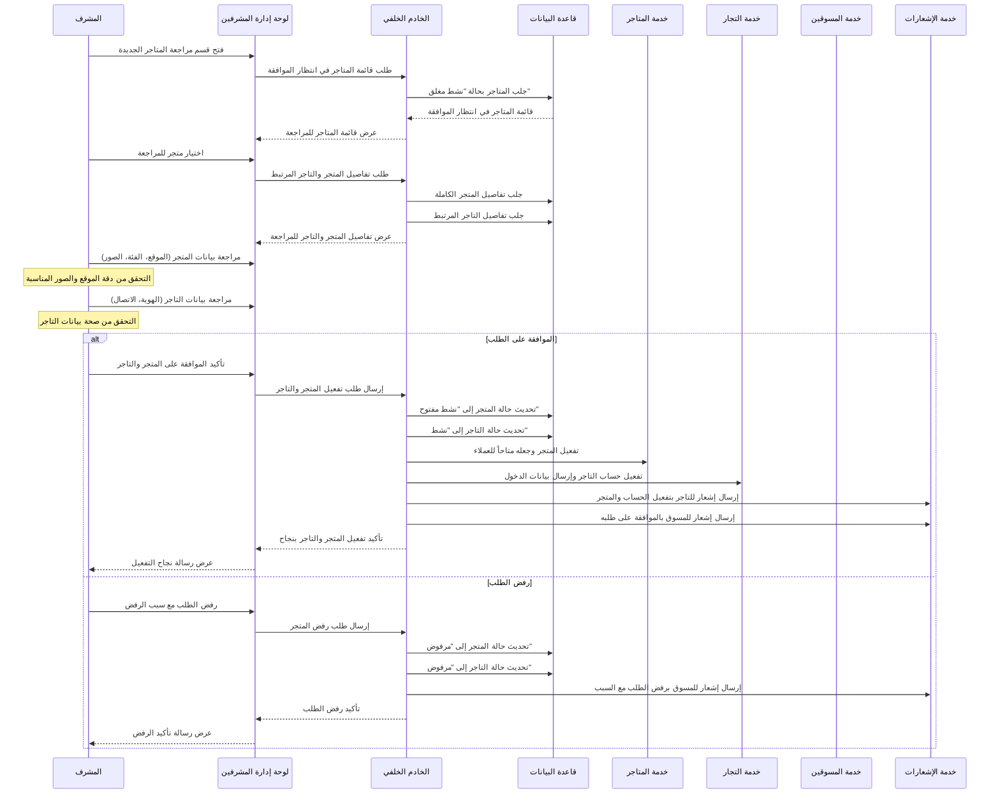

# مخططات تدفقات إنشاء المتاجر في نظام بثواني

## نظرة عامة على عمليات إنشاء المتاجر في النظام

نظام بثواني يدعم طريقتين رئيسيتين لإنشاء المتاجر:

1. **إنشاء متجر بواسطة الأدمن** - إنشاء متجر من لوحة إدارة المشرفين
2. **إنشاء متجر بواسطة المسوق الميداني** - إنشاء متجر سريع من خلال تطبيق المسوق

كل طريقة لها متطلبات وتدفقات مختلفة، وتتطلب موافقات إدارية في بعض الحالات.

---

## 1. تدفق إنشاء متجر بواسطة الأدمن (Admin Store Creation)

### Workflow Diagram - مخطط التدفق

```mermaid
graph TD
    A[بدء إنشاء متجر من لوحة الإدارة] --> B[التحقق من صلاحيات المشرف]
    B -->|ليس لديه صلاحية| C[خطأ - غير مصرح]
    B -->|لديه صلاحية| D[إدخال بيانات المتجر الأساسية]

    D --> E[إدخال موقع المتجر]
    E --> F[اختيار الفئة والتصنيف]
    F --> G[إعداد جدول العمل]

    G --> H[إعداد استراتيجية التسعير]
    H --> I[تحميل الصور والشعار]
    I --> J[التحقق من صحة جميع البيانات]

    J -->|صالحة| K[التحقق من عدم تكرار المتجر]
    J -->|غير صالحة| L[خطأ في البيانات]

    K -->|متاح| M[إنشاء سجل المتجر في قاعدة البيانات]
    K -->|مكرر| N[خطأ - المتجر موجود]

    M --> O[ربط المتجر بحسابات GL المالية]
    O --> P{التحقق من نجاح الربط}

    P -->|ناجح| Q[تعيين حالة المتجر كـ "نشط"]
    P -->|فاشل| R[خطأ في إنشاء الحسابات المالية]

    Q --> S[إرسال إشعار للإدارة بالمتجر الجديد]

    L --> T[تصحيح البيانات]
    N --> U[تغيير بيانات المتجر]
    R --> V[إعادة محاولة إنشاء الحسابات]

    T --> J
    U --> K
    V --> O

    style A fill:#e1f5fe
    style S fill:#c8e6c9
    style C fill:#ffcdd2
    style L fill:#ffcdd2
    style N fill:#ffcdd2
    style R fill:#ffcdd2
```

### Sequence Diagram - مخطط التسلسل



---

## 2. تدفق إنشاء متجر بواسطة المسوق الميداني (Marketer Store Creation)

### Workflow Diagram - مخطط التدفق

```mermaid
graph TD
    A[بدء إنشاء متجر من تطبيق المسوق] --> B[التحقق من هوية المسوق]
    B -->|غير مصدق| C[خطأ - المسوق غير مصدق]

    B -->|مصدق| D[إدخال بيانات المتجر الأساسية]
    D --> E[إدخال موقع المتجر بدقة عالية]

    E --> F[اختيار الفئة والتصنيف]
    F --> G[إدخال بيانات التاجر المالك]

    G --> H[إعداد كلمة مرور مؤقتة للتاجر]
    H --> I[التحقق من صحة جميع البيانات]

    I -->|صالحة| J[التحقق من عدم تكرار البيانات]
    I -->|غير صالحة| K[خطأ في البيانات]

    J -->|متاحة| L[بدء معاملة قاعدة البيانات]
    J -->|مستخدمة| M[خطأ - البيانات مستخدمة]

    L --> N[إنشاء سجل المتجر]
    N --> O[إنشاء سجل التاجر المرتبط]

    O --> P{التحقق من نجاح الإنشاء}
    P -->|ناجح| Q[تعيين حالة المتجر كـ "نشط مغلق"]
    P -->|فاشل| R[خطأ في إنشاء السجلات]

    Q --> S[تعيين حالة التاجر كـ "غير مفعل"]
    S --> T[إرسال إشعار للتاجر بالتفعيل]

    T --> U[إنهاء معاملة قاعدة البيانات]

    K --> V[تصحيح البيانات]
    M --> W[تغيير البيانات]
    R --> X[إعادة المحاولة]

    V --> I
    W --> J
    X --> L

    style A fill:#e1f5fe
    style U fill:#c8e6c9
    style C fill:#ffcdd2
    style K fill:#ffcdd2
    style M fill:#ffcdd2
    style R fill:#ffcdd2
```

### Sequence Diagram - مخطط التسلسل



---

## 3. تدفق تفعيل متجر تم إنشاؤه بواسطة المسوق (Store Activation Workflow)

### Workflow Diagram - مخطط التدفق



### Sequence Diagram - مخطط التسلسل



---

## مقارنة بين طرق إنشاء المتاجر

| الطريقة | المسؤول عن الإنشاء | الحالة الافتراضية | متطلبات خاصة | آلية الموافقة |
|---------|-------------------|-------------------|---------------|----------------|
| **الأدمن** | مشرف النظام | نشط فوري | صلاحيات إدارية، بيانات كاملة | موافقة تلقائية |
| **المسوق الميداني** | مسوق ميداني مصدق | نشط مغلق (يحتاج تفعيل) | مصادقة المسوق، موقع دقيق، تاجر مرتبط | مراجعة إدارية مطلوبة |

---

## البيانات المطلوبة لإنشاء متجر

### البيانات الأساسية (مشتركة)
- **اسم المتجر** (مطلوب، فريد)
- **العنوان الكامل** (مطلوب)
- **إحداثيات الموقع** (خط العرض وخط الطول - مطلوب)
- **الفئة والتصنيف** (مطلوب)
- **معدل العمولة** (اختياري، افتراضي 0%)

### البيانات التشغيلية
- **جدول العمل** (أوقات العمل والإجازات)
- **استراتيجية التسعير** (طريقة حساب الأسعار)
- **الصور والشعار** (مطلوب للأدمن، اختياري للمسوق)
- **العلامات (Tags)** (اختياري)

### البيانات الإضافية للمسوقين
- **مفتاح عدم التكرار** (Idempotency Key) لمنع التكرار
- **بيانات التاجر المرتبط** (الاسم، الهاتف، البريد، كلمة المرور المؤقتة)
- **هوية المسوق المُنشئ**

---

## آليات الحماية والتحقق

### 1. التحقق من التكرار
- منع إنشاء متاجر بنفس الاسم أو في نفس الموقع
- فحص قاعدة البيانات قبل الإنشاء
- استخدام معاملات قاعدة البيانات لضمان التسلسل

### 2. التحقق من صحة البيانات
- التحقق من تنسيق إحداثيات الموقع
- التحقق من صحة الفئة والتصنيف
- التحقق من قوة كلمات المرور للتجار

### 3. نظام الصلاحيات
- التحقق من صلاحيات المُنشئ
- تسجيل عمليات الإنشاء في سجل التدقيق
- ربط كل متجر بالمُنشئ الخاص به

### 4. إدارة المعاملات
- استخدام معاملات قاعدة البيانات لضمان الاتساق
- إلغاء العملية إذا فشل أي جزء منها
- ضمان عدم ترك بيانات غير مكتملة

### 5. إشعارات النظام
- إرسال إشعارات للأطراف المعنية
- إشعار التاجر بإنشاء الحساب
- إشعار الإدارة بطلبات الموافقة

---

## قواعد البيانات المستخدمة

- **المتاجر**: جدول `deliverystores` في MongoDB
- **التجار**: جدول `vendors` في MongoDB
- **المسوقين**: جدول `marketers` في MongoDB
- **الفئات**: جدول `deliverycategories` في MongoDB
- **الحسابات المالية**: جداول الحسابات في نظام المحاسبة

---

## حالات المتجر الممكنة

| الحالة | الوصف | متاح للعملاء | يحتاج موافقة |
|---------|--------|----------------|----------------|
| **نشط مفتوح** | متجر مفعل ويعمل بشكل طبيعي | ✅ متاح | ❌ لا يحتاج |
| **نشط مغلق** | متجر مفعل لكن مغلق مؤقتاً | ❌ غير متاح | ❌ لا يحتاج |
| **غير نشط** | متجر معطل من قبل الإدارة | ❌ غير متاح | ❌ لا يحتاج |
| **في انتظار الموافقة** | متجر جديد في انتظار مراجعة الإدارة | ❌ غير متاح | ✅ يحتاج موافقة |

هذه المخططات تغطي جميع جوانب عمليات إنشاء المتاجر في نظام بثواني بالتفصيل الكامل.
