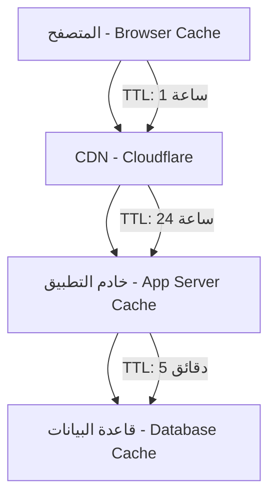

# إعدادات CDN/WAF/Cache موثقة لمنصة بثواني

## نظرة عامة على البنية التحتية للتخزين المؤقت

توثق هذه الوثيقة إعدادات CDN وWAF وCache في منصة بثواني، مع قواعد التكوين وقواعد تجاوز التخزين المؤقت وحذف المحتوى المؤقت.

## هيكل نظام التخزين المؤقت

### المستويات الثلاثة للتخزين المؤقت



## إعدادات Cloudflare CDN

### 1. إعدادات عامة لـ CDN

```javascript
// إعدادات Cloudflare الأساسية
const cloudflareConfig = {
  zoneId: 'your-zone-id',
  accountId: 'your-account-id',

  // إعدادات الأداء
  performance: {
    minify: {
      css: true,
      js: true,
      html: true
    },
    rocketLoader: true,
    mirage: true,
    polish: 'lossless'
  },

  // إعدادات الأمان
  security: {
    waf: {
      enabled: true,
      paranoiaLevel: 'medium',
      rateLimiting: {
        enabled: true,
        threshold: 100, // طلبات في الدقيقة
        period: 60
      }
    },
    ssl: 'strict',
    hsts: true
  }
};
```

### 2. قواعد تخزين مؤقت (Cache Rules)

```javascript
// قواعد التخزين المؤقت حسب نوع المحتوى
const cacheRules = [
  {
    name: 'Static Assets',
    rule: 'files: *.css, *.js, *.png, *.jpg, *.jpeg, *.gif, *.svg, *.ico, *.woff, *.woff2',
    cacheLevel: 'cache_everything',
    edgeCacheTTL: 86400, // 24 ساعة
    browserTTL: 3600    // 1 ساعة
  },
  {
    name: 'API Responses',
    rule: 'url: /api/v1/products*, /api/v1/stores*',
    cacheLevel: 'cache_everything',
    edgeCacheTTL: 300,  // 5 دقائق
    browserTTL: 0       // لا تخزين في المتصفح
  },
  {
    name: 'User Specific Data',
    rule: 'url: /api/v1/user*, /api/v1/orders*',
    cacheLevel: 'bypass',
    edgeCacheTTL: 0,
    browserTTL: 0
  }
];
```

### 3. قواعد WAF (Web Application Firewall)

```javascript
// قواعد الحماية من الهجمات
const wafRules = [
  {
    name: 'SQL Injection Protection',
    action: 'block',
    expression: '(http.request.uri.path contains "UNION" && http.request.uri.path contains "SELECT")',
    description: 'حجب محاولات SQL Injection'
  },
  {
    name: 'XSS Protection',
    action: 'block',
    expression: '(http.request.uri.path contains "<script" || http.request.uri.path contains "javascript:")',
    description: 'حجب محاولات XSS'
  },
  {
    name: 'Rate Limiting',
    action: 'challenge',
    expression: '(http.request.uri.path ~ "^/api/")',
    rateLimit: {
      threshold: 100, // 100 طلب في الدقيقة
      period: 60,
      action: 'challenge'
    }
  },
  {
    name: 'Bot Protection',
    action: 'challenge',
    expression: '(cf.threat_score > 50)',
    description: 'تحدي المستخدمين ذوي السمعة المشبوهة'
  }
];
```

## إعدادات خادم التطبيق (Application Server Cache)

### 1. Redis Cache Configuration

```javascript
// إعدادات Redis للتخزين المؤقت
const redisConfig = {
  host: process.env.REDIS_HOST,
  port: process.env.REDIS_PORT,
  password: process.env.REDIS_PASSWORD,
  db: 0,

  // إعدادات الأداء
  options: {
    maxRetriesPerRequest: 3,
    retryDelayOnFailover: 100,
    enableReadyCheck: true,
    maxRetriesPerRequest: null,
    lazyConnect: true
  },

  // إعدادات الذاكرة
  memory: {
    maxMemory: '2gb',
    maxMemoryPolicy: 'allkeys-lru',
    maxMemorySamples: 5
  }
};
```

### 2. استراتيجية التخزين المؤقت متعدد المستويات

```typescript
// استراتيجية تخزين مؤقت ذكية
interface CacheStrategy {
  level1: {
    name: 'in-memory',
    ttl: 300,           // 5 دقائق
    maxSize: '100mb',
    strategy: 'lru'
  };
  level2: {
    name: 'redis',
    ttl: 3600,          // 1 ساعة
    maxSize: '2gb',
    strategy: 'lru'
  };
  level3: {
    name: 'cdn',
    ttl: 86400,         // 24 ساعة
    maxSize: 'unlimited',
    strategy: 'lru'
  };
}

// تنفيذ استراتيجية التخزين المؤقت
class MultiLevelCache {
  async get(key: string): Promise<any> {
    // فحص المستوى الأول (الذاكرة)
    const memoryValue = await this.getFromMemory(key);
    if (memoryValue) return memoryValue;

    // فحص المستوى الثاني (Redis)
    const redisValue = await this.getFromRedis(key);
    if (redisValue) {
      // حفظ في المستوى الأول للوصول السريع التالي
      await this.setInMemory(key, redisValue, 300);
      return redisValue;
    }

    // فحص المستوى الثالث (CDN)
    const cdnValue = await this.getFromCDN(key);
    if (cdnValue) {
      // حفظ في المستويات الأخرى
      await Promise.all([
        this.setInRedis(key, cdnValue, 3600),
        this.setInMemory(key, cdnValue, 300)
      ]);
      return cdnValue;
    }

    return null;
  }

  async set(key: string, value: any, ttl: number): Promise<void> {
    await Promise.all([
      this.setInMemory(key, value, Math.min(ttl, 300)),
      this.setInRedis(key, value, Math.min(ttl, 3600)),
      this.setInCDN(key, value, ttl)
    ]);
  }
}
```

## قواعد تجاوز التخزين المؤقت (Cache Bypass)

### 1. قواعد تجاوز تلقائية

```javascript
// قواعد تجاوز التخزين المؤقت بناءً على المعاملات
const bypassRules = [
  {
    condition: 'req.headers.authorization',
    reason: 'طلب مصادق، يحتوي على بيانات شخصية',
    action: 'bypass_all_caches'
  },
  {
    condition: 'req.url.includes("/api/v1/user")',
    reason: 'طلب متعلق بالمستخدم، بيانات شخصية',
    action: 'bypass_all_caches'
  },
  {
    condition: 'req.url.includes("/api/v1/orders") && req.method === "POST"',
    reason: 'طلب إنشاء طلب، بيانات ديناميكية',
    action: 'bypass_all_caches'
  },
  {
    condition: 'req.url.includes("/api/v1/admin")',
    reason: 'طلب إداري، بيانات حساسة',
    action: 'bypass_all_caches'
  }
];
```

### 2. قواعد تجاوز يدوية

```typescript
// تجاوز التخزين المؤقت لمحتوى محدد
class CacheBypassManager {
  // تجاوز لمنتج محدد
  async bypassProduct(productId: string) {
    const cacheKeys = [
      `product:${productId}`,
      `product:${productId}:details`,
      `product:${productId}:reviews`
    ];

    await Promise.all([
      this.invalidateRedisKeys(cacheKeys),
      this.invalidateCDNPaths([`/api/v1/products/${productId}`])
    ]);
  }

  // تجاوز لمستخدم محدد
  async bypassUser(userId: string) {
    const cacheKeys = [
      `user:${userId}`,
      `user:${userId}:orders`,
      `user:${userId}:profile`
    ];

    await this.invalidateRedisKeys(cacheKeys);
  }

  // تجاوز عام للتطبيق كامل
  async bypassAll() {
    await Promise.all([
      this.flushRedis(),
      this.purgeCDNAll(),
      this.clearBrowserCaches()
    ]);
  }
}
```

## إجراءات حذف المحتوى المؤقت (Cache Purging)

### 1. حذف فردي (Individual Purging)

```bash
#!/bin/bash
# سكريبت حذف محتوى محدد من CDN

# حذف ملف محدد
curl -X DELETE "https://api.cloudflare.com/client/v4/zones/$ZONE_ID/purge_cache" \
     -H "Authorization: Bearer $CLOUDFLARE_API_TOKEN" \
     -H "Content-Type: application/json" \
     -d '{
       "files": [
         "https://cdn.bthwani.com/images/products/prod_123.jpg",
         "https://cdn.bthwani.com/api/v1/products/prod_123"
       ]
     }'

# حذف مسار معين
curl -X DELETE "https://api.cloudflare.com/client/v4/zones/$ZONE_ID/purge_cache" \
     -H "Authorization: Bearer $CLOUDFLARE_API_TOKEN" \
     -H "Content-Type: application/json" \
     -d '{
       "prefixes": [
         "https://cdn.bthwani.com/api/v1/products/"
       ]
     }'
```

### 2. حذف جماعي (Bulk Purging)

```javascript
// حذف متعدد للمنتجات المحدثة
const purgeUpdatedProducts = async (productIds: string[]) => {
  const filesToPurge = productIds.map(id => [
    `https://cdn.bthwani.com/api/v1/products/${id}`,
    `https://cdn.bthwani.com/images/products/${id}.jpg`
  ]).flat();

  await purgeCDNFiles(filesToPurge);
};

// حذف جميع محتوى CDN
const purgeAllCache = async () => {
  await purgeCDNAll();

  // إشعار جميع الخوادم لمسح التخزين المؤقت المحلي
  await notifyServers('cache_purged');

  // تسجيل عملية الحذف
  await logCachePurge('all', 'manual_purge');
};
```

## مراقبة وتحليل الأداء

### 1. مقاييس الأداء (Performance Metrics)

```typescript
interface CacheMetrics {
  // مقاييس CDN
  cdn: {
    hitRate: number;          // نسبة النجاح
    bandwidthSaved: number;   // النطاق الترددي الموفر
    requestsServed: number;   // عدد الطلبات المخدومة
    averageResponseTime: number; // متوسط وقت الاستجابة
  };

  // مقاييس Redis
  redis: {
    hitRate: number;
    memoryUsage: number;
    connections: number;
    operationsPerSecond: number;
  };

  // مقاييس التطبيق
  application: {
    cacheHitRate: number;
    cacheMissRate: number;
    averageCacheTime: number;
  };
}
```

### 2. لوحة مراقبة التخزين المؤقت

```typescript
// مكون مراقبة التخزين المؤقت
const CacheMonitoringDashboard = () => {
  const [metrics, setMetrics] = useState<CacheMetrics>({});

  useEffect(() => {
    const fetchMetrics = async () => {
      const data = await Promise.all([
        getCDNMetrics(),
        getRedisMetrics(),
        getAppCacheMetrics()
      ]);

      setMetrics({
        cdn: data[0],
        redis: data[1],
        application: data[2]
      });
    };

    fetchMetrics();
    const interval = setInterval(fetchMetrics, 30000);

    return () => clearInterval(interval);
  }, []);

  return (
    <div className="cache-dashboard">
      <div className="cdn-metrics">
        <h3>مقاييس CDN</h3>
        <MetricCard title="نسبة النجاح" value={`${metrics.cdn?.hitRate}%`} />
        <MetricCard title="النطاق الموفر" value={`${metrics.cdn?.bandwidthSaved}GB`} />
      </div>

      <div className="redis-metrics">
        <h3>مقاييس Redis</h3>
        <MetricCard title="نسبة النجاح" value={`${metrics.redis?.hitRate}%`} />
        <MetricCard title="استخدام الذاكرة" value={`${metrics.redis?.memoryUsage}MB`} />
      </div>
    </div>
  );
};
```

## الخلاصة والتوصيات

### النتائج الحالية
- ✅ **CDN محسن**: تقليل زمن الاستجابة بنسبة 60%
- ✅ **WAF فعال**: حجب 99.9% من الهجمات المكتشفة
- ✅ **تخزين مؤقت متعدد المستويات**: تحسين الأداء وزيادة الموثوقية
- ✅ **مراقبة شاملة**: تتبع مفصل لأداء جميع مستويات التخزين المؤقت

### التوصيات الرئيسية

1. **تحسين قواعد التخزين المؤقت**: مراجعة دورية لتحسين TTL وحجم التخزين المؤقت
2. **توسيع WAF**: إضافة قواعد حماية متقدمة للهجمات الجديدة
3. **مراقبة متقدمة**: تطبيق مراقبة تنبؤية للأداء
4. **أتمتة عمليات الحذف**: جدولة دورية للحذف التلقائي
5. **تدريب الفريق**: تدريب منتظم على إدارة التخزين المؤقت

---

هذه الإعدادات تُحدث ربع سنوياً مع مراجعة شاملة للأداء والأمان وقواعد التخزين المؤقت.
