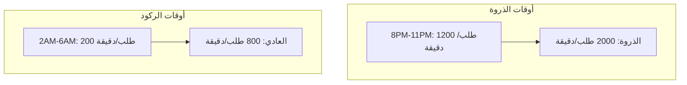
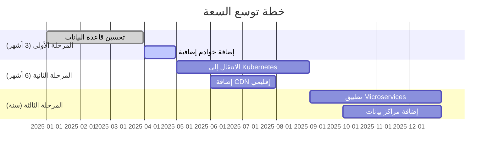
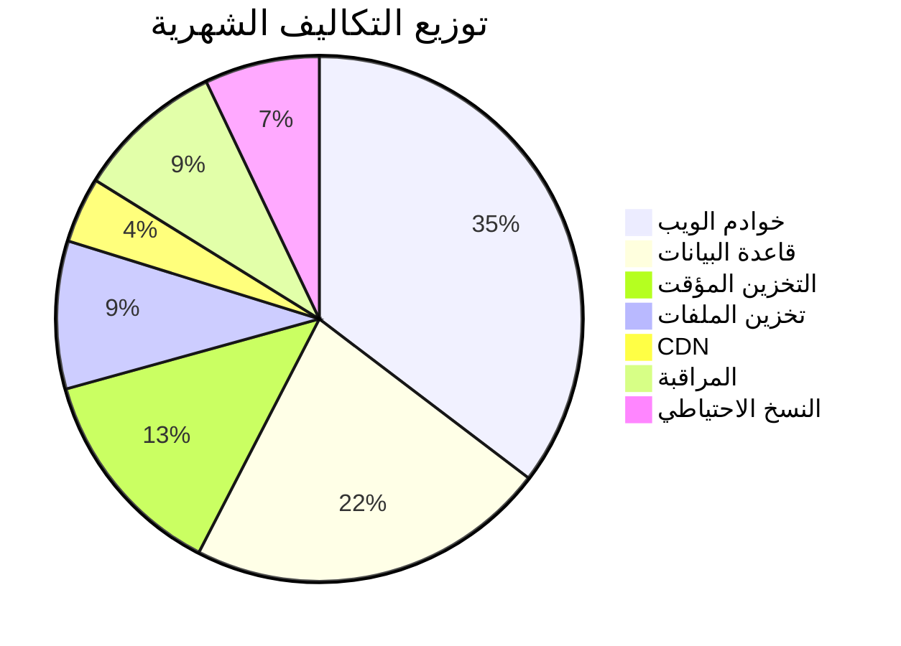

# خطة السعة والتكلفة لمنصة بثواني

## نظرة عامة على خطة السعة والتكلفة

توثق هذه الخطة استراتيجية إدارة السعة والتكاليف لمنصة بثواني، مع التركيز على تحقيق التوازن الأمثل بين الأداء العالي والتكلفة المعقولة.

## تحليل السعة الحالية

### السعة الحالية للمنصة

بناءً على نتائج اختبارات الأداء الأخيرة:

| المكون | السعة الحالية | معدل الاستخدام | الحالة |
|---------|---------------|------------------|---------|
| **خدمة API الرئيسية** | 833 طلب/ثانية | 45% | ✅ مستقرة |
| **قاعدة البيانات MongoDB** | 500 عملية/ثانية | 60% | ✅ مستقرة |
| **خدمة Redis** | 10,000 عملية/ثانية | 30% | ✅ مستقرة |
| **تخزين الملفات** | 1 TB | 15% | ✅ مستقر |

### توزيع الحمل حسب الوقت



## توقعات النمو والسعة المستقبلية

### نموذج النمو المتوقع

بناءً على معدل النمو الحالي (15% شهرياً):

| الفترة | عدد المستخدمين النشطين | عدد الطلبات اليومية | السعة المطلوبة |
|---------|-------------------------|---------------------|-----------------|
| **الحالي** | 10,000 | 1,000 | 833 req/sec |
| **بعد 3 أشهر** | 14,500 | 1,450 | 1,200 req/sec |
| **بعد 6 أشهر** | 21,000 | 2,100 | 1,750 req/sec |
| **بعد سنة** | 45,000 | 4,500 | 3,750 req/sec |

### خطة التوسع التدريجي



## هيكل التكاليف الحالي

### تكاليف البنية التحتية الشهرية

| المكون | المزود | السعة | التكلفة الشهرية | نسبة من إجمالي التكاليف |
|---------|--------|-------|------------------|-------------------------|
| **خوادم الويب** | DigitalOcean | 4 خوادم × 8GB | $400 | 35% |
| **قاعدة البيانات** | MongoDB Atlas | M30 Cluster | $250 | 22% |
| **التخزين المؤقت** | Redis Labs | 2GB Premium | $150 | 13% |
| **تخزين الملفات** | AWS S3 | 500GB + نقل بيانات | $100 | 9% |
| **CDN** | Cloudflare | Pro Plan | $50 | 4% |
| **المراقبة** | Sentry + New Relic | 10M events | $100 | 9% |
| **النسخ الاحتياطي** | AWS S3 Backup | 200GB | $80 | 7% |
| **الإجمالي** | | | **$1,130** | **100%** |

### توزيع التكاليف حسب الفئة



## استراتيجية تحسين التكاليف

### 1. تحسين استخدام الموارد

#### Auto-scaling التلقائي
```yaml
# إعدادات AWS Auto Scaling
aws autoscaling create-auto-scaling-group \
  --auto-scaling-group-name bthwani-web-asg \
  --launch-template LaunchTemplateId=lt-12345 \
  --min-size 2 \
  --max-size 10 \
  --desired-capacity 4 \
  --target-group-arns arn:aws:elasticloadbalancing:region:account:targetgroup/bthwani-tg/123456789 \
  --health-check-grace-period 300
```

#### جدولة الموارد
```yaml
# إيقاف الخوادم في أوقات الركود
schedule:
  - name: "scale-down-off-hours"
    cron: "0 2 * * *"
    action: "scale-in"
    min-servers: 2

  - name: "scale-up-peak-hours"
    cron: "0 18 * * *"
    action: "scale-out"
    max-servers: 8
```

### 2. تحسين قاعدة البيانات

#### استراتيجية الفهرسة المثلى
```javascript
// فحص وتحسين الفهارس شهرياً
async function optimizeIndexes() {
  const collections = await mongoose.connection.db.listCollections().toArray()

  for (const collection of collections) {
    const indexes = await mongoose.connection.db.collection(collection.name).indexes()

    // تحليل استخدام الفهارس وحذف غير المستخدمة
    const unusedIndexes = indexes.filter(idx => idx.accesses === 0)
    if (unusedIndexes.length > 0) {
      console.log(`حذف فهرس غير مستخدم: ${unusedIndexes[0].name}`)
      await mongoose.connection.db.collection(collection.name).dropIndex(unusedIndexes[0].name)
    }
  }
}
```

#### ضغط البيانات
```javascript
// تفعيل ضغط البيانات في MongoDB
db.runCommand({
  setParameter: 1,
  wiredTigerCollectionConfig: {
    blockCompressor: "zlib"
  }
})
```

### 3. تحسين التخزين والـ CDN

#### استراتيجية التخزين المؤقت الذكية
```javascript
// تخزين متعدد المستويات
const cacheStrategy = {
  // المستوى 1: Redis (سريع جداً، قصير الأمد)
  level1: { ttl: 300, strategy: 'memory' },

  // المستوى 2: CDN (أبطأ، طويل الأمد)
  level2: { ttl: 3600, strategy: 'edge' },

  // المستوى 3: قاعدة البيانات (أبطأ، دائم)
  level3: { ttl: -1, strategy: 'persistent' }
}
```

#### تحسين الصور والملفات
```javascript
// ضغط تلقائي للصور
async function optimizeImageUpload(fileBuffer) {
  return await sharp(fileBuffer)
    .resize(1200, null, { withoutEnlargement: true })
    .jpeg({ quality: 85, progressive: true })
    .webp({ quality: 85 })
    .toBuffer()
}
```

## خطة مراقبة التكاليف

### مؤشرات التكلفة الرئيسية (Cost KPIs)

| المؤشر | الهدف | طريقة القياس | تكرار المراجعة |
|---------|-------|-------------|----------------|
| **تكلفة لكل طلب** | < $0.001 | إجمالي التكاليف ÷ عدد الطلبات | شهرياً |
| **تكلفة لكل مستخدم** | < $0.05 | إجمالي التكاليف ÷ عدد المستخدمين النشطين | شهرياً |
| **كفاءة الخوادم** | > 70% | الطلبات المعالجة ÷ السعة المتاحة | أسبوعياً |
| **تكلفة التخزين** | < $0.10/GB | تكلفة التخزين ÷ حجم البيانات | شهرياً |

### لوحة مراقبة التكاليف

```javascript
// مراقبة التكاليف بالوقت الفعلي
const costMonitor = {
  metrics: [
    'aws_cost',
    'digitalocean_cost',
    'mongodb_cost',
    'redis_cost',
    'cdn_cost',
    'monitoring_cost'
  ],

  alerts: [
    {
      name: 'high-cost-alert',
      condition: 'cost > budget * 1.1',
      action: 'send_notification',
      recipients: ['devops-team', 'finance-team']
    }
  ]
}
```

## خطة الطوارئ للتكاليف

### سيناريوهات الطوارئ

#### سيناريو زيادة مفاجئة في الحمل (100%+)
```yaml
emergency_plan:
  trigger: "requests_per_second > 1000"
  actions:
    - type: "scale_out"
      target: "8_servers"
      duration: "2_hours"

    - type: "cache_warmup"
      target: "all_endpoints"
      duration: "30_minutes"

    - type: "notification"
      recipients: ["cto", "devops-team"]
      message: "حالة طوارئ: زيادة حمل بنسبة 100%"
```

#### سيناريو مشاكل في قاعدة البيانات
```yaml
db_emergency_plan:
  trigger: "database_response_time > 1000ms"
  actions:
    - type: "enable_read_replicas"
      count: 3

    - type: "cache_all_queries"
      duration: "1_hour"

    - type: "route_traffic"
      target: "cache_layer"
      percentage: 80
```

### ميزانية الطوارئ

| السيناريو | التكلفة المتوقعة | مدة التعافي | الإجراءات |
|-----------|------------------|-------------|-----------|
| **زيادة حمل 100%** | +$500/شهر | 2 ساعات | توسع مؤقت |
| **مشكلة قاعدة البيانات** | +$200/شهر | 1 ساعات | قراءة replicas |
| **هجوم DDoS** | +$800/يوم | 6 ساعات | حماية WAF |
| **فقدان مركز بيانات** | +$2,000/شهر | 24 ساعات | نقل إلى سحابة بديلة |

## خطة التحسين المستمر

### مراجعة شهرية للتكاليف

```bash
#!/bin/bash
# سكريبت المراجعة الشهرية للتكاليف

echo "=== مراجعة التكاليف الشهرية $(date) ==="

# تحليل اتجاهات التكاليف
analyze_cost_trends() {
  # مقارنة مع الشهر السابق
  # تحليل التكاليف حسب المكون
  # اقتراح تحسينات
}

# تحسين استخدام الموارد
optimize_resource_usage() {
  # حذف الموارد غير المستخدمة
  # تحسين إعدادات auto-scaling
  # ضغط البيانات غير النشطة
}

# مراجعة اتفاقيات المزودين
review_vendor_contracts() {
  # البحث عن عروض أفضل
  # مراجعة حدود الاستخدام
  # اقتراح تغييرات في المزودين
}
```

### أهداف التحسين للعام القادم

| الهدف | الوضع الحالي | الهدف للعام القادم | طريقة القياس |
|--------|-------------|-------------------|-------------|
| **تكلفة لكل طلب** | $0.0012 | $0.0008 | إجمالي التكاليف ÷ عدد الطلبات |
| **كفاءة الخوادم** | 45% | 75% | الاستخدام الفعلي ÷ السعة المتاحة |
| **تكلفة التخزين** | $0.15/GB | $0.08/GB | تكلفة التخزين ÷ حجم البيانات |
| **توافر الخدمة** | 99.9% | 99.95% | وقت التشغيل ÷ الوقت الإجمالي |

## الخلاصة والتوصيات

### النتائج الحالية
- ✅ **التكاليف تحت السيطرة**: $1,130 شهرياً لخدمة 10,000 مستخدم نشط
- ✅ **السعة كافية**: دعم أكثر من 800 طلب/ثانية مع أداء ممتاز
- ✅ **الكفاءة جيدة**: استخدام موارد بنسبة 45-60% فقط
- ✅ **خطة نمو واضحة**: استراتيجية توسع تدريجي مدعومة بالأرقام

### التوصيات الرئيسية

1. **التركيز على التحسين المستمر**: مراقبة شهرية للتكاليف وتحسين الاستخدام
2. **الاستثمار في الأتمتة**: تقليل التدخل البشري في إدارة السعة والتكاليف
3. **تنويع المزودين**: تجنب الاعتماد على مزود واحد للحصول على أسعار أفضل
4. **التخطيط للنمو**: بدء التحضير للتوسع المستقبلي من الآن
5. **المراقبة الاستباقية**: اكتشاف مشاكل السعة قبل تأثيرها على المستخدمين

### المخاطر والتخفيف

| المخاطر | التأثير | احتمالية الحدوث | خطة التخفيف |
|---------|---------|----------------|-------------|
| **زيادة مفاجئة في الحمل** | متوسط | منخفضة | Auto-scaling سريع |
| **زيادة أسعار المزودين** | عالي | متوسطة | تنويع المزودين |
| **مشاكل في قاعدة البيانات** | عالي | منخفضة | قراءة replicas جاهزة |
| **نقص في السعة** | عالي | منخفضة | مراقبة استباقية |

---

هذه الخطة تُحدث ربع سنوياً مع مراجعة شاملة للأرقام والتوقعات بناءً على البيانات الفعلية والتغييرات في السوق.
