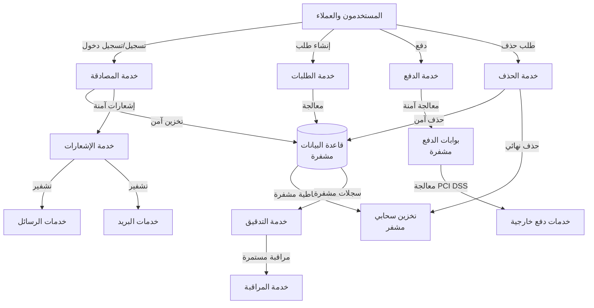

# ملحق حماية البيانات والخصوصية (التقني)

## نظرة عامة على حماية البيانات

يحدد هذا الملحق الإجراءات التقنية المطبقة لحماية البيانات الشخصية في منصة بثواني، مع التركيز على الامتثال لمعايير GDPR وPDPL السعودية وقوانين حماية البيانات المحلية.

## تدفق البيانات الشخصية

### خريطة تدفق البيانات الشخصية



### تفصيل تدفق البيانات حسب النوع

#### 1. تدفق بيانات المصادقة
```yaml
authentication_flow:
  data_types:
    - phone_number: "رقم الهاتف"
    - email: "البريد الإلكتروني (اختياري)"
    - password: "كلمة المرور (مشفرة)"
    - device_info: "معلومات الجهاز"
    - location: "الموقع الجغرافي (اختياري)"

  processing_steps:
    - collection: "جمع البيانات من نموذج التسجيل"
    - validation: "التحقق من صحة البيانات"
    - encryption: "تشفير كلمة المرور بـ bcrypt"
    - storage: "تخزين في قاعدة البيانات المشفرة"
    - token_generation: "إنشاء JWT tokens"
    - logging: "تسجيل العملية مع تصفية البيانات الحساسة"
```

#### 2. تدفق بيانات الطلبات
```yaml
order_flow:
  data_types:
    - customer_info: "معلومات العميل"
    - order_details: "تفاصيل الطلب"
    - delivery_address: "عنوان التسليم"
    - payment_info: "معلومات الدفع (مشفرة جزئياً)"

  processing_steps:
    - collection: "جمع بيانات الطلب من التطبيق"
    - validation: "التحقق من صحة البيانات والمخزون"
    - processing: "معالجة الطلب وتعيين السائق"
    - storage: "تخزين في قاعدة البيانات المشفرة"
    - notification: "إرسال إشعارات للأطراف المعنية"
    - logging: "تسجيل العملية للتدقيق"
```

#### 3. تدفق بيانات الدفع
```yaml
payment_flow:
  data_types:
    - card_details: "تفاصيل البطاقة (مشفرة جزئياً)"
    - transaction_amount: "مبلغ المعاملة"
    - merchant_info: "معلومات التاجر"
    - customer_id: "معرف العميل"

  processing_steps:
    - collection: "جمع بيانات الدفع من نموذج آمن"
    - tokenization: "تحويل البيانات إلى tokens"
    - processing: "إرسال للبوابة الخارجية"
    - storage: "تخزين نتيجة المعاملة فقط"
    - notification: "إشعار العميل والتاجر"
    - compliance: "تسجيل للامتثال PCI DSS"
```

## جهات معالجة البيانات

### 1. معالجات البيانات الداخلية

#### فريق التطوير والعمليات
| الفريق | دور المعالجة | البيانات المعالجة | الوصول المسموح |
|---------|-------------|-------------------|----------------|
| فريق DevOps | صيانة البنية التحتية | السجلات، المقاييس، التكوينات | قراءة فقط، مراقبة |
| فريق التطوير | تطوير واختبار النظام | بيانات اختبار، سجلات التطوير | قراءة محدودة، حذف بعد الاختبار |
| فريق الأمان | مراقبة وحماية البيانات | سجلات الأمان، محاولات الاختراق | قراءة كاملة، تحليل |
| فريق الدعم | مساعدة العملاء | تفاصيل الطلبات والمشاكل | قراءة محدودة، لا يرى البيانات المالية |

### 2. معالجات البيانات الخارجية

#### مزودو خدمات السحابة
| المزود | الخدمة | البيانات المعالجة | الامتثال | اتفاقية المعالجة |
|---------|--------|-------------------|----------|------------------|
| **AWS** | S3, RDS | ملفات، قواعد بيانات | SOC 2, ISO 27001 | DPA موقع مع AWS |
| **Google Cloud** | Firebase, Maps | مصادقة، خرائط | SOC 2, ISO 27001 | DPA موقع مع Google |
| **Render** | استضافة التطبيقات | كود التطبيق، السجلات | SOC 2, ISO 27001 | DPA موقع مع Render |
| **Cloudinary** | معالجة الصور | الصور والوسائط | SOC 2, GDPR | DPA موقع مع Cloudinary |

#### بوابات الدفع
| البوابة | البيانات المعالجة | الامتثال | اتفاقية المعالجة |
|---------|-------------------|----------|------------------|
| **Stripe** | تفاصيل الدفع، معاملات | PCI DSS Level 1 | اتفاقية Stripe DPA |
| **PayPal** | تفاصيل الدفع، معاملات | PCI DSS Level 1 | اتفاقية PayPal DPA |
| **مدى** | معاملات محلية | PCI DSS محلي | اتفاقية مدى معتمدة |
| **STC Pay** | معاملات محلية | PCI DSS محلي | اتفاقية STC معتمدة |

#### خدمات التواصل
| الخدمة | البيانات المعالجة | الامتثال | اتفاقية المعالجة |
|---------|-------------------|----------|------------------|
| **Twilio** | أرقام الهواتف، رسائل | SOC 2, GDPR | DPA موقع مع Twilio |
| **SendGrid** | عناوين البريد، رسائل | SOC 2, GDPR | DPA موقع مع SendGrid |
| **Firebase** | رموز الإشعارات، بيانات الجلسات | SOC 2, GDPR | DPA موقع مع Google |

## التشفير أثناء النقل والسكون

### 1. التشفير أثناء النقل (Data in Transit)

#### بروتوكولات التشفير المستخدمة
```yaml
encryption_in_transit:
  protocols:
    - tls_version: "TLS 1.3"
      cipher_suites:
        - "TLS_AES_128_GCM_SHA256"
        - "TLS_AES_256_GCM_SHA384"
        - "TLS_CHACHA20_POLY1305_SHA256"
      perfect_forward_secrecy: true

  endpoints:
    - url: "api.bthwani.com"
      certificate: "Let's Encrypt"
      hsts: true
      hsts_max_age: "31536000"
    - url: "admin.bthwani.com"
      certificate: "Let's Encrypt"
      hsts: true
    - url: "app.bthwani.com"
      certificate: "Let's Encrypt"
      hsts: true
```

#### تنفيذ التشفير في الكود
```javascript
// تشفير الاتصالات في Express
const express = require('express')
const helmet = require('helmet')

const app = express()

// إعدادات الأمان الأساسية
app.use(helmet({
  contentSecurityPolicy: {
    directives: {
      defaultSrc: ["'self'"],
      scriptSrc: ["'self'", "'unsafe-inline'"],
      styleSrc: ["'self'", "'unsafe-inline'"],
      imgSrc: ["'self'", "data:", "https:"],
    },
  },
  hsts: {
    maxAge: 31536000,
    includeSubDomains: true,
    preload: true
  }
}))

// فرض HTTPS
app.use((req, res, next) => {
  if (req.header('x-forwarded-proto') !== 'https') {
    res.redirect(`https://${req.header('host')}${req.url}`)
  } else {
    next()
  }
})
```

### 2. التشفير في حالة السكون (Data at Rest)

#### تشفير قاعدة البيانات
```javascript
// نموذج مستخدم مع تشفير البيانات الحساسة
const userSchema = new mongoose.Schema({
  phone: { type: String, required: true },
  email: { type: String, sparse: true },
  password: {
    type: String,
    required: true,
    set: (password) => encryptField(password, 'password')
  },
  nationalId: {
    type: String,
    set: (id) => id ? encryptField(id, 'national_id') : undefined
  },
  bankAccount: {
    type: String,
    set: (account) => account ? encryptField(account, 'bank_account') : undefined
  }
})

// تشفير البيانات في السجلات
userSchema.post('save', function(doc) {
  // تصفية البيانات الحساسة في السجلات
  const sanitizedDoc = { ...doc.toObject() }
  delete sanitizedDoc.password
  delete sanitizedDoc.nationalId
  delete sanitizedDoc.bankAccount

  logger.info('User data saved', { userId: doc._id, sanitizedDoc })
})
```

#### تشفير الملفات المخزنة
```javascript
// تشفير الملفات قبل التخزين في S3
const encryptFile = async (fileBuffer, fileName) => {
  const algorithm = 'aes-256-gcm'
  const key = Buffer.from(process.env.FILE_ENCRYPTION_KEY, 'hex')
  const iv = crypto.randomBytes(16)

  const cipher = crypto.createCipher(algorithm, key, iv)
  const encrypted = Buffer.concat([
    iv,
    cipher.update(fileBuffer),
    cipher.final()
  ])

  return {
    encryptedBuffer: encrypted,
    authTag: cipher.getAuthTag(),
    originalName: fileName
  }
}
```

## الحذف والاحتفاظ بالبيانات

### جدول احتفاظ البيانات المعتمد

| نوع البيانات | مدة الاحتفاظ | الأساس القانوني | آلية الحذف | المسؤول |
|-------------|--------------|----------------|-------------|---------|
| **بيانات المصادقة** | 2 سنوات بعد آخر تسجيل دخول | المصلحة المشروعة | حذف تلقائي | نظام تلقائي |
| **بيانات الطلبات** | 7 سنوات | متطلبات قانونية | حذف آمن | فريق المالية |
| **بيانات الدفع** | 7 سنوات | متطلبات PCI DSS | حذف مشفر | بوابات الدفع |
| **سجلات التدقيق** | 7 سنوات | متطلبات قانونية | أرشفة مشفرة | فريق الأمان |
| **بيانات التاجر** | 5 سنوات بعد إغلاق الحساب | العقد | حذف آمن | فريق الأعمال |
| **بيانات السائق** | 3 سنوات بعد إنهاء التعاقد | العقد | حذف آمن | فريق الموارد البشرية |
| **البيانات التسويقية** | 2 سنوات | الموافقة | حذف فوري عند الانسحاب | فريق التسويق |
| **سجلات النظام** | 90 يوم | المراقبة | حذف تلقائي | نظام تلقائي |
| **نسخ احتياطية** | 1 سنة | النسخ الاحتياطي | حذف مشفر | فريق العمليات |

### آلية الحذف الآمن

#### 1. حذف البيانات الشخصية
```javascript
// خدمة حذف البيانات الشخصية
class DataDeletionService {
  async deleteUserData(userId, reason) {
    // 1. التحقق من الهوية والموافقة
    await this.verifyDeletionRequest(userId, reason)

    // 2. تسجيل طلب الحذف
    await this.logDeletionRequest(userId, reason)

    // 3. حذف البيانات من قاعدة البيانات الرئيسية
    await this.deleteFromPrimaryDB(userId)

    // 4. حذف البيانات من قواعد البيانات الاحتياطية
    await this.deleteFromBackupDB(userId)

    // 5. حذف الملفات المخزنة
    await this.deleteUserFiles(userId)

    // 6. حذف السجلات المؤقتة
    await this.deleteTemporaryData(userId)

    // 7. إخطار المستخدم
    await this.notifyUserDeletion(userId)

    // 8. تسجيل اكتمال الحذف
    await this.logDeletionComplete(userId)
  }

  async deleteFromPrimaryDB(userId) {
    // حذف من جداول متعددة
    await Promise.all([
      User.deleteOne({ _id: userId }),
      Order.deleteMany({ customerId: userId }),
      Payment.deleteMany({ customerId: userId }),
      Notification.deleteMany({ userId }),
      AuditLog.deleteMany({ userId })
    ])
  }

  async deleteUserFiles(userId) {
    // حذف الملفات من S3
    const userFiles = await getUserFiles(userId)

    for (const file of userFiles) {
      await deleteFromS3(file.key)
      await logFileDeletion(file.key, userId)
    }
  }
}
```

#### 2. الحذف الآمن لقاعدة البيانات
```javascript
// حذف آمن لقاعدة البيانات
const secureDatabaseDeletion = async (userId) => {
  // 1. حذف البيانات مع تعطيل الفهرسة مؤقتاً
  await mongoose.connection.db.collection('users').deleteMany({ _id: userId })

  // 2. حذف السجلات المرتبطة
  const relatedCollections = ['orders', 'payments', 'notifications', 'audit_logs']
  for (const collection of relatedCollections) {
    await mongoose.connection.db.collection(collection).deleteMany({ userId })
  }

  // 3. إعادة بناء الفهرسة
  await mongoose.connection.db.collection('users').reIndex()
  await mongoose.connection.db.collection('orders').reIndex()

  // 4. تشغيل vacuum لتحرير المساحة
  await mongoose.connection.db.command({ vacuum: 'users' })
  await mongoose.connection.db.command({ vacuum: 'orders' })
}
```

#### 3. الحذف الآمن للملفات
```javascript
// حذف آمن للملفات من S3
const secureFileDeletion = async (fileKey, userId) => {
  // 1. نسخ الملف مؤقتاً للتأكد
  const tempCopy = await copyToTempStorage(fileKey)

  // 2. حذف الملف الأصلي
  await deleteFromS3(fileKey)

  // 3. حذف النسخة المؤقتة بعد تأكيد الحذف
  setTimeout(() => {
    deleteFromTempStorage(tempCopy.key)
  }, 24 * 60 * 60 * 1000) // بعد 24 ساعة

  // 4. تسجيل عملية الحذف
  await logSecureDeletion(fileKey, userId, 'file')
}
```

### سياسة الاحتفاظ المعتمدة

#### 1. جدول احتفاظ مفصل حسب نوع البيانات

| فئة البيانات | مدة الاحتفاظ | الأساس القانوني | آلية الحذف | المراجعة |
|---------------|--------------|----------------|-------------|----------|
| **البيانات الأساسية** | 2 سنوات بعد عدم النشاط | GDPR المادة 17 | حذف تلقائي | مراجعة سنوية |
| **البيانات المالية** | 7 سنوات | قوانين مكافحة الغسل | حذف آمن | مراجعة ربع سنوية |
| **البيانات الصحية** | 5 سنوات | قوانين الصحة | حذف مشفر | مراجعة سنوية |
| **البيانات التسويقية** | 2 سنوات أو حتى الانسحاب | الموافقة | حذف فوري | مراجعة شهرية |
| **سجلات الأمان** | 10 سنوات | قوانين الأمن السيبراني | أرشفة مشفرة | مراجعة سنوية |
| **سجلات التدقيق** | 7 سنوات | متطلبات SOX | أرشفة مشفرة | مراجعة ربع سنوية |

#### 2. آلية الاحتفاظ التلقائية

```javascript
// خدمة الاحتفاظ التلقائية
class DataRetentionService {
  async processRetention() {
    const now = new Date()

    // معالجة كل فئة بيانات حسب جدولها
    for (const category of dataCategories) {
      const expiredRecords = await findExpiredRecords(category, now)
      await deleteExpiredRecords(expiredRecords, category)
      await logRetentionAction(category, expiredRecords.length)
    }
  }

  async findExpiredRecords(category, currentDate) {
    const retentionPeriod = getRetentionPeriod(category)
    const cutoffDate = new Date(currentDate.getTime() - retentionPeriod)

    return await DataRecord.find({
      category,
      createdAt: { $lt: cutoffDate },
      deletedAt: { $exists: false }
    })
  }

  async deleteExpiredRecords(records, category) {
    for (const record of records) {
      // حذف آمن حسب نوع البيانات
      if (category === 'personal') {
        await secureDeletePersonalData(record)
      } else if (category === 'financial') {
        await secureDeleteFinancialData(record)
      }

      // تحديث سجل الحذف
      record.deletedAt = new Date()
      record.deletionReason = 'expired_retention'
      await record.save()
    }
  }
}
```

## مراقبة الامتثال لحماية البيانات

### 1. لوحة مراقبة الامتثال

#### لوحة: GDPR Compliance Dashboard
```yaml
dashboard: "GDPR Compliance Monitoring"
panels:
  - title: "طلبات حذف البيانات (شهرياً)"
    type: "graph"
    query: "data_deletion_requests_30d"

  - title: "مدة معالجة طلبات الحذف"
    type: "histogram"
    query: "data_deletion_processing_time"

  - title: "البيانات منتهية الاحتفاظ"
    type: "singlestat"
    query: "expired_data_count"
    thresholds:
      - color: "green"
        value: 0
      - color: "red"
        value: 1

  - title: "حالة الاحتفاظ حسب الفئة"
    type: "table"
    query: "data_retention_status_by_category"
    columns: ["category", "total_records", "expired_records", "last_cleanup"]
```

### 2. تقارير الامتثال التلقائية

#### تقرير الامتثال الشهري
```javascript
// إنشاء تقرير امتثال شهري
const generateComplianceReport = async (month, year) => {
  const report = {
    period: `${year}-${month}`,
    dataDeletionRequests: await countDataDeletionRequests(month, year),
    averageDeletionTime: await calculateAverageDeletionTime(month, year),
    expiredDataDeleted: await countExpiredDataDeleted(month, year),
    dataBreachIncidents: await countDataBreachIncidents(month, year),
    dsarRequests: await countDSARRequests(month, year),
    dsarResponseTime: await calculateDSARResponseTime(month, year)
  }

  // حفظ التقرير للمراجعة
  await ComplianceReport.create(report)

  // إرسال للجهات المعنية
  await sendComplianceReport(report)

  return report
}
```

### 3. اختبارات الامتثال الدورية

#### اختبار الامتثال لـ GDPR
```javascript
// اختبار شامل للامتثال GDPR
const testGDPRCompliance = async () => {
  const testResults = {
    dataDeletion: await testDataDeletion(),
    consentManagement: await testConsentManagement(),
    dataMinimization: await testDataMinimization(),
    purposeLimitation: await testPurposeLimitation(),
    dataSecurity: await testDataSecurity(),
    breachNotification: await testBreachNotification()
  }

  // فحص النتائج
  for (const [testName, result] of Object.entries(testResults)) {
    if (!result.passed) {
      throw new Error(`GDPR compliance test failed: ${testName}`)
    }
  }

  return testResults
}
```

## اتفاقيات معالجة البيانات

### 1. اتفاقيات معالجة البيانات (DPA)

#### اتفاقية مع AWS
```yaml
dpa_aws:
  effective_date: "2024-01-01"
  version: "2.0"
  data_types:
    - personal_data: true
    - financial_data: true
    - location_data: true
  security_measures:
    - encryption_at_rest: true
    - encryption_in_transit: true
    - access_controls: true
    - audit_logging: true
  breach_notification: "72 ساعة"
  liability: "محدودة حسب الاتفاقية"
```

#### اتفاقية مع Stripe
```yaml
dpa_stripe:
  effective_date: "2024-01-01"
  version: "1.5"
  data_types:
    - payment_data: true
    - card_data: true
  pci_dss_compliance: "Level 1"
  security_measures:
    - tokenization: true
    - encryption: true
    - fraud_detection: true
  breach_notification: "24 ساعة"
```

### 2. إدارة الموافقات

#### نظام إدارة الموافقات
```javascript
// نموذج موافقة المستخدم
const consentSchema = new mongoose.Schema({
  userId: { type: mongoose.Schema.Types.ObjectId, ref: 'User' },
  consentType: {
    type: String,
    enum: ['marketing', 'analytics', 'personalization', 'data_sharing'],
    required: true
  },
  granted: { type: Boolean, default: false },
  grantedAt: { type: Date },
  revokedAt: { type: Date },
  ipAddress: { type: String },
  userAgent: { type: String },
  version: { type: String, required: true }, // نسخة سياسة الخصوصية
  expiresAt: { type: Date }
})

// إنشاء موافقة جديدة
const createConsent = async (userId, consentType, version) => {
  const consent = new Consent({
    userId,
    consentType,
    granted: true,
    grantedAt: new Date(),
    version,
    ipAddress: req.ip,
    userAgent: req.get('User-Agent')
  })

  await consent.save()

  // تسجيل الموافقة للتدقيق
  await logAuditEvent('consent_granted', {
    userId,
    consentType,
    version,
    ipAddress: req.ip
  })
}
```

## استجابة لطلبات البيانات (DSAR)

### 1. معالجة طلبات الوصول للبيانات

#### خدمة استجابة DSAR
```javascript
class DSARService {
  async processAccessRequest(userId, requestType) {
    // التحقق من هوية الطالب
    await verifyUserIdentity(userId)

    // جمع البيانات المطلوبة
    const userData = await collectUserData(userId, requestType)

    // تصفية البيانات الحساسة إذا لزم الأمر
    const sanitizedData = await sanitizeSensitiveData(userData)

    // إنشاء تقرير البيانات
    const report = await generateDataReport(sanitizedData, requestType)

    // إرسال التقرير للمستخدم
    await sendDataReport(userId, report)

    // تسجيل طلب DSAR للتدقيق
    await logDSARRequest(userId, requestType, 'completed')
  }

  async collectUserData(userId, requestType) {
    const data = {}

    if (requestType === 'all' || requestType === 'profile') {
      data.profile = await User.findById(userId).select('-password')
    }

    if (requestType === 'all' || requestType === 'orders') {
      data.orders = await Order.find({ customerId: userId })
    }

    if (requestType === 'all' || requestType === 'payments') {
      data.payments = await Payment.find({ customerId: userId })
        .select('-cardDetails')
    }

    return data
  }
}
```

### 2. معالجة طلبات الحذف

#### خدمة حذف البيانات
```javascript
class DataDeletionService {
  async processDeletionRequest(userId, reason) {
    // التحقق من الطلب والموافقة
    await verifyDeletionRequest(userId, reason)

    // إنشاء نسخة احتياطية قبل الحذف
    await createDeletionBackup(userId)

    // حذف البيانات من جميع المصادر
    await deleteFromAllSources(userId)

    // إخطار المستخدم
    await notifyDeletionComplete(userId)

    // تسجيل الحذف للتدقيق
    await logDeletionComplete(userId, reason)
  }

  async deleteFromAllSources(userId) {
    // حذف من قاعدة البيانات الرئيسية
    await deleteFromPrimaryDatabase(userId)

    // حذف من قواعد البيانات الاحتياطية
    await deleteFromBackupDatabases(userId)

    // حذف الملفات المخزنة
    await deleteUserFiles(userId)

    // حذف السجلات المؤقتة
    await deleteTemporaryData(userId)

    // إخطار الجهات الخارجية
    await notifyExternalProcessors(userId, 'deletion')
  }
}
```

## الخلاصة والمراجعة

### حالة الامتثال الحالية
- ✅ **تشفير شامل**: جميع البيانات مشفرة أثناء النقل والسكون
- ✅ **جدول احتفاظ معتمد**: مدد محددة حسب نوع البيانات والقوانين
- ✅ **آلية حذف آمنة**: حذف كامل وغير قابل للاسترداد
- ✅ **تدفق بيانات موثق**: خرائط تدفق واضحة لجميع أنواع البيانات
- ✅ **اتفاقيات DPA موقعة**: مع جميع معالجي البيانات الخارجيين

### التوصيات للتحسين
- [ ] تطوير أدوات تلقائية لاختبار الامتثال
- [ ] إضافة مراقبة متقدمة لتدفق البيانات في الوقت الفعلي
- [ ] تطوير نظام إشعار تلقائي لانتهاكات الخصوصية
- [ ] إجراء مراجعات دورية لسياسات الاحتفاظ بالبيانات

---

هذا الملحق يوفر إطاراً تقنياً شاملاً لحماية البيانات الشخصية والامتثال لمعايير الخصوصية في منصة بثواني.
