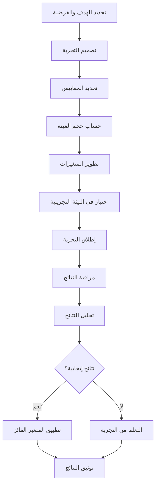

# سياسة A/B وتجارب المنتج وحماية المقاييس لمنصة بثواني

## نظرة عامة على سياسة التجارب والقياس

توثق هذه السياسة إطار عمل اختبارات A/B وتجارب المنتج وحماية المقاييس في منصة بثواني، مع ضمان اتخاذ قرارات مبنية على البيانات وتحسين تجربة المستخدمين.

## فلسفة التجارب في بثواني

### مبادئ أساسية

1. **البيانات أولاً**: كل قرار يجب أن يكون مدعوماً بالبيانات
2. **التجربة المستمرة**: تحسين مستمر للمنتج بناءً على تعليقات المستخدمين
3. **الحماية من التحيز**: ضمان عدالة ودقة التجارب
4. **الأثر الإيجابي**: تحسين تجربة المستخدمين ونتائج الأعمال
5. **السرعة والمرونة**: إمكانية التراجع السريع عند الحاجة

## هيكل نظام اختبارات A/B

### 1. أنواع التجارب

| نوع التجربة | الوصف | المقاييس الرئيسية | مدة التشغيل | مستوى المخاطر |
|-------------|--------|-------------------|-------------|---------------|
| **تحسين التحويل** | تحسين معدل التحويل في مسارات رئيسية | معدل التحويل، قيمة الطلب | 2-4 أسابيع | منخفض |
| **تجربة ميزة جديدة** | اختبار ميزات جديدة قبل الإطلاق الكامل | معدل الاستخدام، رضا المستخدمين | 4-6 أسابيع | متوسط |
| **تحسين الأداء** | تحسين سرعة التطبيق وتجربة المستخدم | زمن التحميل، معدل الارتداد | 1-2 أسابيع | منخفض |
| **تجربة التسعير** | اختبار استراتيجيات التسعير المختلفة | الإيرادات، معدل التحويل | 3-5 أسابيع | عالي |

### 2. عملية تصميم التجربة

```typescript
interface ExperimentDesign {
  id: string;
  name: string;
  hypothesis: string;
  type: 'conversion' | 'feature' | 'performance' | 'pricing';

  // مجموعات التجربة
  variants: {
    control: {
      name: string;
      description: string;
      trafficPercentage: number;
      configuration: Record<string, any>;
    };
    variantA: {
      name: string;
      description: string;
      trafficPercentage: number;
      configuration: Record<string, any>;
    };
    variantB?: {
      name: string;
      description: string;
      trafficPercentage: number;
      configuration: Record<string, any>;
    };
  };

  // مقاييس النجاح
  successMetrics: {
    primary: string;
    secondary: string[];
    minimumImprovement: number;
    statisticalSignificance: number; // 95% افتراضياً
  };

  // معلومات التنفيذ
  implementation: {
    featureFlags: string[];
    affectedComponents: string[];
    affectedUserSegments: string[];
    rolloutStrategy: 'gradual' | 'immediate' | 'canary';
  };

  // معلومات الجدولة
  timeline: {
    startDate: string;
    plannedEndDate: string;
    actualStartDate?: string;
    actualEndDate?: string;
  };

  // معلومات المسؤولية
  owner: string;
  stakeholders: string[];
  reviewers: string[];
}
```

## حماية المقاييس ومنع التحيز

### 1. ضمان دقة المقاييس

#### تصميم المقاييس الصحيح
```typescript
interface MetricDefinition {
  name: string;
  description: string;
  calculation: string;
  dataSource: string;
  aggregation: 'sum' | 'average' | 'count' | 'rate';

  // ضمان الدقة
  validation: {
    dataQuality: 'high' | 'medium' | 'low';
    completeness: number; // نسبة البيانات المكتملة
    accuracy: number; // دقة البيانات
  };

  // منع التحيز
  biasProtection: {
    randomization: boolean;
    sampleSize: number;
    confidenceLevel: number;
    powerAnalysis: boolean;
  };
}
```

#### مثال على مقياس محمي من التحيز
```typescript
const conversionRateMetric: MetricDefinition = {
  name: 'checkout_conversion_rate',
  description: 'معدل التحويل من بدء الطلب لإتمام الدفع',
  calculation: 'completed_orders / started_checkouts',
  dataSource: 'analytics_events',
  aggregation: 'rate',

  validation: {
    dataQuality: 'high',
    completeness: 98,
    accuracy: 99.5
  },

  biasProtection: {
    randomization: true,
    sampleSize: 10000, // عينة كافية للدلالة الإحصائية
    confidenceLevel: 95,
    powerAnalysis: true // تحليل قوة الاختبار
  }
};
```

### 2. مراقبة التحيز والتلاعب

```typescript
// نظام كشف التحيز في التجارب
class BiasDetectionSystem {
  async detectBias(experimentId: string): Promise<BiasReport> {
    const experiment = await this.getExperiment(experimentId);

    // فحص توزيع المستخدمين
    const userDistribution = await this.analyzeUserDistribution(experiment);

    // فحص تأثير الموسمية
    const seasonalityBias = await this.detectSeasonalityBias(experiment);

    // فحص تأثير التحديثات التقنية
    const technicalBias = await this.detectTechnicalBias(experiment);

    // فحص التحيز في السلوك
    const behavioralBias = await this.detectBehavioralBias(experiment);

    return {
      experimentId,
      overallRisk: this.calculateOverallRisk([
        userDistribution,
        seasonalityBias,
        technicalBias,
        behavioralBias
      ]),
      recommendations: this.generateRecommendations([
        userDistribution,
        seasonalityBias,
        technicalBias,
        behavioralBias
      ])
    };
  }
}
```

## عملية تنفيذ التجارب

### 1. خطوات تنفيذ تجربة A/B



### 2. حساب حجم العينة المناسب

```typescript
// حاسبة حجم العينة للتجارب
class SampleSizeCalculator {
  calculateSampleSize(
    baselineRate: number,      // معدل التحويل الحالي
    minimumDetectableEffect: number, // أدنى تأثير يمكن اكتشافه
    power: number = 0.8,       // قوة الاختبار
    significanceLevel: number = 0.05, // مستوى الدلالة
    variantCount: number = 2   // عدد المتغيرات
  ): number {
    // استخدام صيغة حجم العينة للتجارب المقارنة
    const zAlpha = this.getZScore(1 - significanceLevel / 2);
    const zBeta = this.getZScore(power);

    const pooledProbability = baselineRate * (1 - minimumDetectableEffect / 2);
    const variance = pooledProbability * (1 - pooledProbability);

    const sampleSizePerVariant = (
      Math.pow(zAlpha + zBeta, 2) * variance * 2
    ) / Math.pow(minimumDetectableEffect, 2);

    return Math.ceil(sampleSizePerVariant * variantCount);
  }

  private getZScore(probability: number): number {
    // جدول قيم Z المعيارية
    const zTable = {
      0.80: 0.84,
      0.85: 1.04,
      0.90: 1.28,
      0.95: 1.65,
      0.975: 1.96,
      0.99: 2.33
    };

    return zTable[probability] || 1.96;
  }
}
```

### 3. مراقبة التجارب في الوقت الفعلي

```typescript
// نظام مراقبة التجارب
class ExperimentMonitor {
  async monitorExperiment(experimentId: string): Promise<MonitoringReport> {
    const experiment = await this.getExperiment(experimentId);

    // مراقبة المقاييس الأساسية
    const primaryMetrics = await this.getPrimaryMetrics(experiment);
    const secondaryMetrics = await this.getSecondaryMetrics(experiment);

    // فحص السلامة والأداء
    const safetyChecks = await this.performSafetyChecks(experiment);

    // تحليل النتائج المبكرة
    const earlyAnalysis = await this.performEarlyAnalysis(experiment);

    return {
      experimentId,
      timestamp: new Date().toISOString(),
      metrics: { primary: primaryMetrics, secondary: secondaryMetrics },
      safety: safetyChecks,
      earlyAnalysis,
      recommendations: this.generateRecommendations(safetyChecks, earlyAnalysis)
    };
  }

  private async performSafetyChecks(experiment: any): Promise<SafetyCheck[]> {
    return [
      {
        type: 'performance',
        status: await this.checkPerformanceImpact(experiment),
        threshold: 0.1, // 10% تدهور في الأداء
        actual: await this.getPerformanceMetrics(experiment)
      },
      {
        type: 'user_experience',
        status: await this.checkUserExperience(experiment),
        threshold: 4.0, // تقييم 4.0 من 5.0
        actual: await this.getUserSatisfaction(experiment)
      },
      {
        type: 'business_impact',
        status: await this.checkBusinessImpact(experiment),
        threshold: -0.05, // انخفاض 5% في الإيرادات
        actual: await this.getBusinessMetrics(experiment)
      }
    ];
  }
}
```

## حماية المقاييس من التلاعب

### 1. منع التلاعب في البيانات

```typescript
// نظام حماية المقاييس
class MetricsProtectionSystem {
  async validateMetric(metricName: string, value: number, userId: string): Promise<boolean> {
    // فحص القيم الشاذة
    if (this.isOutlier(value)) {
      await this.logSuspiciousActivity(userId, metricName, value);
      return false;
    }

    // فحص معدل التكرار
    if (await this.isUnusualFrequency(userId, metricName)) {
      await this.flagSuspiciousUser(userId);
      return false;
    }

    // فحص الاتساق مع السلوك السابق
    if (await this.isInconsistentWithHistory(userId, metricName, value)) {
      await this.investigateUserBehavior(userId);
      return false;
    }

    return true;
  }

  private async isOutlier(value: number): Promise<boolean> {
    // فحص ما إذا كانت القيمة بعيدة عن المتوسط
    const mean = await this.getMetricMean();
    const stdDev = await this.getMetricStandardDeviation();

    return Math.abs(value - mean) > 3 * stdDev; // قاعدة 3 سيغما
  }

  private async isUnusualFrequency(userId: string, metricName: string): Promise<boolean> {
    const recentEvents = await this.getRecentEvents(userId, metricName, '1h');
    const expectedRate = await this.getExpectedEventRate(metricName);

    return recentEvents.length > expectedRate * 2;
  }
}
```

### 2. ضمان الخصوصية في التجارب

```typescript
// حماية خصوصية المستخدمين في التجارب
class PrivacyProtection {
  async anonymizeExperimentData(experimentData: any): Promise<AnonymizedData> {
    return {
      // إزالة المعلومات الشخصية المباشرة
      userId: this.hashUserId(experimentData.userId),
      sessionId: this.generateSessionId(),

      // الحفاظ على البيانات الإحصائية فقط
      metrics: experimentData.metrics,
      variant: experimentData.variant,
      timestamp: experimentData.timestamp,

      // إضافة ضوضاء لمنع التعرف على الأفراد
      noise: this.addStatisticalNoise(experimentData.metrics)
    };
  }

  private hashUserId(userId: string): string {
    // استخدام هاش آمن لإخفاء هوية المستخدمين
    return crypto.createHash('sha256').update(userId + process.env.SALT).digest('hex');
  }

  private addStatisticalNoise(metrics: any): any {
    // إضافة ضوضاء عشوائية للحماية من الهجمات الإحصائية
    return Object.fromEntries(
      Object.entries(metrics).map(([key, value]) => [
        key,
        typeof value === 'number' ? value + (Math.random() - 0.5) * 0.01 : value
      ])
    );
  }
}
```

## تحليل النتائج واتخاذ القرارات

### 1. منهجية التحليل الإحصائي

```typescript
interface StatisticalAnalysis {
  experimentId: string;
  testType: 't-test' | 'chi-square' | 'anova' | 'regression';
  significanceLevel: number;
  power: number;
  effectSize: number;

  // نتائج التحليل
  results: {
    pValue: number;
    confidenceInterval: [number, number];
    statisticalSignificance: boolean;
    practicalSignificance: boolean;
  };

  // توصيات
  recommendations: {
    action: 'implement' | 'continue' | 'stop' | 'modify';
    confidence: 'high' | 'medium' | 'low';
    nextSteps: string[];
  };
}

// مثال على تحليل نتائج تجربة
const analyzeExperimentResults = async (experimentId: string): Promise<StatisticalAnalysis> => {
  const experimentData = await getExperimentData(experimentId);

  // اختبار t-test للمقارنة بين المتغيرات
  const tTestResult = await performTTest(
    experimentData.control.metrics,
    experimentData.variantA.metrics
  );

  // حساب حجم التأثير
  const effectSize = calculateCohenD(
    experimentData.control.metrics,
    experimentData.variantA.metrics
  );

  // تقييم الدلالة العملية
  const practicalSignificance = evaluatePracticalSignificance(effectSize, experimentData.context);

  return {
    experimentId,
    testType: 't-test',
    significanceLevel: 0.05,
    power: 0.8,
    effectSize,

    results: {
      pValue: tTestResult.pValue,
      confidenceInterval: tTestResult.confidenceInterval,
      statisticalSignificance: tTestResult.pValue < 0.05,
      practicalSignificance
    },

    recommendations: generateRecommendations(tTestResult, practicalSignificance, experimentData)
  };
};
```

### 2. لوحة مراقبة التجارب

```typescript
// مكون مراقبة التجارب في الوقت الفعلي
const ExperimentsDashboard = () => {
  const [experiments, setExperiments] = useState([]);
  const [selectedExperiment, setSelectedExperiment] = useState(null);

  useEffect(() => {
    const fetchExperiments = async () => {
      const data = await api.getAllExperiments({
        status: 'running',
        includeMetrics: true
      });
      setExperiments(data);
    };

    fetchExperiments();
    const interval = setInterval(fetchExperiments, 30000); // كل 30 ثانية

    return () => clearInterval(interval);
  }, []);

  const handleExperimentAction = async (experimentId: string, action: 'pause' | 'stop' | 'extend') => {
    await api.updateExperimentStatus(experimentId, action);
    await fetchExperiments(); // إعادة جلب البيانات
  };

  return (
    <div className="experiments-dashboard">
      <div className="experiments-grid">
        {experiments.map(experiment => (
          <ExperimentCard
            key={experiment.id}
            experiment={experiment}
            onSelect={() => setSelectedExperiment(experiment)}
            onAction={(action) => handleExperimentAction(experiment.id, action)}
          />
        ))}
      </div>

      {selectedExperiment && (
        <ExperimentDetailsModal
          experiment={selectedExperiment}
          onClose={() => setSelectedExperiment(null)}
        />
      )}
    </div>
  );
};
```

## الخلاصة والتوصيات

### النتائج الحالية
- ✅ **نظام تجارب متكامل**: PostHog متكامل مع جميع التطبيقات
- ✅ **حماية مقاييس فعالة**: منع التحيز وضمان دقة البيانات
- ✅ **تحليل إحصائي قوي**: منهجية علمية لتقييم النتائج
- ✅ **مراقبة في الوقت الفعلي**: تتبع فوري لأداء التجارب
- ✅ **خصوصية مضمونة**: حماية بيانات المستخدمين في التجارب

### التوصيات الرئيسية

1. **توسيع نطاق التجارب**: تطبيق اختبارات A/B على المزيد من الميزات
2. **تحسين التحليل**: تطوير نماذج إحصائية أكثر تعقيداً
3. **تعزيز الحماية**: تطوير آليات أقوى لمنع التلاعب في البيانات
4. **تدريب الفريق**: تثقيف الفريق على تصميم التجارب الفعالة
5. **أتمتة التحليل**: تطبيق التعلم الآلي لتحليل النتائج

### مؤشرات نجاح التجارب

| المؤشر | الهدف | طريقة القياس | تكرار المراجعة |
|---------|-------|-------------|----------------|
| **معدل نجاح التجارب** | > 70% | نسبة التجارب التي تحقق التحسن المطلوب | شهري |
| **دقة التحليل الإحصائي** | > 95% | مقارنة النتائج مع التحليلات اليدوية | ربع سنوي |
| **وقت اكتشاف التأثير** | < 7 أيام | وقت من بدء التجربة لاكتشاف النتائج | أسبوعي |
| **حماية من التحيز** | 100% | نسبة التجارب المحمية من التحيز | مع كل تجربة |
| **رضا المستخدمين في التجارب** | > 4.0/5 | استطلاعات رضا المستخدمين المشاركين | بعد كل تجربة |

---

هذه السياسة تُحدث ربع سنوياً مع مراجعة شاملة لمنهجيات التجارب وتحسين عمليات القياس بناءً على الدروس المستفادة والتطورات التقنية.
