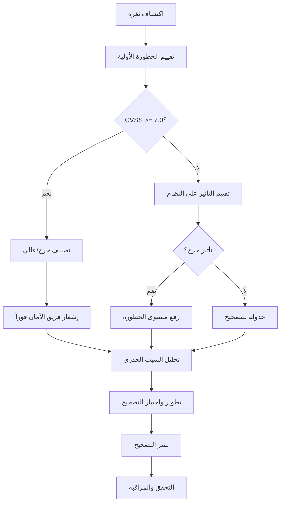

# سياسة إدارة الثغرات والتحديثات لمنصة بثواني

## نظرة عامة على سياسة إدارة الثغرات

توثق هذه السياسة إجراءات اكتشاف وتقييم ومعالجة الثغرات الأمنية والتحديثات في منصة بثواني، مع ضمان استمرارية الأمان والامتثال للمعايير الدولية.

## تصنيف الثغرات ومستويات الخطورة

### مستويات خطورة الثغرات (CVSS Score)

| المستوى | النطاق | الوصف | وقت الاستجابة | الإجراء المطلوب |
|---------|--------|--------|----------------|------------------|
| **حرج (Critical)** | 9.0-10.0 | ثغرات تسمح بتنفيذ كود عن بعد بدون مصادقة | < 24 ساعة | تصحيح فوري أو تعطيل الخدمة |
| **عالي (High)** | 7.0-8.9 | ثغرات تؤثر على سرية أو سلامة البيانات | < 1 أسبوع | تصحيح عاجل في أقرب دورة تحديث |
| **متوسط (Medium)** | 4.0-6.9 | ثغرات محدودة التأثير | < 1 شهر | تصحيح في دورة التحديث التالية |
| **منخفض (Low)** | 0.1-3.9 | ثغرات طفيفة التأثير | < 3 أشهر | تصحيح حسب الحاجة والأولويات |

## عملية اكتشاف وتقييم الثغرات

### 1. أدوات الكشف عن الثغرات

```typescript
interface VulnerabilityScanner {
  name: string;
  type: 'sast' | 'dast' | 'sca' | 'container' | 'infrastructure';
  schedule: 'daily' | 'weekly' | 'monthly' | 'continuous';
  scope: string[];
  configuration: Record<string, any>;
}

// أدوات الكشف المستخدمة
const vulnerabilityTools = [
  {
    name: 'Snyk',
    type: 'sca',
    schedule: 'daily',
    scope: ['dependencies', 'containers'],
    configuration: {
      severityThreshold: 'medium',
      failOnIssues: true
    }
  },
  {
    name: 'OWASP ZAP',
    type: 'dast',
    schedule: 'weekly',
    scope: ['web_applications', 'apis'],
    configuration: {
      scanTypes: ['active', 'passive'],
      excludedUrls: ['/admin/*']
    }
  },
  {
    name: 'Trivy',
    type: 'container',
    schedule: 'continuous',
    scope: ['docker_images', 'k8s_workloads'],
    configuration: {
      severity: ['HIGH', 'CRITICAL'],
      format: 'json'
    }
  }
];
```

### 2. عملية تقييم الثغرات



## سياسات التحديثات والتصحيحات

### 1. جدولة التحديثات

```yaml
# جدول تحديثات منتظمة
update_schedule:
  security_patches:
    critical: "immediate"      # فوري للثغرات الحرجة
    high: "within_1_week"      # خلال أسبوع للثغرات عالية الخطورة
    medium: "within_1_month"   # خلال شهر للثغرات متوسطة الخطورة
    low: "within_3_months"     # خلال 3 أشهر للثغرات منخفضة الخطورة

  dependency_updates:
    major: "quarterly"         # تحديثات رئيسية كل ربع سنة
    minor: "monthly"           # تحديثات ثانوية شهرياً
    patch: "weekly"            # تحديثات تصحيح أسبوعياً

  os_updates:
    security: "monthly"        # تحديثات أمان شهرياً
    feature: "quarterly"       # تحديثات ميزات ربع سنوياً
```

### 2. إجراءات التصحيح

```typescript
interface PatchDeployment {
  id: string;
  vulnerabilityId: string;
  severity: 'critical' | 'high' | 'medium' | 'low';
  patchType: 'hotfix' | 'regular' | 'feature_update';

  // معلومات التصحيح
  details: {
    affectedComponents: string[];
    fixDescription: string;
    testingRequirements: string[];
    rollbackPlan: string;
  };

  // خطة النشر
  deployment: {
    environments: string[];     // البيئات المستهدفة
    rolloutStrategy: 'immediate' | 'staged' | 'canary';
    approvalRequired: boolean;
    notificationPlan: string[];
  };

  // تتبع التقدم
  status: 'planned' | 'in_development' | 'testing' | 'ready' | 'deployed' | 'rolled_back';
  timeline: {
    discoveredAt: string;
    fixedAt?: string;
    deployedAt?: string;
  };
}
```

## مراقبة وتدقيق الثغرات

### 1. لوحة مراقبة الثغرات

```typescript
// مكون مراقبة الثغرات الأمنية
const VulnerabilityDashboard = () => {
  const [vulnerabilities, setVulnerabilities] = useState([]);
  const [patchStatus, setPatchStatus] = useState({});

  useEffect(() => {
    const fetchVulnerabilityData = async () => {
      const [vulns, patches] = await Promise.all([
        getActiveVulnerabilities(),
        getPatchDeploymentStatus()
      ]);

      setVulnerabilities(vulns);
      setPatchStatus(patches);
    };

    fetchVulnerabilityData();
    const interval = setInterval(fetchVulnerabilityData, 300000); // كل 5 دقائق

    return () => clearInterval(interval);
  }, []);

  return (
    <div className="vulnerability-dashboard">
      <div className="vulnerability-summary">
        <MetricCard
          title="ثغرات حرجة مفتوحة"
          value={countVulnerabilitiesBySeverity('critical')}
          trend={vulnerabilityTrends.critical}
          color="red"
        />
        <MetricCard
          title="ثغرات عالية مفتوحة"
          value={countVulnerabilitiesBySeverity('high')}
          trend={vulnerabilityTrends.high}
          color="orange"
        />
        <MetricCard
          title="متوسط وقت التصحيح"
          value={`${patchStatus.averageFixTime}h`}
          trend={patchStatus.fixTimeTrend}
          color="blue"
        />
      </div>

      <div className="vulnerability-details">
        <VulnerabilityTable vulnerabilities={vulnerabilities} />
        <PatchDeploymentTable patches={patchStatus.deployments} />
      </div>
    </div>
  );
};
```

### 2. نظام التنبيهات للثغرات

```typescript
interface VulnerabilityAlert {
  id: string;
  vulnerabilityId: string;
  severity: 'info' | 'low' | 'medium' | 'high' | 'critical';
  title: string;
  description: string;
  affectedComponents: string[];
  remediation: string;

  // معلومات إضافية
  metadata: {
    cveId?: string;
    cvssScore: number;
    exploitability: 'low' | 'medium' | 'high';
    publishedAt: string;
    discoveredInSystemAt: string;
  };

  // إجراءات مطلوبة
  requiredActions: string[];
  assignedTo?: string;
  dueDate?: string;
  status: 'new' | 'investigating' | 'fixing' | 'resolved' | 'accepted_risk';
}
```

## الخلاصة والتوصيات

### النتائج الحالية
- ✅ **نظام كشف شامل**: تغطية جميع أنواع الثغرات (SAST/DAST/SCA/حاويات)
- ✅ **تقييم سريع**: تصنيف دقيق للثغرات حسب CVSS وتأثيرها على النظام
- ✅ **تصحيح منتظم**: جدولة منتظمة للتحديثات حسب مستوى الخطورة
- ✅ **مراقبة فعالة**: تتبع شامل لحالة الثغرات والتصحيحات
- ✅ **تنبيهات ذكية**: إشعارات فورية للثغرات الحرجة والعالية الخطورة

### التوصيات الرئيسية

1. **أتمتة الكشف**: زيادة استخدام الأدوات الآلية للكشف المستمر
2. **تحسين عمليات التصحيح**: تقليل وقت التصحيح من خلال الأتمتة والتدريب
3. **تعزيز الوعي الأمني**: تدريب منتظم للفريق على ممارسات الأمان الآمنة
4. **مراقبة مستمرة**: مراقبة يومية لحالة الأمان والثغرات
5. **تحسين التوثيق**: توثيق شامل لجميع عمليات التصحيح والتحديثات

### مؤشرات الأمان

| المؤشر | الهدف | طريقة القياس | تكرار المراجعة |
|---------|-------|-------------|----------------|
| **تغطية الكشف عن الثغرات** | 100% | نسبة المكونات المغطاة بأدوات الكشف | شهري |
| **متوسط وقت اكتشاف الثغرات** | < 24 ساعة | وقت من نشر الثغرة لاكتشافها | أسبوعي |
| **متوسط وقت التصحيح** | < 7 أيام | وقت من اكتشاف الثغرة لتصحيحها | أسبوعي |
| **نسبة الثغرات الحرجة المفتوحة** | < 1% | نسبة الثغرات الحرجة غير المصححة | يومي |

---

هذه السياسة تُحدث سنوياً مع مراجعة شاملة للتهديدات الناشئة وتحديث أدوات الكشف والحماية.
