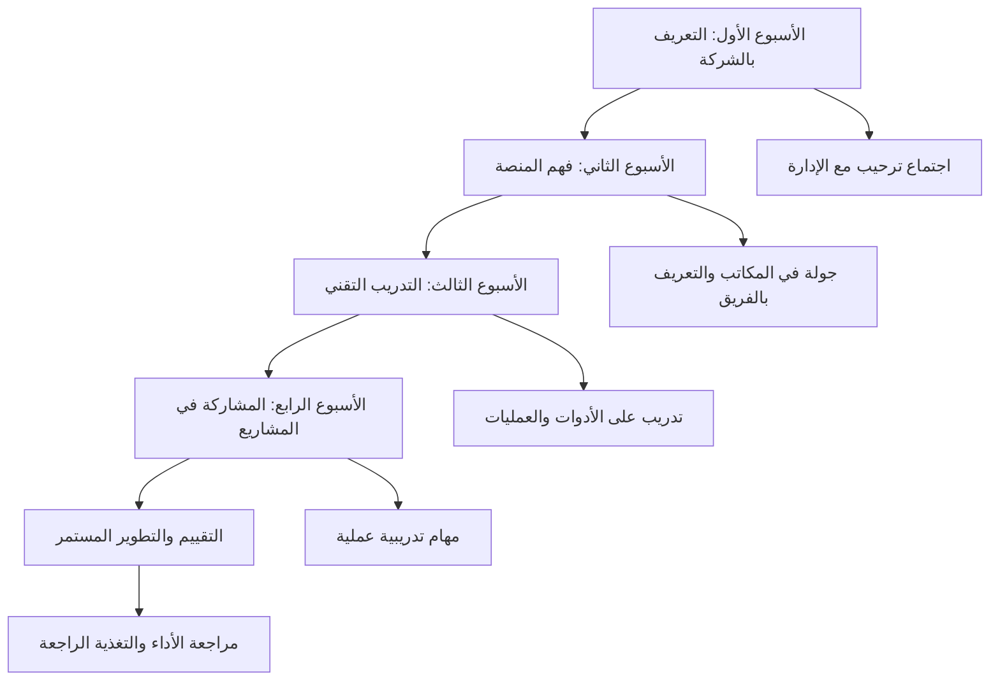

# كتيبات التدريب الداخلية ودليل Onboarding لفرق منصة بثواني

## نظرة عامة على برامج التدريب والـ Onboarding

يوثق هذا الدليل برامج التدريب الداخلية وإجراءات الـ Onboarding لأعضاء فريق منصة بثواني الجدد، مع ضمان اندماج سريع وفعال في الفريق والمشاريع.

## هيكل برامج التدريب والـ Onboarding



## دليل Onboarding للأعضاء الجدد

### المرحلة 1: الأسبوع الأول - التعريف بالشركة والثقافة

#### اليوم الأول: الترحيب والتعريف
```markdown
# جدول اليوم الأول

## الصباح (9:00 - 12:00)
- **لقاء ترحيبي** مع مدير الموارد البشرية
- **جولة في المكاتب** والتعريف بالمرافق
- **لقاء مع المدير المباشر** لشرح المهام والمسؤوليات
- **إعداد الحسابات** والوصول للأنظمة

## بعد الظهر (1:00 - 5:00)
- **لقاء مع فريق التطوير** للتعريف بالمشاريع الحالية
- **جولة في قاعدة الكود** وفهم بنية المشروع
- **إعداد بيئة التطوير** المحلية
- **مراجعة التوثيق الأساسي**
```

#### المهام الأساسية في الأسبوع الأول
- [ ] قراءة دليل الموظف الجديد
- [ ] التسجيل في جميع الأنظمة الداخلية
- [ ] إعداد بيئة التطوير المحلية
- [ ] حضور اجتماع الفريق الأسبوعي
- [ ] إنشاء حساب GitHub وانضمام للمستودعات

### المرحلة 2: الأسبوع الثاني - فهم المنصة والمنتجات

#### ورش عمل تعريفية
```typescript
interface OnboardingWorkshop {
  title: string;
  duration: string;
  instructor: string;
  objectives: string[];
  materials: string[];
}

// ورش العمل المطلوبة
const requiredWorkshops = [
  {
    title: 'نظرة عامة على منصة بثواني',
    duration: '2 ساعات',
    instructor: 'مدير المنتج',
    objectives: [
      'فهم نموذج الأعمال والمنتجات',
      'معرفة أنواع المستخدمين والمسارات',
      'فهم تدفق الطلبات والتوصيل'
    ],
    materials: ['presentation', 'product-demo', 'q&a-session']
  },
  {
    title: 'المعمارية التقنية العامة',
    duration: '3 ساعات',
    instructor: 'مهندس معماري',
    objectives: [
      'فهم هيكل النظام والمكونات',
      'معرفة التقنيات المستخدمة',
      'فهم تدفق البيانات والتكاملات'
    ],
    materials: ['architecture-diagram', 'tech-stack-overview', 'system-demo']
  }
];
```

#### المهام التعليمية
- [ ] حضور جميع ورش العمل المطلوبة
- [ ] دراسة التوثيق الأساسي للمنصة
- [ ] تجربة التطبيقات كمستخدم نهائي
- [ ] كتابة ملخص شخصي لفهم المنصة

### المرحلة 3: الأسبوع الثالث - التدريب التقني العميق

#### برنامج التدريب التقني
```typescript
interface TechnicalTrainingProgram {
  track: 'frontend' | 'backend' | 'fullstack' | 'devops' | 'qa';
  modules: TrainingModule[];
  duration: string;
  assessment: AssessmentCriteria;
}

// مسارات التدريب حسب التخصص
const trainingTracks = {
  frontend: {
    modules: [
      'React & TypeScript Fundamentals',
      'State Management (Zustand/Redux)',
      'Testing (Jest + React Testing Library)',
      'Performance Optimization',
      'Accessibility & i18n'
    ],
    duration: '3 أسابيع',
    assessment: {
      codingTest: 'بناء مكون تفاعلي',
      codeReview: 'مراجعة PR حقيقي',
      presentation: 'عرض تقني للفريق'
    }
  },

  backend: {
    modules: [
      'Node.js & Express Advanced',
      'Database Design & MongoDB',
      'API Design & Documentation',
      'Authentication & Security',
      'Testing & Performance'
    ],
    duration: '4 أسابيع',
    assessment: {
      codingTest: 'بناء API كامل',
      codeReview: 'مراجعة وتحسين endpoint موجود',
      presentation: 'شرح معمارية خدمة'
    }
  }
};
```

#### المهام العملية
- [ ] إكمال جميع الوحدات التدريبية المطلوبة
- [ ] بناء مشروع تدريبي صغير
- [ ] المشاركة في مراجعة كود زملاء
- [ ] كتابة اختبارات شاملة لكود مكتوب

### المرحلة 4: الأسبوع الرابع - المشاركة في المشاريع الحقيقية

#### المهام التدريجية في المشاريع
```typescript
interface ProjectOnboardingTasks {
  week4: {
    observation: 'مراقبة اجتماعات الفريق وفهم سير العمل',
    smallTasks: 'مهام صغيرة مثل إصلاح أخطاء بسيطة أو تحديث توثيق',
    codeReview: 'مراجعة PRs للمطورين الآخرين',
    pairProgramming: 'برمجة مزدوجة مع مطور آخر'
  };

  week5_6: {
    featureDevelopment: 'تطوير ميزة فرعية تحت إشراف',
    testing: 'كتابة اختبارات شاملة للميزة',
    documentation: 'توثيق الميزة والتغييرات',
    deployment: 'نشر الميزة في بيئة التجريب'
  };

  week7_8: {
    independentWork: 'العمل المستقل على مهمة متوسطة الحجم',
    mentorship: 'جلسات إرشاد منتظمة مع المدير',
    performanceReview: 'مراجعة أولية للأداء والتقدم'
  };
}
```

## برامج التطوير المستمر

### 1. برنامج التطوير المهني

#### مسارات التطوير حسب المستويات
```typescript
interface CareerDevelopmentPaths {
  junior: {
    duration: '6-12 شهر',
    milestones: [
      'إتقان التقنيات الأساسية',
      'المشاركة في 5 مشاريع حقيقية',
      'الحصول على تقييم أداء 4+',
      'تقديم عرض تقني للفريق'
    ],
    nextLevel: 'mid-level developer'
  };

  midLevel: {
    duration: '12-24 شهر',
    milestones: [
      'قيادة مشروع فرعي كامل',
      'إرشاد مطورين مبتدئين',
      'تحسين أداء النظام بنسبة 20%',
      'الحصول على شهادة تقنية متقدمة'
    ],
    nextLevel: 'senior developer'
  };

  senior: {
    duration: '24+ شهر',
    milestones: [
      'قيادة مشاريع كبيرة متعددة',
      'تطوير استراتيجيات تقنية',
      'إرشاد عدة مطورين متوسطين',
      'نشر مقالات تقنية أو التحدث في مؤتمرات'
    ],
    nextLevel: 'tech lead or architect'
  };
}
```

### 2. برامج التدريب الخارجية والشهادات

#### الشهادات الموصى بها
```typescript
interface RecommendedCertifications {
  frontend: [
    'React Developer Certification',
    'TypeScript Expert',
    'Web Performance Optimization',
    'Accessibility Specialist (WCAG)'
  ];

  backend: [
    'Node.js Application Development',
    'MongoDB Database Administrator',
    'AWS Certified Developer',
    'Kubernetes Administrator'
  ];

  devops: [
    'AWS DevOps Engineer Professional',
    'Docker Certified Associate',
    'Kubernetes Administrator',
    'Terraform Associate'
  ];

  security: [
    'CompTIA Security+',
    'Certified Ethical Hacker (CEH)',
    'AWS Certified Security',
    'CISSP (للمستويات المتقدمة)'
  ];
}
```

## نظام التقييم والتغذية الراجعة

### 1. نظام التقييم الدوري

#### مؤشرات الأداء الرئيسية (KPIs)
```typescript
interface DeveloperKPIs {
  technical: {
    codeQuality: 'تغطية اختبارات > 90%, معدل أخطاء < 5%',
    performance: 'مساهمة في تحسين الأداء بنسبة 10%',
    documentation: 'توثيق شامل للكود والميزات الجديدة',
    innovation: 'اقتراح تحسينات معمارية أو تقنية'
  };

  collaboration: {
    codeReviews: 'مراجعة 5+ PRs شهرياً بجودة عالية',
    mentorship: 'مساعدة زملاء في حل مشاكل تقنية',
    communication: 'مشاركة فعالة في اجتماعات الفريق',
    knowledgeSharing: 'كتابة مقالات تقنية أو تقديم عروض'
  };

  delivery: {
    onTimeDelivery: 'تسليم المهام في المواعيد المحددة',
    featureCompleteness: 'إكمال جميع متطلبات الميزة',
    userImpact: 'تحسين تجربة المستخدمين النهائيين',
    reliability: 'عدم وجود أخطاء حرجة في الإنتاج'
  };
}
```

### 2. عملية التغذية الراجعة

#### اجتماعات التغذية الراجعة
```typescript
interface FeedbackSessions {
  weekly: {
    format: '1:1 مع المدير المباشر',
    duration: '30 دقيقة',
    topics: ['تقدم المهام', 'تحديات تقنية', 'أهداف الأسبوع القادم'],
    frequency: 'كل جمعة'
  };

  monthly: {
    format: 'مراجعة أداء شهرية',
    duration: '1 ساعة',
    topics: ['إنجازات الشهر', 'نقاط القوة', 'مجالات التحسين', 'أهداف الشهر القادم'],
    frequency: 'نهاية كل شهر'
  };

  quarterly: {
    format: 'مراجعة ربع سنوية شاملة',
    duration: '2 ساعات',
    topics: ['تقييم الأداء العام', 'تطوير المهارات', 'تخطيط المسار المهني', 'أهداف الربع القادم'],
    frequency: 'نهاية كل ربع سنة'
  };
}
```

## موارد التدريب والتعلم

### 1. مكتبة الموارد الداخلية

#### قائمة الكتب والدورات الموصى بها
```typescript
interface LearningResources {
  books: [
    {
      title: 'Clean Code',
      author: 'Robert C. Martin',
      category: 'coding-standards',
      requiredFor: 'جميع المطورين'
    },
    {
      title: 'You Don\'t Know JS',
      author: 'Kyle Simpson',
      category: 'javascript',
      requiredFor: 'مطوري الواجهات الأمامية'
    },
    {
      title: 'Designing Data-Intensive Applications',
      author: 'Martin Kleppmann',
      category: 'system-design',
      requiredFor: 'مهندسي النظم والخلفية'
    }
  ];

  onlineCourses: [
    {
      platform: 'Udemy',
      course: 'React - The Complete Guide',
      duration: '40 ساعة',
      level: 'مبتدئ إلى متوسط'
    },
    {
      platform: 'Coursera',
      course: 'Google Cloud Platform Fundamentals',
      duration: '20 ساعة',
      level: 'مبتدئ'
    }
  ];

  internalResources: [
    {
      type: 'دليل داخلي',
      title: 'معايير الترميز في بثواني',
      url: '/docs/development/coding-standards',
      lastUpdated: '2025-01-15'
    },
    {
      type: 'فيديو تدريبي',
      title: 'كيفية استخدام نظام مراقبة الأخطاء',
      url: '/training/error-monitoring',
      duration: '45 دقيقة'
    }
  ];
}
```

### 2. نظام التعليم الذاتي

#### خطة التطوير الشخصي (PDP)
```typescript
interface PersonalDevelopmentPlan {
  employee: string;
  period: 'quarterly' | 'yearly';
  goals: DevelopmentGoal[];
  resources: string[];
  milestones: Milestone[];
  reviewDate: string;
}

// مثال على خطة تطوير شخصية
const samplePDP: PersonalDevelopmentPlan = {
  employee: 'Ahmed Al-Mansouri',
  period: 'quarterly',
  goals: [
    {
      category: 'technical',
      title: 'إتقان React Server Components',
      description: 'فهم وتطبيق React Server Components في مشاريع حقيقية',
      targetDate: '2025-03-31',
      successCriteria: 'بناء صفحة كاملة باستخدام RSC'
    },
    {
      category: 'soft-skills',
      title: 'تحسين مهارات العرض والتقديم',
      description: 'القدرة على تقديم عروض تقنية واضحة ومؤثرة',
      targetDate: '2025-02-28',
      successCriteria: 'تقديم عرضين تقنيين للفريق'
    }
  ],
  resources: [
    'دورة React Server Components على Udemy',
    'كتاب "Presentation Skills for Technical People"',
    'جلسات إرشاد مع كبار المطورين'
  ],
  milestones: [
    { date: '2025-01-31', description: 'إكمال الدورة التدريبية' },
    { date: '2025-02-15', description: 'بناء نموذج أولي' },
    { date: '2025-03-01', description: 'تطبيق في مشروع حقيقي' }
  ],
  reviewDate: '2025-03-31'
};
```

## الخلاصة والتوصيات

### النتائج الحالية
- ✅ **برنامج Onboarding شامل**: تغطية كاملة لجميع جوانب الانضمام
- ✅ **مسارات تدريب متخصصة**: تدريب مخصص حسب التخصص والمستوى
- ✅ **نظام تقييم فعال**: مؤشرات أداء واضحة ومقاييس نجاح
- ✅ **موارد تعليمية غنية**: مكتبة شاملة من الكتب والدورات
- ✅ **تطوير مهني مستمر**: خطط تطوير شخصية ومسارات واضحة

### التوصيات الرئيسية

1. **تحسين المتابعة**: تطبيق نظام متابعة أسبوعي للأعضاء الجدد
2. **تخصيص التدريب**: تخصيص مسارات التدريب حسب خلفية كل عضو
3. **تعزيز التعلم الاجتماعي**: تنظيم جلسات تعلم جماعية ومشاركة المعرفة
4. **قياس فعالية التدريب**: مراقبة تأثير التدريب على الأداء والرضا
5. **تحديث مستمر**: تحديث البرامج بانتظام بناءً على التغذية الراجعة

### مؤشرات نجاح الـ Onboarding والتدريب

| المؤشر | الهدف | طريقة القياس | تكرار المراجعة |
|---------|-------|-------------|----------------|
| **وقت الإنتاجية الكاملة** | < 3 أشهر | تتبع مساهمات العضو الجديد | شهري |
| **رضا الأعضاء الجدد** | > 4.5/5 | استطلاعات رضا التوظيف | بعد 3 أشهر |
| **معدل الاحتفاظ بالموظفين** | > 90% | تتبع معدل الاستقالة | ربع سنوي |
| **تطوير المهارات** | تحسن بنسبة 25% | تقييم المهارات قبل وبعد التدريب | ربع سنوي |
| **مشاركة في التدريب** | > 80% | نسبة إكمال البرامج التدريبية | شهري |

---

هذا الدليل يُحدث ربع سنوياً مع مراجعة شاملة لبرامج التدريب وإجراءات الـ Onboarding بناءً على تعليقات الأعضاء الجدد وتطور احتياجات الفريق.
